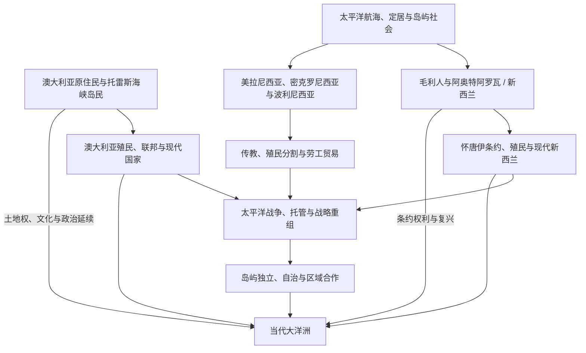

# 大洋洲历史

## 范围与概括

大洋洲历史由澳大利亚大陆、阿奥特阿罗瓦 / 新西兰和太平洋岛屿世界构成。澳大利亚原住民与托雷斯海峡岛民、毛利人、美拉尼西亚、密克罗尼西亚和波利尼西亚各族群形成长期的土地、海洋、航海、语言、贸易和政治网络。欧洲、美国、日本等外部力量的殖民、传教、劳工贸易、战争与核试验改变了区域秩序，但原住民权利、主权与文化复兴仍是当代史的一部分。

## 历史演进图

## 文明与历史空间入口

| 文明 / 历史空间 | 入口 | 范围说明 |
|---|---|---|
| 澳大利亚原住民与托雷斯海峡岛民社会 | [原住民与托雷斯海峡岛民社会](/%E4%BA%BA%E6%96%87%E7%A7%91%E5%AD%A6/%E5%8E%86%E5%8F%B2/%E5%A4%A7%E6%B4%8B%E6%B4%B2/%E6%BE%B3%E5%A4%A7%E5%88%A9%E4%BA%9A/%E5%8E%9F%E4%BD%8F%E6%B0%91%E4%B8%8E%E6%89%98%E9%9B%B7%E6%96%AF%E6%B5%B7%E5%B3%A1%E5%B2%9B%E6%B0%91%E7%A4%BE%E4%BC%9A.md) | 数万年的土地、海洋、亲属与语言传统，不能只作为殖民澳大利亚的前置阶段。 |
| 毛利人与阿奥特阿罗瓦 | [毛利人定居与社会](/%E4%BA%BA%E6%96%87%E7%A7%91%E5%AD%A6/%E5%8E%86%E5%8F%B2/%E5%A4%A7%E6%B4%8B%E6%B4%B2/%E6%96%B0%E8%A5%BF%E5%85%B0/%E6%AF%9B%E5%88%A9%E4%BA%BA%E5%AE%9A%E5%B1%85%E4%B8%8E%E7%A4%BE%E4%BC%9A.md) | 波利尼西亚航海、部族社会、土地关系及延续至今的条约与文化主线。 |
| 太平洋岛屿世界 | [太平洋岛屿](/%E4%BA%BA%E6%96%87%E7%A7%91%E5%AD%A6/%E5%8E%86%E5%8F%B2/%E5%A4%A7%E6%B4%8B%E6%B4%B2/%E5%A4%AA%E5%B9%B3%E6%B4%8B%E5%B2%9B%E5%B1%BF/README.md) | 美拉尼西亚、密克罗尼西亚和波利尼西亚的航海、定居、交换与多样政治传统。 |

## 现代国家与政治实体入口

| 国家 / 政治实体 | 入口 | 主线提示 |
|---|---|---|
| 澳大利亚 | [澳大利亚历史](/%E4%BA%BA%E6%96%87%E7%A7%91%E5%AD%A6/%E5%8E%86%E5%8F%B2/%E5%A4%A7%E6%B4%8B%E6%B4%B2/%E6%BE%B3%E5%A4%A7%E5%88%A9%E4%BA%9A/README.md) | 英国殖民地、联邦、战争、移民、原住民权利与现代澳大利亚。 |
| 新西兰 | [新西兰历史](/%E4%BA%BA%E6%96%87%E7%A7%91%E5%AD%A6/%E5%8E%86%E5%8F%B2/%E5%A4%A7%E6%B4%8B%E6%B4%B2/%E6%96%B0%E8%A5%BF%E5%85%B0/README.md) | 怀唐伊条约、殖民战争、自治领、福利国家与条约和解。 |
| 太平洋独立国家、自治与关联领地 | [独立国家、自治与区域合作](/%E4%BA%BA%E6%96%87%E7%A7%91%E5%AD%A6/%E5%8E%86%E5%8F%B2/%E5%A4%A7%E6%B4%8B%E6%B4%B2/%E5%A4%AA%E5%B9%B3%E6%B4%8B%E5%B2%9B%E5%B1%BF/%E7%8B%AC%E7%AB%8B%E5%9B%BD%E5%AE%B6%E3%80%81%E8%87%AA%E6%B2%BB%E4%B8%8E%E5%8C%BA%E5%9F%9F%E5%90%88%E4%BD%9C.md) | 独立、自由联系、海外领地、区域组织与海洋主权。 |

## 区域共同史与跨境专题

本区内容量和既有结构尚不需要另建空的通史目录。以下现有笔记直接承担大洋洲共同史入口，并由澳大利亚、新西兰和太平洋岛屿国家页补充本地视角。

| 共同史 / 专题 | 入口 | 职责 |
|---|---|---|
| 航海、定居与海洋网络 | [航海、定居与太平洋世界](/%E4%BA%BA%E6%96%87%E7%A7%91%E5%AD%A6/%E5%8E%86%E5%8F%B2/%E5%A4%A7%E6%B4%8B%E6%B4%B2/%E5%A4%AA%E5%B9%B3%E6%B4%8B%E5%B2%9B%E5%B1%BF/%E8%88%AA%E6%B5%B7%E3%80%81%E5%AE%9A%E5%B1%85%E4%B8%8E%E5%A4%AA%E5%B9%B3%E6%B4%8B%E4%B8%96%E7%95%8C.md) | 比较远洋航海、岛屿定居、语言扩散和交换网络。 |
| 殖民、传教与劳工迁移 | [殖民分割、传教与劳工贸易](/%E4%BA%BA%E6%96%87%E7%A7%91%E5%AD%A6/%E5%8E%86%E5%8F%B2/%E5%A4%A7%E6%B4%8B%E6%B4%B2/%E5%A4%AA%E5%B9%B3%E6%B4%8B%E5%B2%9B%E5%B1%BF/%E6%AE%96%E6%B0%91%E5%88%86%E5%89%B2%E3%80%81%E4%BC%A0%E6%95%99%E4%B8%8E%E5%8A%B3%E5%B7%A5%E8%B4%B8%E6%98%93.md) | 维护列强分割、传教网络、黑鸟捕工及跨岛人口流动。 |
| 战争、托管与核遗产 | [太平洋战争、托管与核试验](/%E4%BA%BA%E6%96%87%E7%A7%91%E5%AD%A6/%E5%8E%86%E5%8F%B2/%E5%A4%A7%E6%B4%8B%E6%B4%B2/%E5%A4%AA%E5%B9%B3%E6%B4%8B%E5%B2%9B%E5%B1%BF/%E5%A4%AA%E5%B9%B3%E6%B4%8B%E6%88%98%E4%BA%89%E3%80%81%E6%89%98%E7%AE%A1%E4%B8%8E%E6%A0%B8%E8%AF%95%E9%AA%8C.md) | 维护世界大战、托管制度、冷战基地和核试验影响。 |

## 重要转折

| 时间 | 事件 | 意义 |
|---|---|---|
| 至少数万年前 | 人群在萨胡尔大陆及周边定居 | 澳大利亚原住民和托雷斯海峡岛民社会形成深厚的土地、海洋和亲属关系。 |
| 约13-14世纪 | 毛利人抵达阿奥特阿罗瓦 | 波利尼西亚航海与新西兰社会发展相连。 |
| 18-19世纪 | 欧洲殖民、传教与劳工贸易扩张 | 领土控制、疾病、土地剥夺和劳工流动重组大洋洲社会。 |
| 1840年 | 怀唐伊条约 | 新西兰王室—毛利关系的关键文本，双语文本与解释长期存在争议。 |
| 1901年 | 澳大利亚联邦成立 | 六个英国殖民地组成联邦国家。 |
| 1941-1945年 | 太平洋战争 | 岛屿、海域和澳新成为全球战争与战略网络的重要组成部分。 |
| 1945年后 | 托管、核试验、独立与区域合作 | 多座岛屿走向独立或自治，核遗产、海洋主权和气候成为区域议题。 |
| 1971年 | 太平洋岛屿论坛成立 | 独立和自治的太平洋政治体推进区域合作。 |

## 关键辨析

- 美拉尼西亚、密克罗尼西亚、波利尼西亚是历史地理分类，内部语言、政治体和殖民经历高度多样。
- “澳大利亚原住民”与“托雷斯海峡岛民”具有不同的身份与海洋文化传统，不能互相替代。
- 怀唐伊条约有毛利语与英语文本，二者并非逐字对应；条约权利不是只属于19世纪的历史问题。
- 太平洋岛屿并非都成为独立国家；法属、美国、英国、新西兰等关联领地具有不同政治地位。

## 上级与相邻区域

- 欧洲殖民背景：[欧洲历史](/%E4%BA%BA%E6%96%87%E7%A7%91%E5%AD%A6/%E5%8E%86%E5%8F%B2/%E6%AC%A7%E6%B4%B2/README.md)。
- 东南亚与海洋航路：[东南亚历史](/%E4%BA%BA%E6%96%87%E7%A7%91%E5%AD%A6/%E5%8E%86%E5%8F%B2/%E4%B8%9C%E5%8D%97%E4%BA%9A/README.md)。
- 太平洋战争相关：[日本历史](/%E4%BA%BA%E6%96%87%E7%A7%91%E5%AD%A6/%E5%8E%86%E5%8F%B2/%E4%B8%9C%E4%BA%9A/%E6%97%A5%E6%9C%AC/README.md)、[北美历史](/%E4%BA%BA%E6%96%87%E7%A7%91%E5%AD%A6/%E5%8E%86%E5%8F%B2/%E7%BE%8E%E6%B4%B2/%E5%8C%97%E7%BE%8E/README.md)。

- [历史](/%E4%BA%BA%E6%96%87%E7%A7%91%E5%AD%A6/%E5%8E%86%E5%8F%B2/README.md)
