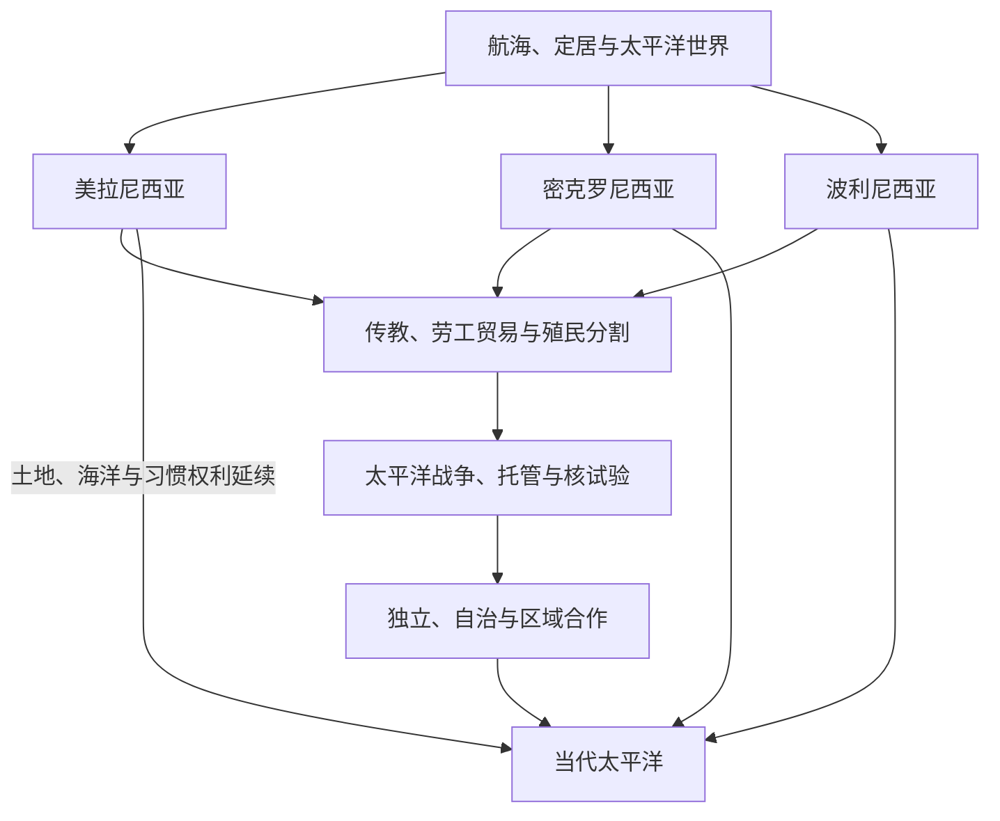

# 太平洋岛屿

## 范围与概括

太平洋岛屿历史以海洋而不是陆地边界为中心。美拉尼西亚、密克罗尼西亚和波利尼西亚是便于导航的历史地理分类，不是单一民族或同质文明。岛屿社会通过航海、亲属、礼仪、交换、园艺、渔业和海洋知识彼此连接；19世纪的传教、劳工贸易与殖民分割，20世纪的太平洋战争、托管、核试验和去殖民化，则把岛屿纳入全球战略体系。

## 演进图

## 主题入口

| 主题 | 入口 | 说明 |
|---|---|---|
| 航海与定居 | [航海、定居与太平洋世界](/%E4%BA%BA%E6%96%87%E7%A7%91%E5%AD%A6/%E5%8E%86%E5%8F%B2/%E5%A4%A7%E6%B4%8B%E6%B4%B2/%E5%A4%AA%E5%B9%B3%E6%B4%8B%E5%B2%9B%E5%B1%BF/%E8%88%AA%E6%B5%B7%E3%80%81%E5%AE%9A%E5%B1%85%E4%B8%8E%E5%A4%AA%E5%B9%B3%E6%B4%8B%E4%B8%96%E7%95%8C.md) | 拉皮塔、远洋航海、岛际交换和“空白海洋”观念的修正。 |
| 美拉尼西亚 | [美拉尼西亚](/%E4%BA%BA%E6%96%87%E7%A7%91%E5%AD%A6/%E5%8E%86%E5%8F%B2/%E5%A4%A7%E6%B4%8B%E6%B4%B2/%E5%A4%AA%E5%B9%B3%E6%B4%8B%E5%B2%9B%E5%B1%BF/%E7%BE%8E%E6%8B%89%E5%B0%BC%E8%A5%BF%E4%BA%9A.md) | 巴布亚新几内亚、所罗门群岛、瓦努阿图、斐济和新喀里多尼亚等多样社会。 |
| 密克罗尼西亚 | [密克罗尼西亚](/%E4%BA%BA%E6%96%87%E7%A7%91%E5%AD%A6/%E5%8E%86%E5%8F%B2/%E5%A4%A7%E6%B4%8B%E6%B4%B2/%E5%A4%AA%E5%B9%B3%E6%B4%8B%E5%B2%9B%E5%B1%BF/%E5%AF%86%E5%85%8B%E7%BD%97%E5%B0%BC%E8%A5%BF%E4%BA%9A.md) | 加罗林、马绍尔、马里亚纳、帕劳等海洋网络及托管遗产。 |
| 波利尼西亚 | [波利尼西亚](/%E4%BA%BA%E6%96%87%E7%A7%91%E5%AD%A6/%E5%8E%86%E5%8F%B2/%E5%A4%A7%E6%B4%8B%E6%B4%B2/%E5%A4%AA%E5%B9%B3%E6%B4%8B%E5%B2%9B%E5%B1%BF/%E6%B3%A2%E5%88%A9%E5%B0%BC%E8%A5%BF%E4%BA%9A.md) | 萨摩亚、汤加、夏威夷、库克群岛、法属波利尼西亚、拉帕努伊与新西兰联系。 |
| 殖民体系 | [殖民分割、传教与劳工贸易](/%E4%BA%BA%E6%96%87%E7%A7%91%E5%AD%A6/%E5%8E%86%E5%8F%B2/%E5%A4%A7%E6%B4%8B%E6%B4%B2/%E5%A4%AA%E5%B9%B3%E6%B4%8B%E5%B2%9B%E5%B1%BF/%E6%AE%96%E6%B0%91%E5%88%86%E5%89%B2%E3%80%81%E4%BC%A0%E6%95%99%E4%B8%8E%E5%8A%B3%E5%B7%A5%E8%B4%B8%E6%98%93.md) | 英法德美日等势力、传教、契约劳动与“黑鸟掠工”。 |
| 战争与核遗产 | [太平洋战争、托管与核试验](/%E4%BA%BA%E6%96%87%E7%A7%91%E5%AD%A6/%E5%8E%86%E5%8F%B2/%E5%A4%A7%E6%B4%8B%E6%B4%B2/%E5%A4%AA%E5%B9%B3%E6%B4%8B%E5%B2%9B%E5%B1%BF/%E5%A4%AA%E5%B9%B3%E6%B4%8B%E6%88%98%E4%BA%89%E3%80%81%E6%89%98%E7%AE%A1%E4%B8%8E%E6%A0%B8%E8%AF%95%E9%AA%8C.md) | 战场、联合国托管、美国与法国核试验及其长期后果。 |
| 独立与合作 | [独立国家、自治与区域合作](/%E4%BA%BA%E6%96%87%E7%A7%91%E5%AD%A6/%E5%8E%86%E5%8F%B2/%E5%A4%A7%E6%B4%8B%E6%B4%B2/%E5%A4%AA%E5%B9%B3%E6%B4%8B%E5%B2%9B%E5%B1%BF/%E7%8B%AC%E7%AB%8B%E5%9B%BD%E5%AE%B6%E3%80%81%E8%87%AA%E6%B2%BB%E4%B8%8E%E5%8C%BA%E5%9F%9F%E5%90%88%E4%BD%9C.md) | 去殖民化、区域论坛、海洋主权和气候政治。 |

## 关键辨析

- 太平洋航海者不是“偶然漂流者”；岛际定居与导航体现长期的知识、技术和社会网络。
- 殖民前的岛屿社会有差异巨大的王权、首领制、村落自治和土地制度，不能只用“部落”概括。
- 岛屿面积小不等于历史影响小：海上通道、港口、资源和战略位置使很多岛屿进入全球战争和贸易。
- 独立、自由联合、自治领地、海外省和托管终结后的政治体具有不同主权程度，不能均称为“国家”。

## 相关入口

- 上级：[大洋洲历史](/%E4%BA%BA%E6%96%87%E7%A7%91%E5%AD%A6/%E5%8E%86%E5%8F%B2/%E5%A4%A7%E6%B4%8B%E6%B4%B2/README.md)。
- 澳大利亚：[澳大利亚历史](/%E4%BA%BA%E6%96%87%E7%A7%91%E5%AD%A6/%E5%8E%86%E5%8F%B2/%E5%A4%A7%E6%B4%8B%E6%B4%B2/%E6%BE%B3%E5%A4%A7%E5%88%A9%E4%BA%9A/README.md)。
- 新西兰：[新西兰历史](/%E4%BA%BA%E6%96%87%E7%A7%91%E5%AD%A6/%E5%8E%86%E5%8F%B2/%E5%A4%A7%E6%B4%8B%E6%B4%B2/%E6%96%B0%E8%A5%BF%E5%85%B0/README.md)。
