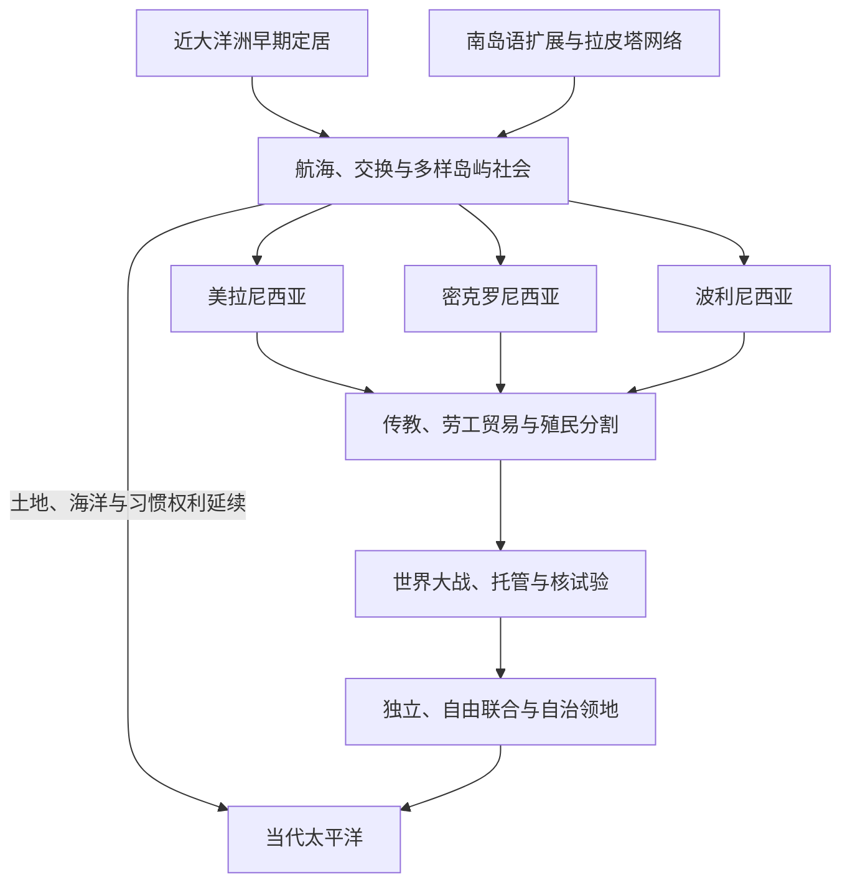

# 太平洋岛屿

## 范围与概括

太平洋岛屿史以海洋通道、亲属网络和岛群生态为中心。美拉尼西亚、密克罗尼西亚、波利尼西亚是19世纪欧洲学者形成的历史地理分类，便于定位却不能代替岛民自身身份。近大洋洲在人类史早期即有人群定居；南岛语航海者与既有巴布亚人群互动，拉皮塔网络继而连接西太平洋与西波利尼西亚。各岛形成王权、等级首领制、村落会议、亲属联盟和分散权威等多种政体。殖民分割、传教、劳工贸易、世界大战、托管和核试验重组这些网络，去殖民化又产生独立、自由联合、海外领地与未完成自决等不同结果。

## 演进图

## 主题与地区导航

| 顺序 | 笔记 | 时间／范围 | 本页职责 |
|---:|---|---|---|
| 1 | [航海、定居与太平洋世界](/%E4%BA%BA%E6%96%87%E7%A7%91%E5%AD%A6/%E5%8E%86%E5%8F%B2/%E5%A4%A7%E6%B4%8B%E6%B4%B2/%E5%A4%AA%E5%B9%B3%E6%B4%8B%E5%B2%9B%E5%B1%BF/%E8%88%AA%E6%B5%B7%E3%80%81%E5%AE%9A%E5%B1%85%E4%B8%8E%E5%A4%AA%E5%B9%B3%E6%B4%8B%E4%B8%96%E7%95%8C.md) | 史前至今 | 萨胡尔、近／远大洋洲、南岛语、拉皮塔、导航与政治形成。 |
| 2 | [美拉尼西亚](/%E4%BA%BA%E6%96%87%E7%A7%91%E5%AD%A6/%E5%8E%86%E5%8F%B2/%E5%A4%A7%E6%B4%8B%E6%B4%B2/%E5%A4%AA%E5%B9%B3%E6%B4%8B%E5%B2%9B%E5%B1%BF/%E7%BE%8E%E6%8B%89%E5%B0%BC%E8%A5%BF%E4%BA%9A.md) | 新几内亚至斐济、新喀里多尼亚 | 巴布亚新几内亚、所罗门、瓦努阿图、斐济、卡纳克社会及国家史。 |
| 3 | [密克罗尼西亚](/%E4%BA%BA%E6%96%87%E7%A7%91%E5%AD%A6/%E5%8E%86%E5%8F%B2/%E5%A4%A7%E6%B4%8B%E6%B4%B2/%E5%A4%AA%E5%B9%B3%E6%B4%8B%E5%B2%9B%E5%B1%BF/%E5%AF%86%E5%85%8B%E7%BD%97%E5%B0%BC%E8%A5%BF%E4%BA%9A.md) | 西北与中北太平洋 | 帕劳、加罗林、马绍尔、马里亚纳、瑙鲁、基里巴斯的海洋政治。 |
| 4 | [波利尼西亚](/%E4%BA%BA%E6%96%87%E7%A7%91%E5%AD%A6/%E5%8E%86%E5%8F%B2/%E5%A4%A7%E6%B4%8B%E6%B4%B2/%E5%A4%AA%E5%B9%B3%E6%B4%8B%E5%B2%9B%E5%B1%BF/%E6%B3%A2%E5%88%A9%E5%B0%BC%E8%A5%BF%E4%BA%9A.md) | 波利尼西亚三角及外围 | 汤加、萨摩亚、夏威夷、塔希提、库克、纽埃、图瓦卢、拉帕努伊等。 |
| 5 | [殖民分割、传教与劳工贸易](/%E4%BA%BA%E6%96%87%E7%A7%91%E5%AD%A6/%E5%8E%86%E5%8F%B2/%E5%A4%A7%E6%B4%8B%E6%B4%B2/%E5%A4%AA%E5%B9%B3%E6%B4%8B%E5%B2%9B%E5%B1%BF/%E6%AE%96%E6%B0%91%E5%88%86%E5%89%B2%E3%80%81%E4%BC%A0%E6%95%99%E4%B8%8E%E5%8A%B3%E5%B7%A5%E8%B4%B8%E6%98%93.md) | 16世纪—20世纪中叶 | 接触、传教、黑鸟掠工、公司与列强分割的机制和后果。 |
| 6 | [太平洋战争、托管与核试验](/%E4%BA%BA%E6%96%87%E7%A7%91%E5%AD%A6/%E5%8E%86%E5%8F%B2/%E5%A4%A7%E6%B4%8B%E6%B4%B2/%E5%A4%AA%E5%B9%B3%E6%B4%8B%E5%B2%9B%E5%B1%BF/%E5%A4%AA%E5%B9%B3%E6%B4%8B%E6%88%98%E4%BA%89%E3%80%81%E6%89%98%E7%AE%A1%E4%B8%8E%E6%A0%B8%E8%AF%95%E9%AA%8C.md) | 1914年至今 | 日本委任统治、二战、联合国托管、核试验与赔偿。 |
| 7 | [独立国家、自治与区域合作](/%E4%BA%BA%E6%96%87%E7%A7%91%E5%AD%A6/%E5%8E%86%E5%8F%B2/%E5%A4%A7%E6%B4%8B%E6%B4%B2/%E5%A4%AA%E5%B9%B3%E6%B4%8B%E5%B2%9B%E5%B1%BF/%E7%8B%AC%E7%AB%8B%E5%9B%BD%E5%AE%B6%E3%80%81%E8%87%AA%E6%B2%BB%E4%B8%8E%E5%8C%BA%E5%9F%9F%E5%90%88%E4%BD%9C.md) | 1962年至今 | 去殖民化路径、区域组织、海洋主权、气候与大国竞争。 |

## 世系、统治与行政专表

| 专表 | 内容契约 |
|---|---|
| [太平洋王权与君主世系表](/%E4%BA%BA%E6%96%87%E7%A7%91%E5%AD%A6/%E5%8E%86%E5%8F%B2/%E5%A4%A7%E6%B4%8B%E6%B4%B2/%E5%A4%AA%E5%B9%B3%E6%B4%8B%E5%B2%9B%E5%B1%BF/%E5%A4%AA%E5%B9%B3%E6%B4%8B%E7%8E%8B%E6%9D%83%E4%B8%8E%E5%90%9B%E4%B8%BB%E4%B8%96%E7%B3%BB%E8%A1%A8.md) | 完整列统一夏威夷王国、Pōmare王朝、近代汤加王朝、斐济短暂王国与萨摩亚国家元首顺序；争议口述谱系不伪造确定表。 |
| [太平洋国家与领地领导结构表](/%E4%BA%BA%E6%96%87%E7%A7%91%E5%AD%A6/%E5%8E%86%E5%8F%B2/%E5%A4%A7%E6%B4%8B%E6%B4%B2/%E5%A4%AA%E5%B9%B3%E6%B4%8B%E5%B2%9B%E5%B1%BF/%E5%A4%AA%E5%B9%B3%E6%B4%8B%E5%9B%BD%E5%AE%B6%E4%B8%8E%E9%A2%86%E5%9C%B0%E9%A2%86%E5%AF%BC%E7%BB%93%E6%9E%84%E8%A1%A8.md) | 截至2026年7月14日，分列国家元首、政府首脑、领地代表与实际权力结构。 |
| [太平洋殖民与托管行政体系表](/%E4%BA%BA%E6%96%87%E7%A7%91%E5%AD%A6/%E5%8E%86%E5%8F%B2/%E5%A4%A7%E6%B4%8B%E6%B4%B2/%E5%A4%AA%E5%B9%B3%E6%B4%8B%E5%B2%9B%E5%B1%BF/%E5%A4%AA%E5%B9%B3%E6%B4%8B%E6%AE%96%E6%B0%91%E4%B8%8E%E6%89%98%E7%AE%A1%E8%A1%8C%E6%94%BF%E4%BD%93%E7%B3%BB%E8%A1%A8.md) | 按管辖阶段列宗主权、行政首脑职称、实际权力及后继安排，避免在各国家页重复。 |

## 重要转折

| 时间 | 事件 | 意义 |
|---|---|---|
| 至少约5万年前 | 人群进入近大洋洲 | 新几内亚、俾斯麦群岛与所罗门西部形成极深的连续居住史。 |
| 约前1600—前500年 | 拉皮塔文化网络 | 陶器、航海、园艺与交换把俾斯麦群岛连接到斐济、汤加、萨摩亚。 |
| 约公元800—1300年 | 东波利尼西亚远洋定居 | 定居夏威夷、拉帕努伊与阿奥特阿罗瓦等遥远岛群。 |
| 1521年以后 | 欧洲船只进入并逐步持续接触 | 疾病、贸易、测绘和帝国主张叠加在既有岛际秩序上。 |
| 19世纪 | 传教、捕鲸、劳工贸易与殖民分割 | 地方首领利用新资源，列强也以保护国、吞并和公司统治夺取主权。 |
| 1914—1945年 | 两次世界大战与日本扩张 | 岛屿成为基地、战场和劳工来源，殖民秩序重新分配。 |
| 1946—1996年 | 托管、核试验与去殖民化 | 自决原则与冷战战略并存，产生独立、自由联合和持续属地。 |
| 1971年 | 南太平洋论坛成立 | 岛国与澳新建立政治协调平台，后发展为太平洋岛屿论坛。 |
| 1985年 | 《拉罗汤加条约》签署 | 南太平洋无核区制度化，回应核试验和军事化。 |

## 关键辨析

- 海上距离不是“隔绝”的同义词；航海知识可把岛屿组成社会空间。
- 小岛不等于小政治。专属经济区、海峡、港口、磷矿、镍矿和军事基地使岛屿具有全球影响。
- 首领制、王权与村落会议常并存；“部落”不能概括全部权力机制。
- 自由联合不是殖民地的别称，也不是完全相同的主权模式：美国与新西兰体系中的国防、公民身份和外交安排不同。
- 气候变化不是脱离历史的环境议题，而与殖民边界、核遗产、移民权和海洋主权相连。

## 相关入口

- 上级：[大洋洲历史](/%E4%BA%BA%E6%96%87%E7%A7%91%E5%AD%A6/%E5%8E%86%E5%8F%B2/%E5%A4%A7%E6%B4%8B%E6%B4%B2/README.md)。
- 大陆国家：[澳大利亚历史](/%E4%BA%BA%E6%96%87%E7%A7%91%E5%AD%A6/%E5%8E%86%E5%8F%B2/%E5%A4%A7%E6%B4%8B%E6%B4%B2/%E6%BE%B3%E5%A4%A7%E5%88%A9%E4%BA%9A/README.md)、[新西兰历史](/%E4%BA%BA%E6%96%87%E7%A7%91%E5%AD%A6/%E5%8E%86%E5%8F%B2/%E5%A4%A7%E6%B4%8B%E6%B4%B2/%E6%96%B0%E8%A5%BF%E5%85%B0/README.md)。
