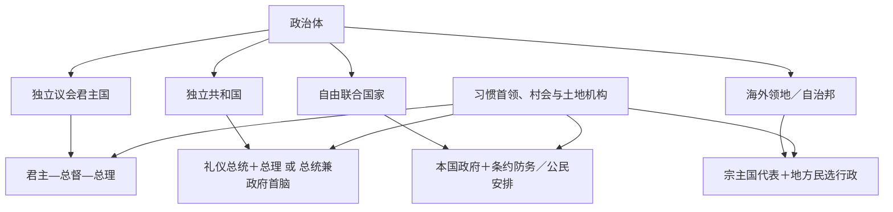

# 太平洋国家与领地领导结构表

## 范围

本表按“国家元首—代表—政府首脑—实际权力”分栏，不把君主、总督、总统、首相、殖民行政官和传统首领混在同一角色。现任人物核验截至2026年7月14日；长期王朝世系见[太平洋王权与君主世系表](/%E4%BA%BA%E6%96%87%E7%A7%91%E5%AD%A6/%E5%8E%86%E5%8F%B2/%E5%A4%A7%E6%B4%8B%E6%B4%B2/%E5%A4%AA%E5%B9%B3%E6%B4%8B%E5%B2%9B%E5%B1%BF/%E5%A4%AA%E5%B9%B3%E6%B4%8B%E7%8E%8B%E6%9D%83%E4%B8%8E%E5%90%9B%E4%B8%BB%E4%B8%96%E7%B3%BB%E8%A1%A8.md)，殖民／托管职位序列见[太平洋殖民与托管行政体系表](/%E4%BA%BA%E6%96%87%E7%A7%91%E5%AD%A6/%E5%8E%86%E5%8F%B2/%E5%A4%A7%E6%B4%8B%E6%B4%B2/%E5%A4%AA%E5%B9%B3%E6%B4%8B%E5%B2%9B%E5%B1%BF/%E5%A4%AA%E5%B9%B3%E6%B4%8B%E6%AE%96%E6%B0%91%E4%B8%8E%E6%89%98%E7%AE%A1%E8%A1%8C%E6%94%BF%E4%BD%93%E7%B3%BB%E8%A1%A8.md)。

## 权力类型图

## 独立议会君主国

| 国家 | 国家元首 | 君主代表 | 政府首脑 | 实际权力结构与现任 |
|---|---|---|---|---|
| 巴布亚新几内亚 | 查尔斯三世 | 总督**鲍勃·达达埃** | 总理**詹姆斯·马拉佩** | 总理由议会多数产生、内阁执政；总督通常依建议。省政府、布干维尔自治政府和习惯土地权力重要。 |
| 所罗门群岛 | 查尔斯三世 | 总督**戴维·蒂瓦·卡普** | 总理**马修·库珀·韦尔** | 议会于2026-05-15在不信任案后选出韦尔；内阁掌行政，省和习惯土地群体影响资源政治。 |
| 图瓦卢 | 查尔斯三世 | 总督**托菲加·瓦埃瓦卢·法拉尼** | 总理**费莱蒂·特奥** | 无正式政党纪律的小议会由议员推举总理；总督履行宪政职能。 |
| 汤加 | **Tupou VI** | 不另设总督 | 首相**Lord Fakafanua** | 本国世袭君主；首相由议会选举后国王任命，国王仍有任命、否决、军队及贵族制度相关权力。2025-12-31新内阁生效。 |

前三国共享同一自然人君主，但各自王冠在法律上独立；英国政府不任命其总督或指挥内阁。

## 独立共和国与特殊元首制

| 国家 | 国家元首 | 政府首脑 | 产生方式 | 实际权力与现任说明 |
|---|---|---|---|---|
| 斐济 | 总统**Ratu Naiqama Lalabalavu** | 总理**Sitiveni Rabuka** | 总统由议会选；总理由议会多数支持 | 总统多礼仪，内阁执政；军队因政变史仍是重要制度背景。 |
| 瓦努阿图 | 总统**Nikenike Vurobaravu** | 总理**Jotham Napat** | 总统由议会与省主席选举团选；总理由议会选 | 总统多礼仪，联合内阁执政；Malvatumauri首领委员会咨询习惯事务。 |
| 萨摩亚 | O le Ao o le Malo **Tuimalealiʻifano Vaʻaletoʻa Sualauvi II** | 总理**Laʻaulialemalietoa Leuatea Polataivao Fosi Schmidt** | 元首由议会选举；总理由议会多数产生 | 元首通常依内阁建议；matai头衔和村级fono构成地方治理。现总理2025-09就职。 |
| 基里巴斯 | 总统**Taneti Maamau** | 同一人兼任 | 议会提名候选人后全民直选 | 总统兼国家与政府首脑并组织内阁；Maamau在2025年开始新任期。 |
| 瑙鲁 | 总统**David Adeang** | 同一人兼任 | 议会从议员中选举 | 总统兼元首、政府首脑和内阁主席；Adeang于2025-10连任。改国名Naoero的修宪程序在2026年仍未全部完成。 |
| 帕劳 | 总统**Surangel Whipps Jr.** | 同一人兼任 | 全民直选 | 总统制；两院国会立法，传统首领委员会就习惯法咨询。Whipps 2024连任、2025就职。 |
| 密克罗尼西亚联邦 | 总统**Wesley Simina** | 同一人兼任 | 国会从四名州级长期议员中选举 | 总统制但依国会联盟；四州自治广泛，美国依自由联合协定承担防务。 |
| 马绍尔群岛 | 总统**Hilda Heine** | 同一人兼任 | Nitijela议会从议员中选举 | 总统组阁并对议会负责；Iroij传统首领委员会咨询。Heine 2024再任，2026仍在任。 |

## 与新西兰自由联合的自治国家

| 政治体 | 形式元首／代表 | 政府首脑 | 实际权力与对外关系 |
|---|---|---|---|
| 库克群岛 | 查尔斯三世；国王代表**Tom Marsters** | 总理**Mark Brown** | 本地议会和内阁完全负责内政并开展外交；居民具新西兰公民身份，新西兰按宪制关系协助国防外交。 |
| 纽埃 | 查尔斯三世；宪制职能与新西兰王冠关系相连 | 总理**Dalton Tagelagi** | 纽埃议会选总理，内阁行使行政权；2026-05-13 Tagelagi再任。与新西兰自由联合且可独立缔结外交关系。 |

自由联合不是宗主国可单方面指挥本地内阁的殖民关系；同时，其公民身份、防务和财政安排又比一般独立国更紧密。

## 美国政治体

| 政治体 | 主权与联邦代表 | 地方政府首脑 | 实际权力结构 |
|---|---|---|---|
| 关岛 | 美国主权；国会依据领地条款立法 | 总督**Lou Leon Guerrero** | 民选总督和一院议会管理内政；美国国防与联邦法优位，居民为美国公民但无总统大选票。 |
| 北马里亚纳群岛自治邦 | 与美国政治联合的自治邦 | 总督**David M. Apatang** | 本地宪法与民选政府；美国掌防务、外交和移民核心框架。Apatang在Arnold Palacios去世后继任。 |
| 美属萨摩亚 | 美国非建制、非组织化领地；内政部监督 | 总督**Pulaʻaliʻi Nikolao Pula** | 民选总督和Fono议会执政；居民通常为美国国民而非自动公民，土地与matai制度受本地宪法保护。 |
| 夏威夷 | 美国州 | 州长由州民直选 | 完整州政府，但原住民夏威夷主权和王室土地议题不因建州自动消失。 |

## 法国政治体

| 政治体 | 法国国家代表 | 地方行政首脑 | 实际权力结构 |
|---|---|---|---|
| 新喀里多尼亚 | 法国高级专员 | 政府主席**Alcide Ponga** | 国会选多党合议政府，省权力显著；法国保留主权、国防、司法等核心权力。2024骚乱后最终地位仍谈判。 |
| 法属波利尼西亚 | 法国高级专员 | 法属波利尼西亚主席**Moetai Brotherson** | 地方议会和政府掌广泛内政；法国保留主权事项。现政府由独立派主导，但政治体尚非独立国家。 |
| 瓦利斯和富图纳 | 省长兼高级行政官**Jean‑François de Manheulle** | 无单一民选政府首脑；领地议会主席处理议会事务 | 法国行政、领地议会与ʻUvea、Alo、Sigave三个习惯王国并存；三王不能合并成“全国国王”。 |

## 新西兰、英国与智利管辖的其他政治体

| 政治体 | 外来主权／代表 | 本地首脑 | 实际权力结构 |
|---|---|---|---|
| 托克劳 | 新西兰领地；新西兰行政官履行外部法定职能 | Ulu-o-Tokelau **Alapati Pita Tavite**（2026年度） | 三环礁Taupulega掌村级权力，General Fono处理全国事务；Ulu由三位Faipule年度轮换。 |
| 皮特凯恩 | 英国海外领地；总督通常由英国驻新西兰高级专员兼任 | 市长**Shawn Christian**（2026年起） | 岛务委员会管理日常，英国保留立法、司法和总督权。 |
| 拉帕努伊 | 智利主权，属于瓦尔帕莱索大区 | 民选市镇政府及原住民机构 | 智利法律与地方行政并行；国家公园、土地和移民控制涉及拉帕努伊人集体权利。 |
| 诺福克岛 | 澳大利亚外部领地；行政官代表联邦 | 地方服务由联邦安排的地区机构承担 | 2016年自治立法议会被撤销后，澳大利亚联邦掌握更直接行政权，地方持续争取制度调整。 |

## 国家元首与政府首脑辨析

- 总督不是英国驻外官员，而是各独立王国君主的本国宪政代表。
- 基里巴斯、瑙鲁、帕劳、密联邦和马绍尔的总统兼任或实质领导政府；斐济、瓦努阿图总统则主要礼仪。
- 萨摩亚O le Ao o le Malo具有传统头衔背景，但由议会选举，不是世袭王位。
- 领地的民选总督／主席掌日常行政，并不等于拥有国际法主权；宗主国仍控制宪制保留事项。
- 传统首领在土地、习惯法与社区中可有实权，但不宜因此把国家总统或首相表改称“王朝世系”。

## 政治更替核验点

| 时间 | 政治体 | 更替 |
|---|---|---|
| 2024年 | 帕劳、马绍尔、新喀里多尼亚等 | 帕劳总统连任；海涅任马绍尔总统；新喀里多尼亚政治危机后政府重组。 |
| 2025年 | 萨摩亚、瑙鲁、瓦努阿图、新喀里多尼亚 | Schmidt、Adeang、Napat、Ponga分别进入现任职位／新任期。 |
| 2025年末—2026年初 | 汤加 | Lord Fakafanua获议会支持，国王任命的新内阁2025-12-31生效。 |
| 2026年5月 | 所罗门群岛 | 不信任案后Matthew Wale获议会26票当选。 |
| 2026年5月 | 纽埃 | Dalton Tagelagi经新一届议会再次当选总理。 |
| 2026年 | 北马里亚纳 | Arnold Palacios去世后David Apatang依法继任总督。 |

## 相关笔记

- 去殖民化与区域政治：[独立国家、自治与区域合作](/%E4%BA%BA%E6%96%87%E7%A7%91%E5%AD%A6/%E5%8E%86%E5%8F%B2/%E5%A4%A7%E6%B4%8B%E6%B4%B2/%E5%A4%AA%E5%B9%B3%E6%B4%8B%E5%B2%9B%E5%B1%BF/%E7%8B%AC%E7%AB%8B%E5%9B%BD%E5%AE%B6%E3%80%81%E8%87%AA%E6%B2%BB%E4%B8%8E%E5%8C%BA%E5%9F%9F%E5%90%88%E4%BD%9C.md)。
- 王权世系：[太平洋王权与君主世系表](/%E4%BA%BA%E6%96%87%E7%A7%91%E5%AD%A6/%E5%8E%86%E5%8F%B2/%E5%A4%A7%E6%B4%8B%E6%B4%B2/%E5%A4%AA%E5%B9%B3%E6%B4%8B%E5%B2%9B%E5%B1%BF/%E5%A4%AA%E5%B9%B3%E6%B4%8B%E7%8E%8B%E6%9D%83%E4%B8%8E%E5%90%9B%E4%B8%BB%E4%B8%96%E7%B3%BB%E8%A1%A8.md)。
- 殖民职位：[太平洋殖民与托管行政体系表](/%E4%BA%BA%E6%96%87%E7%A7%91%E5%AD%A6/%E5%8E%86%E5%8F%B2/%E5%A4%A7%E6%B4%8B%E6%B4%B2/%E5%A4%AA%E5%B9%B3%E6%B4%8B%E5%B2%9B%E5%B1%BF/%E5%A4%AA%E5%B9%B3%E6%B4%8B%E6%AE%96%E6%B0%91%E4%B8%8E%E6%89%98%E7%AE%A1%E8%A1%8C%E6%94%BF%E4%BD%93%E7%B3%BB%E8%A1%A8.md)。
- 总览：[太平洋岛屿](/%E4%BA%BA%E6%96%87%E7%A7%91%E5%AD%A6/%E5%8E%86%E5%8F%B2/%E5%A4%A7%E6%B4%8B%E6%B4%B2/%E5%A4%AA%E5%B9%B3%E6%B4%8B%E5%B2%9B%E5%B1%BF/README.md)。
