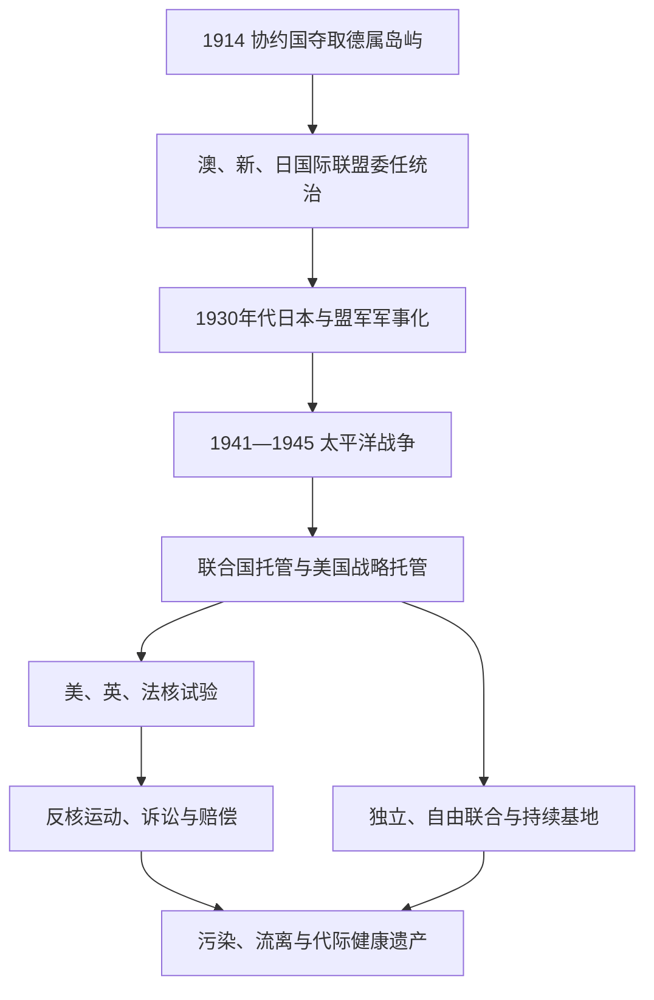

# 太平洋战争、托管与核试验

## 时间

1914年至今，以1914—1945年战争、1946—1996年主要核试验和战后托管为核心；污染、赔偿与未爆弹后果延续至今。

## 概括

两次世界大战把太平洋岛屿从殖民贸易边缘变成海军、机场和通信体系的中心。一战中澳大利亚、新西兰和日本夺取德国殖民地，战后委任统治为下一轮军事化奠基。二战时日本、美国、澳大利亚、新西兰及殖民军队在岛屿推进，岛民既是侦察员、士兵、船员、劳工和救援者，也是强迁、饥饿、轰炸和性暴力的受害者。战后联合国托管以自决为目标，却与美国战略基地及英美法核试验并存。军事“安全”由此转化为岛民长期的土地、健康和主权问题。

## 演进图

## 第一次世界大战与殖民地重新分配

1914年新西兰军队在无大规模战斗下占领德属萨摩亚，澳大利亚海军与军事远征军攻占德属新几内亚及瑙鲁，日本则夺取赤道以北的马里亚纳、加罗林和马绍尔。岛民没有参与决定主权更替。战后国际联盟把萨摩亚交新西兰、新几内亚交澳大利亚、瑙鲁由英澳新共同委任而澳大利亚实际管理，日本获得“南洋群岛”C类委任。

C类委任原则上要求管理国促进居民福祉，实践中却接近领土兼并。日本在南洋群岛发展糖业、港口、学校和移民；澳大利亚在新几内亚管理种植园和劳工；新西兰在萨摩亚压制Mau。国际监督弱、岛民代表有限，说明“委任”并未自动去殖民化。

## 日本扩张与战争爆发

1930年代日本退出国际联盟并限制外界进入南洋群岛，机场、港口和通信逐步军事化。1941年12月后，日本迅速占领关岛、吉尔伯特部分岛屿、拉包尔和所罗门北部，向新几内亚和斐济—萨摩亚方向威胁盟军航线。法属、英属和澳管岛屿成为盟军后勤体系；美国在新赫布里底、斐济、萨摩亚、新喀里多尼亚等建设基地。

战争不是仅由日美两国构成。澳军在新几内亚和西南太平洋承担主力阶段，新西兰军队在所罗门与中太平洋作战，斐济、汤加、萨摩亚等军人和劳工参与，殖民地华人、印度裔和多族港口居民也被动员。

## 主要战役与转折

| 时间 | 战役／地区 | 过程与意义 |
|---|---|---|
| 1942年1月 | 拉包尔陷落 | 日军取得南太平洋重要基地，盟军战俘和平民遭杀害；新几内亚战线展开。 |
| 1942年5月 | 珊瑚海海战 | 日本海上进攻莫尔兹比受阻，航空母舰战显示海空力量转型。 |
| 1942年7月—1943年 | 科科达小径、布纳—戈纳 | 澳、美及巴布亚担架员在恶劣地形作战，阻止陆路进攻莫尔兹比。 |
| 1942年8月—1943年2月 | 瓜达尔卡纳尔 | 盟军首次大规模转入进攻；所罗门侦察员和劳工发挥关键作用。 |
| 1943年11月 | 塔拉瓦 | 美军强攻日军防御环礁，短期高伤亡揭示两栖登陆困难。 |
| 1944年 | 夸贾林、埃内韦塔克 | 美军推进马绍尔，建立后续基地。 |
| 1944年6—7月 | 塞班、提尼安、关岛 | 突破日本“绝对国防圈”；平民大量死亡，B-29基地接近日本本土。 |
| 1944年9—11月 | 贝里琉 | 战役伤亡极高而战略必要性受争议，帕劳土地长期留有遗骸和未爆弹。 |
| 1945年 | 提尼安与战争终结 | 投向广岛、长崎的原子弹由提尼安起飞，岛屿成为核时代起点之一。 |

## 岛民经历

军队征用土地、椰林和村庄修建跑道，货币和工资刺激港口经济，也造成通胀、性别关系变化和战后弃置设施。日本军队在部分地区强迫劳动、处决嫌疑者并迁移居民；盟军轰炸和“越岛”战略同样使未被登陆的驻军与平民陷入饥荒。查莫罗人经历日占强迫劳动与屠杀，瑙鲁人被强迁楚克，Banaba与吉尔伯特居民遭征用。

所罗门“海岸观察员”和本地侦察员提供情报，新几内亚担架员救护伤兵，但殖民纪念长期把他们写成辅助角色。战后军营物资、跨种族接触和盟军对“自由”的宣传反过来增强地方反殖民政治。未爆弹、沉船燃油和军事垃圾至今仍影响土地与渔场。

## 战后托管与政治地位

1946年联合国托管制度要求管理国促进自决。澳大利亚继续管理新几内亚，新西兰管理西萨摩亚，美国管理日本旧南洋群岛；瑙鲁由英澳新共同托管而澳大利亚行政。美国TTPI是唯一“战略托管地”，安全理事会而非仅托管理事会监督，美国保留关闭区域和军事部署的特殊权力。

托管推动学校、地方议会和宪制会议，却没有统一终点：萨摩亚1962年独立，瑙鲁1968年独立，巴布亚新几内亚1975年独立；北马里亚纳选择美国自治邦，密克罗尼西亚联邦、马绍尔和帕劳选择自由联合。详细行政序列见[太平洋殖民与托管行政体系表](/%E4%BA%BA%E6%96%87%E7%A7%91%E5%AD%A6/%E5%8E%86%E5%8F%B2/%E5%A4%A7%E6%B4%8B%E6%B4%B2/%E5%A4%AA%E5%B9%B3%E6%B4%8B%E5%B2%9B%E5%B1%BF/%E5%A4%AA%E5%B9%B3%E6%B4%8B%E6%AE%96%E6%B0%91%E4%B8%8E%E6%89%98%E7%AE%A1%E8%A1%8C%E6%94%BF%E4%BD%93%E7%B3%BB%E8%A1%A8.md)。

## 美国在马绍尔群岛的核试验

美国1946—1958年在比基尼和埃内韦塔克进行67次大气和水下核试验。居民被告知为“人类福祉”暂时迁移，但替代岛屿食物不足，回迁多次失败。1954年Castle Bravo爆炸当量远超预期，放射性沉降覆盖Rongelap、Utrik和日本渔船“第五福龙丸”；美国在已暴露居民中开展医学研究，知情同意和治疗伦理长期受批评。

埃内韦塔克部分污染土壤被集中于Runit Dome；建筑并未清除整个核遗产。比基尼仍不适宜稳定回居，Rongelap居民经历撤离、回迁和再次迁移。自由联合协定设核赔偿机制和法庭，但裁决金额远超基金能力，美国对“完全最终解决”的主张与马绍尔持续诉求冲突。

## 英国在澳大利亚与中太平洋的试验

英国1952年在西澳Montebello群岛进行首次核爆，1953年在Emu Field、1956—1963年在Maralinga开展试验及“次临界／小规模”实验。澳大利亚政府批准并参与后勤，原住民土地通行、预警和清理不足；Aṉangu等群体、军人和工作人员可能接触污染。1980年代皇家委员会推动清理和土地返还，但健康、档案与赔偿争议延续。

英国1957—1958年又在当时属吉尔伯特和埃利斯殖民地的Malden与Kiritimati进行氢弹试验；美国1962年在Kiritimati附近继续Operation Dominic。岛民劳工和英新斐军人参与，剂量记录与健康认定成为后续索赔难点。基里巴斯独立后仍要求核试验国承担责任。

## 法国在法属波利尼西亚的试验

法国结束阿尔及利亚试验后，把中心移至Mururoa和Fangataufa，1966—1996年共进行近两百次大气与地下试验。大气沉降影响多个有人岛，地下爆炸又引发环礁地质与泄漏担忧。法国军费和岗位重塑塔希提经济，使领地财政更依赖国家转移，也压低了公开批评空间。

澳大利亚和新西兰1973年向国际法院起诉并派军舰抗议；太平洋教会、独立运动与无核组织持续行动。1985年法国特工在奥克兰炸沉“彩虹勇士”号，造成一人死亡，事件强化区域反核立场。法国2009年设补偿制度，后逐步放宽，但举证、剂量模型和承认范围仍有争议。

## 区域反核政治

1954年Bravo事件、核沉降和殖民统治把反核与自决结合。1985年南太平洋国家签署《拉罗汤加条约》，禁止区域内核爆炸和放射性废物倾倒，并对核武器驻留赋予国家决定权。新西兰1987年立法无核，导致美国暂停澳新美条约对其义务；法国1996年结束试验后签署相关议定书。

无核区不等于完全去军事化：美国基地、自由联合防务权、核动力／核武模糊政策和核废物运输仍受争论。岛民更强调“核正义”，即医疗、环境监测、档案公开、迁居权、土地修复和跨代赔偿。

## 因果与阶段终结

- **战争结构因素**：帝国航线、油料与空军基地需求，使小岛成为战略节点。
- **直接转折**：一战击败德国后改为委任；二战击败日本后改为联合国托管。
- **冷战压力**：美国、英国、法国把人口稀少的殖民岛屿视为可测试空间，政治不平等降低本地否决权。
- **试验终止原因**：技术转向地下试验、国际舆论、区域政府抗议、条约与冷战结束共同作用。
- **为何遗产未终结**：放射性核素、被迫迁移、法律时效和赔偿制度跨越数代，不能用“最后一次爆炸日期”划句号。

## 演变关系

- 前一阶段：[殖民分割、传教与劳工贸易](/%E4%BA%BA%E6%96%87%E7%A7%91%E5%AD%A6/%E5%8E%86%E5%8F%B2/%E5%A4%A7%E6%B4%8B%E6%B4%B2/%E5%A4%AA%E5%B9%B3%E6%B4%8B%E5%B2%9B%E5%B1%BF/%E6%AE%96%E6%B0%91%E5%88%86%E5%89%B2%E3%80%81%E4%BC%A0%E6%95%99%E4%B8%8E%E5%8A%B3%E5%B7%A5%E8%B4%B8%E6%98%93.md)。
- 后一阶段：[独立国家、自治与区域合作](/%E4%BA%BA%E6%96%87%E7%A7%91%E5%AD%A6/%E5%8E%86%E5%8F%B2/%E5%A4%A7%E6%B4%8B%E6%B4%B2/%E5%A4%AA%E5%B9%B3%E6%B4%8B%E5%B2%9B%E5%B1%BF/%E7%8B%AC%E7%AB%8B%E5%9B%BD%E5%AE%B6%E3%80%81%E8%87%AA%E6%B2%BB%E4%B8%8E%E5%8C%BA%E5%9F%9F%E5%90%88%E4%BD%9C.md)。
- 地区细节：[密克罗尼西亚](/%E4%BA%BA%E6%96%87%E7%A7%91%E5%AD%A6/%E5%8E%86%E5%8F%B2/%E5%A4%A7%E6%B4%8B%E6%B4%B2/%E5%A4%AA%E5%B9%B3%E6%B4%8B%E5%B2%9B%E5%B1%BF/%E5%AF%86%E5%85%8B%E7%BD%97%E5%B0%BC%E8%A5%BF%E4%BA%9A.md)、[美拉尼西亚](/%E4%BA%BA%E6%96%87%E7%A7%91%E5%AD%A6/%E5%8E%86%E5%8F%B2/%E5%A4%A7%E6%B4%8B%E6%B4%B2/%E5%A4%AA%E5%B9%B3%E6%B4%8B%E5%B2%9B%E5%B1%BF/%E7%BE%8E%E6%8B%89%E5%B0%BC%E8%A5%BF%E4%BA%9A.md)、[波利尼西亚](/%E4%BA%BA%E6%96%87%E7%A7%91%E5%AD%A6/%E5%8E%86%E5%8F%B2/%E5%A4%A7%E6%B4%8B%E6%B4%B2/%E5%A4%AA%E5%B9%B3%E6%B4%8B%E5%B2%9B%E5%B1%BF/%E6%B3%A2%E5%88%A9%E5%B0%BC%E8%A5%BF%E4%BA%9A.md)。
- 总览：[太平洋岛屿](/%E4%BA%BA%E6%96%87%E7%A7%91%E5%AD%A6/%E5%8E%86%E5%8F%B2/%E5%A4%A7%E6%B4%8B%E6%B4%B2/%E5%A4%AA%E5%B9%B3%E6%B4%8B%E5%B2%9B%E5%B1%BF/README.md)。
