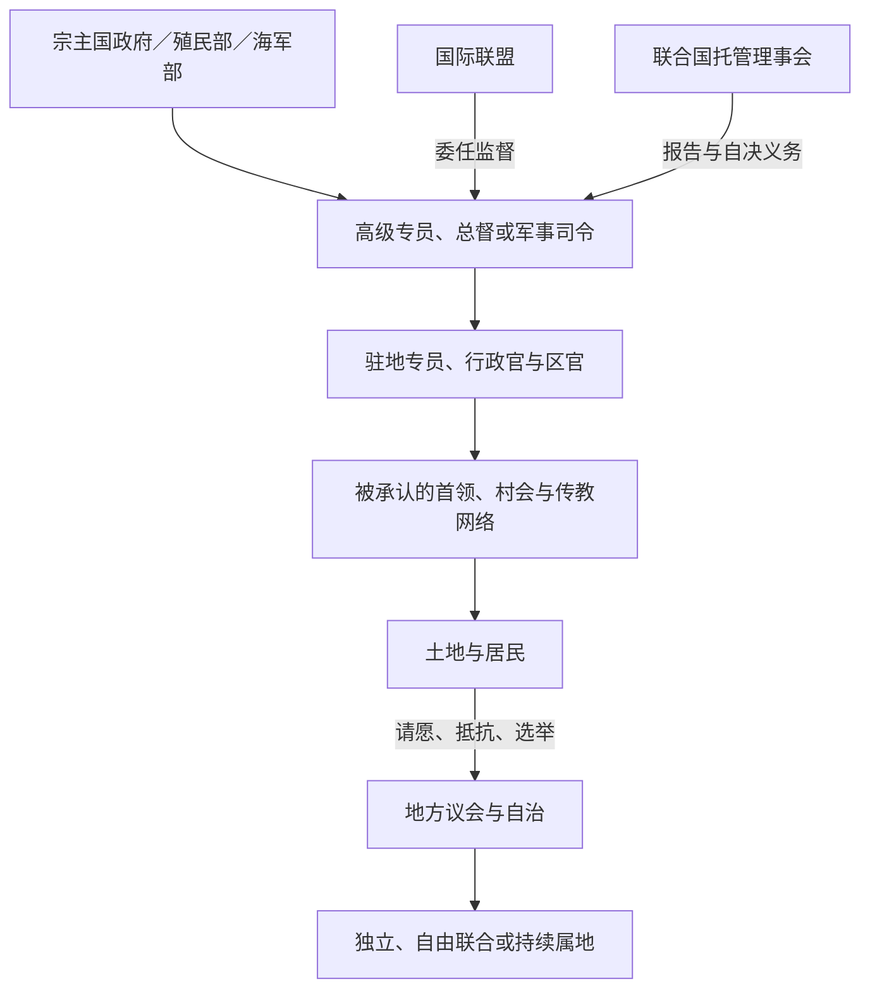

# 太平洋殖民与托管行政体系表

## 范围与读法

本表按岛群列出外来主权阶段、正式行政首脑职称、实际权力和直接后继。它追踪的是“政权—职位”完整序列，而非把数十个互不相属殖民地的所有临时代理官员混成一条人物世系；临时军政长官和短期代行者只在造成制度转折时注明。殖民地、保护国、委任统治和托管地不是君主王朝，故不套用君主表。

## 行政关系图

## 跨区域机构

| 机构 | 时间 | 行政首脑 | 覆盖与实际权力 | 终结／后继 |
|---|---|---|---|---|
| 西太平洋高级专员公署 | 1877—1976 | 高级专员，长期由斐济总督兼任 | 对英国未正式殖民岛屿的英国臣民行使领事司法，并监督所罗门、吉尔伯特—埃利斯等驻地专员 | 各领地独立或建立直接总督职位后撤销。 |
| 日本南洋厅 | 1922—1944 | 南洋厅长官，受日本内阁／拓务省监督 | 管理帕劳、加罗林、马绍尔、北马里亚纳；警察、学校、经济和移民，后期军事化 | 美军占领；1947年美国战略托管。 |
| 太平洋群岛托管地（TTPI） | 1947—1994 | 美国海军军政长官；1951后高级专员 | 美国为联合国战略托管管理国，控制防务、外交和财政，逐步设密克罗尼西亚议会 | 北马里亚纳盟约、三份自由联合；帕劳1994年最后退出。 |

## 美拉尼西亚管辖序列

| 地区 | 时间 | 政权／法律地位 | 行政首脑职称 | 实际权力与直接后继 |
|---|---|---|---|---|
| 英属新几内亚／巴布亚 | 1884—1888；1888—1906；1906—1942 | 英国保护地→王室殖民地→澳大利亚领地 | 特别专员→行政长官／副总督 | 英国后移交澳大利亚；二战军政后与新几内亚合并管理。 |
| 德属新几内亚 | 1884—1914 | 德国保护地，初由新几内亚公司经营 | 土地首长／公司行政官→帝国总督 | 1914年澳军占领；1921年国际联盟委任澳大利亚。 |
| 新几内亚委任统治地 | 1921—1942 | 澳大利亚C类委任统治 | 行政长官 | 对土地、劳工和税收有广泛权力；日军入侵后军管。 |
| 巴布亚—新几内亚合并行政 | 1942—1949；1949—1975 | 澳军行政→联合国托管地与巴布亚领地行政联合 | 总行政长官→行政长官；后设高级专员／自治政府 | 1973年内部自治，1975年巴布亚新几内亚独立。 |
| 英属所罗门群岛保护国 | 1893—1953；1953—1978 | 英国保护国 | 驻地专员（受高级专员监督）→总督 | 控制司法、税收与土地；战后地方议会发展，1978年独立。 |
| 新赫布里底英法共管 | 1906—1980 | 英法共管地 | 英、法驻地专员各一；联合高等法院 | 两套警察、法院、学校和公司法并存；1980年瓦努阿图独立。 |
| 斐济王室殖民地 | 1874—1970 | 英国殖民地 | 总督；兼西太平洋高级专员 | 土著事务以首领会议和区行政间接治理；1970年独立。 |
| 新喀里多尼亚 | 1853—1946 | 法国殖民地／流放地 | 总督 | 土地没收、indigénat与镍矿；1946年后为海外领地。 |
| 新喀里多尼亚海外体制 | 1946年至今 | 海外领地→特殊共同体 | 法国高级专员；地方政府主席 | 法国掌主权核心；Nouméa协议后权力下放，自决安排仍在谈判。 |

## 波利尼西亚管辖序列

| 地区 | 时间 | 政权／法律地位 | 行政首脑职称 | 实际权力与直接后继 |
|---|---|---|---|---|
| 塔希提法国保护国 | 1842—1880 | Pōmare王国置于法国保护 | 法国专员／总督与本地君主并立 | 法国控制外交并逐步扩权；Pōmare V于1880年让渡。 |
| 法属大洋洲／法属波利尼西亚 | 1880—1957；1957年至今 | 法国殖民地→海外领地／海外集体 | 总督→高级专员；另有自治政府主席 | 地方自治扩大，法国保留国防、司法与主权。 |
| 德属萨摩亚 | 1900—1914 | 德国殖民地 | 帝国总督 | 发展种植园、税收和地方首领行政；1914年被新西兰占领。 |
| 新西兰军事占领萨摩亚 | 1914—1920 | 战时占领 | 军事行政官（罗伯特·洛根为关键首任） | 1918流感重创合法性；转国际联盟委任。 |
| 西萨摩亚委任／托管 | 1920—1946；1946—1962 | 新西兰C类委任→联合国托管 | 行政官→高级专员；逐步设本地政府 | Mau运动、地方自治与联合国监督；1962年独立。 |
| 东萨摩亚／美属萨摩亚 | 1900—1951；1951年至今 | 美国海军管辖→美国内政部非建制领地 | 海军总督→内政部任命总督→1977后民选总督 | 美国拥有主权，本地宪法、议会与民选政府处理内政。 |
| 汤加英国保护国 | 1900—1970 | 受保护国家 | 英国领事／专员；汤加国王和首相继续执政 | 英国主掌外交并影响内阁，非直接王室殖民；1970年终止保护。 |
| 库克群岛 | 1888—1901；1901—1965 | 英国保护国→新西兰属地 | 英国驻地官→新西兰驻地专员 | 1965年与新西兰自由联合自治。 |
| 纽埃 | 1900—1901；1901—1974 | 英国保护国→新西兰管辖 | 驻地专员 | 1974年自由联合自治。 |
| 托克劳 | 1877／1889—1926；1926年至今 | 英国保护下“联合群岛”→新西兰领地 | 吉尔伯特—埃利斯驻地体系→新西兰行政官 | 村议会保留广泛权力；两次自决公投未达自由联合门槛。 |
| 图瓦卢（埃利斯群岛） | 1892—1916；1916—1975；1975—1978 | 英国保护国→吉尔伯特和埃利斯殖民地→分立殖民地 | 驻地专员／总督 | 1974公投选择与吉尔伯特分离；1978独立。 |
| 夏威夷 | 1893—1898；1898—1959 | 临时政府／共和国→美国领地 | 共和国总统→美国任命领地总督 | 1898吞并，1959成为美国州；原住民主权争议延续。 |
| 拉帕努伊 | 1888年至今 | 智利吞并；长期公司牧场与海军管理 | 海军／公司行政→智利地方行政 | 1966后完整公民权和地方政府；土地与自治诉求持续。 |
| 瓦利斯和富图纳 | 1887／1888—1961；1961年至今 | 法国保护国→海外领地／集体 | 驻地官→高级行政官／省长 | 三个习惯王国与法国行政、领地议会并存。 |
| 皮特凯恩 | 1838年至今 | 英国殖民地／海外领地 | 总督，通常由英国驻新西兰高级专员兼任；岛上行政官和民选市长 | 岛务委员会处理日常治理，英国保留主权。 |

## 密克罗尼西亚管辖序列

| 地区 | 时间 | 政权／法律地位 | 行政首脑职称 | 实际权力与直接后继 |
|---|---|---|---|---|
| 西属马里亚纳／加罗林 | 17世纪后期—1898／1899 | 西班牙殖民及传教管辖 | 关岛总督；加罗林地区驻地官 | 关岛1898割让美国；北马里亚纳和加罗林1899售德国。 |
| 德属密克罗尼西亚 | 1885／1899—1914 | 德国保护地 | 驻地专员／区行政官，受德属新几内亚总督体系监督 | 1914年日本占领，后成南洋委任地。 |
| 关岛美国海军政府 | 1898—1941；1944—1950 | 美国非建制领地 | 海军总督 | 1941—1944日本占领；1950组织法后民政。 |
| 关岛日本占领 | 1941—1944 | 军事占领 | 日本海军军政官 | 强迫劳动、迁移和暴力；1944美军重占。 |
| 关岛民政 | 1950年至今 | 美国有组织非建制领地 | 美国总统／内政体系；1970后民选总督 | 地方自治有限，美国掌主权与防务。 |
| 北马里亚纳 | 1947—1978／1986 | TTPI一部分→美国自治邦过渡 | TTPI高级专员→自治邦总督 | 1975盟约公投，1986主要条款生效。 |
| 马绍尔／加罗林／帕劳 | 1947—1986／1990／1994 | 美国战略托管 | TTPI高级专员、区行政官 | 分别形成马绍尔、密联邦、帕劳自由联合国家。 |
| 瑙鲁德国统治 | 1888—1914 | 德国保护地，纳入马绍尔行政 | 驻地行政官／Jaluit公司影响 | 澳军1914占领。 |
| 瑙鲁委任／托管 | 1920—1942；1947—1968 | 英澳新共同委任，澳大利亚实际行政→联合国托管 | 澳大利亚任命行政官 | 日占中断；1968独立。 |
| 瑙鲁日本占领 | 1942—1945 | 军事占领 | 日本海军军政 | 强迁楚克与死亡；澳大利亚战后恢复行政。 |
| 吉尔伯特群岛 | 1892—1916；1916—1976／1979 | 英国保护国→吉尔伯特和埃利斯殖民地→分立殖民地 | 驻地专员→总督 | 埃利斯分离；1979基里巴斯独立。 |

## 重要行政首脑与制度节点

| 人物／职位 | 地区与任期节点 | 作用 |
|---|---|---|
| 阿瑟·戈登 | 斐济总督，1875—1880 | 发展间接统治、保留大部分iTaukei土地并引入印度契约劳工；制度兼有保护与族群隔离。 |
| 威廉·麦格雷戈 | 英属新几内亚行政长官，1888—1898 | 扩大殖民巡察和行政边界。 |
| 阿尔伯特·哈尔 | 德属新几内亚关键总督／行政官 | 推动村落行政、土地和种植园政策，亦遭本地抵抗。 |
| 休伯特·默里 | 巴布亚副总督，1908—1940 | 长期塑造澳管巴布亚“保护性”家长制及劳工管理。 |
| 威廉·索尔夫 | 德属萨摩亚首任总督，1900—1910 | 以首领体系、种植园与中央行政巩固德治。 |
| 罗伯特·洛根 | 新西兰占领萨摩亚军事行政官，1914—1919 | 负责接管；1918年流感处置失败成为殖民责任核心。 |
| 乔治·理查森 | 西萨摩亚行政官，1923—1928 | 强硬政策激化Mau运动。 |
| 美国TTPI高级专员 | 1951—1986以后分阶段 | 在内政部体系下掌预算、外交与行政，同时逐步移交地方议会。 |
| 英法两驻地专员 | 新赫布里底，1906—1980 | 并列而非上下级，联合规则不足导致重复行政和无国籍困境。 |
| 法国高级专员 | 新喀里多尼亚、法属波利尼西亚当代 | 代表法国国家并掌保留权力，与地方政府主席分工。 |

## 权力结构辨析

- “保护国”有时保留本地君主和内阁，如汤加；有时殖民官逐步取得几乎全部权力，如所罗门，不能只按名称判断。
- 国际联盟C类委任和联合国托管都要求居民福祉，但C类委任常被当作管理国领土的延伸；联合国托管的自决监督更强。
- 总督／高级专员与地方首领并非平等“双重主权”：殖民法律通常决定何种习惯被承认。
- 军事占领以武装司令为实际最高权力，既有王权或民政机构可能被暂停、利用或架空。

## 相关笔记

- 过程说明：[殖民分割、传教与劳工贸易](/%E4%BA%BA%E6%96%87%E7%A7%91%E5%AD%A6/%E5%8E%86%E5%8F%B2/%E5%A4%A7%E6%B4%8B%E6%B4%B2/%E5%A4%AA%E5%B9%B3%E6%B4%8B%E5%B2%9B%E5%B1%BF/%E6%AE%96%E6%B0%91%E5%88%86%E5%89%B2%E3%80%81%E4%BC%A0%E6%95%99%E4%B8%8E%E5%8A%B3%E5%B7%A5%E8%B4%B8%E6%98%93.md)。
- 战时转移：[太平洋战争、托管与核试验](/%E4%BA%BA%E6%96%87%E7%A7%91%E5%AD%A6/%E5%8E%86%E5%8F%B2/%E5%A4%A7%E6%B4%8B%E6%B4%B2/%E5%A4%AA%E5%B9%B3%E6%B4%8B%E5%B2%9B%E5%B1%BF/%E5%A4%AA%E5%B9%B3%E6%B4%8B%E6%88%98%E4%BA%89%E3%80%81%E6%89%98%E7%AE%A1%E4%B8%8E%E6%A0%B8%E8%AF%95%E9%AA%8C.md)。
- 后继政体：[独立国家、自治与区域合作](/%E4%BA%BA%E6%96%87%E7%A7%91%E5%AD%A6/%E5%8E%86%E5%8F%B2/%E5%A4%A7%E6%B4%8B%E6%B4%B2/%E5%A4%AA%E5%B9%B3%E6%B4%8B%E5%B2%9B%E5%B1%BF/%E7%8B%AC%E7%AB%8B%E5%9B%BD%E5%AE%B6%E3%80%81%E8%87%AA%E6%B2%BB%E4%B8%8E%E5%8C%BA%E5%9F%9F%E5%90%88%E4%BD%9C.md)、[太平洋国家与领地领导结构表](/%E4%BA%BA%E6%96%87%E7%A7%91%E5%AD%A6/%E5%8E%86%E5%8F%B2/%E5%A4%A7%E6%B4%8B%E6%B4%B2/%E5%A4%AA%E5%B9%B3%E6%B4%8B%E5%B2%9B%E5%B1%BF/%E5%A4%AA%E5%B9%B3%E6%B4%8B%E5%9B%BD%E5%AE%B6%E4%B8%8E%E9%A2%86%E5%9C%B0%E9%A2%86%E5%AF%BC%E7%BB%93%E6%9E%84%E8%A1%A8.md)。
- 总览：[太平洋岛屿](/%E4%BA%BA%E6%96%87%E7%A7%91%E5%AD%A6/%E5%8E%86%E5%8F%B2/%E5%A4%A7%E6%B4%8B%E6%B4%B2/%E5%A4%AA%E5%B9%B3%E6%B4%8B%E5%B2%9B%E5%B1%BF/README.md)。
