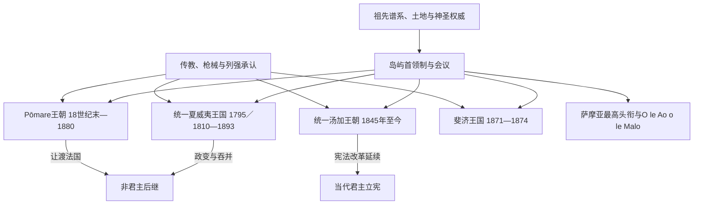

# 太平洋王权与君主世系表

## 范围与原则

本表完整列出史料连续、具有明确近代国家统治范围的夏威夷王国、塔希提Pōmare王朝、统一后的汤加王国，以及1871—1874年斐济王国唯一君主。萨摩亚O le Ao o le Malo因首任安排近似传统终身元首而常被误称君主，本表另列完整国家元首顺序并明确其共和国式议会选举性质。早期Tuʻi Tonga、Nan Madol、拉帕努伊和各岛ariki谱系兼有口述、共治、头衔分化与年代争议，不伪造“精确完整王表”。

## 王权关系图

## 统一夏威夷王国君主完整表

| 顺序 | 君主 | 在位 | 王室／与前任关系 | 关键事件与终结 |
|---:|---|---|---|---|
| 1 | **Kamehameha I** | 1795／1810—1819 | Kamehameha王朝创立者 | 1795年控制主要岛屿，1810年Kauaʻi臣服完成统一；控制檀香贸易与外国关系。 |
| 2 | Kamehameha II（Liholiho） | 1819—1824 | Kamehameha I之子 | 与Kaʻahumanu共同废除kapu体系；赴英期间病逝。 |
| 3 | **Kamehameha III（Kauikeaouli）** | 1825—1854 | Kamehameha II之弟 | 幼年由摄政；1840年宪法、1848年土地大分割，1843年恢复日维护主权。 |
| 4 | Kamehameha IV（Alexander Liholiho） | 1855—1863 | Kamehameha I之外孙系侄／养嗣 | 抵制美国吞并倾向，推动圣公会与医疗事业；无存活继承人。 |
| 5 | Kamehameha V（Lot Kapuāiwa） | 1863—1872 | Kamehameha IV之兄 | 1864年宪法加强王权；未指定继承人而亡，王朝直系终结。 |
| 6 | William Charles Lunalilo | 1873—1874 | Keōua后裔；由议会选举 | 顺应民意选立，任期不足一年、无嗣。 |
| 7 | **David Kalākaua** | 1874—1891 | Kalākaua王朝创立者；议会选举 | 文化复兴与世界巡访；1887年被迫接受“刺刀宪法”削权。 |
| 8 | **Liliʻuokalani** | 1891—1893 | Kalākaua之妹 | 试图制定新宪法恢复王权；1893年被定居者政变推翻，1895年正式放弃王位要求。 |

王国直接后继为1893—1894年临时政府、1894—1898年夏威夷共和国，1898年被美国吞并。君主制灭亡的结构原因包括原住民人口锐减、糖业资本和外国公民控制选举；直接触发是Liliʻuokalani制宪争议、政变委员会行动及美国驻军介入。

## 塔希提Pōmare王朝完整表

| 顺序 | 君主 | 在位 | 与前任关系 | 关键事件／备注 |
|---:|---|---|---|---|
| 1 | **Pōmare I** | 约1788—1791为王；1791—1803摄政 | 王朝创立者 | 借武器与联盟扩大对塔希提控制；1791年让位幼子但继续实际统治。 |
| 2 | **Pōmare II** | 1791—1821；1803后亲政 | Pōmare I之子 | 一度流亡，皈依基督教；1815年Feʻi Pi获胜后重建统治。 |
| 3 | Pōmare III | 1821—1827 | Pōmare II之子 | 幼年继位，由母系亲属与首领摄政；早逝。 |
| 4 | **Pōmare IV** | 1827—1877 | Pōmare III之同父异母姊 | 1842年被迫接受法国保护，1844—1847年法塔战争；保护国下继续为君主。 |
| 5 | **Pōmare V** | 1877—1880 | Pōmare IV之子 | 1880年接受法国安排并让渡王国，获终身待遇；王国灭亡。 |

Pōmare王权兴起依赖群岛战争、欧洲武器和传教联盟；衰落来自地方首领抵抗、英法传教竞争和法国军事压力。1880年让渡是直接终结机制，王国领土并入法国殖民体系。

## 统一后汤加王国君主完整表

本表从1845年Taufaʻāhau统一主要岛群并以George Tupou I名号即位起。更早的Tuʻi Tonga、Tuʻi Haʻatakalaua和Tuʻi Kanokupolu并存且年代有争议，应按头衔史研究，不与现代单一王位机械拼接。

| 顺序 | 君主 | 在位 | 与前任关系 | 关键事件／备注 |
|---:|---|---|---|---|
| 1 | **George Tupou I** | 1845—1893 | 统一者；原名Taufaʻāhau | 统一岛群、皈依卫理宗；颁布1839年法典和1875年宪法，确立近代王国。 |
| 2 | George Tupou II | 1893—1918 | George Tupou I曾孙 | 1900年接受英国保护以维持王朝与领土；财政和内政受英国强力影响。 |
| 3 | **Sālote Tupou III** | 1918—1965 | George Tupou II之女 | 长期统治，整合王族和首领；提升国际能见度并推动教育。 |
| 4 | Tāufaʻāhau Tupou IV | 1965—2006 | Sālote Tupou III之子 | 1970年终止英国保护；现代化与君主主导政府并存。 |
| 5 | George Tupou V | 2006—2012 | Tāufaʻāhau Tupou IV长子 | 2006年努库阿洛法骚乱后承诺民主改革；2010年选举扩大民选议员。 |
| 6 | **Tupou VI** | 2012年至今 | George Tupou V之弟 | 君主立宪改革后的国王；仍具任命、否决和贵族相关权力。 |

王朝持续的原因包括1875年宪法、土地制度、首领整合和以保护国换取内政延续。2010年改革没有废除王位，而是把日常政府更明确交由议会多数与首相。

## 斐济王国君主完整表

| 顺序 | 君主／称号 | 在位 | 建立与终结 |
|---:|---|---|---|
| 1 | **Seru Epenisa Cakobau，Tui Viti** | 1871—1874 | 在定居者、债务与列强压力下建立统一政府，但并未完全控制所有首领；1874年与主要首领签署割让文书，群岛成为英国殖民地。 |

Cakobau此前是Bau的Vunivalu，其“Tui Viti”主张经历长期争议。本表只把1871年宪制王国视为单一国家王位，不把各地首领头衔错误合并为其臣属世系。

## 萨摩亚O le Ao o le Malo完整表

萨摩亚宪制是议会共和国式结构，O le Ao o le Malo由立法议会选举，不能当作世袭君主。1962年独立时对两位最高头衔持有者作终身共同元首的过渡安排，造成“君主制”误读。

| 顺序 | 国家元首 | 任期 | 产生方式与备注 |
|---:|---|---|---|
| 1A | Tupua Tamasese Meaʻole | 1962—1963 | 与Malietoa Tanumafili II共同终身元首；1963年去世。 |
| 1B | **Malietoa Tanumafili II** | 1962—2007 | 1962—1963共同、其后单独终身元首；独立宪法的特别过渡安排。 |
| 2 | Tui Atua Tupua Tamasese Efi | 2007—2017 | 议会选举，两届五年任期。 |
| 3 | **Tuimalealiʻifano Vaʻaletoʻa Sualauvi II** | 2017年至今 | 议会选举；2022年开始第二届，核验至2026-07-14仍在任。 |

## 不建立伪完整表的王权

| 制度 | 原因 | 正确记录方式 |
|---|---|---|
| Tuʻi Tonga早期谱系 | 口述世系很长，神圣头衔与实际统治、共治和年代不一致 | 分别研究三大汤加头衔，明确“约”和争议。 |
| 拉帕努伊ariki | 口述名单受奴掠、人口崩溃和殖民记录影响 | 结合氏族、鸟人仪式和智利吞并史，不造连续年份。 |
| Nan Madol／Saudeleur | 考古年代与口述统治者数目不完全对应 | 记录政体结构和约略阶段。 |
| 库克群岛ariki | 各岛多个头衔并存，现代House of Ariki不是国家上院或统一王室 | 按岛和头衔记录，不合并成“库克国王”。 |
| 瓦利斯和富图纳三王 | ʻUvea、Alo、Sigave各自选立，继承可中断或争议 | 按三个习惯王国分别维护，不能列成一条领地王朝。 |
| 毛利Kīngitanga | 属新西兰专门主线 | 完整八君主见[新西兰总督、总理与毛利君主表](/%E4%BA%BA%E6%96%87%E7%A7%91%E5%AD%A6/%E5%8E%86%E5%8F%B2/%E5%A4%A7%E6%B4%8B%E6%B4%B2/%E6%96%B0%E8%A5%BF%E5%85%B0/%E6%96%B0%E8%A5%BF%E5%85%B0%E6%80%BB%E7%9D%A3%E3%80%81%E6%80%BB%E7%90%86%E4%B8%8E%E6%AF%9B%E5%88%A9%E5%90%9B%E4%B8%BB%E8%A1%A8.md)。 |

## 相关笔记

- 地区过程：[波利尼西亚](/%E4%BA%BA%E6%96%87%E7%A7%91%E5%AD%A6/%E5%8E%86%E5%8F%B2/%E5%A4%A7%E6%B4%8B%E6%B4%B2/%E5%A4%AA%E5%B9%B3%E6%B4%8B%E5%B2%9B%E5%B1%BF/%E6%B3%A2%E5%88%A9%E5%B0%BC%E8%A5%BF%E4%BA%9A.md)。
- 殖民终结：[殖民分割、传教与劳工贸易](/%E4%BA%BA%E6%96%87%E7%A7%91%E5%AD%A6/%E5%8E%86%E5%8F%B2/%E5%A4%A7%E6%B4%8B%E6%B4%B2/%E5%A4%AA%E5%B9%B3%E6%B4%8B%E5%B2%9B%E5%B1%BF/%E6%AE%96%E6%B0%91%E5%88%86%E5%89%B2%E3%80%81%E4%BC%A0%E6%95%99%E4%B8%8E%E5%8A%B3%E5%B7%A5%E8%B4%B8%E6%98%93.md)。
- 当代角色：[太平洋国家与领地领导结构表](/%E4%BA%BA%E6%96%87%E7%A7%91%E5%AD%A6/%E5%8E%86%E5%8F%B2/%E5%A4%A7%E6%B4%8B%E6%B4%B2/%E5%A4%AA%E5%B9%B3%E6%B4%8B%E5%B2%9B%E5%B1%BF/%E5%A4%AA%E5%B9%B3%E6%B4%8B%E5%9B%BD%E5%AE%B6%E4%B8%8E%E9%A2%86%E5%9C%B0%E9%A2%86%E5%AF%BC%E7%BB%93%E6%9E%84%E8%A1%A8.md)。
- 总览：[太平洋岛屿](/%E4%BA%BA%E6%96%87%E7%A7%91%E5%AD%A6/%E5%8E%86%E5%8F%B2/%E5%A4%A7%E6%B4%8B%E6%B4%B2/%E5%A4%AA%E5%B9%B3%E6%B4%8B%E5%B2%9B%E5%B1%BF/README.md)。
