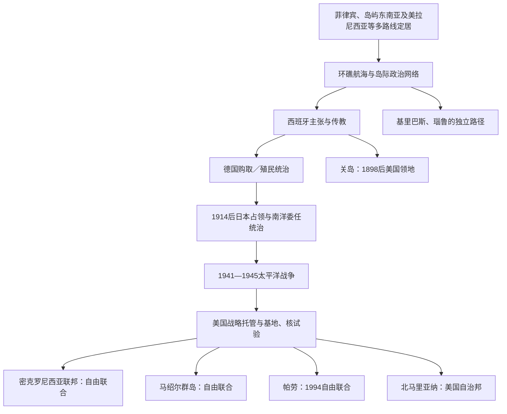

# 密克罗尼西亚

## 范围

通常包括帕劳、加罗林群岛、马绍尔群岛、马里亚纳群岛、瑙鲁和吉尔伯特群岛。这个欧洲地理名涵盖高岛、火山岛与低环礁，语言祖源和殖民路径并不统一。基里巴斯和瑙鲁常被归入密克罗尼西亚，但其文化网络也与波利尼西亚、美拉尼西亚交织。

## 概括

密克罗尼西亚航海者在极小陆地和巨大海域之间发展涌浪导航、母系土地、石币、maneaba会议、首领联盟与岛际贡赋等制度。西班牙、德国、日本和美国在约四百年间轮替控制，尤其日本南洋厅与美国太平洋群岛托管地留下基地、移民和宪政遗产。独立后的帕劳、密克罗尼西亚联邦和马绍尔与美国订立自由联合协定；关岛、北马里亚纳仍属美国；核试验和军事基地使主权问题持续存在。

## 演进图

## 殖民前制度与代表性政体

| 地区 | 制度与历史 | 关键辨析 |
|---|---|---|
| 波纳佩Nan Madol | 约公元第二千纪初形成巨石岛城，与Saudeleur王朝相关；后由Nahnmwarki等地方首领体系取代 | 年代与王朝细节有口述和考古争议，不宜制造精确“国王全表”。 |
| 雅浦 | 村落等级、岛际网络与从帕劳采制的石币rai | 石币价值依历史、关系和风险，并非按直径机械定价。 |
| 马绍尔 | iroij首领、alap氏族管理者和rijerbal使用者构成土地权层级；导航者掌握涌浪知识 | 棒图主要用于岸上教学，不是西式航海图。 |
| 帕劳 | 母系氏族与男女首领会议、村落联盟并存 | 现代两院议会旁仍承认传统首领咨询机构。 |
| 马里亚纳 | 查莫罗人建造latte石柱房屋，母系关系与等级社会突出 | 不是“西班牙到来前无政治组织”。 |
| 吉尔伯特群岛 | maneaba会议、长老和岛屿首领权威因岛而异 | 基里巴斯不是统一古代王国。 |
| 瑙鲁 | 十二氏族、母系土地与区社群 | 小岛社会仍有复杂产权和冲突调解。 |

## 西班牙、德国与日本统治

1521年麦哲伦到达关岛后，西班牙直到17世纪才以传教和军事建立稳定控制。查莫罗战争、疾病和强制迁村造成人口剧减。西班牙对加罗林和马绍尔的实际管辖较弱；1885年德西争端经教皇调解后西班牙保留加罗林，1899年美西战争后又将其售给德国。德国在帕劳、加罗林、马绍尔和瑙鲁推动椰干与磷矿经济。

日本1914年占领德国赤道以北岛屿，1920年获国际联盟“南洋群岛委任统治”。南洋厅从科罗尔管理，发展糖业、渔业、学校和港口，并鼓励日本、冲绳和朝鲜移民；1930年代军事化加深。殖民建设与本地政治排除并存，不能把日治只写成“现代化”。

## 战争、托管与核试验

1941年后关岛、帕劳、马里亚纳和加罗林成为激战区。塞班、提尼安、贝里琉等战役造成平民伤亡与强制迁移；提尼安随后成为原子弹轰炸机基地。1947年，联合国将日本旧委任地设为战略托管领土，由美国管理。美国控制防务和行政，通过地区议会逐步推动自治，却同时在马绍尔进行67次核试验。

具体战争、核试验与托管终结过程见[太平洋战争、托管与核试验](/%E4%BA%BA%E6%96%87%E7%A7%91%E5%AD%A6/%E5%8E%86%E5%8F%B2/%E5%A4%A7%E6%B4%8B%E6%B4%B2/%E5%A4%AA%E5%B9%B3%E6%B4%8B%E5%B2%9B%E5%B1%BF/%E5%A4%AA%E5%B9%B3%E6%B4%8B%E6%88%98%E4%BA%89%E3%80%81%E6%89%98%E7%AE%A1%E4%B8%8E%E6%A0%B8%E8%AF%95%E9%AA%8C.md)和[太平洋殖民与托管行政体系表](/%E4%BA%BA%E6%96%87%E7%A7%91%E5%AD%A6/%E5%8E%86%E5%8F%B2/%E5%A4%A7%E6%B4%8B%E6%B4%B2/%E5%A4%AA%E5%B9%B3%E6%B4%8B%E5%B2%9B%E5%B1%BF/%E5%A4%AA%E5%B9%B3%E6%B4%8B%E6%AE%96%E6%B0%91%E4%B8%8E%E6%89%98%E7%AE%A1%E8%A1%8C%E6%94%BF%E4%BD%93%E7%B3%BB%E8%A1%A8.md)。

## 密克罗尼西亚联邦

雅浦、楚克、波纳佩和科斯雷于1979年通过宪法组成联邦；马绍尔、帕劳和北马里亚纳选择不同道路。1986年与美国的自由联合协定生效，联合国托管于1990年终结。总统由国会从州级长期议员中选出，既为国家元首又为政府首脑；四州保留广泛自治。

协定给予美国防务权并提供财政、项目和移民通道。2024年续订援助安排延长战略合作。跨州交通、侨移、气候和公共财政依赖构成结构压力；地方习惯权威和联邦制度需持续协调。截至2026年总统为韦斯利·西米纳。

## 马绍尔群岛

日本委任统治后，美军1944年占领。1946—1958年比基尼和埃内韦塔克核试验导致迁移、污染和健康损害，1954年Castle Bravo沉降尤其严重。1979年成立宪政政府，1986年自由联合生效，1991年加入联合国。

总统由Nitijela议会从议员中选出，兼国家与政府首脑；传统首领委员会Iroij提供咨询。核赔偿法庭裁决、美国基金和未清理土地持续争议。2024年自由联合续约带来新资金，但没有自动解决核责任。截至2026年总统为希尔达·海涅。

## 帕劳

帕劳在西班牙、德国、日本和美国间转手。日本时期科罗尔成为南洋厅中心，人口和经济高度殖民化；1944年贝里琉战役重创岛屿。1979年帕劳未加入密克罗尼西亚联邦，并以宪法无核条款要求核物质进入需高门槛同意。与美国的自由联合因防务条款多次公投，1994年才生效并正式独立。

总统由直选产生，传统首领委员会向政府提供习惯法意见。海洋保护与旅游是国家战略，也面临外部安全和气候压力。苏兰格尔·惠普斯二世2024年连任，2025年开始第二任期，截至2026年仍为总统。

## 瑙鲁

瑙鲁1888年纳入德属马绍尔保护区，磷矿自20世纪初开采。一战后由澳大利亚实际管理、英澳新共同受托；二战日军占领并把大批瑙鲁人强迁至楚克，约三分之一死于流亡。1947年再成为联合国托管地，1968年独立。

独立后磷矿收入一度使人均财富极高，但矿层枯竭、投资失误和环境破坏导致财政危机。此后离岸金融、援助和澳大利亚区域处理中心成为收入来源，也引发人权与依赖争议。总统由议会选出，兼国家与政府首脑。戴维·阿迪昂2025年连任；2026年议会通过将国名改回“Naoero”的修宪案，但尚待宪法程序完成，故核验日仍按“瑙鲁共和国”记载。

## 基里巴斯

吉尔伯特群岛各岛拥有maneaba与首领制度。英国1892年建立保护国，1916年与埃利斯群岛等组成殖民地。二战塔拉瓦战役造成巨大军民伤亡。吉尔伯特与以波利尼西亚人为主的埃利斯群岛在1970年代分离，基里巴斯于1979年独立。

Banaba磷矿长期由殖民当局开采，岛民多被迁往斐济Rabi岛；独立安排保留Banaba特殊代表与土地联系。国家横跨吉尔伯特、菲尼克斯和莱恩群岛，拥有巨大专属经济区。总统（Te Beretitenti）由议会提名后全民选举，兼国家与政府首脑。塔内希·马茂2025年再次当选，核验日仍在任。海平面、淡水、金枪鱼收入与跨国迁移是国家生存议题，但“必然沉没灭国”会抹去其适应和海洋主权行动。

## 关岛与北马里亚纳

关岛1898年由西班牙割让美国，先由海军总督统治；1941—1944年日军占领，查莫罗人遭强迫劳动和暴力。1950年《关岛组织法》授予美国公民身份和民选政府，1970年后总督直选，但居民不能在美国总统大选投票，国会代表无最终表决权。军事基地占地、移民和查莫罗自决是核心议题。2026年总督仍为Lou Leon Guerrero。

北马里亚纳在二战后属战略托管，1975年公投选择与美国建立自治邦而非独立，1986年盟约主要条款生效。地方有宪法与直选政府，美国负责防务和主权。Arnold Palacios去世后，副总督David Apatang继任，2026年为现任总督。

## 结构性比较

- **权力来源**：环礁土地和导航知识、首领谱系、村落会议与殖民行政叠加。
- **殖民更替原因**：美西战争、德国购买、一战委任、二战军事占领和联合国托管，不是岛内王朝自然更替。
- **独立分化原因**：岛群身份、无核条款、财政与防务选择导致联邦、自由联合或美国属地等不同结果。
- **当代脆弱性**：核污染、基地、援助依赖、海平面和人口外流；广阔海域和条约地位也提供谈判能力。

## 演变关系

- 共同前史：[航海、定居与太平洋世界](/%E4%BA%BA%E6%96%87%E7%A7%91%E5%AD%A6/%E5%8E%86%E5%8F%B2/%E5%A4%A7%E6%B4%8B%E6%B4%B2/%E5%A4%AA%E5%B9%B3%E6%B4%8B%E5%B2%9B%E5%B1%BF/%E8%88%AA%E6%B5%B7%E3%80%81%E5%AE%9A%E5%B1%85%E4%B8%8E%E5%A4%AA%E5%B9%B3%E6%B4%8B%E4%B8%96%E7%95%8C.md)。
- 战争与托管：[太平洋战争、托管与核试验](/%E4%BA%BA%E6%96%87%E7%A7%91%E5%AD%A6/%E5%8E%86%E5%8F%B2/%E5%A4%A7%E6%B4%8B%E6%B4%B2/%E5%A4%AA%E5%B9%B3%E6%B4%8B%E5%B2%9B%E5%B1%BF/%E5%A4%AA%E5%B9%B3%E6%B4%8B%E6%88%98%E4%BA%89%E3%80%81%E6%89%98%E7%AE%A1%E4%B8%8E%E6%A0%B8%E8%AF%95%E9%AA%8C.md)。
- 当代政体：[太平洋国家与领地领导结构表](/%E4%BA%BA%E6%96%87%E7%A7%91%E5%AD%A6/%E5%8E%86%E5%8F%B2/%E5%A4%A7%E6%B4%8B%E6%B4%B2/%E5%A4%AA%E5%B9%B3%E6%B4%8B%E5%B2%9B%E5%B1%BF/%E5%A4%AA%E5%B9%B3%E6%B4%8B%E5%9B%BD%E5%AE%B6%E4%B8%8E%E9%A2%86%E5%9C%B0%E9%A2%86%E5%AF%BC%E7%BB%93%E6%9E%84%E8%A1%A8.md)。
- 总览：[太平洋岛屿](/%E4%BA%BA%E6%96%87%E7%A7%91%E5%AD%A6/%E5%8E%86%E5%8F%B2/%E5%A4%A7%E6%B4%8B%E6%B4%B2/%E5%A4%AA%E5%B9%B3%E6%B4%8B%E5%B2%9B%E5%B1%BF/README.md)。
