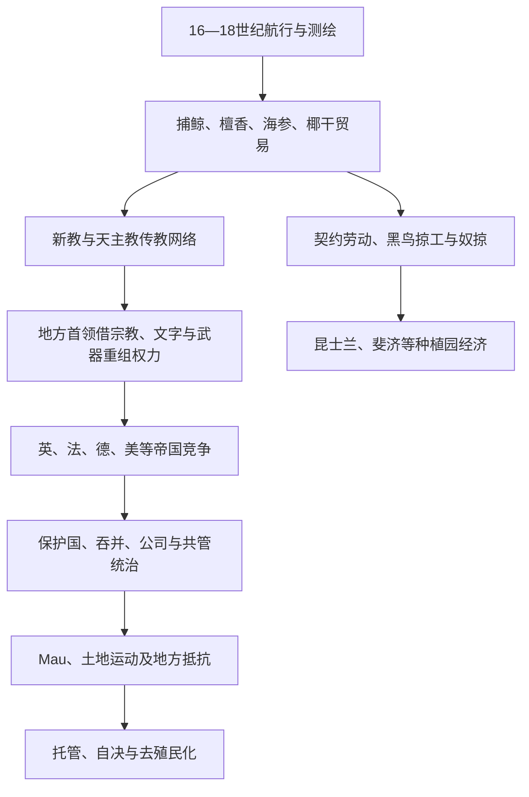

# 殖民分割、传教与劳工贸易

## 时间

16世纪初至20世纪中叶，以18世纪末以后持续接触和19世纪殖民分割为核心。

## 概括

列强没有通过一次会议把太平洋整齐瓜分。探险测绘、捕鲸、檀香和海参贸易、传教、土地交易、劳工招募、公司破产、海军竞争与地方王位冲突逐步把岛群纳入帝国。地方首领会利用枪械、读写、宗教和外国承认来统一或抵抗；欧洲商人和传教士也依赖岛民的食物、港口和政治保护。19世纪后期，英、法、德、美、智利和日本把这种不平等接触转为保护国、殖民地、吞并地与共管体制。殖民秩序的核心不是“带来现代化”，而是以外来主权重定土地、劳动和海上通道。

## 演进图

## 从航行到持续接触

1521年麦哲伦到达关岛、1568年门达尼亚到所罗门、1642年塔斯曼到新西兰与汤加一带，但早期到访通常无法稳定统治。18世纪后期库克等航行绘制海图，使捕鲸、海豹、商船和海军补给更加持续。铁器、枪械和布匹进入，岛民提供食物、水、木材、劳工与导航；冲突常来自交换规则、性关系、土地使用和暴力误判，而非“文明初遇”的单一模式。

疾病是力量变化的重要机制。天花、麻疹、流感、痢疾和性病在缺乏既有免疫的群体中造成高死亡；人口下降削弱粮食、军事与仪式网络，也为殖民者制造“正在消失民族”的话语。疫情后果仍取决于营养、迁移和政治照护，不能视为无责任的自然事件。

## 传教网络与本地能动性

1797年伦敦传道会抵达塔希提，随后进入库克、萨摩亚等地；卫理宗在汤加和斐济影响显著；天主教Picpus、Marist等修会与新教竞争。传教士发展本地语拼写、印刷、学校和跨岛教会，翻译圣经也固定某些方言为标准语。岛民教师往往比欧洲人更早把基督教带到邻岛，形成“太平洋人传教太平洋”的网络。

皈依可为首领提供新的神圣合法性、外交伙伴和读写官僚，也会挑战祭司、性别角色、舞蹈、婚姻和土地仪式。塔希提Pōmare II、汤加George Tupou I等借基督教加强统一；斐济、瓦努阿图和新喀里多尼亚则长期存在宗派与地方抵抗。基督教本身被岛民重新解释，不能等同于文化被动替换。

## 商品、公司与土地

| 商品／行业 | 主要地区 | 政治后果 |
|---|---|---|
| 捕鲸与海豹 | 新西兰、夏威夷、塔希提等港口 | 形成多族港镇、性别与疾病接触，增强外国领事要求。 |
| 檀香、海参 | 斐济、瓦努阿图、新喀里多尼亚、所罗门 | 短期采掘、武器交换和商人暴力，资源枯竭后迅速转移。 |
| 椰干 | 萨摩亚、德属新几内亚、马绍尔等 | 公司、种植园和税收推动固定劳动与土地契约。 |
| 糖 | 夏威夷、斐济、昆士兰 | 大规模外来劳工和资本影响政权；夏威夷种植园精英参与政变。 |
| 磷矿 | Banaba、瑙鲁、Makatea等 | 土地被开挖、人口迁移，殖民收益与环境修复失衡。 |
| 镍 | 新喀里多尼亚 | 法国资本、移民与卡纳克土地问题结合，至今仍影响自决。 |

殖民土地取得常以首领签名、译文不对称、债务抵押或“未利用土地”概念实现。外来私产法把重叠使用权压成单一所有者，导致同一交易在岛民与商人眼中具有不同意义。公司有时先于国家行使准行政权，破产或冲突后又促使宗主国接管。

## 黑鸟掠工、契约劳动与跨岛社会

1860年代至20世纪初，昆士兰和斐济种植园招募约十万计劳动合同，其中来自新赫布里底、所罗门等地者最集中。“黑鸟掠工”专指绑架、欺骗、冒充传教船和强迫签约等暴力方式；并非每份合同都属绑架，但殖民法律、语言障碍和武装船只使“自愿”高度不平等。1862—1863年秘鲁奴掠船还袭击拉帕努伊、托克劳等地，许多被掳者死亡，少数返乡者又带回疾病。

昆士兰的南海岛民劳工常被称为Australian South Sea Islanders的祖先。澳大利亚联邦成立后，大批人员依据太平洋岛民劳工法被遣返，部分已建立家庭者获准留下。斐济殖民政府认为美拉尼西亚劳工供应不稳定，自1879年至1916年从英属印度输入约六万名契约劳工；契约终止后印裔群体成为国家人口与政治主体。劳工迁移因此既是强制剥削，也是今日跨岛和离散社群的历史来源。

## 帝国分割的机制

| 机制 | 典型案例 | 实际含义 |
|---|---|---|
| 首领割让 | 斐济1874年割让英国 | 王室接收主权并承诺土地与首领制度，解释与执行长期不对称。 |
| 保护国 | 汤加、所罗门、吉尔伯特、库克等 | 宗主国控制外交或逐步介入内政；本地政府保留程度各异。 |
| 单方面吞并 | 新喀里多尼亚1853、夏威夷1898、纽埃／库克1901 | 海军、国内立法或殖民宣告覆盖本地主权。 |
| 公司与特许 | 德属新几内亚公司、磷矿公司 | 私人企业获得土地、税收或行政权，国家在危机后接管。 |
| 共管 | 新赫布里底1906—1980 | 英法两套法律和行政并列，本地居民处于权利夹缝。 |
| 战争转移 | 关岛1898、德属岛屿1914 | 宗主权由欧洲战争和海军占领决定。 |
| 委任／托管 | 日本南洋委任地、澳管新几内亚、美国战略托管 | 国际监督以福祉和自决为名，但宗主国仍控制核心权力。 |

完整管辖、行政首脑职称和后继关系见[太平洋殖民与托管行政体系表](/%E4%BA%BA%E6%96%87%E7%A7%91%E5%AD%A6/%E5%8E%86%E5%8F%B2/%E5%A4%A7%E6%B4%8B%E6%B4%B2/%E5%A4%AA%E5%B9%B3%E6%B4%8B%E5%B2%9B%E5%B1%BF/%E5%A4%AA%E5%B9%B3%E6%B4%8B%E6%AE%96%E6%B0%91%E4%B8%8E%E6%89%98%E7%AE%A1%E8%A1%8C%E6%94%BF%E4%BD%93%E7%B3%BB%E8%A1%A8.md)。

## 抵抗、谈判与殖民秩序衰落

斐济Tuka运动、德属新几内亚Tolai反抗、1910年Sokehs起义、萨摩亚Mau、所罗门Maasina Ruru和卡纳克民族主义等显示抵抗形式从武装、逃工到宗教、拒税和请愿不等。首领加入殖民委员会也不必然代表接受主权，可能是保护土地和资源的策略。

殖民帝国的“崛起”依靠海军、资本、传教信息网和列强相互承认；其结构性弱点是行政成本高、合法性低、商品依赖及本地受教育精英增长。两次世界大战直接打破德、日等帝国在太平洋的统治，联合国自决规范、反殖民组织和宗主国财政压力则推动战后去殖民化。殖民结束并未消除土地登记、官方语言、首都布局与出口单一化等遗产。

## 演变关系

- 前一阶段：[航海、定居与太平洋世界](/%E4%BA%BA%E6%96%87%E7%A7%91%E5%AD%A6/%E5%8E%86%E5%8F%B2/%E5%A4%A7%E6%B4%8B%E6%B4%B2/%E5%A4%AA%E5%B9%B3%E6%B4%8B%E5%B2%9B%E5%B1%BF/%E8%88%AA%E6%B5%B7%E3%80%81%E5%AE%9A%E5%B1%85%E4%B8%8E%E5%A4%AA%E5%B9%B3%E6%B4%8B%E4%B8%96%E7%95%8C.md)。
- 后一阶段：[太平洋战争、托管与核试验](/%E4%BA%BA%E6%96%87%E7%A7%91%E5%AD%A6/%E5%8E%86%E5%8F%B2/%E5%A4%A7%E6%B4%8B%E6%B4%B2/%E5%A4%AA%E5%B9%B3%E6%B4%8B%E5%B2%9B%E5%B1%BF/%E5%A4%AA%E5%B9%B3%E6%B4%8B%E6%88%98%E4%BA%89%E3%80%81%E6%89%98%E7%AE%A1%E4%B8%8E%E6%A0%B8%E8%AF%95%E9%AA%8C.md)。
- 当代：[独立国家、自治与区域合作](/%E4%BA%BA%E6%96%87%E7%A7%91%E5%AD%A6/%E5%8E%86%E5%8F%B2/%E5%A4%A7%E6%B4%8B%E6%B4%B2/%E5%A4%AA%E5%B9%B3%E6%B4%8B%E5%B2%9B%E5%B1%BF/%E7%8B%AC%E7%AB%8B%E5%9B%BD%E5%AE%B6%E3%80%81%E8%87%AA%E6%B2%BB%E4%B8%8E%E5%8C%BA%E5%9F%9F%E5%90%88%E4%BD%9C.md)。
- 总览：[太平洋岛屿](/%E4%BA%BA%E6%96%87%E7%A7%91%E5%AD%A6/%E5%8E%86%E5%8F%B2/%E5%A4%A7%E6%B4%8B%E6%B4%B2/%E5%A4%AA%E5%B9%B3%E6%B4%8B%E5%B2%9B%E5%B1%BF/README.md)。
