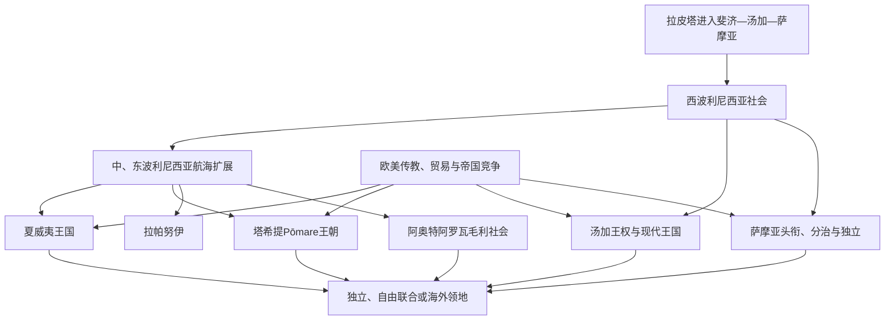

# 波利尼西亚

## 范围

波利尼西亚三角通常以夏威夷、拉帕努伊和阿奥特阿罗瓦为顶点，内部包括萨摩亚、汤加、塔希提、马克萨斯、库克、纽埃、托克劳、图瓦卢等岛群。波利尼西亚“外围岛”还分布于美拉尼西亚和密克罗尼西亚。语言亲缘和航海祖源相近，不等于各地属于同一帝国或共享同一政体。

## 概括

西波利尼西亚从拉皮塔网络发展出萨摩亚的头衔—会议体系和汤加的多层神圣王权；中东波利尼西亚航海者又建立塔希提、夏威夷、拉帕努伊与毛利社会。18—19世纪枪械、传教、檀香、捕鲸和贸易使部分首领统一群岛，也使外国商人和海军介入。夏威夷被美国吞并，塔希提进入法国殖民，萨摩亚被德美分割，汤加则在英国保护下保留王朝。战后产生独立、自由联合和持续海外领地等多条路径。

## 演进图

## 政治制度的共同点与差异

波利尼西亚社会常以神圣谱系把首领与祖先、土地和生产联系起来，但权力可由祭司、武士、地方头领和家族会议分担。夏威夷发展高集权王国；汤加的Tuʻi Tonga、Tuʻi Haʻatakalaua和Tuʻi Kanokupolu头衔长期分掌神圣与世俗权力；萨摩亚最高头衔则由扩展家族和政治会议协商授予。库克群岛ariki、拉帕努伊ariki和毛利rangatira也各有继承规则，不能统称“国王”。

完整且文献连续的近代王朝见[太平洋王权与君主世系表](/%E4%BA%BA%E6%96%87%E7%A7%91%E5%AD%A6/%E5%8E%86%E5%8F%B2/%E5%A4%A7%E6%B4%8B%E6%B4%B2/%E5%A4%AA%E5%B9%B3%E6%B4%8B%E5%B2%9B%E5%B1%BF/%E5%A4%AA%E5%B9%B3%E6%B4%8B%E7%8E%8B%E6%9D%83%E4%B8%8E%E5%90%9B%E4%B8%BB%E4%B8%96%E7%B3%BB%E8%A1%A8.md)；口述传统中年代和统治范围存在争议的早期谱系只按制度说明，不伪造精确全表。

## 汤加

约前一千纪拉皮塔人定居后，汤加逐渐形成以Tongatapu为中心的王权。Tuʻi Tonga神圣王系通过婚姻、贡赋和航海影响斐济、萨摩亚等地，但“汤加海上帝国”的直接行政范围随时期变化，不应画成固定领土国家。约15世纪以后，Tuʻi Haʻatakalaua和Tuʻi Kanokupolu分担世俗军事权。

18—19世纪内战、传教和枪械重组政治。Taufaʻāhau统一主要岛群，1845年以George Tupou I名号成为国王，1875年宪法废除农奴性义务、确立土地和议会制度。1900年汤加成为英国保护国，外交受英国控制但本土君主与政府延续；1970年保护关系终止。

2010年改革让多数议员由民选产生，国王仍保留任命、否决和贵族制度相关权力。2022年火山喷发和海啸凸显灾害脆弱性。2026年国王为Tupou VI，首相为Lord Fakafanua。六位近代君主完整世系见专表。

## 萨摩亚

萨摩亚政治以aiga扩展家族、matai头衔和fono会议为基础，Malietoa、Tupua Tamasese、Mataʻafa、Tuimalealiʻifano等最高头衔提供全国性权威，却不构成简单世袭王朝。19世纪德、英、美商人与海军介入王位争端；1899年列强协议将西部交德国、东部交美国，英国退出并获其他殖民补偿。

新西兰1914年占领德属萨摩亚，后以国际联盟委任和联合国托管形式管理。1918年流感和1929年镇压Mau运动严重损害统治合法性。1962年西萨摩亚独立，是战后太平洋较早独立国家；1997年改国名“萨摩亚”。

宪法由议会选举O le Ao o le Malo为国家元首；首任两位高级领袖共同任职，Malietoa Tanumafili II后来终身任职，此后均为五年任期，因此不应称为世袭君主制。2021年大选后长达数月的宪政危机由法院和议会程序解决，Fiame Naomi Mataʻafa成为首位女性总理。2025年提前选举后，Laʻauli Leuatea Schmidt于9月出任总理；2026年仍在任，国家元首为Tuimalealiʻifano Vaʻaletoʻa Sualauvi II。国家元首完整顺序见[太平洋王权与君主世系表](/%E4%BA%BA%E6%96%87%E7%A7%91%E5%AD%A6/%E5%8E%86%E5%8F%B2/%E5%A4%A7%E6%B4%8B%E6%B4%B2/%E5%A4%AA%E5%B9%B3%E6%B4%8B%E5%B2%9B%E5%B1%BF/%E5%A4%AA%E5%B9%B3%E6%B4%8B%E7%8E%8B%E6%9D%83%E4%B8%8E%E5%90%9B%E4%B8%BB%E4%B8%96%E7%B3%BB%E8%A1%A8.md)。

## 夏威夷

波利尼西亚航海者约在公元第一千纪后期定居，群岛形成多个aliʻi统治的岛屿政体。Kamehameha利用火器、外国顾问和战略联盟，于1795年控制主要岛屿，1810年Kauaʻi接受其宗主权，完成王国统一。其继承者废除kapu体系，接受基督教和文字，并在欧美压力下制定1840年宪法和1848年土地大分割。

糖业、外来人口和美国资本扩大，疾病使原住民人口锐减。1887年武装定居者迫使Kalākaua接受“刺刀宪法”，限制王权并以财产资格改变选民结构。1893年美国部长支持下的安全部队为政变者提供保护，Liliʻuokalani被推翻；共和国1894年建立，美国1898年以联合决议吞并，1959年成为州。1993年美国国会道歉决议承认政变中美国代理人的作用，但没有自动恢复主权或解决原住民土地诉求。

夏威夷王国八位君主完整在位见[太平洋王权与君主世系表](/%E4%BA%BA%E6%96%87%E7%A7%91%E5%AD%A6/%E5%8E%86%E5%8F%B2/%E5%A4%A7%E6%B4%8B%E6%B4%B2/%E5%A4%AA%E5%B9%B3%E6%B4%8B%E5%B2%9B%E5%B1%BF/%E5%A4%AA%E5%B9%B3%E6%B4%8B%E7%8E%8B%E6%9D%83%E4%B8%8E%E5%90%9B%E4%B8%BB%E4%B8%96%E7%B3%BB%E8%A1%A8.md)。当代夏威夷主权运动、语言学校和土地抗议说明吞并并非无争议的历史终点。

## 塔希提与法属波利尼西亚

18世纪末，Pōmare I及其继承者借助武器、传教和岛际联盟统一塔希提并扩张影响。Pōmare II皈依基督教并在1815年Feʻi Pi战役获胜，伦敦传道会与王权结合。法国1842年强迫Pōmare IV接受保护国，引发法塔战争；1880年Pōmare V把王国交法国，成为殖民地核心。

法国把社会群岛、马克萨斯、土阿莫土等不同历史岛群合并为法属大洋洲；1946年成为海外领地，1957年改称法属波利尼西亚并逐步自治。1966—1996年Mururoa和Fangataufa核试验带来健康、环境与补偿争议。自治政府掌握广泛内政，法国保留主权、国防、司法等核心权力。2023年独立派赢得地方选举，Moetai Brotherson任法属波利尼西亚主席，截至2026年仍在任；独立与自治路线仍由选举政治竞争。

## 库克群岛、纽埃与托克劳

库克群岛各岛有不同ariki体系，19世纪在传教与法国威胁背景下进入英国保护，1901年并入新西兰。1965年实行与新西兰自由联合的自治宪制：内部自治、可自行开展外交，新西兰公民身份与国防协助关系保留。2026年国王代表为Tom Marsters，总理Mark Brown。

纽埃1900年成为英国保护地，1901年随库克群岛转入新西兰，1974年经自决成为与新西兰自由联合的自治国家。人口大量居住海外，使侨民、航空和财政支持成为国家结构一部分。Dalton Tagelagi于2026年5月再次获议会选为总理。

托克劳三环礁由各自Taupulega村议会治理，1926年起由新西兰管理。2006、2007年两次自决公投均未达到转为自由联合所需门槛，故仍是新西兰非自治领地。Ulu-o-Tokelau由三环礁Faipule年度轮任；Alapati Pita Tavite于2026年3月开始新任期。气候、运输和去殖民地位仍是议题。

## 图瓦卢

埃利斯群岛以波利尼西亚社会为主，19世纪劳工掠夺和传教冲击人口。英国将其与吉尔伯特群岛合并管理，文化和政治差异促使1974年公投分离；1978年图瓦卢独立为议会君主制。低环礁国家通过渔业许可、“.tv”域名、侨工和援助维持财政。2023年宪法强调国家永久性和文化价值，澳图Falepili Union又涉及气候迁移与安全协商。2026年国家元首查尔斯三世由总督Tofiga Vaevalu Falani代表，总理为Feleti Teo。

## 拉帕努伊、瓦利斯和富图纳

拉帕努伊人建立moai、ahu祭祀景观和竞争性亲属政治。19世纪秘鲁奴掠、疾病和传教使人口崩落；智利1888年签署兼并协议，其西班牙语与拉帕努伊语含义和土地权理解不同。随后牧羊公司限制居民活动，1966年才授予完整智利公民权。今天文化、土地管理和自治诉求不能被“生态自毁”神话遮蔽。

瓦利斯（ʻUvea）和富图纳的Alo、Sigave保留三个习惯王权，与法国行政并存。19世纪天主教传教影响深，岛屿先成法国保护国，1961年成为海外领地。三王不是一个统一王朝，继承由本地王族和首领程序决定；法国高级行政官、领地议会与习惯首领共同构成复合治理。

## 共同的崛起、衰落与转折因素

- **王权崛起**：生产剩余、神圣谱系、战争技术、婚姻与远洋贡赋；19世纪又借助火器和外国承认。
- **结构性削弱**：疾病导致人口锐减，土地私有化和商人债务改变权力基础，传教重塑礼仪。
- **外部压力**：美、德、英、法海军竞争和种植园资本。
- **直接灭亡机制**：夏威夷为1893年政变及1898年吞并；Pōmare王国为保护国压力后1880年让渡；萨摩亚旧王权争端则被1899年列强分治替代。
- **延续方式**：汤加王朝保持国家君主制；萨摩亚头衔、库克ariki和瓦利斯—富图纳王权在宪政框架内继续发挥作用。

## 演变关系

- 航海前史：[航海、定居与太平洋世界](/%E4%BA%BA%E6%96%87%E7%A7%91%E5%AD%A6/%E5%8E%86%E5%8F%B2/%E5%A4%A7%E6%B4%8B%E6%B4%B2/%E5%A4%AA%E5%B9%B3%E6%B4%8B%E5%B2%9B%E5%B1%BF/%E8%88%AA%E6%B5%B7%E3%80%81%E5%AE%9A%E5%B1%85%E4%B8%8E%E5%A4%AA%E5%B9%B3%E6%B4%8B%E4%B8%96%E7%95%8C.md)。
- 完整世系：[太平洋王权与君主世系表](/%E4%BA%BA%E6%96%87%E7%A7%91%E5%AD%A6/%E5%8E%86%E5%8F%B2/%E5%A4%A7%E6%B4%8B%E6%B4%B2/%E5%A4%AA%E5%B9%B3%E6%B4%8B%E5%B2%9B%E5%B1%BF/%E5%A4%AA%E5%B9%B3%E6%B4%8B%E7%8E%8B%E6%9D%83%E4%B8%8E%E5%90%9B%E4%B8%BB%E4%B8%96%E7%B3%BB%E8%A1%A8.md)。
- 殖民与战争：[殖民分割、传教与劳工贸易](/%E4%BA%BA%E6%96%87%E7%A7%91%E5%AD%A6/%E5%8E%86%E5%8F%B2/%E5%A4%A7%E6%B4%8B%E6%B4%B2/%E5%A4%AA%E5%B9%B3%E6%B4%8B%E5%B2%9B%E5%B1%BF/%E6%AE%96%E6%B0%91%E5%88%86%E5%89%B2%E3%80%81%E4%BC%A0%E6%95%99%E4%B8%8E%E5%8A%B3%E5%B7%A5%E8%B4%B8%E6%98%93.md)、[太平洋战争、托管与核试验](/%E4%BA%BA%E6%96%87%E7%A7%91%E5%AD%A6/%E5%8E%86%E5%8F%B2/%E5%A4%A7%E6%B4%8B%E6%B4%B2/%E5%A4%AA%E5%B9%B3%E6%B4%8B%E5%B2%9B%E5%B1%BF/%E5%A4%AA%E5%B9%B3%E6%B4%8B%E6%88%98%E4%BA%89%E3%80%81%E6%89%98%E7%AE%A1%E4%B8%8E%E6%A0%B8%E8%AF%95%E9%AA%8C.md)。
- 新西兰分支：[新西兰历史](/%E4%BA%BA%E6%96%87%E7%A7%91%E5%AD%A6/%E5%8E%86%E5%8F%B2/%E5%A4%A7%E6%B4%8B%E6%B4%B2/%E6%96%B0%E8%A5%BF%E5%85%B0/README.md)。
- 总览：[太平洋岛屿](/%E4%BA%BA%E6%96%87%E7%A7%91%E5%AD%A6/%E5%8E%86%E5%8F%B2/%E5%A4%A7%E6%B4%8B%E6%B4%B2/%E5%A4%AA%E5%B9%B3%E6%B4%8B%E5%B2%9B%E5%B1%BF/README.md)。
