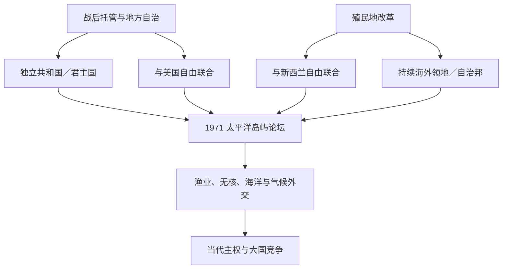

# 独立国家、自治与区域合作

## 时间

1962年至今；现任人物与政治地位核验截至2026年7月14日。

## 概括

太平洋去殖民化没有单一模板。萨摩亚、瑙鲁、斐济、巴布亚新几内亚、所罗门、图瓦卢、基里巴斯和瓦努阿图取得独立；汤加结束英国保护但保留王朝；密克罗尼西亚三国与美国自由联合；库克群岛、纽埃与新西兰自由联合；关岛、新喀里多尼亚、法属波利尼西亚、托克劳等仍属非独立政治体。小岛国家以巨大专属经济区、集体外交和条约关系扩大谈判能力，同时面对殖民经济、核遗产、气候迁移和外部安全竞争。

## 演进图

## 去殖民化时间线

| 时间 | 政治体 | 路径与直接机制 |
|---|---|---|
| 1962年 | 萨摩亚 | 联合国托管结束，经宪制会议和公投独立。 |
| 1965年 | 库克群岛 | 公投通过与新西兰自由联合的自治宪法。 |
| 1968年 | 瑙鲁 | 英澳新托管结束，独立共和国。 |
| 1970年 | 汤加 | 英国保护关系终止，既有君主国取得完整对外主权。 |
| 1970年 | 斐济 | 英国殖民地独立为议会君主国，1987年政变后成共和国。 |
| 1974年 | 纽埃 | 公投通过与新西兰自由联合。 |
| 1975年 | 巴布亚新几内亚 | 澳大利亚管理的巴布亚与新几内亚联合独立。 |
| 1978年 | 所罗门群岛 | 英国保护国独立为议会君主国。 |
| 1978年 | 图瓦卢 | 与吉尔伯特殖民地分离后独立。 |
| 1979年 | 基里巴斯 | 英国殖民统治结束，Banaba与海域安排纳入宪法。 |
| 1980年 | 瓦努阿图 | 英法共管终结；独立前Santo分离叛乱被平定。 |
| 1986年 | 密克罗尼西亚联邦、马绍尔群岛 | 与美国自由联合生效；联合国分别于1990、1991年确认托管终止。 |
| 1994年 | 帕劳 | 无核宪法与协定多次公投后，自由联合生效，TTPI最后部分终结。 |

## 四类政治地位

| 路径 | 代表 | 国家元首／政府首脑结构 | 主权边界 |
|---|---|---|---|
| 独立议会君主国 | PNG、所罗门、图瓦卢、汤加 | 前三国由共同君主及总督、总理分工；汤加有本国王朝 | 享国际人格；防务外交自主，但可签安全协定。 |
| 独立共和国 | 斐济、瓦努阿图、萨摩亚、基里巴斯、瑙鲁 | 总统或传统式国家元首；有些国家总统兼政府首脑 | 完整国际主权，宪制设计差异很大。 |
| 美国自由联合 | 密联邦、马绍尔、帕劳 | 各有本国总统 | 国家可外交和加入联合国；美国掌条约约定的防务权，居民获特殊赴美权。 |
| 新西兰自由联合 | 库克群岛、纽埃 | 君主／国王代表与本地总理 | 内部完全自治并开展外交；公民为新西兰公民，新西兰按请求协助外交防务。 |
| 海外领地／自治邦 | 关岛、北马里亚纳、美属萨摩亚、法属岛屿、托克劳、皮特凯恩 | 宗主国元首／代表与民选地方政府并存 | 国际主权属宗主国，自治和公民权安排不同。 |

各现任人物和实际权力分表见[太平洋国家与领地领导结构表](/%E4%BA%BA%E6%96%87%E7%A7%91%E5%AD%A6/%E5%8E%86%E5%8F%B2/%E5%A4%A7%E6%B4%8B%E6%B4%B2/%E5%A4%AA%E5%B9%B3%E6%B4%8B%E5%B2%9B%E5%B1%BF/%E5%A4%AA%E5%B9%B3%E6%B4%8B%E5%9B%BD%E5%AE%B6%E4%B8%8E%E9%A2%86%E5%9C%B0%E9%A2%86%E5%AF%BC%E7%BB%93%E6%9E%84%E8%A1%A8.md)。

## 国家建构与政权稳定

独立国家大多继承威斯敏斯特议会模式，但地方首领、习惯土地和小选区政治改变其运作。瓦努阿图、所罗门和PNG频繁不信任投票，常源于多党联盟、地区代表和资源分配；这不等同国家崩溃。斐济1987、2000、2006年政变则涉及军队、族群制度和宪法竞争，2014年后恢复选举。萨摩亚2021年危机由选举、法院与议会开会地点争议引发，最终和平交接；2025年提前选举又产生新政府。

小议会使一两名议员转向即可更换政府，因此一些国家设置不信任案冷却期、反跳党规则或直接总统制。传统首领可能进入上院、咨询委员会或土地机构，但不应与国家行政首脑混为一表。

## 区域组织与“蓝色太平洋”

| 机构／条约 | 建立 | 主要功能 |
|---|---:|---|
| 太平洋共同体（SPC） | 1947年 | 技术、卫生、统计、农业、海洋和文化合作；早期由殖民国家建立，后岛国主导增强。 |
| 太平洋岛屿论坛（PIF） | 1971年 | 领导人政治协调；成员包括独立国、自由联合体及部分法属领地。 |
| 南太平洋无核区条约 | 1985年 | 禁止核试验和核废物倾倒，体现区域反核外交。 |
| 美拉尼西亚先锋集团 | 1988年制度化 | 美拉尼西亚国家、FLNKS等推动贸易、文化与政治协调。 |
| 瑙鲁协定缔约方（PNA） | 1982年 | 管理西中太平洋鲣金枪鱼资源，以“船日计划”提高岛国收益。 |
| 波利尼西亚领导人集团 | 2011年 | 波利尼西亚国家与领地协调文化、气候和经济议题。 |
| 2050蓝色太平洋战略 | 2022年 | 把海洋、和平安全、气候、资源、技术和以人为本发展纳入长期框架。 |

区域主义并非澳新单向领导。岛国以“蓝色太平洋大陆”概念强调海洋连接和集体主权，并要求外部伙伴依据论坛议程行动。密克罗尼西亚国家2021年因秘书长轮换争端一度宣布退出论坛，随后通过改革协议修复，显示区域团结需要制度平衡。

## 海洋主权、渔业与资源

1982年《联合国海洋法公约》的200海里专属经济区使小岛国家成为“大洋国家”。金枪鱼许可、PNA船日计划和区域渔业机构提供主要收入；非法捕捞、气候导致鱼群东移和外部船队议价仍构成挑战。海底矿产可能带来收益，也因生态未知和治理能力引发分歧：瑙鲁、库克等探索开发，帕劳、斐济等倡议预防或暂停。

海平面上升可能改变基线和岛屿可居住性。太平洋国家推动“即使海岸变化，已依法划定海域仍保持”的立场，把气候适应与国家连续性相连。图瓦卢等强调国家不会因领土暂时不可居住而自动灭亡。

## 气候、灾害与迁移

气旋、海水入侵、珊瑚白化和淡水压力与殖民时期集中聚落、磷矿破坏和现代基础设施不足叠加。迁移既是适应策略，也可能造成语言、墓地和土地关系断裂。新西兰和澳大利亚的季节劳工、太平洋准入和2023年澳图Falepili Union提供流动渠道，但“气候难民”并非现成统一法律身份。

岛国要求主要排放国减排并提供赠款而非加债，推动国际法院气候咨询意见等法律路线。气候安全不能被外部军事实力叙事取代，本地优先事项通常是水、卫生、住房、航运和灾害恢复。

## 核遗产、非殖民化与未决自决

马绍尔、基里巴斯和法属波利尼西亚持续要求健康监测、赔偿与档案；无核条约构成共同身份。新喀里多尼亚三次公投后的合法性争议、法属波利尼西亚独立派执政、关岛与美属萨摩亚的自决选择、托克劳未达门槛公投，以及布干维尔独立谈判，说明去殖民化尚未完成。

“非自治领土名单”是联合国框架之一，但是否列入、何时公投和选民资格本身可能引发争议。自决可通向独立、自由联合或融入，不应预设唯一正确结果。

## 大国竞争与岛屿能动性

美国以自由联合、关岛基地和援助维持战略存在；澳大利亚、新西兰承担安全和发展伙伴角色；法国是本地区拥有领土与军力的国家；中国通过基础设施、外交和警务合作扩大影响，台湾则与帕劳、马绍尔、图瓦卢保持邦交。2019年所罗门、基里巴斯转向北京，2022年中所安全协定引发外部担忧。

岛国并非被动“棋子”。它们会同时与多个伙伴谈判港口、气候资金、渔业和教育，但债务透明、精英问责与安全协定公开程度仍重要。2026年所罗门总理更替、汤加和萨摩亚新政府表明区域政治首先受本国议会和选民驱动。

## 结构性成就、风险与阶段判断

- **主权资源**：海洋法、集体外交、渔业和战略位置扩大谈判能力。
- **结构约束**：人口规模、交通成本、灾害、单一出口和殖民行政边界。
- **外部压力**：气候融资、军事基地、援助竞争和全球商品波动。
- **直接危机触发**：不信任案、政变、骚乱或自然灾害，但原因需分层解释。
- **阶段判断**：当代并非统一“后殖民完成期”；国家巩固、自由联合续约与未决自决同时存在。

## 演变关系

- 前一阶段：[太平洋战争、托管与核试验](/%E4%BA%BA%E6%96%87%E7%A7%91%E5%AD%A6/%E5%8E%86%E5%8F%B2/%E5%A4%A7%E6%B4%8B%E6%B4%B2/%E5%A4%AA%E5%B9%B3%E6%B4%8B%E5%B2%9B%E5%B1%BF/%E5%A4%AA%E5%B9%B3%E6%B4%8B%E6%88%98%E4%BA%89%E3%80%81%E6%89%98%E7%AE%A1%E4%B8%8E%E6%A0%B8%E8%AF%95%E9%AA%8C.md)。
- 殖民制度：[太平洋殖民与托管行政体系表](/%E4%BA%BA%E6%96%87%E7%A7%91%E5%AD%A6/%E5%8E%86%E5%8F%B2/%E5%A4%A7%E6%B4%8B%E6%B4%B2/%E5%A4%AA%E5%B9%B3%E6%B4%8B%E5%B2%9B%E5%B1%BF/%E5%A4%AA%E5%B9%B3%E6%B4%8B%E6%AE%96%E6%B0%91%E4%B8%8E%E6%89%98%E7%AE%A1%E8%A1%8C%E6%94%BF%E4%BD%93%E7%B3%BB%E8%A1%A8.md)。
- 王权延续：[太平洋王权与君主世系表](/%E4%BA%BA%E6%96%87%E7%A7%91%E5%AD%A6/%E5%8E%86%E5%8F%B2/%E5%A4%A7%E6%B4%8B%E6%B4%B2/%E5%A4%AA%E5%B9%B3%E6%B4%8B%E5%B2%9B%E5%B1%BF/%E5%A4%AA%E5%B9%B3%E6%B4%8B%E7%8E%8B%E6%9D%83%E4%B8%8E%E5%90%9B%E4%B8%BB%E4%B8%96%E7%B3%BB%E8%A1%A8.md)。
- 总览：[太平洋岛屿](/%E4%BA%BA%E6%96%87%E7%A7%91%E5%AD%A6/%E5%8E%86%E5%8F%B2/%E5%A4%A7%E6%B4%8B%E6%B4%B2/%E5%A4%AA%E5%B9%B3%E6%B4%8B%E5%B2%9B%E5%B1%BF/README.md)。
