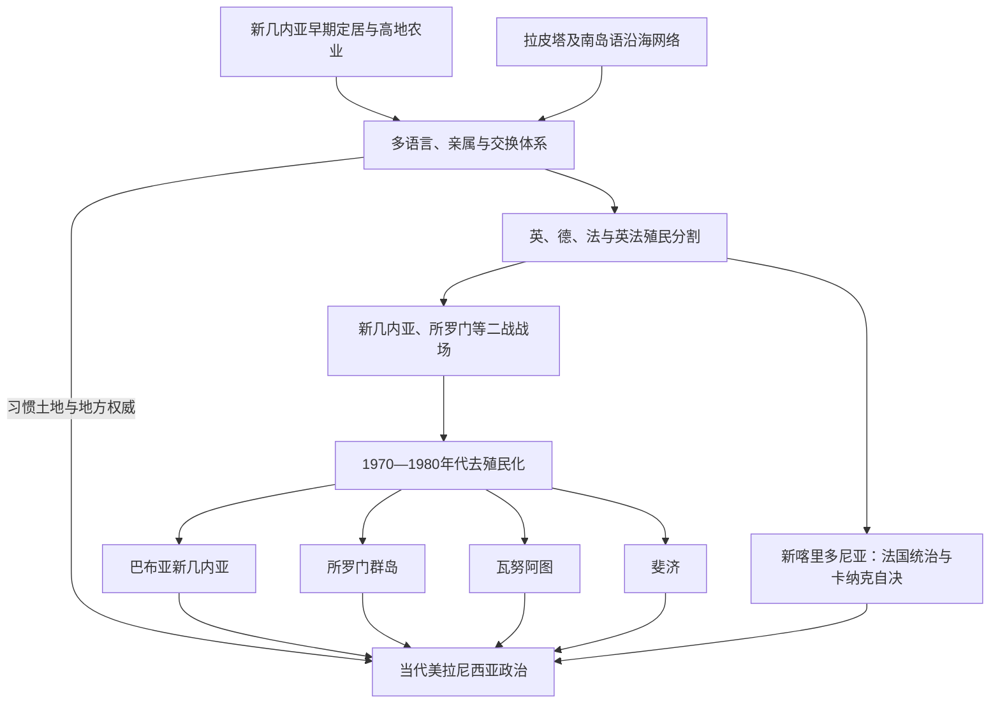

# 美拉尼西亚

## 范围

通常包括新几内亚、俾斯麦群岛、所罗门群岛、瓦努阿图、新喀里多尼亚和斐济。“美拉尼西亚”一词源于欧洲分类，其内部拥有全球最高水平的语言与制度多样性；西新几内亚的美拉尼西亚社会现处印度尼西亚管辖，本笔记重点维护大洋洲目录内的巴布亚新几内亚和太平洋岛国主线。

## 概括

美拉尼西亚并不存在从“无首领部落”统一发展为现代国家的单线过程。新几内亚高地农业、沿海南岛语网络、贝币交换、等级首领制、“大人物”声望政治和村落会议长期并存。19世纪列强把区域切分为英、德、法及英法共管领地，劳工招募和传教改变权威；二战又把新几内亚和所罗门变成主战场。1970—1980年代独立国家继承殖民边界，必须在习惯土地、资源项目、岛屿地方主义和议会政府之间建立秩序。

## 演进图

## 殖民前政治与交换

| 类型 | 例子与机制 | 不宜误解 |
|---|---|---|
| 高地园艺社会 | 甜薯引入后支持更高人口；猪、贝壳和宴会用于联盟与声望竞争 | “大人物”权威依赠礼和支持者，不是无制度状态。 |
| Kula等交换圈 | 特罗布里恩及马辛群岛间礼仪贵重物循环，伴随普通贸易与外交 | 不是纯经济市场，也不是没有实际物资交换的仪式。 |
| 等级首领制 | 斐济、所罗门部分岛屿和新喀里多尼亚存在世袭或神圣化首领 | 继承常需群体确认，权力受土地群体和仪式约束。 |
| 等级社团 | 瓦努阿图部分地区以献猪、宴会和等级仪式累积身份 | 地位可获得，不完全等同世袭贵族。 |
| 习惯土地 | 亲属群体持有重叠使用、继承和精神关系 | 殖民登记为个人产权常造成冲突。 |

## 巴布亚新几内亚

新几内亚至少约5万年前有人居住，高地Kuk等遗址显示近万年的植物管理和农业改造。约前一千纪以后，南岛语群体进入部分海岸和岛屿，与巴布亚语言人群互动。19世纪末，德国控制东北部和俾斯麦群岛，英国控制东南部；英国部分1906年移交澳大利亚，改称巴布亚，德属新几内亚一战后成为澳大利亚委任统治地。

二战中日军占领北岸与岛屿，科科达小径、布纳—戈纳等战役造成大规模军民损失；巴布亚与新几内亚行政随后合并。战后澳大利亚逐步发展地方议会，迈克尔·索马雷等推动自治，1975年独立。宪法采用议会君主制，并承认“巴布亚新几内亚方式”和习惯法。

独立后国家受地形、八百余种语言、有限交通和地方忠诚制约，选举又把地方网络纳入议会。矿业和油气提供收入，也引发土地、环境和收益分配冲突。1988—1998年布干维尔战争源于Panguna铜矿、地方身份和中央关系，和平协议建立自治政府；2019年非约束性公投压倒性支持独立，最终地位仍须与国家议会协商。国家没有因“部落多”必然失败，关键在资源分配、地方代表、公共服务和习惯土地如何协调。

截至2026年核验日，国家元首为查尔斯三世，由总督鲍勃·达达埃代表；总理詹姆斯·马拉佩领导政府。角色分表见[太平洋国家与领地领导结构表](/%E4%BA%BA%E6%96%87%E7%A7%91%E5%AD%A6/%E5%8E%86%E5%8F%B2/%E5%A4%A7%E6%B4%8B%E6%B4%B2/%E5%A4%AA%E5%B9%B3%E6%B4%8B%E5%B2%9B%E5%B1%BF/%E5%A4%AA%E5%B9%B3%E6%B4%8B%E5%9B%BD%E5%AE%B6%E4%B8%8E%E9%A2%86%E5%9C%B0%E9%A2%86%E5%AF%BC%E7%BB%93%E6%9E%84%E8%A1%A8.md)。

## 所罗门群岛

拉皮塔网络进入所罗门东部后，各岛形成不同语言、贝币、首领与交换体系。19世纪黑鸟掠工使大量所罗门人被送往昆士兰和斐济；英国自1893年起逐步建立保护国。殖民政府力量薄弱，主要通过驻地专员、地方首领和传教网络治理。

1942—1943年瓜达尔卡纳尔战役使岛屿成为美日争夺焦点。战后Maasina Ruru运动要求地方自治、经济尊严和拒纳税，殖民政府镇压后又被迫扩大地方议会。1978年独立，采用议会君主制。

1998—2003年瓜达尔卡纳尔与马莱塔武装冲突、土地和迁移争端导致“紧张时期”，政府财政与警务崩溃。2003年起区域援助团RAMSI在所罗门政府邀请下恢复治安和财政，2017年结束；其成效伴随主权和外部依赖争论。2019年政府与台湾断交并承认北京，2021年霍尼亚拉骚乱及2022年中所安全协定使大国竞争进入国内政治。2026年5月，议会选出马修·韦尔接替杰里迈亚·马内莱任总理；总督戴维·蒂瓦·卡普代表查尔斯三世。

## 瓦努阿图

约前一千纪拉皮塔人定居，随后形成一百余种语言、村落、等级社团和复杂土地制度。19世纪传教、檀香和劳工招募导致人口下降及文化重组。英国与法国定居者利益并存，1906年建立英法共管：两套法院、警察、学校和国籍并列，本地居民却长期不是任一宗主国的平等公民，被讽称“混乱公管”。

战后民族主义围绕土地展开。Jimmy Stevens的Nagriamel运动和Walter Lini领导的Vanua'aku Pati代表不同岛屿、语言和政治方向。1980年独立前，Espiritu Santo发生分离叛乱，巴布亚新几内亚军队协助中央政府平定。新国名Vanuatu意为“我们的土地”，宪法保护习惯土地所有权，并以议会共和国、国家元首和总理分权。

独立后联合政府更替频繁，原因包括多党、地区和语言联盟，而非政体必然失序；气旋和基础设施压力放大财政困难。2025年约瑟姆·纳帕特出任总理，国家元首为尼克尼克·武罗巴拉武；截至2026年仍在任。

## 斐济

斐济约前1200年已有拉皮塔定居，后与汤加、萨摩亚和西美拉尼西亚保持往来。19世纪武装贸易和地区战争使Bau首领Seru Epenisa Cakobau扩大影响，但其“斐济王”地位需与其他强大首领协商。1871年建立短暂统一王国，债务、定居者压力和地区抵抗使Cakobau于1874年把群岛割让英国。

殖民政府保留大首领会议并通过间接统治管理iTaukei土地，同时1879—1916年引入约六万名印度契约劳工（girmitiya）经营蔗糖。人口和经济的双重结构延续至独立。1970年独立后实行议会君主制，族群配额与土地制度试图平衡利益，却把身份政治固定化。

1987年两次政变阻止印度裔占主导的联合政府并建立共和国；2000年政变和军方接管再次冲击宪政。2006年弗兰克·姆拜尼马拉马政变以反种族政治为名集中权力，2013年宪法确立共同选民名册并强化中央政府。2014年恢复选举；2022年西蒂韦尼·兰布卡组成联盟政府，实现长期执政阵营更替。2026年国家元首为拉图·奈卡马·拉拉巴拉武，总理仍为兰布卡。

## 新喀里多尼亚

卡纳克社会由氏族、土地和多层首领关系组织；“拉皮塔”名称即来自本地主岛一处遗址。法国1853年吞并后建立流放殖民地，没收土地、设保留地并以indigénat制度限制卡纳克人。镍矿、欧洲定居和来自瓦利斯、富图纳等地的劳工移民改变人口。二战中努美阿成为盟军基地，战后卡纳克获得法国公民权，自治诉求上升。

1980年代独立派FLNKS与留法派冲突，1988年Ouvéa人质危机后签署Matignon协议；1998年Nouméa协议安排权力下放和三次公投。2018、2020年独立未获多数；2021年第三次公投因独立派在疫情和哀悼期抵制而以极低独立票结束，合法性持续争议。2024年法国拟扩大地方选民名册引发骚乱、死亡与经济破坏，方案被搁置并重新谈判政治地位。2025—2026年地方政府由Alcide Ponga任主席，法国仍掌握主权、防务和部分核心权限；最终制度安排尚未完成，不应写成已经独立或自决终结。

## 共同的兴衰机制

- **殖民国家崛起**：海军、传教网络、土地登记、公司和劳工控制，而非单一征服战。
- **独立国家的基础**：民族主义、教会教育、地方议会、国际自决规范及殖民财政压力。
- **结构难题**：殖民边界跨越语言和岛屿；习惯土地与矿业特许；首都—外岛服务差距。
- **外部压力**：战争、气旋、商品价格与援助竞争。
- **直接政治危机**：政变、土地冲突或不信任投票通常是结构矛盾的触发点，不应被解释为“传统文化不适合民主”。

## 演变关系

- 共同前史：[航海、定居与太平洋世界](/%E4%BA%BA%E6%96%87%E7%A7%91%E5%AD%A6/%E5%8E%86%E5%8F%B2/%E5%A4%A7%E6%B4%8B%E6%B4%B2/%E5%A4%AA%E5%B9%B3%E6%B4%8B%E5%B2%9B%E5%B1%BF/%E8%88%AA%E6%B5%B7%E3%80%81%E5%AE%9A%E5%B1%85%E4%B8%8E%E5%A4%AA%E5%B9%B3%E6%B4%8B%E4%B8%96%E7%95%8C.md)。
- 殖民制度：[殖民分割、传教与劳工贸易](/%E4%BA%BA%E6%96%87%E7%A7%91%E5%AD%A6/%E5%8E%86%E5%8F%B2/%E5%A4%A7%E6%B4%8B%E6%B4%B2/%E5%A4%AA%E5%B9%B3%E6%B4%8B%E5%B2%9B%E5%B1%BF/%E6%AE%96%E6%B0%91%E5%88%86%E5%89%B2%E3%80%81%E4%BC%A0%E6%95%99%E4%B8%8E%E5%8A%B3%E5%B7%A5%E8%B4%B8%E6%98%93.md)、[太平洋殖民与托管行政体系表](/%E4%BA%BA%E6%96%87%E7%A7%91%E5%AD%A6/%E5%8E%86%E5%8F%B2/%E5%A4%A7%E6%B4%8B%E6%B4%B2/%E5%A4%AA%E5%B9%B3%E6%B4%8B%E5%B2%9B%E5%B1%BF/%E5%A4%AA%E5%B9%B3%E6%B4%8B%E6%AE%96%E6%B0%91%E4%B8%8E%E6%89%98%E7%AE%A1%E8%A1%8C%E6%94%BF%E4%BD%93%E7%B3%BB%E8%A1%A8.md)。
- 战后与独立：[太平洋战争、托管与核试验](/%E4%BA%BA%E6%96%87%E7%A7%91%E5%AD%A6/%E5%8E%86%E5%8F%B2/%E5%A4%A7%E6%B4%8B%E6%B4%B2/%E5%A4%AA%E5%B9%B3%E6%B4%8B%E5%B2%9B%E5%B1%BF/%E5%A4%AA%E5%B9%B3%E6%B4%8B%E6%88%98%E4%BA%89%E3%80%81%E6%89%98%E7%AE%A1%E4%B8%8E%E6%A0%B8%E8%AF%95%E9%AA%8C.md)、[独立国家、自治与区域合作](/%E4%BA%BA%E6%96%87%E7%A7%91%E5%AD%A6/%E5%8E%86%E5%8F%B2/%E5%A4%A7%E6%B4%8B%E6%B4%B2/%E5%A4%AA%E5%B9%B3%E6%B4%8B%E5%B2%9B%E5%B1%BF/%E7%8B%AC%E7%AB%8B%E5%9B%BD%E5%AE%B6%E3%80%81%E8%87%AA%E6%B2%BB%E4%B8%8E%E5%8C%BA%E5%9F%9F%E5%90%88%E4%BD%9C.md)。
- 总览：[太平洋岛屿](/%E4%BA%BA%E6%96%87%E7%A7%91%E5%AD%A6/%E5%8E%86%E5%8F%B2/%E5%A4%A7%E6%B4%8B%E6%B4%B2/%E5%A4%AA%E5%B9%B3%E6%B4%8B%E5%B2%9B%E5%B1%BF/README.md)。
