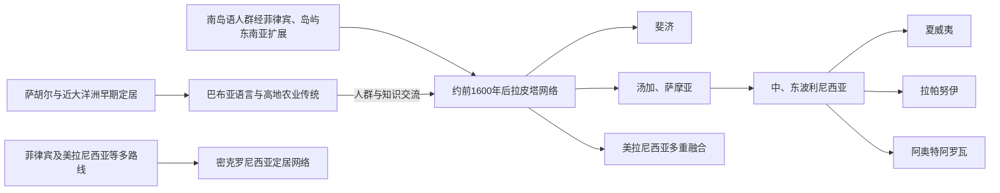

# 航海、定居与太平洋世界

## 时间

至少约5万年前至今。不同地点的定居年代、出发区域和返航频率仍随考古、语言、遗传、古环境和口述传统研究修订。

## 概括

太平洋从来不是等待欧洲“发现”的空白。新几内亚及邻近岛群在更新世即有人居住；其后南岛语航海者与巴布亚人群交汇，形成拉皮塔文化和新的海上网络。远洋航海者利用星辰升落、涌浪、风、云、鸟和生物发光判断方向，以独木舟、舷外浮木舟和双体航具维持探索、返航、婚姻和交换。岛屿社会的兴起不是单一路线复制，而是人口、生态、作物、灾害与政治选择的共同结果。

## 演进图

## 近大洋洲、远大洋洲与萨胡尔

冰期海平面较低时，澳大利亚、新几内亚和塔斯马尼亚组成萨胡尔大陆，但从巽他陆架到萨胡尔仍需跨海。至少约5万年前，人群已到达新几内亚和俾斯麦群岛；所罗门群岛西部也有非常早的定居证据。“近大洋洲”通常指新几内亚、俾斯麦和所罗门近西部，岛间视距较短、居住年代深；“远大洋洲”指必须进行更长越洋航行才能到达的岛群。这是考古便利分类，不是文明等级。

新几内亚高地在全新世早期发展排水沟、园圃和植物管理，Kuk遗址显示香蕉、芋类等作物驯化和农业景观的长期演变。沿海和岛屿人群则结合渔业、贝类、独木舟与交换。所谓“狩猎采集—农业—国家”的单线阶段论不适合这里：园艺、采集、渔业和贸易常长期并存。

## 南岛语扩展与拉皮塔

约前3000年后，南岛语人群从台湾经菲律宾向岛屿东南亚和太平洋扩展，与当地人群发生通婚、语言替换和技术交流。约前1600年，带有齿纹压印陶器的拉皮塔文化出现在俾斯麦群岛，随后数世纪扩展至所罗门、瓦努阿图、新喀里多尼亚、斐济、汤加和萨摩亚。

拉皮塔不是“单一民族帝国”。考古组合包括陶器、石斧、贝饰、家养猪鸡狗、园艺和近岸聚落，但不同地点吸收既有人群和资源。其历史意义在于建立远大洋洲最早广域定居链，并为许多大洋洲南岛语社会提供部分祖源。

## 密克罗尼西亚的多路线定居

密克罗尼西亚并非简单从拉皮塔向北分出。马里亚纳群岛的查莫罗祖先很早即从菲律宾或岛屿东南亚方向抵达；加罗林、帕劳、马绍尔和吉尔伯特群岛则可能由不同时间、不同方向的人群形成。西加罗林与菲律宾、印尼联系较强，东部环礁与美拉尼西亚和波利尼西亚网络交织。语言亲缘相近不等于一次迁徙或统一政治。

## 波利尼西亚远洋扩展

汤加与萨摩亚约前一千纪已有人定居，随后形成“祖源波利尼西亚”语言文化区。东向扩展可能经历数百年停顿；约公元800—1200年，航海者进入社会群岛、马克萨斯、库克和其他中东波利尼西亚枢纽，之后到达夏威夷、拉帕努伊和阿奥特阿罗瓦。各地年代仍在精细校准，宜使用“约”而非伪精确年。

返航和持续联系并非处处相同。黑曜石、玄武岩和口述谱系证明一些航线维持往返；边缘岛屿也可能在数代后失联。航海者会选择逆风探索，以便顺信风返航，并通过“扩展目标”——鸟群、云反光、涌浪变化——发现地平线外岛屿。

## 导航知识与船舶

| 知识／技术 | 功能 | 说明 |
|---|---|---|
| 星罗盘 | 记忆恒星升落方位 | 航海者按夜间时段更换参照，不依赖单一“北极星”。 |
| 海洋涌浪 | 判断远处风场与岛屿反射波 | 马绍尔航海传统特别发展涌浪知识，棒图是教学工具而非船上“地图”。 |
| 鸟、云与海色 | 识别陆地距离和礁湖 | 某些鸟每日返巢；岛屿上空云形和潟湖反光可被辨识。 |
| 推算航法 | 以速度、方向和时间估计位置 | 由专门导航者在记忆中持续更新。 |
| 舷外浮木／双体船 | 稳定、载重与远航 | 具体船型随岛群木材、海况和任务而异。 |
| 口述与训练 | 传递航线、地名和禁忌 | 知识常受家系、师徒与政治权威控制。 |

## 环境与政治形成

高火山岛可支持梯田、灌溉与较大人口，环礁则依赖椰子、露兜树、芋坑和广阔海域。资源集中、剩余生产与神圣谱系有时促进等级王权，如汤加和夏威夷；地形破碎、语言高度多样或土地由小亲属群体掌握时，则常见分散首领和“大人物”竞争。两者不是固定的美拉尼西亚—波利尼西亚二分法：斐济兼有强首领联盟，萨摩亚权力又依会议与头衔选举。

气旋、火山、干旱、海啸和土壤限制会促成人口迁移、禁忌与储粮制度，但不自动导致“崩溃”。拉帕努伊等地的社会变化必须同时考虑殖民奴掠、疾病和外部牧场统治，不能只归因于砍树。

## 欧洲殖民后的航海延续

蒸汽船、殖民港口和护照边界改变跨岛流动，劳工招募与传教网络又建立新航线。20世纪远洋航海复兴以Hōkūleʻa等实践证明无仪器导航可行，并重建跨岛教育与文化联盟。今天航空、侨汇和数字通信与传统海洋知识并存；海洋保护区、航线命名和气候迁移把航海史重新转化为主权政治。

## 演变关系

- 地区分支：[美拉尼西亚](/%E4%BA%BA%E6%96%87%E7%A7%91%E5%AD%A6/%E5%8E%86%E5%8F%B2/%E5%A4%A7%E6%B4%8B%E6%B4%B2/%E5%A4%AA%E5%B9%B3%E6%B4%8B%E5%B2%9B%E5%B1%BF/%E7%BE%8E%E6%8B%89%E5%B0%BC%E8%A5%BF%E4%BA%9A.md)、[密克罗尼西亚](/%E4%BA%BA%E6%96%87%E7%A7%91%E5%AD%A6/%E5%8E%86%E5%8F%B2/%E5%A4%A7%E6%B4%8B%E6%B4%B2/%E5%A4%AA%E5%B9%B3%E6%B4%8B%E5%B2%9B%E5%B1%BF/%E5%AF%86%E5%85%8B%E7%BD%97%E5%B0%BC%E8%A5%BF%E4%BA%9A.md)、[波利尼西亚](/%E4%BA%BA%E6%96%87%E7%A7%91%E5%AD%A6/%E5%8E%86%E5%8F%B2/%E5%A4%A7%E6%B4%8B%E6%B4%B2/%E5%A4%AA%E5%B9%B3%E6%B4%8B%E5%B2%9B%E5%B1%BF/%E6%B3%A2%E5%88%A9%E5%B0%BC%E8%A5%BF%E4%BA%9A.md)。
- 外部重组：[殖民分割、传教与劳工贸易](/%E4%BA%BA%E6%96%87%E7%A7%91%E5%AD%A6/%E5%8E%86%E5%8F%B2/%E5%A4%A7%E6%B4%8B%E6%B4%B2/%E5%A4%AA%E5%B9%B3%E6%B4%8B%E5%B2%9B%E5%B1%BF/%E6%AE%96%E6%B0%91%E5%88%86%E5%89%B2%E3%80%81%E4%BC%A0%E6%95%99%E4%B8%8E%E5%8A%B3%E5%B7%A5%E8%B4%B8%E6%98%93.md)。
- 总览：[太平洋岛屿](/%E4%BA%BA%E6%96%87%E7%A7%91%E5%AD%A6/%E5%8E%86%E5%8F%B2/%E5%A4%A7%E6%B4%8B%E6%B4%B2/%E5%A4%AA%E5%B9%B3%E6%B4%8B%E5%B2%9B%E5%B1%BF/README.md)。
