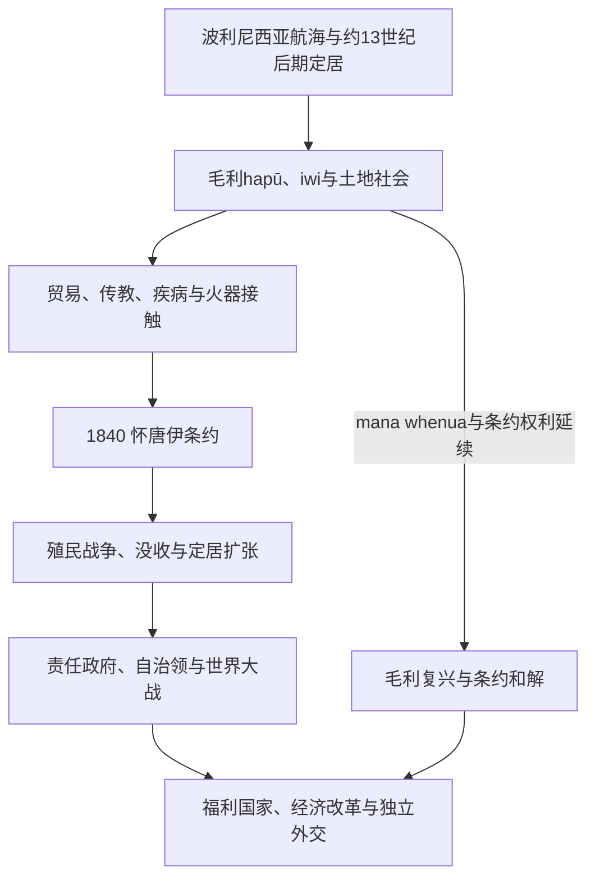

# 新西兰历史

## 历史主线

阿奥特阿罗瓦／新西兰的历史始于波利尼西亚航海者约在13世纪后期定居并形成毛利社会。欧洲接触带来新商品、疾病、传教和火器，也把毛利经济接入全球捕鲸与贸易网络。1840年《怀唐伊条约》建立王室治理框架，但毛利语文本的kāwanatanga（治理权）与对tino rangatiratanga（充分首领权／自主权）的保证，和英语文本的“主权让渡”并不等同。殖民战争、土地没收和定居扩张造成权力失衡；责任政府、自治领、世界大战和福利国家则形成现代议会国家。战后毛利复兴与条约和解使这段历史重新进入法律和公共治理。

## 演进图

## 阶段导航

| 顺序 | 阶段 | 时间 | 本页职责 |
|---:|---|---|---|
| 1 | [毛利人定居与社会](/%E4%BA%BA%E6%96%87%E7%A7%91%E5%AD%A6/%E5%8E%86%E5%8F%B2/%E5%A4%A7%E6%B4%8B%E6%B4%B2/%E6%96%B0%E8%A5%BF%E5%85%B0/%E6%AF%9B%E5%88%A9%E4%BA%BA%E5%AE%9A%E5%B1%85%E4%B8%8E%E7%A4%BE%E4%BC%9A.md) | 约13世纪后期至今 | 定居、环境适应、亲属政治、pā、交换与毛利君主运动。 |
| 2 | [欧洲接触、怀唐伊条约与殖民战争](/%E4%BA%BA%E6%96%87%E7%A7%91%E5%AD%A6/%E5%8E%86%E5%8F%B2/%E5%A4%A7%E6%B4%8B%E6%B4%B2/%E6%96%B0%E8%A5%BF%E5%85%B0/%E6%AC%A7%E6%B4%B2%E6%8E%A5%E8%A7%A6%E3%80%81%E6%80%80%E5%94%90%E4%BC%8A%E6%9D%A1%E7%BA%A6%E4%B8%8E%E6%AE%96%E6%B0%91%E6%88%98%E4%BA%89.md) | 1642—1870年代 | 接触、火枪战争、条约双文本、殖民政府、战争与土地剥夺。 |
| 3 | [自治领、战争与福利国家](/%E4%BA%BA%E6%96%87%E7%A7%91%E5%AD%A6/%E5%8E%86%E5%8F%B2/%E5%A4%A7%E6%B4%8B%E6%B4%B2/%E6%96%B0%E8%A5%BF%E5%85%B0/%E8%87%AA%E6%B2%BB%E9%A2%86%E3%80%81%E6%88%98%E4%BA%89%E4%B8%8E%E7%A6%8F%E5%88%A9%E5%9B%BD%E5%AE%B6.md) | 1870年代—1945年 | 定居国家整合、选举改革、自治领、萨摩亚统治与世界大战。 |
| 4 | [战后新西兰与条约和解](/%E4%BA%BA%E6%96%87%E7%A7%91%E5%AD%A6/%E5%8E%86%E5%8F%B2/%E5%A4%A7%E6%B4%8B%E6%B4%B2/%E6%96%B0%E8%A5%BF%E5%85%B0/%E6%88%98%E5%90%8E%E6%96%B0%E8%A5%BF%E5%85%B0%E4%B8%8E%E6%9D%A1%E7%BA%A6%E5%92%8C%E8%A7%A3.md) | 1945年至今 | 宪政独立、移民、无核外交、经济改革、毛利复兴与和解。 |
| 专表 | [新西兰总督、总理与毛利君主表](/%E4%BA%BA%E6%96%87%E7%A7%91%E5%AD%A6/%E5%8E%86%E5%8F%B2/%E5%A4%A7%E6%B4%8B%E6%B4%B2/%E6%96%B0%E8%A5%BF%E5%85%B0/%E6%96%B0%E8%A5%BF%E5%85%B0%E6%80%BB%E7%9D%A3%E3%80%81%E6%80%BB%E7%90%86%E4%B8%8E%E6%AF%9B%E5%88%A9%E5%90%9B%E4%B8%BB%E8%A1%A8.md) | 1840年至今 | 完整列副王、总理各段任期及Kīngitanga八位君主。 |

## 重要转折与时间节点

| 时间 | 转折 | 意义 |
|---|---|---|
| 约13世纪后期 | 波利尼西亚航海者定居 | 形成独特毛利语言、亲属与土地社会；精确年代仍有讨论。 |
| 1769年 | 库克航行与持续欧洲接触 | 贸易、捕鲸、传教与新技术网络扩大。 |
| 1835年 | 《新西兰独立宣言》 | 部分北方rangatira以“联合部族”名义宣示权威，英国承认旗帜和文件。 |
| 1840年 | 《怀唐伊条约》 | 王室政府的基础文本；双语含义和履行成为长期争议。 |
| 1860—1872年 | 新西兰战争主要阶段 | 王室、殖民政府与不同毛利政治体交战，没收和土地法院扩大土地转移。 |
| 1856年 | 责任政府形成 | 内阁开始依议会信任运作。 |
| 1893年 | 女性获得议会选举权 | 新西兰成为首批实现全国女性选举权的自治政治体之一。 |
| 1907年 | 自治领地位 | 强化自治身份，但并非一次性完全独立。 |
| 1947年 | 采纳《威斯敏斯特法令》 | 英国立法权进一步受新西兰自主控制。 |
| 1975年 | 怀唐伊法庭成立 | 条约申索进入专门调查机制；1985年后可追溯1840年。 |
| 1987年 | 无核区立法与毛利语成为官方语言 | 独立外交和语言复兴的制度化节点。 |
| 1996年 | 首次混合比例代表制大选 | 联合政府和小党政治成为常态。 |

## 政体与实际权力

新西兰是单一制议会民主与君主立宪国家。君主由总督代表；总理和内阁必须维持众议院信任。1951年起议会为一院制。成文法律、法院判例、王室特权和宪政惯例共同构成“非单一法典化”的宪法。

截至2026年7月14日，君主为查尔斯三世，总督为辛迪·基罗，总理为克里斯托弗·拉克森。Kīngitanga现任第八位毛利君主为Ngā Wai Hono i te Pō；该职位代表参加王运动的iwi与hapū之团结和mana，并非新西兰国家君主，也不能代表所有毛利政治共同体。完整任期见[领导与世系专表](/%E4%BA%BA%E6%96%87%E7%A7%91%E5%AD%A6/%E5%8E%86%E5%8F%B2/%E5%A4%A7%E6%B4%8B%E6%B4%B2/%E6%96%B0%E8%A5%BF%E5%85%B0/%E6%96%B0%E8%A5%BF%E5%85%B0%E6%80%BB%E7%9D%A3%E3%80%81%E6%80%BB%E7%90%86%E4%B8%8E%E6%AF%9B%E5%88%A9%E5%90%9B%E4%B8%BB%E8%A1%A8.md)。

## 关键辨析

- 《怀唐伊条约》有毛利语和英语文本，不能把英语“cession of sovereignty”直接视为所有签署者一致理解。
- “新西兰战争”不是单一的英—毛利二元战争；毛利各政治体的立场和联盟不同。
- 1907年自治领、1947年法令采纳和1986年宪法法共同构成渐进宪政独立。
- Kīngitanga是1850年代兴起的原住民政治运动，不是英国王室授予的从属爵位。

## 相关入口

- 上级：[大洋洲历史](/%E4%BA%BA%E6%96%87%E7%A7%91%E5%AD%A6/%E5%8E%86%E5%8F%B2/%E5%A4%A7%E6%B4%8B%E6%B4%B2/README.md)。
- 波利尼西亚背景：[波利尼西亚](/%E4%BA%BA%E6%96%87%E7%A7%91%E5%AD%A6/%E5%8E%86%E5%8F%B2/%E5%A4%A7%E6%B4%8B%E6%B4%B2/%E5%A4%AA%E5%B9%B3%E6%B4%8B%E5%B2%9B%E5%B1%BF/%E6%B3%A2%E5%88%A9%E5%B0%BC%E8%A5%BF%E4%BA%9A.md)。
- 区域政治：[独立国家、自治与区域合作](/%E4%BA%BA%E6%96%87%E7%A7%91%E5%AD%A6/%E5%8E%86%E5%8F%B2/%E5%A4%A7%E6%B4%8B%E6%B4%B2/%E5%A4%AA%E5%B9%B3%E6%B4%8B%E5%B2%9B%E5%B1%BF/%E7%8B%AC%E7%AB%8B%E5%9B%BD%E5%AE%B6%E3%80%81%E8%87%AA%E6%B2%BB%E4%B8%8E%E5%8C%BA%E5%9F%9F%E5%90%88%E4%BD%9C.md)。
