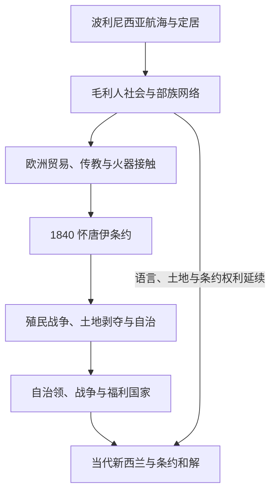

# 新西兰历史

## 历史主线

阿奥特阿罗瓦 / 新西兰历史始于波利尼西亚航海者形成的毛利社会。18世纪末欧洲接触扩大后，贸易、传教、火器和定居者改变岛屿政治。1840年怀唐伊条约成为英国王室与毛利人关系的关键文本，但毛利语和英语版本、主权与土地权含义存在长期争议。殖民战争、自治领、两次世界大战、福利国家和战后条约和解，共同构成现代新西兰。

## 演进图

## 阶段导航

| 顺序 | 阶段 | 时间 | 简要概括 |
|---:|---|---|---|
| 1 | [毛利人定居与社会](/%E4%BA%BA%E6%96%87%E7%A7%91%E5%AD%A6/%E5%8E%86%E5%8F%B2/%E5%A4%A7%E6%B4%8B%E6%B4%B2/%E6%96%B0%E8%A5%BF%E5%85%B0/%E6%AF%9B%E5%88%A9%E4%BA%BA%E5%AE%9A%E5%B1%85%E4%B8%8E%E7%A4%BE%E4%BC%9A.md) | 约13-14世纪至今 | 波利尼西亚定居者形成部族、亲属、土地与海洋社会。 |
| 2 | [欧洲接触、怀唐伊条约与殖民战争](/%E4%BA%BA%E6%96%87%E7%A7%91%E5%AD%A6/%E5%8E%86%E5%8F%B2/%E5%A4%A7%E6%B4%8B%E6%B4%B2/%E6%96%B0%E8%A5%BF%E5%85%B0/%E6%AC%A7%E6%B4%B2%E6%8E%A5%E8%A7%A6%E3%80%81%E6%80%80%E5%94%90%E4%BC%8A%E6%9D%A1%E7%BA%A6%E4%B8%8E%E6%AE%96%E6%B0%91%E6%88%98%E4%BA%89.md) | 1769-1870年代 | 接触、条约、殖民政府、战争和土地剥夺。 |
| 3 | [自治领、战争与福利国家](/%E4%BA%BA%E6%96%87%E7%A7%91%E5%AD%A6/%E5%8E%86%E5%8F%B2/%E5%A4%A7%E6%B4%8B%E6%B4%B2/%E6%96%B0%E8%A5%BF%E5%85%B0/%E8%87%AA%E6%B2%BB%E9%A2%86%E3%80%81%E6%88%98%E4%BA%89%E4%B8%8E%E7%A6%8F%E5%88%A9%E5%9B%BD%E5%AE%B6.md) | 1870年代-1945年 | 定居殖民国家整合、自治领、世界大战和社会政策。 |
| 4 | [战后新西兰与条约和解](/%E4%BA%BA%E6%96%87%E7%A7%91%E5%AD%A6/%E5%8E%86%E5%8F%B2/%E5%A4%A7%E6%B4%8B%E6%B4%B2/%E6%96%B0%E8%A5%BF%E5%85%B0/%E6%88%98%E5%90%8E%E6%96%B0%E8%A5%BF%E5%85%B0%E4%B8%8E%E6%9D%A1%E7%BA%A6%E5%92%8C%E8%A7%A3.md) | 1945年至今 | 去殖民化、经济改革、毛利复兴和条约申索。 |

## 政体结构

新西兰是议会民主制和君主立宪制国家。君主由总督代表；总理和内阁依赖议会信任。毛利部族（iwi）和亚部族（hapū）不是国家政府的同义词，但其固有权威、土地、渔业、语言和条约权利构成公共法与政治的重要部分。

## 相关入口

- 上级：[大洋洲历史](/%E4%BA%BA%E6%96%87%E7%A7%91%E5%AD%A6/%E5%8E%86%E5%8F%B2/%E5%A4%A7%E6%B4%8B%E6%B4%B2/README.md)。
- 波利尼西亚背景：[波利尼西亚](/%E4%BA%BA%E6%96%87%E7%A7%91%E5%AD%A6/%E5%8E%86%E5%8F%B2/%E5%A4%A7%E6%B4%8B%E6%B4%B2/%E5%A4%AA%E5%B9%B3%E6%B4%8B%E5%B2%9B%E5%B1%BF/%E6%B3%A2%E5%88%A9%E5%B0%BC%E8%A5%BF%E4%BA%9A.md)。
- 太平洋区域：[太平洋岛屿](/%E4%BA%BA%E6%96%87%E7%A7%91%E5%AD%A6/%E5%8E%86%E5%8F%B2/%E5%A4%A7%E6%B4%8B%E6%B4%B2/%E5%A4%AA%E5%B9%B3%E6%B4%8B%E5%B2%9B%E5%B1%BF/README.md)。
