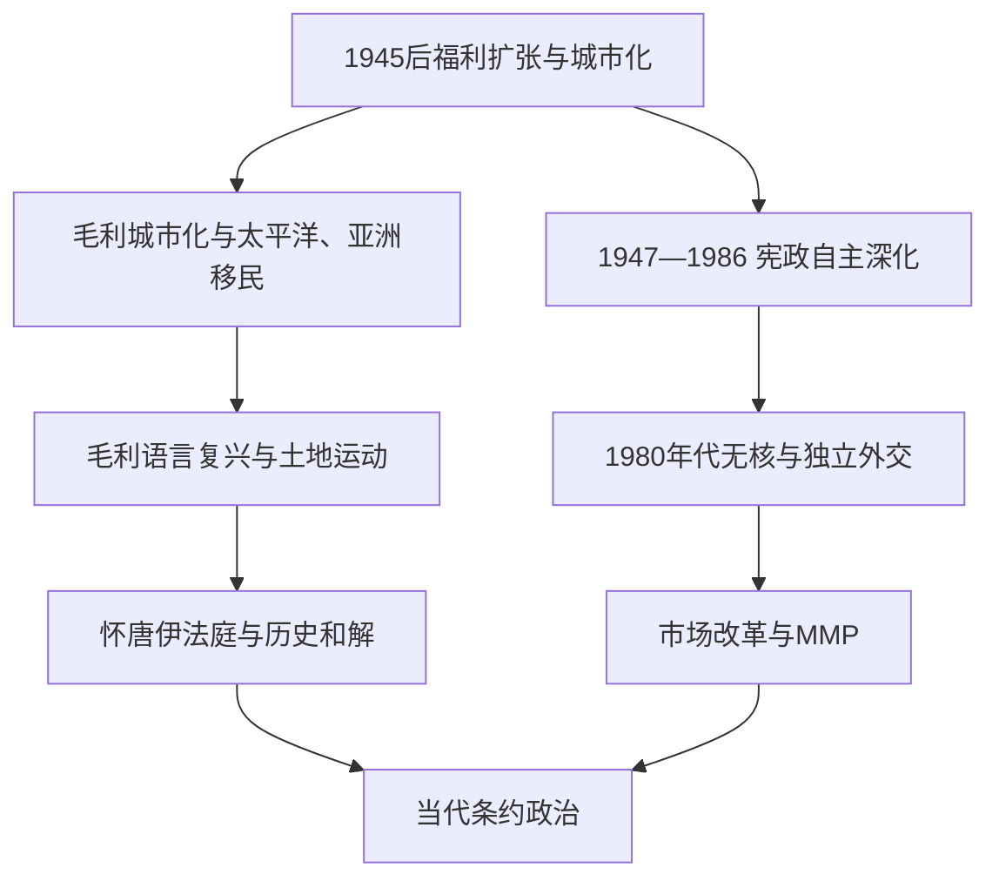

# 战后新西兰与条约和解

## 时间

1945年至今；现任人物核验截至2026年7月14日。

## 概括

战后新西兰从依赖英国市场和文化的自治领，转变为法律上自主、实行混合比例代表制、奉行无核政策并以太平洋和亚太为重要方向的议会国家。福利扩张、毛利城市化和太平洋移民改变社会；英国加入欧洲共同体后，经济危机推动1980年代激进市场改革。与此同时，毛利语言、土地与tino rangatiratanga运动促使怀唐伊法庭、历史和解和共同治理进入国家制度。和解不是终点，淡水、海岸、宪法解释与社会差距仍有争议。

## 演进图

## 现行政体与权力结构

| 角色 | 截至2026-07-14 | 实际位置 |
|---|---|---|
| 君主 | 查尔斯三世 | 新西兰王位与英国由同一人担任，但属于独立的新西兰王冠。 |
| 总督 | 辛迪·基罗（2021年至今） | 君主代表；通常依部长建议任命政府、批准法律与履行礼仪职能。 |
| 总理 | 克里斯托弗·拉克森（2023年至今） | 国家党领袖，领导国家党—行动党—新西兰优先党联合政府。 |
| 内阁 | 对一院制众议院负责 | 实际行政决策核心；联合协议约束政策。 |
| 议会 | 混合比例代表制产生 | 政党票决定总体比例，选区席与名单席结合。 |
| 法院 | 最高法院为终审法院 | 解释法律与条约原则，但议会仍具强势立法地位。 |
| iwi、hapū及毛利机构 | 非国家行政层级 | 通过条约权利、法定机构、资产管理和共同治理行使集体权威。 |

历届副王、总理和毛利君主见[新西兰总督、总理与毛利君主表](/%E4%BA%BA%E6%96%87%E7%A7%91%E5%AD%A6/%E5%8E%86%E5%8F%B2/%E5%A4%A7%E6%B4%8B%E6%B4%B2/%E6%96%B0%E8%A5%BF%E5%85%B0/%E6%96%B0%E8%A5%BF%E5%85%B0%E6%80%BB%E7%9D%A3%E3%80%81%E6%80%BB%E7%90%86%E4%B8%8E%E6%AF%9B%E5%88%A9%E5%90%9B%E4%B8%BB%E8%A1%A8.md)。

## 宪政独立的渐进完成

1947年新西兰采纳《威斯敏斯特法令》，英国议会原则上仅在新西兰请求并同意时立法；同年又请求英国修法以便新西兰议会修改自身宪制。1986年《宪法法》在国内重新表述君主、行政、议会和司法结构，终止请求英国立法的需要。2004年最高法院取代枢密院成为终审机关。这一过程说明独立没有单一断裂日。

总督职位也从帝国政府联络者转为新西兰君主代表。任命实际由新西兰总理提出，20世纪后期以后人选更多反映本国社会，包括首位新西兰出生、首位毛利血统与多位女性总督。

## 战后社会、移民与太平洋关系

国家住房、公共卫生、教育和全就业政策延续战前福利国家。毛利人口大量从农村迁入奥克兰、惠灵顿等城市，获得工资就业和教育机会，也面临住房、种族歧视与语言断裂。1950年代以后萨摩亚、汤加、库克群岛、纽埃和托克劳人口迁入，使“太平洋新西兰”成为国内社会的一部分。

1970年代经济衰退和移民执法导致针对太平洋人的“黎明突袭”；政府于2021年正式道歉。1987年移民制度改以技能为主，亚洲移民显著增加。多元社会并不消除殖民层级，而是使条约伙伴关系、移民公民权和太平洋责任并置。

## 毛利复兴与条约和解过程

1. 1972年毛利请愿推动毛利语教学；1975年土地大游行以“再也不失去一英亩土地”为口号，串联各地申诉。
2. 1975年《怀唐伊条约法》设立怀唐伊法庭，最初只能调查当代王室行为；1985年权限追溯至1840年，历史土地与资源申索大量进入调查。
3. 1987年毛利语成为官方语言，随后语言巢、毛利学校、广播电视和高等教育扩大。
4. 1980年代法院发展“条约原则”，要求王室与毛利以合理伙伴、善意和积极保护方式处理法定事项；具体效力仍取决于立法文本。
5. 1992年渔业和解、1995年Waikato-Tainui和解、1998年Ngāi Tahu和解成为大型历史申索范式，通常包含王室道歉、文化救济、土地或资金和法定承认。
6. 2014年Tūhoe和解承认Te Urewera为具有自身法律身份的实体；2017年Whanganui河获法律人格，反映共同治理与原住民世界观进入法律。
7. 和解多处理历史王室违约，不等同于结清所有当代权利。淡水分配、海岸海床、儿童与医疗服务、宪法地位仍持续争论。

## 外交、安全与无核转向

1951年澳新美安全条约把新西兰纳入美国主导的太平洋体系，国家参加朝鲜与越南战争。1973年英国加入欧洲共同体冲击传统出口，新西兰转向澳大利亚、亚洲和多元市场。1984年工党政府拒绝无法确认是否携核的美国军舰入港，1987年以法律确立无核区；美国暂停对新西兰的条约义务，但澳新双边防务和后来的美新合作逐步恢复。

新西兰支持南太平洋无核区、太平洋岛屿论坛和地区发展，也必须面对其曾统治萨摩亚、管理托克劳与自由联合关系中的权力不对称。2026年的安全合作讨论仍以“太平洋主导”与大国竞争如何平衡为核心。

## 经济改革与政治制度变化

英国市场流失、石油危机、通胀和“Think Big”债务使穆尔敦时代经济管制陷入困境。1984年朗伊—道格拉斯政府浮动汇率、取消补贴、降低关税、改革国企；1990年代国家党又收紧福利并通过《雇佣合同法》。改革抑制部分失衡、提高开放度，却造成失业、去工业化和毛利／太平洋社区承受不成比例成本。

两大党在“赢者通吃”选制下实施剧烈改革，引发选举制度不信任。1993年公投通过混合比例代表制，1996年首次使用MMP；此后联合或少数政府成为常态。2017—2023年阿德恩政府经历基督城清真寺袭击、怀特岛火山灾害和新冠疫情；公共卫生成功、边境与财政措施又伴随住房、债务和治理争论。2023年拉克森领导的三党联合政府上台，重新调整税收、公共部门、条约相关政策与资源管理。

## 结构性成就、压力与未决转折

- **稳定来源**：议会惯例、比例代表、公共服务、农业与服务出口、教育和区域网络。
- **结构压力**：住房成本、生产率、基础设施、人口老龄化、气候灾害与地区不平等。
- **条约张力**：国家主权、tino rangatiratanga和全体公民平等如何制度结合，仍有竞争性解释。
- **阶段判断**：现行政体并未出现“灭亡”过程；更可能通过选举、司法、条约和解和宪法辩论渐进改变。

## 演变关系

- 前一阶段：[自治领、战争与福利国家](/%E4%BA%BA%E6%96%87%E7%A7%91%E5%AD%A6/%E5%8E%86%E5%8F%B2/%E5%A4%A7%E6%B4%8B%E6%B4%B2/%E6%96%B0%E8%A5%BF%E5%85%B0/%E8%87%AA%E6%B2%BB%E9%A2%86%E3%80%81%E6%88%98%E4%BA%89%E4%B8%8E%E7%A6%8F%E5%88%A9%E5%9B%BD%E5%AE%B6.md)。
- 毛利社会主线：[毛利人定居与社会](/%E4%BA%BA%E6%96%87%E7%A7%91%E5%AD%A6/%E5%8E%86%E5%8F%B2/%E5%A4%A7%E6%B4%8B%E6%B4%B2/%E6%96%B0%E8%A5%BF%E5%85%B0/%E6%AF%9B%E5%88%A9%E4%BA%BA%E5%AE%9A%E5%B1%85%E4%B8%8E%E7%A4%BE%E4%BC%9A.md)。
- 区域去殖民化：[独立国家、自治与区域合作](/%E4%BA%BA%E6%96%87%E7%A7%91%E5%AD%A6/%E5%8E%86%E5%8F%B2/%E5%A4%A7%E6%B4%8B%E6%B4%B2/%E5%A4%AA%E5%B9%B3%E6%B4%8B%E5%B2%9B%E5%B1%BF/%E7%8B%AC%E7%AB%8B%E5%9B%BD%E5%AE%B6%E3%80%81%E8%87%AA%E6%B2%BB%E4%B8%8E%E5%8C%BA%E5%9F%9F%E5%90%88%E4%BD%9C.md)。
- 所属总览：[新西兰历史](/%E4%BA%BA%E6%96%87%E7%A7%91%E5%AD%A6/%E5%8E%86%E5%8F%B2/%E5%A4%A7%E6%B4%8B%E6%B4%B2/%E6%96%B0%E8%A5%BF%E5%85%B0/README.md)。
