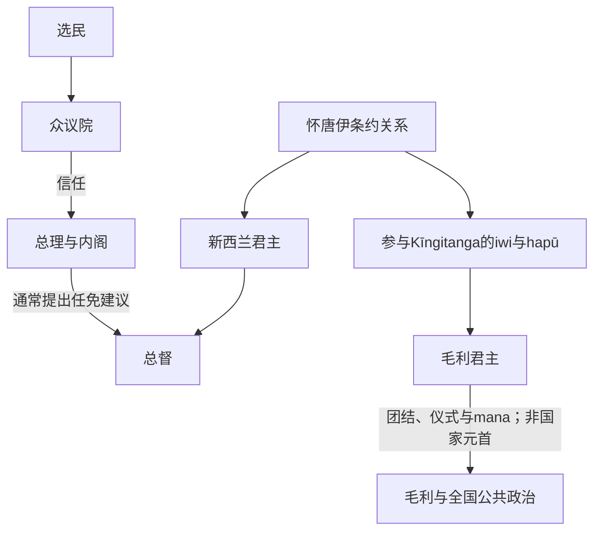

# 新西兰总督、总理与毛利君主表

## 范围

副王表自1840年王室殖民政府建立起，列正式副总督与总督；1917年后英文职称改为 Governor-General。短期行政官代行期在备注说明，不冒充完整正式任命。政府首脑表按1856年责任政府形成后的每段任期排列；复任不合并。Kīngitanga表列1858年以来公认八位毛利君主。现任人物核验截至2026年7月14日。

## 权力关系图

## 正式副王完整表

| 顺序 | 人物 | 职称 | 任期 | 关键说明 |
|---:|---|---|---|---|
| 1 | **威廉·霍布森** | 副总督；后总督 | 1840—1842 | 条约签署与殖民政府建立；任内去世。 |
| 2 | 罗伯特·菲茨罗伊 | 总督 | 1843—1845 | 怀劳事件后就任；因财政与定居者批评被召回。 |
| 3 | **乔治·格雷** | 总督 | 1845—1853 | 首任期处理北方战争并推动中央行政。 |
| 4 | 托马斯·戈尔·布朗 | 总督 | 1855—1861 | Waitara购买争议与第一次塔拉纳基战争。 |
| 5 | **乔治·格雷** | 总督 | 1861—1868 | 第二任期；Waikato入侵和土地没收时期。 |
| 6 | 乔治·鲍恩 | 总督 | 1868—1873 | 帝国军撤离、殖民政府自理防务。 |
| 7 | 詹姆斯·弗格森 | 总督 | 1873—1874 | 任期短，辞职返英。 |
| 8 | 诺曼比侯爵 | 总督 | 1875—1879 | 责任政府惯例进一步稳定。 |
| 9 | 赫拉克勒斯·罗宾逊 | 总督 | 1879—1880 | 任期短，后转任开普殖民地。 |
| 10 | 阿瑟·戈登 | 总督 | 1880—1882 | 同时任西太平洋高级专员；Parihaka事件时期。 |
| 11 | 威廉·杰沃伊斯 | 总督 | 1883—1889 | 加强海岸防御。 |
| 12 | 昂斯洛伯爵 | 总督 | 1889—1892 | 政党政府形成初期。 |
| 13 | 格拉斯哥伯爵 | 总督 | 1892—1897 | 自由党长期执政初期。 |
| 14 | 兰弗利伯爵 | 总督 | 1897—1904 | 南非战争与帝国爱国主义时期。 |
| 15 | 普伦基特勋爵 | 总督 | 1904—1910 | 自治领称号出现时期。 |
| 16 | 伊斯灵顿勋爵 | 总督 | 1910—1912 | 首位入住现惠灵顿总督府的总督。 |
| 17 | 利物浦伯爵 | 总督→总督（Governor-General） | 1912—1920 | 1917年职称改变；一战与萨摩亚占领。 |
| 18 | 杰利科子爵 | 总督（Governor-General） | 1920—1924 | 前英国海军元帅。 |
| 19 | 查尔斯·弗格森 | 总督（Governor-General） | 1924—1930 | 一战后与大萧条初期。 |
| 20 | 布莱迪斯洛勋爵 | 总督（Governor-General） | 1930—1935 | 促成怀唐伊条约签署地成为国家纪念空间。 |
| 21 | 戈尔韦子爵 | 总督（Governor-General） | 1935—1941 | 首届工党政府与二战初期。 |
| 22 | 西里尔·纽沃尔 | 总督（Governor-General） | 1941—1946 | 二战后半期。 |
| 23 | **伯纳德·弗赖伯格** | 总督（Governor-General） | 1946—1952 | 首位被视为新西兰人的总督（Governor-General）；二战名将。 |
| 24 | 威洛比·诺里 | 总督（Governor-General） | 1952—1957 | 伊丽莎白二世早期。 |
| 25 | 科巴姆子爵 | 总督（Governor-General） | 1957—1962 | 战后繁荣与外交调整。 |
| 26 | 伯纳德·弗格森 | 总督（Governor-General） | 1962—1967 | 最后一位英国出生的总督（Governor-General）。 |
| 27 | **阿瑟·波里特** | 总督（Governor-General） | 1967—1972 | 首位新西兰出生者。 |
| 28 | 丹尼斯·布伦德尔 | 总督（Governor-General） | 1972—1977 | 条约法与社会抗议时期。 |
| 29 | 基思·霍利奥克 | 总督（Governor-General） | 1977—1980 | 前总理，任命引发职位政治化讨论。 |
| 30 | 戴维·贝蒂 | 总督（Governor-General） | 1980—1985 | 1984年政权交接与汇率危机时期。 |
| 31 | **保罗·里夫斯** | 总督（Governor-General） | 1985—1990 | 首位毛利血统总督（Governor-General）。 |
| 32 | **凯瑟琳·蒂泽德** | 总督（Governor-General） | 1990—1996 | 首位女性总督（Governor-General）。 |
| 33 | 迈克尔·哈迪·博伊斯 | 总督（Governor-General） | 1996—2001 | MMP初期联合政府。 |
| 34 | 西尔维娅·卡特赖特 | 总督（Governor-General） | 2001—2006 | 前高等法院法官。 |
| 35 | 阿南德·萨蒂亚南德 | 总督（Governor-General） | 2006—2011 | 首位亚裔与太平洋背景者。 |
| 36 | 杰里·马特帕里 | 总督（Governor-General） | 2011—2016 | 前国防军司令，毛利血统。 |
| 37 | 帕齐·雷迪 | 总督（Governor-General） | 2016—2021 | 基督城袭击与疫情初期。 |
| 38 | **辛迪·基罗** | 总督（Governor-General） | 2021年至今 | 首位毛利女性总督（Governor-General）；截至核验日仍在任。 |

1842—1843、1853—1855、1874—1875等正式任命空档由殖民地秘书或军队高级官员以行政官身份代行，不另编号。官方统计副王人数时对职位范围和乔治·格雷两段任期的计数方式可能不同，本表按人物—任命段落展示。

## 政府首脑完整任期表

19世纪称Premier，1906年后正式使用Prime Minister。每段复任单列，故“任次”多于42位人物。

| 任次 | 政府首脑 | 阵营／政党 | 任期 | 继任与关键说明 |
|---:|---|---|---|---|
| 1 | 亨利·休厄尔 | 无正式政党 | 1856-05-07—05-20 | 首届责任政府；两周后失去支持。 |
| 2 | 威廉·福克斯 | 无正式政党 | 1856-05-20—06-02 | 首次；政府仅约两周。 |
| 3 | 爱德华·斯塔福德 | 无正式政党 | 1856—1861 | 首次；早期较稳定内阁。 |
| 4 | 威廉·福克斯 | 无正式政党 | 1861—1862 | 第二次。 |
| 5 | 阿尔弗雷德·多梅特 | 无正式政党 | 1862—1863 | Waikato战争初期。 |
| 6 | 弗雷德里克·惠特克 | 无正式政党 | 1863—1864 | 土地没收政策时期；首次。 |
| 7 | 弗雷德里克·韦尔德 | 无正式政党 | 1864—1865 | 推动殖民地“自立”防务。 |
| 8 | 爱德华·斯塔福德 | 无正式政党 | 1865—1869 | 第二次。 |
| 9 | 威廉·福克斯 | 无正式政党 | 1869—1872 | 第三次；沃格尔公共工程。 |
| 10 | 爱德华·斯塔福德 | 无正式政党 | 1872-09-10—10-11 | 第三次，约一月。 |
| 11 | 乔治·沃特豪斯 | 无正式政党 | 1872—1873 | 未经新西兰普选入众院的立法会议员。 |
| 12 | 威廉·福克斯 | 无正式政党 | 1873-03-03—04-08 | 第四次。 |
| 13 | 朱利叶斯·沃格尔 | 无正式政党 | 1873—1875 | 首次；借款、铁路与移民。 |
| 14 | 丹尼尔·波伦 | 无正式政党 | 1875—1876 | 沃格尔在海外期间过渡。 |
| 15 | 朱利叶斯·沃格尔 | 无正式政党 | 1876-02-15—09-01 | 第二次。 |
| 16 | 哈里·阿特金森 | 无正式政党 | 1876—1877 | 首次；其内阁曾重组。 |
| 17 | 乔治·格雷 | 自由派 | 1877—1879 | 前总督转任政府首脑。 |
| 18 | 约翰·霍尔 | 保守派 | 1879—1882 | 女性参政运动的后期倡议者。 |
| 19 | 弗雷德里克·惠特克 | 保守派 | 1882—1883 | 第二次。 |
| 20 | 哈里·阿特金森 | 保守派 | 1883—1884 | 第二次。 |
| 21 | 罗伯特·斯托特 | 自由派 | 1884-08-16—08-28 | 首次，12天。 |
| 22 | 哈里·阿特金森 | 保守派 | 1884-08-28—09-03 | 第三次，约一周。 |
| 23 | 罗伯特·斯托特 | 自由派 | 1884—1887 | 第二次；“斯托特—沃格尔”内阁。 |
| 24 | 哈里·阿特金森 | 保守派 | 1887—1891 | 第四次。 |
| 25 | 约翰·巴兰斯 | 自由党 | 1891—1893 | 首届自由党政府；任内去世。 |
| 26 | **理查德·塞登** | 自由党 | 1893—1906 | 最长任政府首脑；任内去世。 |
| 27 | 威廉·霍尔-琼斯 | 自由党 | 1906-06-21—08-06 | 等待沃德返国的过渡政府。 |
| 28 | 约瑟夫·沃德 | 自由党 | 1906—1912 | 首次；自治领与社会改革。 |
| 29 | 托马斯·麦肯齐 | 自由党 | 1912-03-28—07-10 | 议会不信任下台。 |
| 30 | **威廉·梅西** | 改革党 | 1912—1925 | 一战、征兵与萨摩亚统治；任内去世。 |
| 31 | 弗朗西斯·贝尔 | 改革党 | 1925-05-14—05-30 | 看守16天。 |
| 32 | 戈登·科茨 | 改革党 | 1925—1928 | 现代化与乡村政策。 |
| 33 | 约瑟夫·沃德 | 联合党 | 1928—1930 | 第二次，健康原因辞职。 |
| 34 | 乔治·福布斯 | 联合党／联合政府 | 1930—1935 | 大萧条。 |
| 35 | **迈克尔·约瑟夫·萨维奇** | 工党 | 1935—1940 | 首届工党和福利国家；任内去世。 |
| 36 | **彼得·弗雷泽** | 工党 | 1940—1949 | 二战与战后秩序。 |
| 37 | 西德尼·霍兰 | 国家党 | 1949—1957 | 首届国家党政府。 |
| 38 | 基思·霍利奥克 | 国家党 | 1957-09-20—12-12 | 首次短任。 |
| 39 | 沃尔特·纳什 | 工党 | 1957—1960 | 第二届工党政府。 |
| 40 | 基思·霍利奥克 | 国家党 | 1960—1972 | 第二次，长期执政。 |
| 41 | 杰克·马歇尔 | 国家党 | 1972-02-07—12-08 | 接任后当年选举失利。 |
| 42 | 诺曼·柯克 | 工党 | 1972—1974 | 独立外交；任内去世。 |
| 43 | 比尔·罗林 | 工党 | 1974—1975 | 柯克去世后接任。 |
| 44 | 罗伯特·穆尔敦 | 国家党 | 1975—1984 | 经济管制、“Think Big”。 |
| 45 | 戴维·朗伊 | 工党 | 1984—1989 | 市场改革和无核政策；辞职。 |
| 46 | 杰弗里·帕尔默 | 工党 | 1989—1990 | 宪法与公共部门改革；选前被替换。 |
| 47 | 迈克·穆尔 | 工党 | 1990-09-04—11-02 | 选举前短任。 |
| 48 | 吉姆·博尔格 | 国家党 | 1990—1997 | MMP与大型条约和解；党内更替。 |
| 49 | 珍妮·希普利 | 国家党 | 1997—1999 | 首位女性总理。 |
| 50 | 海伦·克拉克 | 工党 | 1999—2008 | 三届政府、最高法院和社会改革。 |
| 51 | 约翰·基 | 国家党 | 2008—2016 | 三度赢得选举后自愿辞职。 |
| 52 | 比尔·英格利希 | 国家党 | 2016—2017 | 联合谈判后失去执政。 |
| 53 | 杰辛达·阿德恩 | 工党 | 2017—2023 | 清真寺袭击与疫情；辞职。 |
| 54 | 克里斯·希普金斯 | 工党 | 2023-01-25—11-27 | 选举前接任，后败北。 |
| 55 | **克里斯托弗·拉克森** | 国家党 | 2023年至今 | 三党联合政府；截至核验日仍在任。 |

## Kīngitanga毛利君主完整世系

| 顺序 | 毛利君主 | 在位 | 与前任关系 | 关键事件／备注 |
|---:|---|---|---|---|
| 1 | **Pōtatau Te Wherowhero** | 1858—1860 | 创立者 | Waikato高mana rangatira；接受多iwi推举，建立Kīngitanga。 |
| 2 | **Tāwhiao** | 1860—1894 | Pōtatau之子 | Waikato战争、土地没收与退守Rohe Pōtae；后寻求和平和救济。 |
| 3 | Mahuta | 1894—1912 | Tāwhiao之子 | 曾进入立法会和行政会议，尝试以国家制度寻求补偿。 |
| 4 | Te Rata | 1912—1933 | Mahuta之子 | 赴英国请愿土地没收问题；一战时期Waikato征兵争议。 |
| 5 | Korokī | 1933—1966 | Te Rata之子 | 在Te Puea Hērangi协助下维系运动；战后与王室关系改善。 |
| 6 | **Te Atairangikaahu** | 1966—2006 | Korokī之女 | 首位女性毛利君主；任期四十年，成为全国和解与文化复兴象征。 |
| 7 | **Tūheitia** | 2006—2024 | Te Atairangikaahu之子 | 推动iwi团结、教育和条约议题；2024年去世。 |
| 8 | **Ngā Wai Hono i te Pō** | 2024年至今 | Tūheitia之女 | 2024年由te kāhui ariki与运动领袖选定并即位；截至核验日为现任。 |

“世袭”并不表示机械长子继承；王室家族与Kīngitanga领导者在丧葬会议中确认继承人。毛利君主不取代rangatira、iwi或hapū的自身权威，也不是新西兰宪制中的国家元首。

## 相关笔记

- 国家阶段：[欧洲接触、怀唐伊条约与殖民战争](/%E4%BA%BA%E6%96%87%E7%A7%91%E5%AD%A6/%E5%8E%86%E5%8F%B2/%E5%A4%A7%E6%B4%8B%E6%B4%B2/%E6%96%B0%E8%A5%BF%E5%85%B0/%E6%AC%A7%E6%B4%B2%E6%8E%A5%E8%A7%A6%E3%80%81%E6%80%80%E5%94%90%E4%BC%8A%E6%9D%A1%E7%BA%A6%E4%B8%8E%E6%AE%96%E6%B0%91%E6%88%98%E4%BA%89.md)、[自治领、战争与福利国家](/%E4%BA%BA%E6%96%87%E7%A7%91%E5%AD%A6/%E5%8E%86%E5%8F%B2/%E5%A4%A7%E6%B4%8B%E6%B4%B2/%E6%96%B0%E8%A5%BF%E5%85%B0/%E8%87%AA%E6%B2%BB%E9%A2%86%E3%80%81%E6%88%98%E4%BA%89%E4%B8%8E%E7%A6%8F%E5%88%A9%E5%9B%BD%E5%AE%B6.md)、[战后新西兰与条约和解](/%E4%BA%BA%E6%96%87%E7%A7%91%E5%AD%A6/%E5%8E%86%E5%8F%B2/%E5%A4%A7%E6%B4%8B%E6%B4%B2/%E6%96%B0%E8%A5%BF%E5%85%B0/%E6%88%98%E5%90%8E%E6%96%B0%E8%A5%BF%E5%85%B0%E4%B8%8E%E6%9D%A1%E7%BA%A6%E5%92%8C%E8%A7%A3.md)。
- 毛利社会：[毛利人定居与社会](/%E4%BA%BA%E6%96%87%E7%A7%91%E5%AD%A6/%E5%8E%86%E5%8F%B2/%E5%A4%A7%E6%B4%8B%E6%B4%B2/%E6%96%B0%E8%A5%BF%E5%85%B0/%E6%AF%9B%E5%88%A9%E4%BA%BA%E5%AE%9A%E5%B1%85%E4%B8%8E%E7%A4%BE%E4%BC%9A.md)。
- 总览：[新西兰历史](/%E4%BA%BA%E6%96%87%E7%A7%91%E5%AD%A6/%E5%8E%86%E5%8F%B2/%E5%A4%A7%E6%B4%8B%E6%B4%B2/%E6%96%B0%E8%A5%BF%E5%85%B0/README.md)。
