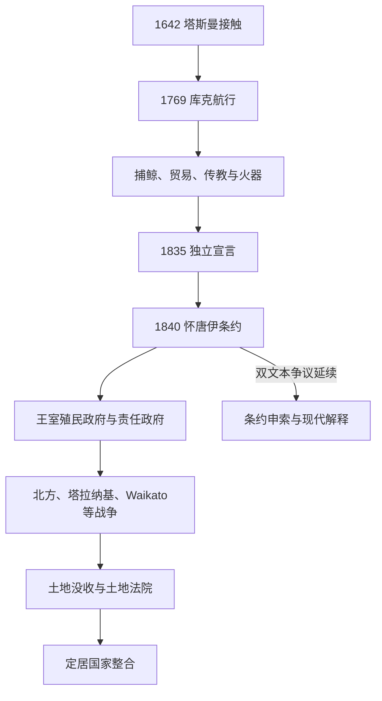

# 欧洲接触、怀唐伊条约与殖民战争

## 时间

1642—1870年代；土地、条约与主权后果延续至今。

## 概括

1642年塔斯曼短暂接触、1769年库克测绘之后，捕鲸、海豹、贸易和传教建立持续往来。毛利政治体主动利用船舶、农产品、火器、读写和海外市场，但疾病与武器也加剧人口和权力震荡。1835年《独立宣言》和1840年《怀唐伊条约》试图回应定居者失序与法国竞争；条约并未产生一致的主权理解。王室殖民政府、定居者责任政府和不同毛利联盟之间的土地冲突，最终在1840—1870年代多场战争中爆发。

## 演进图

## 接触与毛利主导的贸易阶段

库克航行并未立即建立殖民政府。1790年代至1830年代，海豹猎人、捕鲸者、木材商和传教士依赖毛利供给与许可。北岛Bay of Islands成为港口中心，部分rangatira赴悉尼并与新南威尔士商人建立关系。传教士发展毛利语拼写、学校和印刷；毛利农场、船只与磨坊参与跨塔斯曼市场。

欧洲疾病导致严重人口损失，火枪和马铃薯改变战争规模。1830年伊丽莎白号船事件等显示欧洲商人也被卷入毛利冲突。英国驻留官詹姆斯·巴斯比权力有限，无法以常规殖民行政管理定居者。

## 1835年宣言与1840年条约

1834年北方首领选择旗帜，使毛利船只可获英国承认。1835年，部分北方rangatira签署《新西兰联合部族独立宣言》，宣示“ko te Kingitanga ko te mana i te w[h]enua”由首领集体掌握；英国予以承认。英国随后担心新西兰公司土地交易、定居者秩序和法国介入，派威廉·霍布森寻求条约。

1840年2月6日起，毛利语《Te Tiriti o Waitangi》和英语文本在多地签署。约五百余名rangatira签名或作记号，大多数签的是毛利语文本，部分重要首领未签。

| 议题 | 毛利语文本常见理解 | 英语文本 | 历史争议 |
|---|---|---|---|
| 第一条 | 授予王室kāwanatanga，即治理／政府权力 | chiefs cede sovereignty | 是否让渡最终主权并无共同、逐字对应的表达。 |
| 第二条 | 保证tino rangatiratanga于土地、家园和珍贵事物 | 保证full exclusive and undisturbed possession | 自主权、财产权与王室优先购买权之间持续冲突。 |
| 第三条 | 给予与英国臣民相同权利和保护 | rights and privileges of British subjects | 法律平等承诺与殖民实践落差明显。 |

霍布森随后分别以条约签署和“发现”主张北、南岛主权。新西兰最初隶属新南威尔士，1841年成为独立王室殖民地。

## 殖民统治结构

| 阶段 | 行政首脑 | 实际权力 |
|---|---|---|
| 1840—1841年 | 副总督威廉·霍布森 | 隶属新南威尔士，负责签约和建政。 |
| 1841—1856年 | 英国任命总督 | 总督、官僚和军队权力集中；立法机构代表有限。 |
| 1856年以后 | 总督＋责任政府总理／内阁 | 定居者议会掌握日常内政与土地政策；帝国控制军事、外交仍逐步缩减。 |
| 毛利政治体 | rangatira、hapū、iwi及Kīngitanga等 | 对本群体土地与社会保持实际权威，但殖民法律不断压缩空间。 |

副王与政府首脑完整顺序见[新西兰总督、总理与毛利君主表](/%E4%BA%BA%E6%96%87%E7%A7%91%E5%AD%A6/%E5%8E%86%E5%8F%B2/%E5%A4%A7%E6%B4%8B%E6%B4%B2/%E6%96%B0%E8%A5%BF%E5%85%B0/%E6%96%B0%E8%A5%BF%E5%85%B0%E6%80%BB%E7%9D%A3%E3%80%81%E6%80%BB%E7%90%86%E4%B8%8E%E6%AF%9B%E5%88%A9%E5%90%9B%E4%B8%BB%E8%A1%A8.md)。

## 战争过程与转折

### 北方战争与早期冲突

1843年怀劳事件源于新西兰公司试图测量有争议土地，冲突造成双方死亡。1845—1846年Hōne Heke多次砍倒Kororāreka旗杆，与Kawiti共同反对殖民权威；Tāmati Wāka Nene等毛利首领支持王室。Ruapekapeka战役显示毛利“枪炮pā”能够吸收炮击。战争没有简单军事投降，双方都宣称达成目标。

### 第一次塔拉纳基战争

殖民政府在争议中接受Te Teira出售Waitara土地，Wiremu Kīngi反对，1860年战争爆发。军事僵局和政治压力促成1861年停火，但土地与主权问题未解决。Kīngitanga被殖民政府视为对王室权威的挑战。

### Waikato入侵

总督乔治·格雷修建通向Waikato的军事道路，并于1863年以安全威胁为由越过Mangatawhiri河。Rangiriri、Ōrākau等战役后殖民军占领核心地区；Kīngitanga退入Rohe Pōtae。约120万英亩土地在新西兰定居法框架下被没收，其中也包括“忠诚”或中立群体土地。军事优势来自帝国军队、殖民民兵、蒸汽船和补给体系，而非单场战役。

### Tauranga、东海岸、Tītokowaru与Te Kooti

1864年Gate Pā战役中毛利守军重创英军，随后在Te Ranga失利。Pai Mārire宗教传播、东海岸内战与殖民同盟交错。1868—1869年Tītokowaru在塔拉纳基有效抵抗，部队后因内部原因解体；Te Kooti从查塔姆群岛逃脱后在东部和中部游击至1872年。后期战争更多由殖民武装与毛利盟军承担，显示“种族战争”标签掩盖复杂联盟。

## 土地转移机制与战争后果

战争没收是直接手段，1865年成立的原住民土地法院则把集体、重叠权利转化为可登记、交易的个人化产权。诉讼成本、测量费、债务和投机加速土地出售。与此同时，移民、铁路和农牧扩张使定居人口在1850年代末超过毛利人口。

殖民国家“崛起”依赖人口、帝国军力、信贷与法律产权；毛利政治空间被削弱并非单一战败，而是军事、人口、法院、税收和基础设施共同作用。1870年代帝国军队撤离、殖民政府自行承担安全，战争阶段趋于结束；Parihaka等非暴力抵抗和土地争议继续存在。

## 演变关系

- 前一节点：[毛利人定居与社会](/%E4%BA%BA%E6%96%87%E7%A7%91%E5%AD%A6/%E5%8E%86%E5%8F%B2/%E5%A4%A7%E6%B4%8B%E6%B4%B2/%E6%96%B0%E8%A5%BF%E5%85%B0/%E6%AF%9B%E5%88%A9%E4%BA%BA%E5%AE%9A%E5%B1%85%E4%B8%8E%E7%A4%BE%E4%BC%9A.md)。
- 后一节点：[自治领、战争与福利国家](/%E4%BA%BA%E6%96%87%E7%A7%91%E5%AD%A6/%E5%8E%86%E5%8F%B2/%E5%A4%A7%E6%B4%8B%E6%B4%B2/%E6%96%B0%E8%A5%BF%E5%85%B0/%E8%87%AA%E6%B2%BB%E9%A2%86%E3%80%81%E6%88%98%E4%BA%89%E4%B8%8E%E7%A6%8F%E5%88%A9%E5%9B%BD%E5%AE%B6.md)。
- 条约当代性：[战后新西兰与条约和解](/%E4%BA%BA%E6%96%87%E7%A7%91%E5%AD%A6/%E5%8E%86%E5%8F%B2/%E5%A4%A7%E6%B4%8B%E6%B4%B2/%E6%96%B0%E8%A5%BF%E5%85%B0/%E6%88%98%E5%90%8E%E6%96%B0%E8%A5%BF%E5%85%B0%E4%B8%8E%E6%9D%A1%E7%BA%A6%E5%92%8C%E8%A7%A3.md)。
- 所属总览：[新西兰历史](/%E4%BA%BA%E6%96%87%E7%A7%91%E5%AD%A6/%E5%8E%86%E5%8F%B2/%E5%A4%A7%E6%B4%8B%E6%B4%B2/%E6%96%B0%E8%A5%BF%E5%85%B0/README.md)。
