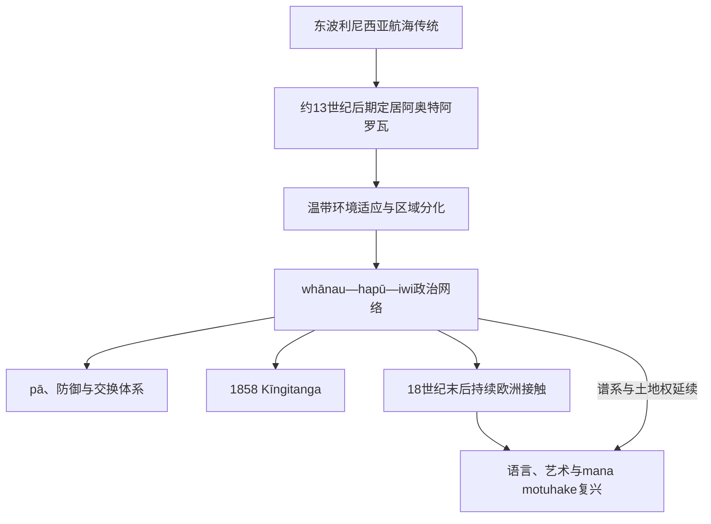

# 毛利人定居与社会

## 时间

约13世纪后期至今。早期定居的具体年代、航路和船队传统需结合考古、语言、遗传与各iwi口述史理解，不宜压缩成一次统一“发现”。

## 概括

毛利人是波利尼西亚航海者及其后代在阿奥特阿罗瓦形成的原住民族。定居者把热带园艺、航海和亲属知识调整到温带群岛：早期捕猎恐鸟等大型动物，随后发展以kūmara（甘薯）、渔业、鸟类、森林和储藏为基础的地区经济。whānau、hapū与iwi通过whakapapa（谱系）、mana（权威）、utu（互惠／平衡）和对whenua（土地）的责任组织政治。社会从来不是统一王国，1858年成立的Kīngitanga也只是多个政治联合中的一种。

## 演进图

## 定居与环境适应

最初航海者从东波利尼西亚携带甘薯、芋、葫芦、狗和鼠，北岛温暖地区较适合园艺，南岛和高纬地区则更依赖渔猎与季节移动。早期聚落利用沿海、河口和恐鸟资源；大型鸟类快速减少后，经济转向更精细的园艺、储藏、鳗鱼和海洋资源管理。森林焚烧、聚落迁移和物种变化显示人类对环境产生影响，但这种变化不能套用“生态崩溃导致文明灭亡”的单因模型。

绿色岩玉／pounamu、黑曜石、石材、食物和工艺品在两岛之间流通。waka航行、婚姻和谱系建立远距离联系；南北岛的不同生态与人口密度又造成方言、建筑、军事和季节节律差异。

## 社会与统治结构

| 概念／层级 | 功能 | 辨析 |
|---|---|---|
| whānau | 扩展家庭、生产与照护单位 | 不仅是西式核心家庭。 |
| hapū | 共享祖先与资源的亲属政治体 | 殖民前后常是土地、战争、外交和条约签署的关键层级。 |
| iwi | 由相关hapū构成的更大认同网络 | 在不同时期动员程度不同，并非固定中央政府。 |
| rangatira | 有谱系、能力与群体支持的领导者 | 权威受互惠、声望与集体关系约束。 |
| tohunga | 专门知识和仪式持有者 | 可涉及宗教、治疗、航海、工艺和历史。 |
| mana whenua | 对特定土地具有权威、责任与关系 | 不等同于单纯地主产权。 |
| pā | 防御聚落及政治经济中心 | 反映资源竞争、人口与战争技术，不代表社会永恒好战。 |

## 冲突、联盟与火器时代

接触前已有战争、和亲、移居与复仇循环。火枪、马铃薯和欧洲贸易在1800年代改变动员能力：马铃薯可支持远征，火枪采购又促使群体争夺港口贸易。约1807—1840年代的“火枪战争”造成大量死亡、迁移和领地重组，但并非纯粹由武器决定；旧有争端、商业路线、俘虏劳动和领导策略同样重要。各iwi通过获取武器、筑pā、结盟、撤迁或谈判作出不同回应。

## Kīngitanga的建立与世系

定居人口增长和土地出售压力促使多个iwi在1850年代讨论共同君主。1858年，具有广泛mana的Waikato领袖Pōtatau Te Wherowhero在Ngāruawāhia即位。运动的目标是团结土地与政治权威，并非复制欧洲绝对君主制。1863年王室军队入侵Waikato后，王运动退守Rohe Pōtae（“国王乡”），仍以会议、信仰、土地和象征政治维持组织。

八位毛利君主的完整顺序、亲属关系和关键事件见[新西兰总督、总理与毛利君主表](/%E4%BA%BA%E6%96%87%E7%A7%91%E5%AD%A6/%E5%8E%86%E5%8F%B2/%E5%A4%A7%E6%B4%8B%E6%B4%B2/%E6%96%B0%E8%A5%BF%E5%85%B0/%E6%96%B0%E8%A5%BF%E5%85%B0%E6%80%BB%E7%9D%A3%E3%80%81%E6%80%BB%E7%90%86%E4%B8%8E%E6%AF%9B%E5%88%A9%E5%90%9B%E4%B8%BB%E8%A1%A8.md)。现任Ngā Wai Hono i te Pō于2024年继承其父Tūheitia。Kīngitanga的世袭核心延续，但其政治权威来自参与共同体承认，不是国家宪法授予。

## 欧洲接触后的延续与转型

传教学校和印刷促进读写与基督教传播，毛利也将文字用于报纸、请愿和谱系。殖民战争、土地没收和土地法院削弱许多hapū的经济基础；城市化和同化教育进一步冲击语言。然而Rātana运动、毛利议会、部族信托、文化团体与政治代表保持组织连续性。20世纪后期kōhanga reo（语言巢）、kura kaupapa学校、毛利媒体和条约申索推动语言与治理复兴。

复兴不是“回到静止传统”，而是以现代法律、教育、企业和共同治理实践延续tino rangatiratanga与集体责任。

## 重要事件

| 时间 | 事件 | 影响 |
|---|---|---|
| 约13世纪后期 | 东波利尼西亚定居 | 开始形成阿奥特阿罗瓦独特社会。 |
| 约14—16世纪 | 经济由早期大型猎物转向园艺、渔猎与储藏 | 地区适应、人口与pā体系发展。 |
| 约1807—1840年代 | 火枪战争 | 迁徙、联盟与力量重组，不能简化为“欧洲征服前奏”。 |
| 1858年 | Pōtatau成为首位毛利国王 | Kīngitanga制度化。 |
| 1863—1864年 | Waikato战争与土地没收 | 王运动核心地区遭军事占领，退守国王乡。 |
| 1970年代以后 | 土地游行、语言运动与条约申索 | 毛利复兴进入国家法律与教育制度。 |

## 演变关系

- 欧洲接触与战争：[欧洲接触、怀唐伊条约与殖民战争](/%E4%BA%BA%E6%96%87%E7%A7%91%E5%AD%A6/%E5%8E%86%E5%8F%B2/%E5%A4%A7%E6%B4%8B%E6%B4%B2/%E6%96%B0%E8%A5%BF%E5%85%B0/%E6%AC%A7%E6%B4%B2%E6%8E%A5%E8%A7%A6%E3%80%81%E6%80%80%E5%94%90%E4%BC%8A%E6%9D%A1%E7%BA%A6%E4%B8%8E%E6%AE%96%E6%B0%91%E6%88%98%E4%BA%89.md)。
- 当代复兴：[战后新西兰与条约和解](/%E4%BA%BA%E6%96%87%E7%A7%91%E5%AD%A6/%E5%8E%86%E5%8F%B2/%E5%A4%A7%E6%B4%8B%E6%B4%B2/%E6%96%B0%E8%A5%BF%E5%85%B0/%E6%88%98%E5%90%8E%E6%96%B0%E8%A5%BF%E5%85%B0%E4%B8%8E%E6%9D%A1%E7%BA%A6%E5%92%8C%E8%A7%A3.md)。
- 海洋背景：[航海、定居与太平洋世界](/%E4%BA%BA%E6%96%87%E7%A7%91%E5%AD%A6/%E5%8E%86%E5%8F%B2/%E5%A4%A7%E6%B4%8B%E6%B4%B2/%E5%A4%AA%E5%B9%B3%E6%B4%8B%E5%B2%9B%E5%B1%BF/%E8%88%AA%E6%B5%B7%E3%80%81%E5%AE%9A%E5%B1%85%E4%B8%8E%E5%A4%AA%E5%B9%B3%E6%B4%8B%E4%B8%96%E7%95%8C.md)。
- 所属总览：[新西兰历史](/%E4%BA%BA%E6%96%87%E7%A7%91%E5%AD%A6/%E5%8E%86%E5%8F%B2/%E5%A4%A7%E6%B4%8B%E6%B4%B2/%E6%96%B0%E8%A5%BF%E5%85%B0/README.md)。
