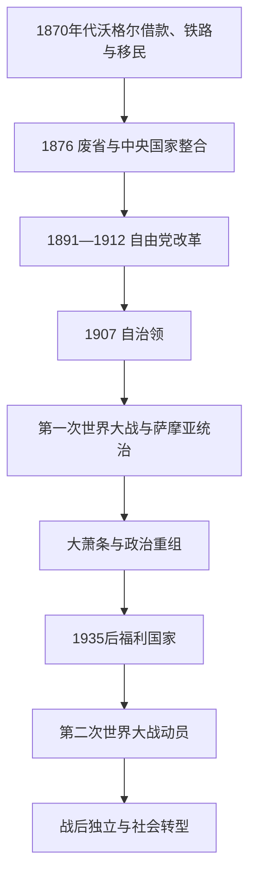

# 自治领、战争与福利国家

## 时间

1870年代—1945年。

## 概括

战争主要阶段结束后，移民、借款、铁路和冷藏航运把新西兰整合为向英国出口肉类、羊毛和乳品的定居殖民国家。自由党时代的土地、劳工、养老金和女性选举权改革建立“社会实验室”形象，但毛利土地持续流失，华人等群体受歧视。1907年自治领地位强化国家认同；第一次世界大战、对萨摩亚的占领、大萧条和第二次世界大战扩大中央政府能力，并促成1930年代福利国家。

## 演进图

## 国家整合与政治结构

1870年财政部长朱利叶斯·沃格尔提出以英国借款建设铁路、电报和移民计划，中央政府因此扩大。1876年省制废除，地方政府仍存在，但全国议会、官僚和公共工程成为主轴。责任政府已于1856年形成；总督越来越按部长建议行事，却继续代表帝国并处理对外与宪政事务。

完整总督和总理任期见[新西兰总督、总理与毛利君主表](/%E4%BA%BA%E6%96%87%E7%A7%91%E5%AD%A6/%E5%8E%86%E5%8F%B2/%E5%A4%A7%E6%B4%8B%E6%B4%B2/%E6%96%B0%E8%A5%BF%E5%85%B0/%E6%96%B0%E8%A5%BF%E5%85%B0%E6%80%BB%E7%9D%A3%E3%80%81%E6%80%BB%E7%90%86%E4%B8%8E%E6%AF%9B%E5%88%A9%E5%90%9B%E4%B8%BB%E8%A1%A8.md)。

| 力量 | 角色 | 局限 |
|---|---|---|
| 总督／总督-general | 王室代表、形式行政首脑 | 随自治发展，实际日常权力转向责任内阁。 |
| 总理与内阁 | 预算、土地、劳工、战争与外交决策核心 | 必须维持众议院信任。 |
| 两院议会 | 众议院民选；立法会任命 | 毛利有专门选区，但定居者人口和制度占优势。 |
| 工会与农场利益 | 塑造仲裁、工资、关税和出口政策 | 性别、种族与地区利益并不一致。 |
| iwi、hapū与毛利运动 | 土地、地方自治、请愿和宗教政治 | 土地法院、税债和政府收购持续压缩资源。 |

## 自由党改革与定居者国家

1891年自由党上台，约翰·巴兰斯、理查德·塞登和约瑟夫·沃德推动累进土地税、土地分割、劳资仲裁、老年养老金和公共工程。1893年女性获得议会选举权，源于凯特·谢泼德等妇女与禁酒组织长期动员；女性当时仍不能立即参选议员。1894年强制仲裁制度试图以国家调解避免罢工，形成“没有社会主义的国家干预”。

改革扩大定居者民主，却未平等覆盖所有人。人头税和入境限制针对华人；“家庭工资”以男性养家者为中心。原住民土地收购和法院分割继续，毛利议会运动、Kotahitanga、Kīngitanga和后来的Rātana则要求自治与条约救济。

1882年冷藏肉首次成功运往英国，乳品合作社和冷藏航运使小农出口扩张。对单一英国市场的依赖带来繁荣，也构成日后结构脆弱性。

## 自治领与第一次世界大战

1907年“新西兰自治领”称号取代殖民地称号，象征地位提高，但英国仍掌握可观法律和外交联系。1914年战争爆发后，新西兰占领德属萨摩亚，并在加里波利、西线和中东投入军队。1916年实行征兵；毛利参与受到部族历史立场影响，Waikato等地因土地没收记忆反对强制征兵。战争造成约1.8万人死亡，并强化ANZAC记忆。

战时对萨摩亚的行政判断产生长期后果。1918年流感由新西兰船只带入萨摩亚，在薄弱防疫下造成灾难性死亡。1920年代萨摩亚Mau非暴力运动反对新西兰统治；1929年“黑色星期六”警察开火并杀死重要领袖Tupua Tamasese Lealofi III。新西兰的“自治”因此与其自身殖民统治并存。

## 战间危机与福利国家兴起

1920年代农产品价格和英国贷款支撑增长，1929年后出口收入崩落、失业激增。福布斯—科茨联合政府以削支和工资调整应对，引发失业者抗议。危机削弱旧自由—改革阵营，1935年工党在迈克尔·约瑟夫·萨维奇领导下获胜。

首届工党政府恢复工资、建设国家住房、发展公共医疗并通过1938年《社会保障法》，建立更普遍的养老金、失业和医疗保障。福利制度的“普遍性”仍受到性别工资、毛利服务可及性和家庭模式限制，但国家责任显著扩大。

## 第二次世界大战

1939年新西兰对德宣战，部队在希腊、克里特、北非和意大利作战；日本南进后又承担太平洋防务。彼得·弗雷泽政府通过征兵、配给、价格管制和产业动员组织战争，并与毛利领导合作组建第28毛利营。美军驻扎加强新西兰与美国联系，但国家仍把英国视为主要文化和战略中心。

1942年新西兰批准采纳《威斯敏斯特法令》的讨论尚未完成；战争后才于1947年正式采纳。1945年阶段的直接结束来自战争终结与全球秩序变化：英国实力下降、联合国成立、萨摩亚去殖民化压力和国内城市化共同开启新阶段。

## 兴起、矛盾与转折原因

- **崛起机制**：英国资本与市场、冷藏技术、移民、土地开发和中央公共工程。
- **制度优势**：责任政府、广泛选举权、仲裁和福利建立相对稳定的阶级妥协。
- **结构代价**：毛利土地剥夺、殖民萨摩亚、种族排斥和对英出口依赖。
- **外部冲击**：战争与大萧条扩大国家干预，并暴露帝国安全和市场依赖。
- **直接转折**：1945年后去殖民化、人口城市化、宪政自主和新安全联盟使“英国农场式自治领”模式逐步退出。

## 演变关系

- 前一阶段：[欧洲接触、怀唐伊条约与殖民战争](/%E4%BA%BA%E6%96%87%E7%A7%91%E5%AD%A6/%E5%8E%86%E5%8F%B2/%E5%A4%A7%E6%B4%8B%E6%B4%B2/%E6%96%B0%E8%A5%BF%E5%85%B0/%E6%AC%A7%E6%B4%B2%E6%8E%A5%E8%A7%A6%E3%80%81%E6%80%80%E5%94%90%E4%BC%8A%E6%9D%A1%E7%BA%A6%E4%B8%8E%E6%AE%96%E6%B0%91%E6%88%98%E4%BA%89.md)。
- 后一阶段：[战后新西兰与条约和解](/%E4%BA%BA%E6%96%87%E7%A7%91%E5%AD%A6/%E5%8E%86%E5%8F%B2/%E5%A4%A7%E6%B4%8B%E6%B4%B2/%E6%96%B0%E8%A5%BF%E5%85%B0/%E6%88%98%E5%90%8E%E6%96%B0%E8%A5%BF%E5%85%B0%E4%B8%8E%E6%9D%A1%E7%BA%A6%E5%92%8C%E8%A7%A3.md)。
- 太平洋战争：[太平洋战争、托管与核试验](/%E4%BA%BA%E6%96%87%E7%A7%91%E5%AD%A6/%E5%8E%86%E5%8F%B2/%E5%A4%A7%E6%B4%8B%E6%B4%B2/%E5%A4%AA%E5%B9%B3%E6%B4%8B%E5%B2%9B%E5%B1%BF/%E5%A4%AA%E5%B9%B3%E6%B4%8B%E6%88%98%E4%BA%89%E3%80%81%E6%89%98%E7%AE%A1%E4%B8%8E%E6%A0%B8%E8%AF%95%E9%AA%8C.md)。
- 所属总览：[新西兰历史](/%E4%BA%BA%E6%96%87%E7%A7%91%E5%AD%A6/%E5%8E%86%E5%8F%B2/%E5%A4%A7%E6%B4%8B%E6%B4%B2/%E6%96%B0%E8%A5%BF%E5%85%B0/README.md)。
