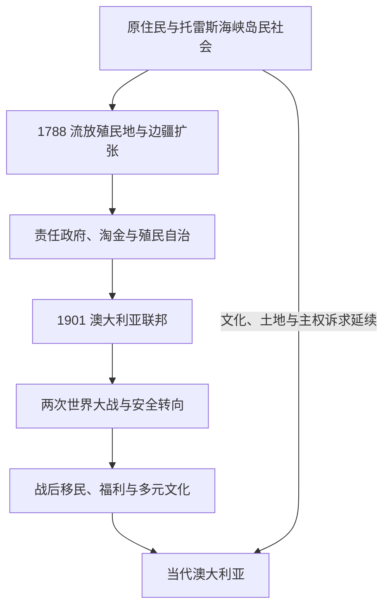

# 澳大利亚历史

## 历史主线

澳大利亚史不是从1788年开始。大陆原住民和托雷斯海峡岛民在不同生态区形成延续数万年的法律、亲属、语言、土地与海洋社会。1788年以后，英国以流放殖民地为起点建立定居殖民秩序；牧业、矿业和城市扩张与土地剥夺、边疆战争、疾病和强制同化同时发生。六个自治殖民地于1901年组成联邦，但国家的对外自主、国籍制度和宪法独立是在20世纪逐步完成的。两次世界大战、战后移民、白澳政策终结、原住民权利运动和亚太经济联系，最终塑造今日的联邦国家。

## 演进图

## 阶段导航

| 顺序 | 阶段 | 时间 | 本页职责 |
|---:|---|---|---|
| 1 | [原住民与托雷斯海峡岛民社会](/%E4%BA%BA%E6%96%87%E7%A7%91%E5%AD%A6/%E5%8E%86%E5%8F%B2/%E5%A4%A7%E6%B4%8B%E6%B4%B2/%E6%BE%B3%E5%A4%A7%E5%88%A9%E4%BA%9A/%E5%8E%9F%E4%BD%8F%E6%B0%91%E4%B8%8E%E6%89%98%E9%9B%B7%E6%96%AF%E6%B5%B7%E5%B3%A1%E5%B2%9B%E6%B0%91%E7%A4%BE%E4%BC%9A.md) | 至少约6.5万年前至今 | 土地与海洋社会、亲属和法律体系、殖民冲击、抵抗与复兴。 |
| 2 | [英国殖民地与殖民自治](/%E4%BA%BA%E6%96%87%E7%A7%91%E5%AD%A6/%E5%8E%86%E5%8F%B2/%E5%A4%A7%E6%B4%8B%E6%B4%B2/%E6%BE%B3%E5%A4%A7%E5%88%A9%E4%BA%9A/%E8%8B%B1%E5%9B%BD%E6%AE%96%E6%B0%91%E5%9C%B0%E4%B8%8E%E6%AE%96%E6%B0%91%E8%87%AA%E6%B2%BB.md) | 1788—1901年 | 六殖民地形成、边疆扩张、流放、淘金、责任政府与联邦化。 |
| 3 | [联邦、世界大战与战后社会](/%E4%BA%BA%E6%96%87%E7%A7%91%E5%AD%A6/%E5%8E%86%E5%8F%B2/%E5%A4%A7%E6%B4%8B%E6%B4%B2/%E6%BE%B3%E5%A4%A7%E5%88%A9%E4%BA%9A/%E8%81%94%E9%82%A6%E3%80%81%E4%B8%96%E7%95%8C%E5%A4%A7%E6%88%98%E4%B8%8E%E6%88%98%E5%90%8E%E7%A4%BE%E4%BC%9A.md) | 1901—1945年 | 联邦制度、白澳秩序、世界大战、大萧条与太平洋战略转向。 |
| 4 | [当代澳大利亚](/%E4%BA%BA%E6%96%87%E7%A7%91%E5%AD%A6/%E5%8E%86%E5%8F%B2/%E5%A4%A7%E6%B4%8B%E6%B4%B2/%E6%BE%B3%E5%A4%A7%E5%88%A9%E4%BA%9A/%E5%BD%93%E4%BB%A3%E6%BE%B3%E5%A4%A7%E5%88%A9%E4%BA%9A.md) | 1945年至今 | 大移民、多元文化、权利运动、经济重组、宪政与区域外交。 |
| 专表 | [澳大利亚总督与总理表](/%E4%BA%BA%E6%96%87%E7%A7%91%E5%AD%A6/%E5%8E%86%E5%8F%B2/%E5%A4%A7%E6%B4%8B%E6%B4%B2/%E6%BE%B3%E5%A4%A7%E5%88%A9%E4%BA%9A/%E6%BE%B3%E5%A4%A7%E5%88%A9%E4%BA%9A%E6%80%BB%E7%9D%A3%E4%B8%8E%E6%80%BB%E7%90%86%E8%A1%A8.md) | 1901年至今 | 完整列出联邦君主、总督和历届总理，复任与看守任期不合并。 |

## 重要转折与时间节点

| 时间 | 转折 | 长期意义 |
|---|---|---|
| 至少约6.5万年前 | 人类已在萨胡尔大陆活动 | 建立远早于欧洲殖民的历史尺度；具体年代仍随考古研究修订。 |
| 1788年 | 第一舰队抵达悉尼湾 | 新南威尔士流放殖民地建立，定居殖民扩张开始。 |
| 1850年代 | 淘金潮与责任政府 | 人口、资本与全球移民骤增，多个殖民地取得自治内阁。 |
| 1901年 | 六殖民地组成联邦 | 联邦掌握关税、移民和防务，州仍保留广泛权力。 |
| 1914—1918年 | 第一次世界大战 | 军事牺牲和征兵争论重塑国家政治与记忆。 |
| 1942年 | 新加坡陷落、达尔文遭空袭 | 安全依赖由英国显著转向美国，太平洋成为战略中心。 |
| 1967年 | 原住民相关宪法公投 | 扩大联邦处理原住民事务的宪法空间，但不是赋予公民权的单一时点。 |
| 1986年 | 《澳大利亚法》生效 | 终止英国议会对澳立法能力及残余司法联系。 |
| 1992—1993年 | 马博判决与原住民土地权法 | 推翻“无主地”在普通法中的基础，建立原住民土地权申索框架。 |
| 2023年 | “原住民之声”修宪公投未获通过 | 显示承认、代表机制与国家和解仍存在重大分歧。 |

## 政体与实际权力

澳大利亚是联邦议会民主制与君主立宪制国家。君主是形式国家元首，由总督在联邦层面代表；总督通常依总理和部长建议行使权力，但宪法保留权的边界在1975年危机中成为核心争议。总理不是宪法明文设定的职位，而是由能够维持众议院信任的政党或联盟领袖担任。六州各有州总督与责任政府；北领地、首都领地等自治领地的权力来源于联邦立法。

截至2026年7月14日，君主为查尔斯三世，总督为萨曼莎·莫斯廷，总理为安东尼·阿尔巴尼斯。完整在位与任期见[澳大利亚总督与总理表](/%E4%BA%BA%E6%96%87%E7%A7%91%E5%AD%A6/%E5%8E%86%E5%8F%B2/%E5%A4%A7%E6%B4%8B%E6%B4%B2/%E6%BE%B3%E5%A4%A7%E5%88%A9%E4%BA%9A/%E6%BE%B3%E5%A4%A7%E5%88%A9%E4%BA%9A%E6%80%BB%E7%9D%A3%E4%B8%8E%E6%80%BB%E7%90%86%E8%A1%A8.md)。

## 关键辨析

- 1901年是联邦成立日，不是澳大利亚所有宪政联系一次性断裂的“独立日”。
- “边疆”不是空地推进线，而是原住民国家与定居殖民权力长期冲突、谈判和共存的空间。
- 1967年公投没有“首次给予原住民投票权”；各州选举资格和联邦法律此前已有复杂变化。
- 澳大利亚原住民与托雷斯海峡岛民是不同但相互关联的原住民族群，不能混称为单一文化。

## 相关入口

- 上级：[大洋洲历史](/%E4%BA%BA%E6%96%87%E7%A7%91%E5%AD%A6/%E5%8E%86%E5%8F%B2/%E5%A4%A7%E6%B4%8B%E6%B4%B2/README.md)。
- 区域联系：[太平洋岛屿](/%E4%BA%BA%E6%96%87%E7%A7%91%E5%AD%A6/%E5%8E%86%E5%8F%B2/%E5%A4%A7%E6%B4%8B%E6%B4%B2/%E5%A4%AA%E5%B9%B3%E6%B4%8B%E5%B2%9B%E5%B1%BF/README.md)、[太平洋战争、托管与核试验](/%E4%BA%BA%E6%96%87%E7%A7%91%E5%AD%A6/%E5%8E%86%E5%8F%B2/%E5%A4%A7%E6%B4%8B%E6%B4%B2/%E5%A4%AA%E5%B9%B3%E6%B4%8B%E5%B2%9B%E5%B1%BF/%E5%A4%AA%E5%B9%B3%E6%B4%8B%E6%88%98%E4%BA%89%E3%80%81%E6%89%98%E7%AE%A1%E4%B8%8E%E6%A0%B8%E8%AF%95%E9%AA%8C.md)。
