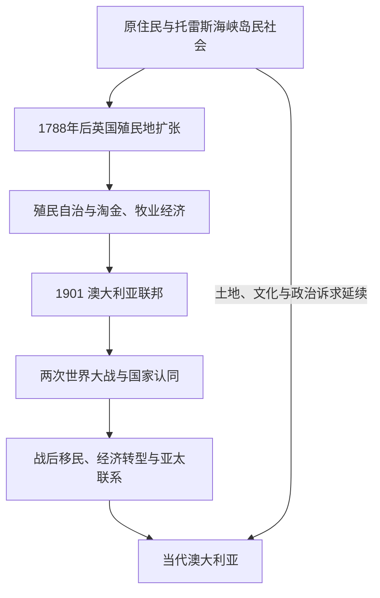

# 澳大利亚历史

## 历史主线

澳大利亚历史从原住民与托雷斯海峡岛民社会开始。1788年英国建立新南威尔士流放殖民地，定居殖民扩展伴随土地掠夺、边疆暴力和人口冲击；19世纪殖民地逐步取得自治，1901年六殖民地组成澳大利亚联邦。两次世界大战、战后移民、多元文化、原住民权利运动、经济全球化与亚太联系共同塑造现代澳大利亚。

## 演进图

## 阶段导航

| 顺序 | 阶段 | 时间 | 简要概括 |
|---:|---|---|---|
| 1 | [原住民与托雷斯海峡岛民社会](/%E4%BA%BA%E6%96%87%E7%A7%91%E5%AD%A6/%E5%8E%86%E5%8F%B2/%E5%A4%A7%E6%B4%8B%E6%B4%B2/%E6%BE%B3%E5%A4%A7%E5%88%A9%E4%BA%9A/%E5%8E%9F%E4%BD%8F%E6%B0%91%E4%B8%8E%E6%89%98%E9%9B%B7%E6%96%AF%E6%B5%B7%E5%B3%A1%E5%B2%9B%E6%B0%91%E7%A4%BE%E4%BC%9A.md) | 至少数万年前至今 | 多样的语言、土地和海洋社会，持续构成澳大利亚历史主体。 |
| 2 | [英国殖民地与殖民自治](/%E4%BA%BA%E6%96%87%E7%A7%91%E5%AD%A6/%E5%8E%86%E5%8F%B2/%E5%A4%A7%E6%B4%8B%E6%B4%B2/%E6%BE%B3%E5%A4%A7%E5%88%A9%E4%BA%9A/%E8%8B%B1%E5%9B%BD%E6%AE%96%E6%B0%91%E5%9C%B0%E4%B8%8E%E6%AE%96%E6%B0%91%E8%87%AA%E6%B2%BB.md) | 1788-1901年 | 流放殖民、边疆扩张、淘金、自治和联邦构想。 |
| 3 | [联邦、世界大战与战后社会](/%E4%BA%BA%E6%96%87%E7%A7%91%E5%AD%A6/%E5%8E%86%E5%8F%B2/%E5%A4%A7%E6%B4%8B%E6%B4%B2/%E6%BE%B3%E5%A4%A7%E5%88%A9%E4%BA%9A/%E8%81%94%E9%82%A6%E3%80%81%E4%B8%96%E7%95%8C%E5%A4%A7%E6%88%98%E4%B8%8E%E6%88%98%E5%90%8E%E7%A4%BE%E4%BC%9A.md) | 1901-1945年 | 联邦制度、白澳政策、世界大战与太平洋战略转向。 |
| 4 | [当代澳大利亚](/%E4%BA%BA%E6%96%87%E7%A7%91%E5%AD%A6/%E5%8E%86%E5%8F%B2/%E5%A4%A7%E6%B4%8B%E6%B4%B2/%E6%BE%B3%E5%A4%A7%E5%88%A9%E4%BA%9A/%E5%BD%93%E4%BB%A3%E6%BE%B3%E5%A4%A7%E5%88%A9%E4%BA%9A.md) | 1945年至今 | 移民、多元文化、原住民权利、宪政与区域外交。 |

## 政体结构

澳大利亚是联邦议会民主制和君主立宪制国家。君主由总督代表；总理和内阁须维持众议院信任；六州与领地政府在教育、警务、资源等领域拥有重要权力。联邦制度和与英国王室的宪政关系经历渐进变化，不能把1901年简单写成与英国完全切断的独立日期。

## 相关入口

- 上级：[大洋洲历史](/%E4%BA%BA%E6%96%87%E7%A7%91%E5%AD%A6/%E5%8E%86%E5%8F%B2/%E5%A4%A7%E6%B4%8B%E6%B4%B2/README.md)。
- 太平洋区域：[太平洋岛屿](/%E4%BA%BA%E6%96%87%E7%A7%91%E5%AD%A6/%E5%8E%86%E5%8F%B2/%E5%A4%A7%E6%B4%8B%E6%B4%B2/%E5%A4%AA%E5%B9%B3%E6%B4%8B%E5%B2%9B%E5%B1%BF/README.md)。
- 新西兰对照：[新西兰历史](/%E4%BA%BA%E6%96%87%E7%A7%91%E5%AD%A6/%E5%8E%86%E5%8F%B2/%E5%A4%A7%E6%B4%8B%E6%B4%B2/%E6%96%B0%E8%A5%BF%E5%85%B0/README.md)。
