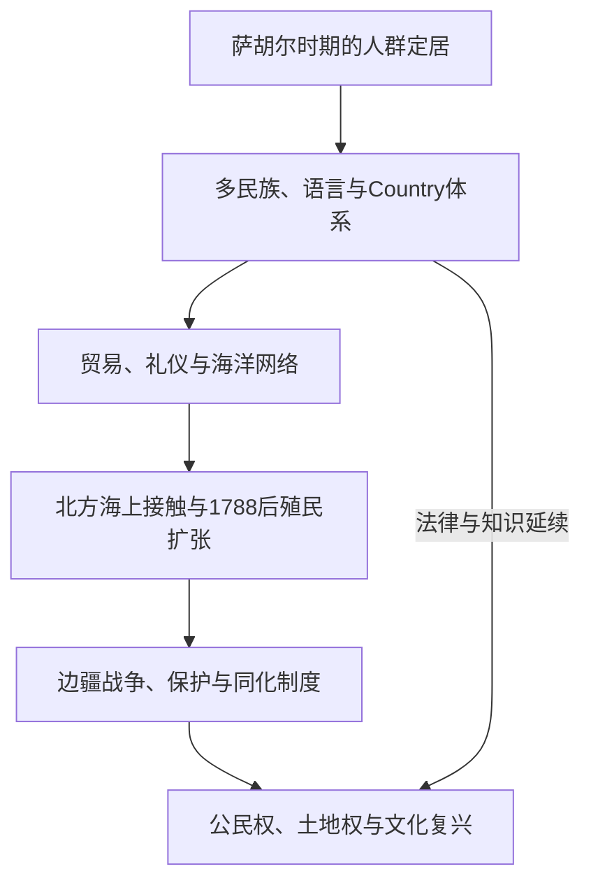

# 原住民与托雷斯海峡岛民社会

## 时间

至少约6.5万年前至今。最早定居年代、迁徙线路与不同地点的连续性仍需结合考古、古环境、语言材料和各族口述传统理解。

## 概括

澳大利亚原住民与托雷斯海峡岛民不是一个同质群体。大陆上存在数百个拥有各自语言、Country／土地—水域关系、法律、仪式与亲属制度的民族；托雷斯海峡岛民则在澳大利亚大陆与新几内亚之间建立海洋、园艺、贸易和岛际政治网络。殖民造成土地丧失、屠杀、疾病、劳役、儿童强制带离与制度性隔离，但没有终结原住民族的历史主体性。

## 历史演进图

## 环境、社会与政治机制

| 维度 | 机制与地区差异 |
|---|---|
| Country | 同时包含土地、水域、祖先、故事、责任和法律关系，不等同于可自由买卖的近代私产。 |
| 亲属制度 | 通过氏族、婚姻规则、图腾和代际义务配置资源、照护、仪式与政治责任；各地区体系不同。 |
| 生计与土地管理 | 狩猎、采集、渔业、块茎和种籽利用、火耕式景观管理、鱼坝及季节性迁移相结合，并非“被动依赖自然”。 |
| 交换网络 | 石斧、赭石、贝壳、珍珠贝、食物、歌曲与仪式沿大陆和海岸远距离流通。 |
| 托雷斯海峡 | 岛屿社会兼有园艺、渔猎、航海和与巴布亚海岸的交流；岛群内部语言与政治也有差异。 |
| 权威 | 长者、知识持有者与仪式责任人依具体事项形成权威，不宜强套中央集权王权模型。 |

## 殖民接触与抵抗过程

1. 1788年前，北澳部分群体已与望加锡海参捕捞者等保持海上贸易；欧洲船只也有零散接触。由此不能把第一舰队理解为大陆第一次进入外部网络。
2. 新南威尔士殖民者以“无主地”观念占用水源、猎场和路径。原住民的反击、袭击牲畜、外交和策略性合作构成边疆政治；彭穆威等人的抵抗只是众多地区案例之一。
3. 19世纪牧业和矿业向内陆、北部与西部推进，屠杀、报复、警察远征和强迫迁移反复发生。塔斯马尼亚的“黑线”行动、昆士兰土著骑警体系等显示暴力并非偶发私人冲突。
4. 传教站、保留地和“保护官”制度逐渐控制居住、工资、婚姻和儿童监护。各州法规不同，却共同把原住民置于不平等行政监管之下。
5. 19世纪末至20世纪中叶，同化政策和强制安置导致大量儿童离开家庭，后统称“被偷走的一代”。2008年联邦议会正式道歉，但赔偿、档案与家庭重建持续进行。
6. 原住民从未只被动承受：罢工、请愿、社团、法律诉讼、艺术和跨地区政治组织不断发展。1938年“哀悼日”、1966年古林吉人离岗斗争和1972年原住民帐篷使馆把权利议题推到全国政治中心。

## 权利转折

| 时间 | 事件 | 辨析与后果 |
|---|---|---|
| 1850年代以后 | 各殖民地／州选举法变化 | 部分原住民男性在若干殖民地理论上具资格，但行政排斥和后来的联邦限制使权利并不稳定。 |
| 1948—1949年 | 澳大利亚国籍与联邦选举法律调整 | 国籍制度从“英国臣民”逐渐转为澳大利亚公民；联邦投票资格仍经历后续改革。 |
| 1962年 | 联邦选举法扩大原住民登记投票 | 登记最初属自愿，不能把投票权全部归因于1967年公投。 |
| 1967年 | 修宪公投 | 删除人口统计排除，并允许联邦为原住民制定特别法律；以压倒性多数通过。 |
| 1976年 | 北领地《原住民土地权法》 | 建立法定土地申索机制，是土地权制度化的重要节点。 |
| 1992年 | 马博诉昆士兰州案（第二号） | 高等法院否定普通法中的“无主地”，承认原住民土地权可能延续。 |
| 1993年 | 《原住民土地权法》 | 规定申索、确认及与其他土地权益协调的全国框架。 |
| 2023年 | 原住民之声公投 | 建议设宪法承认的咨询机构，未取得全国多数与州多数。 |

## 延续、复兴与未决问题

语言巢、社区学校、原住民控制的医疗服务、护林员项目、艺术中心和土地理事会把文化延续与现代治理结合。法律承认并不等于完成和解：矿业许可、文化遗产保护、监禁率、儿童安置、健康与住房差距，以及是否通过条约、真相讲述或其他机制承认原住民主权，仍有结构性争议。托雷斯海峡低海拔岛屿还直接面对海平面上升对家园、墓地和文化权利的威胁。

## 演变关系

- 殖民扩张：[英国殖民地与殖民自治](/%E4%BA%BA%E6%96%87%E7%A7%91%E5%AD%A6/%E5%8E%86%E5%8F%B2/%E5%A4%A7%E6%B4%8B%E6%B4%B2/%E6%BE%B3%E5%A4%A7%E5%88%A9%E4%BA%9A/%E8%8B%B1%E5%9B%BD%E6%AE%96%E6%B0%91%E5%9C%B0%E4%B8%8E%E6%AE%96%E6%B0%91%E8%87%AA%E6%B2%BB.md)。
- 当代权利与宪政：[当代澳大利亚](/%E4%BA%BA%E6%96%87%E7%A7%91%E5%AD%A6/%E5%8E%86%E5%8F%B2/%E5%A4%A7%E6%B4%8B%E6%B4%B2/%E6%BE%B3%E5%A4%A7%E5%88%A9%E4%BA%9A/%E5%BD%93%E4%BB%A3%E6%BE%B3%E5%A4%A7%E5%88%A9%E4%BA%9A.md)。
- 海洋联系：[航海、定居与太平洋世界](/%E4%BA%BA%E6%96%87%E7%A7%91%E5%AD%A6/%E5%8E%86%E5%8F%B2/%E5%A4%A7%E6%B4%8B%E6%B4%B2/%E5%A4%AA%E5%B9%B3%E6%B4%8B%E5%B2%9B%E5%B1%BF/%E8%88%AA%E6%B5%B7%E3%80%81%E5%AE%9A%E5%B1%85%E4%B8%8E%E5%A4%AA%E5%B9%B3%E6%B4%8B%E4%B8%96%E7%95%8C.md)。
- 所属总览：[澳大利亚历史](/%E4%BA%BA%E6%96%87%E7%A7%91%E5%AD%A6/%E5%8E%86%E5%8F%B2/%E5%A4%A7%E6%B4%8B%E6%B4%B2/%E6%BE%B3%E5%A4%A7%E5%88%A9%E4%BA%9A/README.md)。
