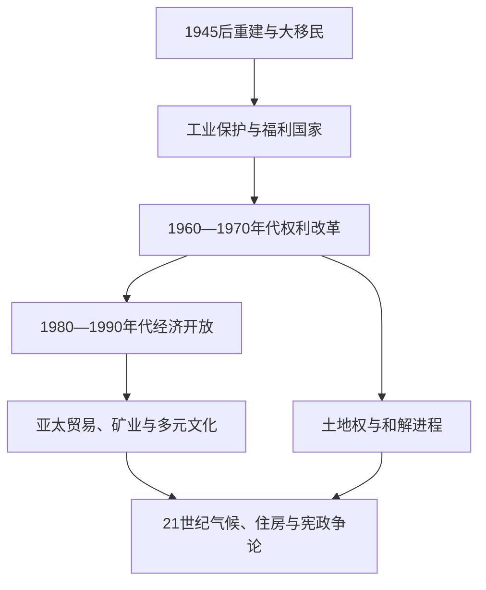

# 当代澳大利亚

## 时间

1945年至今；现任人物核验截至2026年7月14日。

## 概括

战后澳大利亚通过大规模移民、基础设施建设和制造业保护迅速扩张，随后在1970年代终结白澳政策并转向多元文化。1980年代以后的金融开放、浮动汇率、私有化与亚太贸易重组经济；矿业繁荣、服务业和移民支撑增长，也加剧住房、地区与代际差距。原住民权利从公民平等推进到土地权、真相讲述和制度承认，但2023年修宪公投失败说明国家和解仍未完成。

## 演进图

## 现行政体与实际权力

| 角色 | 截至2026-07-14 | 权力性质 |
|---|---|---|
| 君主 | 查尔斯三世（2022年至今） | 澳大利亚王位与英国王位由同一人担任，但法律上属于独立的澳大利亚王冠。 |
| 总督 | 萨曼莎·莫斯廷（2024年至今） | 行使形式行政权、任命总理和批准法律；通常依部长建议，保留权极少使用。 |
| 总理 | 安东尼·阿尔巴尼斯（2022年至今） | 工党领袖，掌握众议院信任并领导内阁；2025年联邦选举后组成第二届政府。 |
| 内阁 | 对众议院集体负责 | 决定行政、预算、外交与国家安全政策。 |
| 州与领地政府 | 六州、两个主要自治领地 | 在教育、医院、警务、交通与资源治理中权力显著。 |
| 高等法院 | 联邦最高司法机关 | 审查法律是否符合宪法并裁判联邦—州争议。 |

历届总督与总理完整顺序见[澳大利亚总督与总理表](/%E4%BA%BA%E6%96%87%E7%A7%91%E5%AD%A6/%E5%8E%86%E5%8F%B2/%E5%A4%A7%E6%B4%8B%E6%B4%B2/%E6%BE%B3%E5%A4%A7%E5%88%A9%E4%BA%9A/%E6%BE%B3%E5%A4%A7%E5%88%A9%E4%BA%9A%E6%80%BB%E7%9D%A3%E4%B8%8E%E6%80%BB%E7%90%86%E8%A1%A8.md)。

## 战后重建、移民与白澳政策终结

1945年后“人口增长或灭亡”的安全观推动辅助移民计划，大量英国人、南欧与东欧人进入；雪山水电工程等大型项目结合移民劳动、工业化和国家建设。对非欧洲移民的限制从1950年代逐步放宽，1966年改革削弱种族标准，惠特拉姆政府于1973年在政策层面完成白澳制度的终结。1975年《种族歧视法》提供全国法律保障，多元文化政策则承认移民社群保留语言与文化的正当性。

这些改革并非线性进步。越南战争后的难民、亚洲移民增加以及边境与庇护政策长期引发争议；离岸处理、临时签证和拘留制度体现人权义务、边境控制与政党竞争之间的冲突。

## 原住民权利与和解

1965年“自由乘车”揭示乡镇隔离；1966年古林吉人罢工把工资与土地权结合；1967年公投扩大联邦权限。1972年帐篷使馆和1976年北领地土地权法推动政治承认。1992年马博判决与1993年原住民土地权法否定“无主地”；1996年维克判决确认土地权可与牧场租约在一定条件下共存，随后引发限制性修法。

1991年皇家委员会报告关注原住民羁押死亡，1997年《带他们回家》报告记录儿童带离，2008年联邦道歉承认“被偷走的一代”。2017年《乌鲁鲁发自内心的声明》提出“声音、条约、真相”；2023年将咨询机构写入宪法的公投未获通过。失败没有终结州级条约、真相委员会、文化遗产与缩小差距政策的讨论。

## 宪政与政治转折

- **1975年宪政危机**：参议院延迟拨款后，总督约翰·克尔解除惠特拉姆总理职务并任命弗雷泽为看守总理。事件显示成文宪法、威斯敏斯特惯例与总督保留权之间的张力。
- **1986年《澳大利亚法》**：联邦、各州与英国配套立法终止英国议会为澳立法和向枢密院上诉的残余渠道。
- **1999年共和制公投**：选民否决由议会选出的总统取代君主方案；结果不能简单理解为对所有共和方案的永久否定。
- **选举与政党**：工党与自由党—国家党联盟长期主导，优先投票、强制投票和比例代表制参议院使小党与独立议员仍能影响立法。

## 经济转型与社会政策

1950—1960年代依靠关税保护、全就业和住房建设形成“战后共识”。1970年代石油危机、通胀和制造业竞争使旧模式失效。霍克—基廷政府浮动澳元、削减关税、放松金融、建立强制退休金并推进工资协定；霍华德政府实施商品及服务税、劳资关系改革与部分私有化。2008年金融危机后财政刺激避免严重衰退，2010年代资源出口与中国需求强化矿业依赖；新冠疫情又扩大边境管制、财政支出和联邦—州协调。

增长与高移民并存，住房供给、租金、基础设施和生产率成为21世纪核心矛盾。偏远地区、资源城镇与大都市获得的公共服务和就业机会差异明显。

## 外交、安全与太平洋关系

1951年《澳新美安全条约》标志美国同盟制度化；澳大利亚此后参加朝鲜、越南、阿富汗和伊拉克等战争。与亚洲的经贸和教育联系持续扩大，同时保持五眼联盟、美日印澳机制和英美澳安全合作。对太平洋岛国，澳大利亚提供援助、劳工流动和灾害响应，也因化石能源政策、区域安全主导和离岸难民处理受到批评。理解区域角色需同时看到安全贡献与权力不对称。

## 结构性挑战与阶段判断

- **国家能力来源**：稳定议会制度、自然资源、高移民、教育与亚太贸易。
- **长期脆弱性**：住房和生产率压力、资源周期、气候灾害、生态退化及原住民不平等。
- **直接政治触发**：火灾、洪水、疫情、生活成本和地缘竞争不断重排议程，但尚未构成政体断裂。
- **未决宪政问题**：共和国、原住民承认和联邦—州财政关系仍可能推动下一轮制度调整。

## 演变关系

- 前一阶段：[联邦、世界大战与战后社会](/%E4%BA%BA%E6%96%87%E7%A7%91%E5%AD%A6/%E5%8E%86%E5%8F%B2/%E5%A4%A7%E6%B4%8B%E6%B4%B2/%E6%BE%B3%E5%A4%A7%E5%88%A9%E4%BA%9A/%E8%81%94%E9%82%A6%E3%80%81%E4%B8%96%E7%95%8C%E5%A4%A7%E6%88%98%E4%B8%8E%E6%88%98%E5%90%8E%E7%A4%BE%E4%BC%9A.md)。
- 原住民主线：[原住民与托雷斯海峡岛民社会](/%E4%BA%BA%E6%96%87%E7%A7%91%E5%AD%A6/%E5%8E%86%E5%8F%B2/%E5%A4%A7%E6%B4%8B%E6%B4%B2/%E6%BE%B3%E5%A4%A7%E5%88%A9%E4%BA%9A/%E5%8E%9F%E4%BD%8F%E6%B0%91%E4%B8%8E%E6%89%98%E9%9B%B7%E6%96%AF%E6%B5%B7%E5%B3%A1%E5%B2%9B%E6%B0%91%E7%A4%BE%E4%BC%9A.md)。
- 区域合作：[独立国家、自治与区域合作](/%E4%BA%BA%E6%96%87%E7%A7%91%E5%AD%A6/%E5%8E%86%E5%8F%B2/%E5%A4%A7%E6%B4%8B%E6%B4%B2/%E5%A4%AA%E5%B9%B3%E6%B4%8B%E5%B2%9B%E5%B1%BF/%E7%8B%AC%E7%AB%8B%E5%9B%BD%E5%AE%B6%E3%80%81%E8%87%AA%E6%B2%BB%E4%B8%8E%E5%8C%BA%E5%9F%9F%E5%90%88%E4%BD%9C.md)。
- 所属总览：[澳大利亚历史](/%E4%BA%BA%E6%96%87%E7%A7%91%E5%AD%A6/%E5%8E%86%E5%8F%B2/%E5%A4%A7%E6%B4%8B%E6%B4%B2/%E6%BE%B3%E5%A4%A7%E5%88%A9%E4%BA%9A/README.md)。
