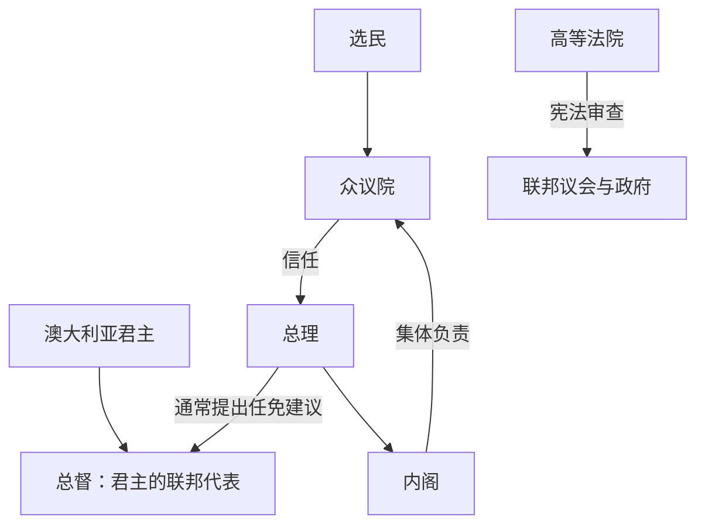

# 澳大利亚总督与总理表

## 时间与范围

1901年至今；现任人物核验截至2026年7月14日。本表按实际任期逐段列出，复任、看守政府和任内政党重组均不合并。

## 宪政关系图

## 澳大利亚君主

| 顺序 | 君主 | 澳大利亚在位 | 与前任关系 | 关键说明 |
|---:|---|---|---|---|
| 1 | 维多利亚 | 1901-01-01—1901-01-22 | 联邦成立时在位 | 在其统治末期联邦成立。 |
| 2 | 爱德华七世 | 1901—1910 | 维多利亚之子 | 联邦制度建立初期。 |
| 3 | 乔治五世 | 1910—1936 | 爱德华七世之子 | 一战、自治领地位发展。 |
| 4 | 爱德华八世 | 1936 | 乔治五世长子 | 退位危机；澳大利亚以本国法律处理王位变更。 |
| 5 | 乔治六世 | 1936—1952 | 爱德华八世之弟 | 二战与战后重建。 |
| 6 | 伊丽莎白二世 | 1952—2022 | 乔治六世长女 | “澳大利亚女王”称号制度化；1986年宪政联系进一步独立。 |
| 7 | **查尔斯三世** | 2022年至今 | 伊丽莎白二世长子 | 截至核验日的澳大利亚君主。 |

## 总督完整表

| 顺序 | 总督 | 任期 | 任命背景／关键事件 |
|---:|---|---|---|
| 1 | 霍普顿伯爵约翰·霍普 | 1901—1902 | 首任总督；“霍普顿失误”后任命巴顿组阁。 |
| 2 | 坦尼森勋爵哈勒姆·坦尼森 | 1903—1904 | 由南澳总督升任。 |
| 3 | 诺思科特勋爵亨利·诺思科特 | 1904—1908 | 早期政党不稳定时期。 |
| 4 | 达德利伯爵威廉·沃德 | 1908—1911 | 工党首次形成较稳定全国政府。 |
| 5 | 登曼勋爵托马斯·登曼 | 1911—1914 | 1913年堪培拉命名典礼。 |
| 6 | 罗纳德·门罗·弗格森 | 1914—1920 | 一战及征兵政治；帝国联系仍强。 |
| 7 | 亨利·福斯特 | 1920—1925 | 战后政治与布鲁斯政府。 |
| 8 | 斯通黑文勋爵约翰·贝尔德 | 1925—1930 | 1927年新议会大厦启用。 |
| 9 | **艾萨克·艾萨克斯** | 1931—1936 | 首位澳大利亚出生的总督。 |
| 10 | 高里勋爵亚历山大·霍尔-鲁思文 | 1936—1945 | 任期最长；大萧条后期与二战。 |
| 11 | 格洛斯特公爵亨利王子 | 1945—1947 | 王室成员，战后过渡。 |
| 12 | **威廉·麦凯尔** | 1947—1953 | 首位曾任澳大利亚政党政治家的总督。 |
| 13 | 威廉·斯利姆 | 1953—1960 | 二战名将，孟席斯长期执政期。 |
| 14 | 邓罗西尔勋爵威廉·莫里森 | 1960—1961 | 任内去世。 |
| 15 | 德利尔勋爵威廉·西德尼 | 1961—1965 | 战后社会转型期。 |
| 16 | 理查德·凯西 | 1965—1969 | 澳大利亚外交家和前部长。 |
| 17 | 保罗·哈斯勒克 | 1969—1974 | 原部长；惠特拉姆政府上台。 |
| 18 | **约翰·克尔** | 1974—1977 | 1975年解除惠特拉姆职务，引发持续宪政争议。 |
| 19 | 泽尔曼·考恩 | 1977—1982 | 在危机后重建职位公共信誉。 |
| 20 | 尼尼安·斯蒂芬 | 1982—1989 | 前高等法院法官；《澳大利亚法》时期。 |
| 21 | 比尔·海登 | 1989—1996 | 前工党领袖和外长。 |
| 22 | 威廉·迪恩 | 1996—2001 | 强调和解与社会包容。 |
| 23 | 彼得·霍林沃思 | 2001—2003 | 因处理教会性侵争议辞职。 |
| 24 | 迈克尔·杰弗里 | 2003—2008 | 前军官、西澳总督。 |
| 25 | 昆廷·布赖斯 | 2008—2014 | 首位女性总督。 |
| 26 | 彼得·科斯格罗夫 | 2014—2019 | 前国防军司令。 |
| 27 | 戴维·赫尔利 | 2019—2024 | 疫情与多次部长任命争议时期。 |
| 28 | **萨曼莎·莫斯廷** | 2024年至今 | 截至核验日的总督。 |

## 总理完整任期表

| 任次 | 总理 | 政党／政治阵营 | 任期 | 上台与离任要点 |
|---:|---|---|---|---|
| 1 | **埃德蒙·巴顿** | 保护主义 | 1901—1903 | 联邦首任；离任转任高等法院。 |
| 2 | 阿尔弗雷德·迪金 | 保护主义 | 1903—1904 | 失去议会支持。 |
| 3 | 克里斯·沃森 | 工党 | 1904 | 世界早期全国工党政府之一；信任不足下台。 |
| 4 | 乔治·里德 | 自由贸易 | 1904—1905 | 联盟支持瓦解。 |
| 5 | 阿尔弗雷德·迪金 | 保护主义 | 1905—1908 | 第二次执政；工党撤回支持。 |
| 6 | 安德鲁·费希尔 | 工党 | 1908—1909 | 首次执政；迪金阵营融合后失去多数。 |
| 7 | 阿尔弗雷德·迪金 | 联邦自由党 | 1909—1910 | 第三次执政；1910年选举败北。 |
| 8 | 安德鲁·费希尔 | 工党 | 1910—1913 | 第二次执政；实施全国改革，选举失利。 |
| 9 | 约瑟夫·库克 | 联邦自由党 | 1913—1914 | 双重解散选举后败北。 |
| 10 | 安德鲁·费希尔 | 工党 | 1914—1915 | 第三次执政；一战中辞职。 |
| 11 | **比利·休斯** | 工党→国家工党→民族党 | 1915—1923 | 征兵分裂后重组阵营；乡村党撤回支持而离任。 |
| 12 | 斯坦利·布鲁斯 | 民族党 | 1923—1929 | 与乡村党联盟；劳资政策导致选举失败。 |
| 13 | 詹姆斯·斯卡林 | 工党 | 1929—1932 | 大萧条与党内分裂，选举败北。 |
| 14 | 约瑟夫·莱昂斯 | 统一澳大利亚党 | 1932—1939 | 任内去世。 |
| 15 | 厄尔·佩奇 | 乡村党 | 1939 | 看守，等待联合政府选出新领袖。 |
| 16 | 罗伯特·孟席斯 | 统一澳大利亚党 | 1939—1941 | 战时联合支持流失而辞职。 |
| 17 | 阿瑟·法登 | 乡村党 | 1941 | 预算案失去议会支持。 |
| 18 | **约翰·柯廷** | 工党 | 1941—1945 | 太平洋战争领导人；任内去世。 |
| 19 | 弗兰克·福德 | 工党 | 1945 | 看守8天，等待工党选举领袖。 |
| 20 | 本·奇夫利 | 工党 | 1945—1949 | 战后重建；1949年选举失败。 |
| 21 | **罗伯特·孟席斯** | 自由党 | 1949—1966 | 第二次执政，任期最长；自愿退休。 |
| 22 | 哈罗德·霍尔特 | 自由党 | 1966—1967 | 游泳失踪，推定死亡。 |
| 23 | 约翰·麦克尤恩 | 乡村党 | 1967—1968 | 看守，等待自由党选举领袖。 |
| 24 | 约翰·戈顿 | 自由党 | 1968—1971 | 党内信任票僵局后辞职。 |
| 25 | 威廉·麦克马洪 | 自由党 | 1971—1972 | 选举败于工党。 |
| 26 | 高夫·惠特拉姆 | 工党 | 1972—1975 | 改革政府；被总督解除职务。 |
| 27 | 马尔科姆·弗雷泽 | 自由党 | 1975—1983 | 先任看守、后赢得选举；1983年败北。 |
| 28 | 鲍勃·霍克 | 工党 | 1983—1991 | 经济改革；党内挑战失利。 |
| 29 | 保罗·基廷 | 工党 | 1991—1996 | 深化开放与亚太外交；选举失败。 |
| 30 | 约翰·霍华德 | 自由党 | 1996—2007 | 长期联盟政府；本人及政府在选举中败北。 |
| 31 | 凯文·陆克文 | 工党 | 2007—2010 | 党内支持崩落，被吉拉德取代。 |
| 32 | 朱莉娅·吉拉德 | 工党 | 2010—2013 | 首位女性总理；党内投票败给陆克文。 |
| 33 | 凯文·陆克文 | 工党 | 2013 | 第二次执政；选举败北。 |
| 34 | 托尼·阿博特 | 自由党 | 2013—2015 | 党内挑战败给特恩布尔。 |
| 35 | 马尔科姆·特恩布尔 | 自由党 | 2015—2018 | 党内领导危机后失去职位。 |
| 36 | 斯科特·莫里森 | 自由党 | 2018—2022 | 疫情时期执政；2022年选举败北。 |
| 37 | **安东尼·阿尔巴尼斯** | 工党 | 2022年至今 | 2025年赢得连任；截至核验日仍在任。 |

## 继任与保留权辨析

总理职位依议会惯例产生：君主任命的是能够维持众议院信任者。佩奇、福德和麦克尤恩属于在执政党选出新领袖前的看守总理，仍应列为正式任期。1975年弗雷泽先由总督任命为看守总理，随后通过选举取得授权。多次执政的迪金、费希尔、孟席斯和陆克文必须按每段任期分别列出。

## 相关笔记

- 政体阶段：[联邦、世界大战与战后社会](/%E4%BA%BA%E6%96%87%E7%A7%91%E5%AD%A6/%E5%8E%86%E5%8F%B2/%E5%A4%A7%E6%B4%8B%E6%B4%B2/%E6%BE%B3%E5%A4%A7%E5%88%A9%E4%BA%9A/%E8%81%94%E9%82%A6%E3%80%81%E4%B8%96%E7%95%8C%E5%A4%A7%E6%88%98%E4%B8%8E%E6%88%98%E5%90%8E%E7%A4%BE%E4%BC%9A.md)、[当代澳大利亚](/%E4%BA%BA%E6%96%87%E7%A7%91%E5%AD%A6/%E5%8E%86%E5%8F%B2/%E5%A4%A7%E6%B4%8B%E6%B4%B2/%E6%BE%B3%E5%A4%A7%E5%88%A9%E4%BA%9A/%E5%BD%93%E4%BB%A3%E6%BE%B3%E5%A4%A7%E5%88%A9%E4%BA%9A.md)。
- 总览：[澳大利亚历史](/%E4%BA%BA%E6%96%87%E7%A7%91%E5%AD%A6/%E5%8E%86%E5%8F%B2/%E5%A4%A7%E6%B4%8B%E6%B4%B2/%E6%BE%B3%E5%A4%A7%E5%88%A9%E4%BA%9A/README.md)。
