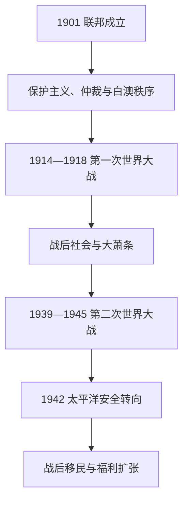

# 联邦、世界大战与战后社会

## 时间

1901—1945年。

## 概括

联邦初期的澳大利亚把六州统一到共同关税、移民和防务框架中，并以工资仲裁、贸易保护和“白澳政策”建构定居者福利国家。国家仍深嵌英帝国，却在第一次世界大战的巨大伤亡、战间经济危机和第二次世界大战的亚洲战场中逐步形成独立决策能力。1942年前后，英国无力保证澳洲安全，美国成为主要军事伙伴；这一转向为战后外交和社会重建奠定基础。

## 演进图

## 联邦统治结构

| 角色 | 制度位置 | 实际运作 |
|---|---|---|
| 君主 | 共同体形式元首 | 此期先后为维多利亚、爱德华七世、乔治五世、爱德华八世、乔治六世。 |
| 总督 | 君主任命的联邦代表 | 早期兼具帝国联络角色；随自治惯例发展，逐渐主要依据澳洲部长建议行事。 |
| 总理与内阁 | 获众议院信任的政府核心 | 掌握联邦行政、预算、战争动员和对外政策；完整任期见专表。 |
| 联邦议会 | 众议院与参议院 | 众院体现人口，参院使六州平等代表；共同制定联邦法律。 |
| 州政府 | 原六殖民地政府延续 | 继续负责教育、土地、警务、卫生等大量事务。 |
| 高等法院 | 1903年建立 | 解释联邦—州权限，逐步形成独立宪法法秩序。 |

完整总督和总理顺序见[澳大利亚总督与总理表](/%E4%BA%BA%E6%96%87%E7%A7%91%E5%AD%A6/%E5%8E%86%E5%8F%B2/%E5%A4%A7%E6%B4%8B%E6%B4%B2/%E6%BE%B3%E5%A4%A7%E5%88%A9%E4%BA%9A/%E6%BE%B3%E5%A4%A7%E5%88%A9%E4%BA%9A%E6%80%BB%E7%9D%A3%E4%B8%8E%E6%80%BB%E7%90%86%E8%A1%A8.md)。

## 早期联邦秩序

1901年首届议会迅速通过移民限制和太平洋岛民劳工相关法律，以听写测试等手段排除非欧洲移民并遣返大批南海岛民。白澳政策既是种族国家工程，也与工会保护“白人工资”和定居者人口政策结合。1904年建立联邦工资仲裁制度，1907年“哈维斯特判决”提出男性养家者“基本工资”理念；但原住民、女性和许多非白人劳动者并未平等分享福利。

早期政党体系由保护主义者、自由贸易者和工党竞争，1909年前后自由主义势力融合，工党也成长为全国执政党。联邦通过统一关税、邮政、防务和首都建设增强国家能力，1911年取得联邦首都领地，1927年议会迁至堪培拉。

## 第一次世界大战

1914年澳大利亚随英国参战，并夺取德属新几内亚。澳新军团在加里波利、西线和中东作战，死亡与伤残规模深刻改变家庭和公共记忆。1916、1917年两次征兵公投均失败，工党因总理休斯支持征兵而分裂。战争扩大联邦财政和行政能力，也加剧反德情绪、工运压制和爱尔兰裔天主教群体的政治对立。

战后，澳大利亚以自治领身份参加巴黎和会，获得德属新几内亚委任统治，并成为国际联盟成员。它仍把英帝国视为安全框架，却已在太平洋拥有自身殖民行政责任。

## 战间期、大萧条与社会调整

1920年代依靠英国资本和农矿出口增长，城市化、汽车与大众文化扩展，但外债和商品价格使经济脆弱。1929年后出口与信贷骤降，失业率大幅上升。联邦与州围绕削支、货币和偿债争论，1931年工党分裂，斯卡林政府下台。保守派莱昂斯政府通过紧缩、货币调整和外部复苏稳定财政，社会代价却集中于工人和失业者。

1931年《威斯敏斯特法令》承认自治领立法平等；澳大利亚直到1942年才追溯采纳至1939年，反映对帝国联系的长期依赖而非自动独立。

## 第二次世界大战与战略转折

1939年孟席斯政府宣布参战，澳军先在欧洲、北非和地中海作战。1941年柯廷出任总理；日本袭击珍珠港、新加坡陷落和1942年达尔文空袭暴露英国防务承诺的局限。澳军从中东调回，并在科科达小径、新几内亚和西南太平洋作战。美国麦克阿瑟将总部设在澳大利亚，军事、工业与外交关系由此显著转向美国。

战争实行配给、价格与工资管制，扩大女性就业和联邦所得税权。原住民和托雷斯海峡岛民以军人、劳工和侦察者参与战争，却仍受工资与公民权歧视。1942年妇女辅助军种和1943年联邦福利立法显示战时国家能力为战后重建创造制度条件。

## 阶段兴起、危机与终结原因

- **结构动力**：统一市场、贸易保护、工资仲裁和英帝国资本支撑早期联邦稳定。
- **内部矛盾**：种族排斥、联邦—州财政冲突、阶级与性别不平等，使“社会实验”只覆盖部分人口。
- **外部压力**：两次世界大战和大萧条迫使联邦扩大征税、动员和社会政策。
- **直接转折**：1945年战争结束后，安全重心、人口政策和经济规划已改变；澳大利亚进入大规模移民、工业化与多元文化逐步形成的新阶段。

## 演变关系

- 前一阶段：[英国殖民地与殖民自治](/%E4%BA%BA%E6%96%87%E7%A7%91%E5%AD%A6/%E5%8E%86%E5%8F%B2/%E5%A4%A7%E6%B4%8B%E6%B4%B2/%E6%BE%B3%E5%A4%A7%E5%88%A9%E4%BA%9A/%E8%8B%B1%E5%9B%BD%E6%AE%96%E6%B0%91%E5%9C%B0%E4%B8%8E%E6%AE%96%E6%B0%91%E8%87%AA%E6%B2%BB.md)。
- 后一阶段：[当代澳大利亚](/%E4%BA%BA%E6%96%87%E7%A7%91%E5%AD%A6/%E5%8E%86%E5%8F%B2/%E5%A4%A7%E6%B4%8B%E6%B4%B2/%E6%BE%B3%E5%A4%A7%E5%88%A9%E4%BA%9A/%E5%BD%93%E4%BB%A3%E6%BE%B3%E5%A4%A7%E5%88%A9%E4%BA%9A.md)。
- 区域战场：[太平洋战争、托管与核试验](/%E4%BA%BA%E6%96%87%E7%A7%91%E5%AD%A6/%E5%8E%86%E5%8F%B2/%E5%A4%A7%E6%B4%8B%E6%B4%B2/%E5%A4%AA%E5%B9%B3%E6%B4%8B%E5%B2%9B%E5%B1%BF/%E5%A4%AA%E5%B9%B3%E6%B4%8B%E6%88%98%E4%BA%89%E3%80%81%E6%89%98%E7%AE%A1%E4%B8%8E%E6%A0%B8%E8%AF%95%E9%AA%8C.md)。
- 所属总览：[澳大利亚历史](/%E4%BA%BA%E6%96%87%E7%A7%91%E5%AD%A6/%E5%8E%86%E5%8F%B2/%E5%A4%A7%E6%B4%8B%E6%B4%B2/%E6%BE%B3%E5%A4%A7%E5%88%A9%E4%BA%9A/README.md)。
