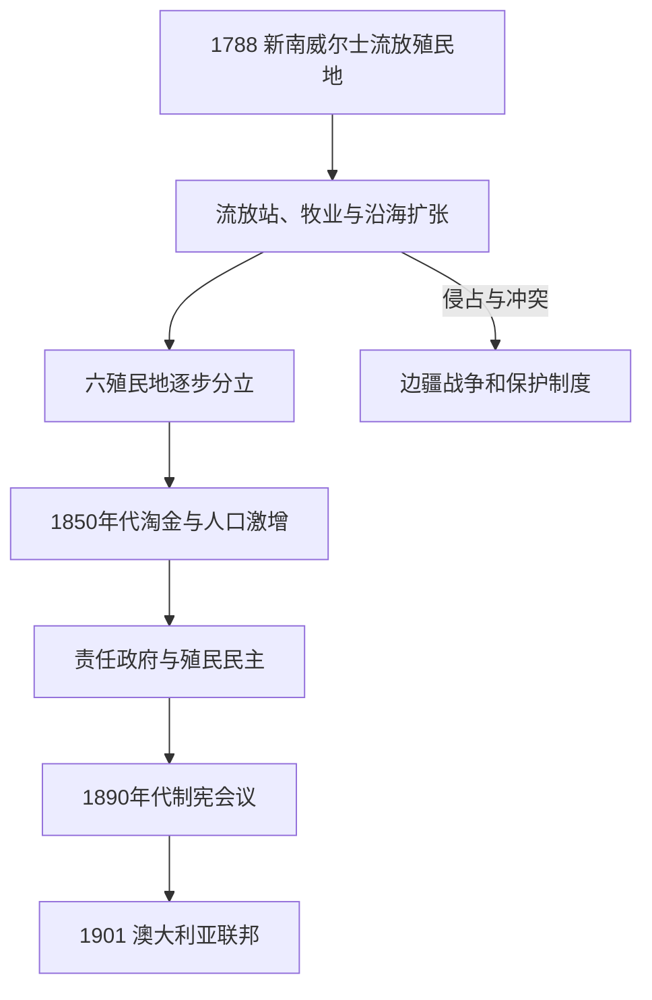

# 英国殖民地与殖民自治

## 时间

1788—1901年。

## 概括

英国以新南威尔士流放殖民地为起点，将分散港口、牧场、矿区和自治城市扩展为六个殖民地。这个过程的动力来自囚犯劳役、羊毛出口、土地投机、淘金与全球移民；其代价包括对原住民土地的占领、边疆战争和种族化法律。19世纪中叶以后，责任政府把日常行政权移交给定居者内阁，但伦敦仍控制帝国外交并保留宪政监督。联邦运动最终以1900年英国法案和1901年联邦成立告终。

## 演进图

## 六殖民地形成与行政结构

| 殖民地 | 建立／分立过程 | 责任政府 | 1901年前的政治特点 |
|---|---|---:|---|
| 新南威尔士 | 1788年建立；初辖范围很广 | 1856年 | 最早的流放与总督统治中心，后成为人口与金融重地。 |
| 塔斯马尼亚（原范迪门地） | 1803年设点，1825年与新南威尔士分立，1856年改名 | 1856年 | 流放制度密集；“黑色战争”与原住民强制迁移造成灾难。 |
| 西澳大利亚 | 1829年天鹅河殖民地建立，后引入囚犯 | 1890年 | 地广人稀、开发缓慢，淘金后人口增长。 |
| 南澳大利亚 | 1836年按“系统殖民”方案建立，不以流放为起点 | 1857年 | 土地销售融资移民，较早形成议会改革与宗教多元。 |
| 维多利亚 | 1830年代定居扩张，1851年从新南威尔士分立 | 1855年 | 淘金中心；尤里卡事件与广泛男性选举权推动民主化。 |
| 昆士兰 | 1824年莫顿湾流放点，1859年从新南威尔士分立 | 1859年 | 牧业、糖业和南海岛民劳工制度突出，边疆暴力延续较晚。 |

早期总督兼任军事、司法和土地行政首脑，权力受殖民部指令约束。1820年代后立法会议逐步出现；责任政府建立后，总督原则上依能够获得下院支持的殖民部长行事。原住民政治共同体既没有被视为平等缔约者，也未在殖民议会中获得与土地损失相称的权力。

## 扩张过程与重要事件

### 流放、自由移民与牧业

1788—1868年，英国向澳洲各殖民地运送约16万名囚犯。囚犯劳动修建道路、农场和公共设施，获释者与自由移民共同形成殖民社会。19世纪初羊毛出口和“擅自占地者”牧场推动内陆扩张；水源与草场占用直接冲击原住民生计，殖民警察、地方武装和原住民抵抗使边疆冲突持续数代。

### 土地、法律与边疆战争

英国法宣称主权，却没有与大陆各民族缔结普遍土地条约。1835年约翰·巴特曼与库林人所作土地协议很快被殖民政府否定，强化王室垄断土地取得的立场。殖民地以许可、测量和私有产权覆盖原有Country关系；暴力冲突、屠杀和粮源破坏与疾病共同造成人口锐减。19世纪后期，“保护”制度又把幸存者集中到传教站和保留地。

### 淘金、社会冲突与民主化

1851年新南威尔士、维多利亚发现金矿，引来英国、爱尔兰、中国、欧洲和美洲移民。矿工许可证、警察执法和政治代表问题在1854年尤里卡栅栏事件中爆发。事件军事上迅速失败，却促进矿权改革和议会代表。与此同时，排华税、登陆限制与反华暴力把种族排斥制度化，并为联邦初年的白澳政策提供先例。

### 劳工与全球网络

昆士兰糖业从1860年代起招募大量南海岛民，其中既有契约，也有欺骗和强迫性质的“黑鸟掠工”。阿富汗、印度和今巴基斯坦地区的驼队人员维持内陆运输；华人矿工、商人和菜农构成多个殖民地经济的一部分。所谓“英国澳大利亚”从一开始就是受全球劳工和商品网络塑造的社会。

## 联邦为何兴起

| 因素 | 作用 |
|---|---|
| 关税与市场 | 殖民地间关卡和铁路标准阻碍统一市场，企业和政治家要求协调。 |
| 防务与帝国战略 | 德、法在太平洋扩张及俄国威胁想象推动共同防务。 |
| 移民排斥 | 各殖民地希望以统一联邦权力实施种族化边境控制。 |
| 民主政治 | 1890年代制宪会议与公投为新宪法赋予定居者选民授权。 |
| 障碍 | 殖民地利益、参议院代表、财政分配和新南威尔士疑虑多次拖延进程。 |

1891年宪法草案未立即成功；1897—1898年经选举产生的制宪会议修订文本，多数殖民地经公投同意。英国议会通过《1900年澳大利亚联邦宪法法》，六殖民地于1901年1月1日成为六州。联邦是自治殖民地的联合而非共和国建国，也没有取得原住民的普遍同意。

## 兴起条件、局限与阶段终结

殖民国家崛起依靠英国海军与资本、囚犯和移民劳力、羊毛与黄金出口、土地制度和自治议会。其内部矛盾则包括经济危机、劳资冲突、殖民地关税竞争、排外政治与持续边疆暴力。1901年阶段终结的直接机制不是殖民政府崩溃，而是六殖民地通过联邦宪法将部分主权移交给新联邦；殖民地转为州，仍保留大量法律和行政权。

## 演变关系

- 被殖民社会：[原住民与托雷斯海峡岛民社会](/%E4%BA%BA%E6%96%87%E7%A7%91%E5%AD%A6/%E5%8E%86%E5%8F%B2/%E5%A4%A7%E6%B4%8B%E6%B4%B2/%E6%BE%B3%E5%A4%A7%E5%88%A9%E4%BA%9A/%E5%8E%9F%E4%BD%8F%E6%B0%91%E4%B8%8E%E6%89%98%E9%9B%B7%E6%96%AF%E6%B5%B7%E5%B3%A1%E5%B2%9B%E6%B0%91%E7%A4%BE%E4%BC%9A.md)。
- 后一阶段：[联邦、世界大战与战后社会](/%E4%BA%BA%E6%96%87%E7%A7%91%E5%AD%A6/%E5%8E%86%E5%8F%B2/%E5%A4%A7%E6%B4%8B%E6%B4%B2/%E6%BE%B3%E5%A4%A7%E5%88%A9%E4%BA%9A/%E8%81%94%E9%82%A6%E3%80%81%E4%B8%96%E7%95%8C%E5%A4%A7%E6%88%98%E4%B8%8E%E6%88%98%E5%90%8E%E7%A4%BE%E4%BC%9A.md)。
- 完整联邦领导表：[澳大利亚总督与总理表](/%E4%BA%BA%E6%96%87%E7%A7%91%E5%AD%A6/%E5%8E%86%E5%8F%B2/%E5%A4%A7%E6%B4%8B%E6%B4%B2/%E6%BE%B3%E5%A4%A7%E5%88%A9%E4%BA%9A/%E6%BE%B3%E5%A4%A7%E5%88%A9%E4%BA%9A%E6%80%BB%E7%9D%A3%E4%B8%8E%E6%80%BB%E7%90%86%E8%A1%A8.md)。
- 所属总览：[澳大利亚历史](/%E4%BA%BA%E6%96%87%E7%A7%91%E5%AD%A6/%E5%8E%86%E5%8F%B2/%E5%A4%A7%E6%B4%8B%E6%B4%B2/%E6%BE%B3%E5%A4%A7%E5%88%A9%E4%BA%9A/README.md)。
