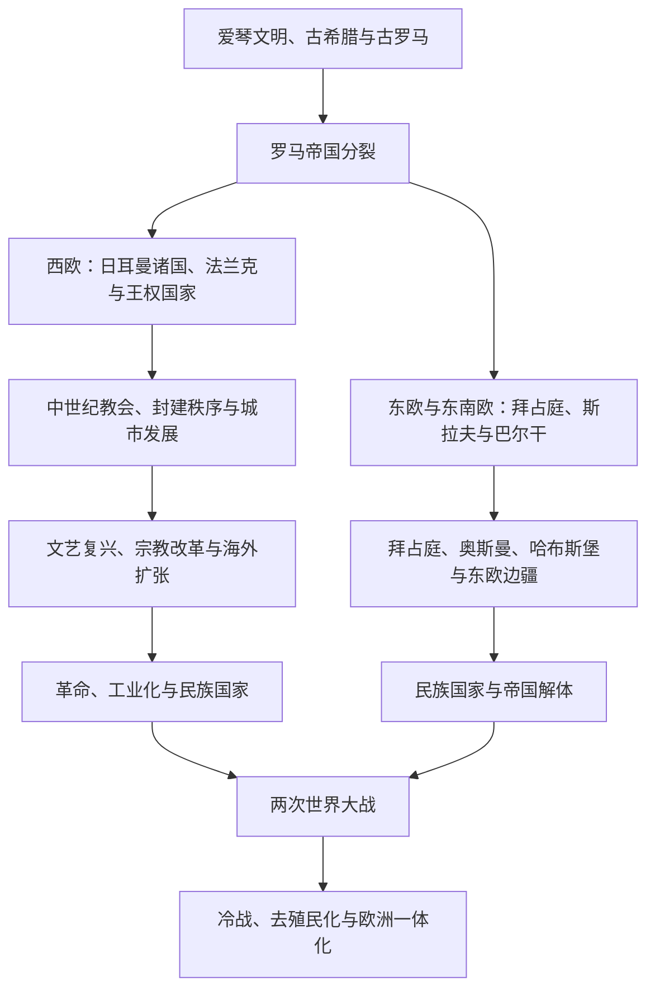

# 欧洲历史

## 概括

欧洲历史由地中海古典世界、西欧与中欧的王权和帝国、东欧与巴尔干的多族群政治、北海—波罗的海网络以及近代海外扩张共同构成。本目录按“欧洲通史 + 历史区域 + 国家”组织：跨越现代边界的共同阶段放入通史，具体王朝、制度和国家发展放入下级目录。

## 历史主线

## 通史入口

[欧洲通史](/%E4%BA%BA%E6%96%87%E7%A7%91%E5%AD%A6/%E5%8E%86%E5%8F%B2/%E6%AC%A7%E6%B4%B2/_%E9%80%9A%E5%8F%B2/README.md)集中整理古希腊、古罗马、后罗马诸国、法兰克、中世纪、革命、民族国家、世界大战与战后欧洲等共同主线。

## 区域与国家入口

| 区域 / 国家 | 入口 | 主线提示 |
|---|---|---|
| 不列颠群岛 | [不列颠群岛](/%E4%BA%BA%E6%96%87%E7%A7%91%E5%AD%A6/%E5%8E%86%E5%8F%B2/%E6%AC%A7%E6%B4%B2/%E4%B8%8D%E5%88%97%E9%A2%A0%E7%BE%A4%E5%B2%9B/README.md) | 史前不列颠、罗马统治、英格兰、苏格兰、威尔士、爱尔兰与联合王国。 |
| 法国 | [法国](/%E4%BA%BA%E6%96%87%E7%A7%91%E5%AD%A6/%E5%8E%86%E5%8F%B2/%E6%AC%A7%E6%B4%B2/%E6%B3%95%E5%9B%BD/README.md) | 高卢、法兰克、西法兰克、法兰西王国、革命与共和国。 |
| 德意志 | [德意志](/%E4%BA%BA%E6%96%87%E7%A7%91%E5%AD%A6/%E5%8E%86%E5%8F%B2/%E6%AC%A7%E6%B4%B2/%E5%BE%B7%E6%84%8F%E5%BF%97/README.md) | 东法兰克、神圣罗马帝国、普鲁士、德国和奥地利方向。 |
| 意大利 | [意大利](/%E4%BA%BA%E6%96%87%E7%A7%91%E5%AD%A6/%E5%8E%86%E5%8F%B2/%E6%AC%A7%E6%B4%B2/%E6%84%8F%E5%A4%A7%E5%88%A9/README.md) | 古代意大利、城邦、教皇国、文艺复兴、统一与共和国。 |
| 伊比利亚半岛 | [伊比利亚半岛](/%E4%BA%BA%E6%96%87%E7%A7%91%E5%AD%A6/%E5%8E%86%E5%8F%B2/%E6%AC%A7%E6%B4%B2/%E4%BC%8A%E6%AF%94%E5%88%A9%E4%BA%9A%E5%8D%8A%E5%B2%9B/README.md) | 罗马西班尼亚、西哥特、安达卢斯、收复失地运动与西葡形成。 |
| 低地国家 | [低地国家](/%E4%BA%BA%E6%96%87%E7%A7%91%E5%AD%A6/%E5%8E%86%E5%8F%B2/%E6%AC%A7%E6%B4%B2/%E4%BD%8E%E5%9C%B0%E5%9B%BD%E5%AE%B6/README.md) | 勃艮第—哈布斯堡遗产、荷兰共和国、比利时、卢森堡与欧洲一体化。 |
| 中欧 | [中欧](/%E4%BA%BA%E6%96%87%E7%A7%91%E5%AD%A6/%E5%8E%86%E5%8F%B2/%E6%AC%A7%E6%B4%B2/%E4%B8%AD%E6%AC%A7/README.md) | 神圣罗马帝国、瑞士邦联、匈牙利、哈布斯堡及多族群边疆。 |
| 东南欧与巴尔干 | [东南欧与巴尔干](/%E4%BA%BA%E6%96%87%E7%A7%91%E5%AD%A6/%E5%8E%86%E5%8F%B2/%E6%AC%A7%E6%B4%B2/%E4%B8%9C%E5%8D%97%E6%AC%A7%E4%B8%8E%E5%B7%B4%E5%B0%94%E5%B9%B2/README.md) | 希腊、阿尔巴尼亚、罗马尼亚及拜占庭—奥斯曼—哈布斯堡交界。 |
| 北欧 | [北欧](/%E4%BA%BA%E6%96%87%E7%A7%91%E5%AD%A6/%E5%8E%86%E5%8F%B2/%E6%AC%A7%E6%B4%B2/%E5%8C%97%E6%AC%A7/README.md) | 维京时代、卡尔马联盟与丹麦、挪威、瑞典、冰岛、芬兰。 |
| 波罗的海 | [波罗的海](/%E4%BA%BA%E6%96%87%E7%A7%91%E5%AD%A6/%E5%8E%86%E5%8F%B2/%E6%AC%A7%E6%B4%B2/%E6%B3%A2%E7%BD%97%E7%9A%84%E6%B5%B7/README.md) | 波罗的人、北方十字军、立陶宛大公国与波罗的海三国。 |
| 斯拉夫 | [斯拉夫](/%E4%BA%BA%E6%96%87%E7%A7%91%E5%AD%A6/%E5%8E%86%E5%8F%B2/%E6%AC%A7%E6%B4%B2/%E6%96%AF%E6%8B%89%E5%A4%AB/README.md) | 东斯拉夫、西斯拉夫和南斯拉夫的分化、国家形成与现代发展。 |

## 关键辨析

- 欧洲不是从希腊、罗马直线发展到现代民族国家；北欧、东欧、巴尔干和草原边疆都有独立而交错的历史主线。
- 古希腊、罗马帝国、神圣罗马帝国和哈布斯堡君主国均跨越现代国界，不能被单一国家史吸收。
- “中欧”“东欧”“东南欧”和“巴尔干”是分析框架，边界因时代和问题而变化。
- 欧洲海外扩张必须与美洲、非洲、亚洲和大洋洲的本地历史并读，不能只从殖民母国视角叙述。

## 跨区域联系

- 拜占庭、奥斯曼与东地中海：[西亚历史](/%E4%BA%BA%E6%96%87%E7%A7%91%E5%AD%A6/%E5%8E%86%E5%8F%B2/%E8%A5%BF%E4%BA%9A/README.md)。
- 安达卢斯、地中海与北非：[北非历史](/%E4%BA%BA%E6%96%87%E7%A7%91%E5%AD%A6/%E5%8E%86%E5%8F%B2/%E5%8C%97%E9%9D%9E/README.md)。
- 殖民扩张与全球体系：[世界历史通史](/%E4%BA%BA%E6%96%87%E7%A7%91%E5%AD%A6/%E5%8E%86%E5%8F%B2/_%E9%80%9A%E5%8F%B2/README.md)。
- 俄罗斯与欧亚草原互动：[东斯拉夫](/%E4%BA%BA%E6%96%87%E7%A7%91%E5%AD%A6/%E5%8E%86%E5%8F%B2/%E6%AC%A7%E6%B4%B2/%E6%96%AF%E6%8B%89%E5%A4%AB/%E4%B8%9C%E6%96%AF%E6%8B%89%E5%A4%AB/README.md)与[中亚历史](/%E4%BA%BA%E6%96%87%E7%A7%91%E5%AD%A6/%E5%8E%86%E5%8F%B2/%E4%B8%AD%E4%BA%9A/README.md)。
