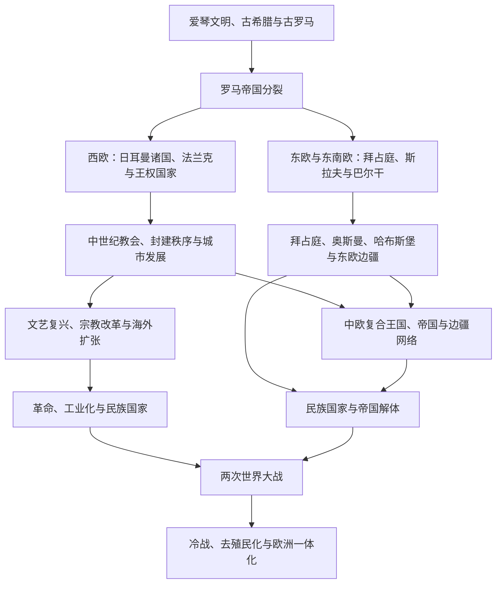

# 欧洲历史

[返回历史总览](/%E4%BA%BA%E6%96%87%E7%A7%91%E5%AD%A6/%E5%8E%86%E5%8F%B2/README.md)

## 范围与概括

欧洲历史由地中海古典世界、西欧与中欧的王权和帝国、东欧与巴尔干的多族群政治、北海—波罗的海网络以及近代海外扩张共同构成。本目录按“欧洲通史 + 历史区域 + 国家”组织：跨越现代边界的共同阶段放入通史，具体王朝、制度和国家发展放入下级目录。

## 历史主线

## 文明与历史空间入口

本组用于进入跨越现代国界、不能归入单一国家史的文明圈、帝国体系与历史共同体。对象类型说明其组织方式，不表示彼此都是同一种政治实体。

| 对象 | 对象类型 | 入口 | 主线提示 |
|---|---|---|---|
| 欧洲共同史 | 区域共同史与跨境历史框架 | [欧洲通史](/%E4%BA%BA%E6%96%87%E7%A7%91%E5%AD%A6/%E5%8E%86%E5%8F%B2/%E6%AC%A7%E6%B4%B2/_%E9%80%9A%E5%8F%B2/README.md) | 古希腊、古罗马、后罗马诸国、法兰克、中世纪、革命、民族国家、世界大战与战后欧洲等共同主线。 |
| 古希腊世界 | 文明圈、城邦与王国网络 | [古希腊](/%E4%BA%BA%E6%96%87%E7%A7%91%E5%AD%A6/%E5%8E%86%E5%8F%B2/%E6%AC%A7%E6%B4%B2/_%E9%80%9A%E5%8F%B2/%E5%8F%A4%E5%B8%8C%E8%85%8A/README.md) | 爱琴文明、城邦、马其顿扩张与跨欧亚非的希腊化世界。 |
| 古罗马世界 | 文明传统、共和国与跨地中海帝国 | [古罗马](/%E4%BA%BA%E6%96%87%E7%A7%91%E5%AD%A6/%E5%8E%86%E5%8F%B2/%E6%AC%A7%E6%B4%B2/_%E9%80%9A%E5%8F%B2/%E5%8F%A4%E7%BD%97%E9%A9%AC/README.md) | 从罗马城邦、共和国到帝国分裂，以及延续至1453年的东罗马主线。 |
| 后罗马西欧 | 区域转型阶段与多政权群 | [后罗马时代的日耳曼诸国](/%E4%BA%BA%E6%96%87%E7%A7%91%E5%AD%A6/%E5%8E%86%E5%8F%B2/%E6%AC%A7%E6%B4%B2/_%E9%80%9A%E5%8F%B2/%E5%90%8E%E7%BD%97%E9%A9%AC%E6%97%B6%E4%BB%A3%E7%9A%84%E6%97%A5%E8%80%B3%E6%9B%BC%E8%AF%B8%E5%9B%BD/README.md) | 西罗马旧疆中的日耳曼王国、教会、地方贵族与城市共同重组西欧。 |
| 法兰克世界 | 跨区域王国与帝国秩序 | [法兰克王国](/%E4%BA%BA%E6%96%87%E7%A7%91%E5%AD%A6/%E5%8E%86%E5%8F%B2/%E6%AC%A7%E6%B4%B2/_%E9%80%9A%E5%8F%B2/%E5%90%8E%E7%BD%97%E9%A9%AC%E6%97%B6%E4%BB%A3%E7%9A%84%E6%97%A5%E8%80%B3%E6%9B%BC%E8%AF%B8%E5%9B%BD/%E6%B3%95%E5%85%B0%E5%85%8B%E7%8E%8B%E5%9B%BD/README.md) | 墨洛温、加洛林与843年后的分裂，是法国、德意志和中部欧洲多条主线的共同背景。 |
| 中欧 | 跨时期历史空间与分析框架 | [中欧历史空间](/%E4%BA%BA%E6%96%87%E7%A7%91%E5%AD%A6/%E5%8E%86%E5%8F%B2/%E6%AC%A7%E6%B4%B2/_%E9%80%9A%E5%8F%B2/%E4%B8%AD%E6%AC%A7%E5%8E%86%E5%8F%B2%E7%A9%BA%E9%97%B4.md) | 比较神圣罗马帝国、哈布斯堡体系、瑞士、匈牙利与周边国家的交错关系。 |
| 斯拉夫世界 | 语言文化共同体与历史分支 | [斯拉夫](/%E4%BA%BA%E6%96%87%E7%A7%91%E5%AD%A6/%E5%8E%86%E5%8F%B2/%E6%AC%A7%E6%B4%B2/%E6%96%AF%E6%8B%89%E5%A4%AB/README.md) | 东斯拉夫、西斯拉夫和南斯拉夫的分化、国家形成与现代发展。 |

## 现代国家与政治实体入口

本组按现代国家或相互关联的国家群进入连续史；分组入口只是导航，不把区域共同史等同于任何一个当代国家。

| 国家 / 国家群 | 入口 | 主线提示 |
|---|---|---|
| 法国 | [法国](/%E4%BA%BA%E6%96%87%E7%A7%91%E5%AD%A6/%E5%8E%86%E5%8F%B2/%E6%AC%A7%E6%B4%B2/%E6%B3%95%E5%9B%BD/README.md) | 高卢、法兰克、西法兰克、法兰西王国、革命与共和国。 |
| 联合王国、爱尔兰及构成国 | [不列颠群岛](/%E4%BA%BA%E6%96%87%E7%A7%91%E5%AD%A6/%E5%8E%86%E5%8F%B2/%E6%AC%A7%E6%B4%B2/%E4%B8%8D%E5%88%97%E9%A2%A0%E7%BE%A4%E5%B2%9B/README.md) | 史前不列颠、罗马统治、英格兰、苏格兰、威尔士、爱尔兰与联合王国。 |
| 德国、奥地利与瑞士 | [德意志](/%E4%BA%BA%E6%96%87%E7%A7%91%E5%AD%A6/%E5%8E%86%E5%8F%B2/%E6%AC%A7%E6%B4%B2/%E5%BE%B7%E6%84%8F%E5%BF%97/README.md)、[瑞士](/%E4%BA%BA%E6%96%87%E7%A7%91%E5%AD%A6/%E5%8E%86%E5%8F%B2/%E6%AC%A7%E6%B4%B2/%E5%BE%B7%E6%84%8F%E5%BF%97/%E7%91%9E%E5%A3%AB/README.md) | 东法兰克、神圣罗马帝国及现代国家分支；瑞士另有神圣罗马帝国中的邦联形成、独立发展、联邦国家与中立传统。 |
| 意大利 | [意大利](/%E4%BA%BA%E6%96%87%E7%A7%91%E5%AD%A6/%E5%8E%86%E5%8F%B2/%E6%AC%A7%E6%B4%B2/%E6%84%8F%E5%A4%A7%E5%88%A9/README.md) | 古代意大利、城邦、教皇国、文艺复兴、统一与共和国。 |
| 西班牙与葡萄牙 | [伊比利亚半岛](/%E4%BA%BA%E6%96%87%E7%A7%91%E5%AD%A6/%E5%8E%86%E5%8F%B2/%E6%AC%A7%E6%B4%B2/%E4%BC%8A%E6%AF%94%E5%88%A9%E4%BA%9A%E5%8D%8A%E5%B2%9B/README.md) | 罗马西班尼亚、西哥特、安达卢斯、收复失地运动与西葡形成。 |
| 荷兰、比利时与卢森堡 | [低地国家](/%E4%BA%BA%E6%96%87%E7%A7%91%E5%AD%A6/%E5%8E%86%E5%8F%B2/%E6%AC%A7%E6%B4%B2/%E4%BD%8E%E5%9C%B0%E5%9B%BD%E5%AE%B6/README.md) | 勃艮第—哈布斯堡遗产、荷兰共和国、现代三国与欧洲一体化。 |
| 匈牙利 | [匈牙利](/%E4%BA%BA%E6%96%87%E7%A7%91%E5%AD%A6/%E5%8E%86%E5%8F%B2/%E6%AC%A7%E6%B4%B2/%E5%8C%88%E7%89%99%E5%88%A9/README.md) | 马扎尔人进入喀尔巴阡盆地、王国形成、帝国竞争和现代国家。 |
| 希腊、罗马尼亚、阿尔巴尼亚及南斯拉夫后继国家 | [东南欧与巴尔干](/%E4%BA%BA%E6%96%87%E7%A7%91%E5%AD%A6/%E5%8E%86%E5%8F%B2/%E6%AC%A7%E6%B4%B2/%E4%B8%9C%E5%8D%97%E6%AC%A7%E4%B8%8E%E5%B7%B4%E5%B0%94%E5%B9%B2/README.md) | 各国连续史与南斯拉夫共同线并读，区分古希腊文明与现代希腊国家。 |
| 丹麦、挪威、瑞典、冰岛与芬兰 | [北欧](/%E4%BA%BA%E6%96%87%E7%A7%91%E5%AD%A6/%E5%8E%86%E5%8F%B2/%E6%AC%A7%E6%B4%B2/%E5%8C%97%E6%AC%A7/README.md) | 维京时代、卡尔马联盟及五国的国家形成与现代发展。 |
| 爱沙尼亚、拉脱维亚与立陶宛 | [波罗的海](/%E4%BA%BA%E6%96%87%E7%A7%91%E5%AD%A6/%E5%8E%86%E5%8F%B2/%E6%AC%A7%E6%B4%B2/%E6%B3%A2%E7%BD%97%E7%9A%84%E6%B5%B7/README.md) | 波罗的人、北方十字军、立陶宛大公国与波罗的海三国。 |
| 东、西、南斯拉夫国家主线 | [斯拉夫](/%E4%BA%BA%E6%96%87%E7%A7%91%E5%AD%A6/%E5%8E%86%E5%8F%B2/%E6%AC%A7%E6%B4%B2/%E6%96%AF%E6%8B%89%E5%A4%AB/README.md) | 由语言文化分化进入俄罗斯、乌克兰、白俄罗斯、波兰、捷克、斯洛伐克及南斯拉夫诸国历史。 |

## 区域共同史与跨境专题

同一入口可能同时出现在国家组与本组：前者用于寻找现代国家，后者用于理解跨境联系。

| 区域 / 专题 | 入口 | 适合处理的问题 |
|---|---|---|
| 不列颠群岛共同史 | [不列颠群岛](/%E4%BA%BA%E6%96%87%E7%A7%91%E5%AD%A6/%E5%8E%86%E5%8F%B2/%E6%AC%A7%E6%B4%B2/%E4%B8%8D%E5%88%97%E9%A2%A0%E7%BE%A4%E5%B2%9B/README.md) | 罗马统治、盎格鲁—撒克逊与诺曼扩张、三王国关系、联合与分离。 |
| 伊比利亚半岛共同史 | [伊比利亚半岛](/%E4%BA%BA%E6%96%87%E7%A7%91%E5%AD%A6/%E5%8E%86%E5%8F%B2/%E6%AC%A7%E6%B4%B2/%E4%BC%8A%E6%AF%94%E5%88%A9%E4%BA%9A%E5%8D%8A%E5%B2%9B/README.md) | 罗马、西哥特、安达卢斯、基督教诸国、大航海与西葡帝国。 |
| 低地国家共同史 | [低地国家](/%E4%BA%BA%E6%96%87%E7%A7%91%E5%AD%A6/%E5%8E%86%E5%8F%B2/%E6%AC%A7%E6%B4%B2/%E4%BD%8E%E5%9C%B0%E5%9B%BD%E5%AE%B6/README.md) | 勃艮第—哈布斯堡遗产、宗教冲突、商业网络与国家分化。 |
| 东南欧与巴尔干 | [东南欧与巴尔干](/%E4%BA%BA%E6%96%87%E7%A7%91%E5%AD%A6/%E5%8E%86%E5%8F%B2/%E6%AC%A7%E6%B4%B2/%E4%B8%9C%E5%8D%97%E6%AC%A7%E4%B8%8E%E5%B7%B4%E5%B0%94%E5%B9%B2/README.md) | 拜占庭、奥斯曼、哈布斯堡、多族群帝国与民族国家形成。 |
| 北欧与北海—波罗的海网络 | [北欧](/%E4%BA%BA%E6%96%87%E7%A7%91%E5%AD%A6/%E5%8E%86%E5%8F%B2/%E6%AC%A7%E6%B4%B2/%E5%8C%97%E6%AC%A7/README.md)、[波罗的海](/%E4%BA%BA%E6%96%87%E7%A7%91%E5%AD%A6/%E5%8E%86%E5%8F%B2/%E6%AC%A7%E6%B4%B2/%E6%B3%A2%E7%BD%97%E7%9A%84%E6%B5%B7/README.md) | 维京迁徙、贸易联盟、十字军、帝国竞争与近现代国家形成。 |
| 中欧复合政治空间 | [中欧历史空间](/%E4%BA%BA%E6%96%87%E7%A7%91%E5%AD%A6/%E5%8E%86%E5%8F%B2/%E6%AC%A7%E6%B4%B2/_%E9%80%9A%E5%8F%B2/%E4%B8%AD%E6%AC%A7%E5%8E%86%E5%8F%B2%E7%A9%BA%E9%97%B4.md) | 横向比较神圣罗马帝国、哈布斯堡体系、瑞士、匈牙利与周边国家，不取代各国连续史。 |
| 斯拉夫分化与传播 | [斯拉夫](/%E4%BA%BA%E6%96%87%E7%A7%91%E5%AD%A6/%E5%8E%86%E5%8F%B2/%E6%AC%A7%E6%B4%B2/%E6%96%AF%E6%8B%89%E5%A4%AB/README.md) | 语言文化共同体、迁徙分化、宗教差异和国家形成之间的关系。 |
| 殖民扩张、世界大战与去殖民化 | [世界历史通史](/%E4%BA%BA%E6%96%87%E7%A7%91%E5%AD%A6/%E5%8E%86%E5%8F%B2/_%E9%80%9A%E5%8F%B2/README.md) | 把欧洲帝国史与美洲、非洲、亚洲和大洋洲的本地历史放在同一全球框架中。 |

## 关键辨析

- 欧洲不是从希腊、罗马直线发展到现代民族国家；北欧、东欧、巴尔干和草原边疆都有独立而交错的历史主线。
- 古希腊、罗马帝国、神圣罗马帝国和哈布斯堡君主国均跨越现代国界，不能被单一国家史吸收。
- [“中欧”](/%E4%BA%BA%E6%96%87%E7%A7%91%E5%AD%A6/%E5%8E%86%E5%8F%B2/%E6%AC%A7%E6%B4%B2/_%E9%80%9A%E5%8F%B2/%E4%B8%AD%E6%AC%A7%E5%8E%86%E5%8F%B2%E7%A9%BA%E9%97%B4.md)、“东欧”“东南欧”和“巴尔干”是分析框架，边界因时代和问题而变化。
- 欧洲海外扩张必须与美洲、非洲、亚洲和大洋洲的本地历史并读，不能只从殖民母国视角叙述。

## 上级与相邻区域

- 拜占庭、奥斯曼与东地中海：[西亚历史](/%E4%BA%BA%E6%96%87%E7%A7%91%E5%AD%A6/%E5%8E%86%E5%8F%B2/%E8%A5%BF%E4%BA%9A/README.md)。
- 安达卢斯、地中海与北非：[北非历史](/%E4%BA%BA%E6%96%87%E7%A7%91%E5%AD%A6/%E5%8E%86%E5%8F%B2/%E5%8C%97%E9%9D%9E/README.md)。
- 殖民扩张与全球体系：[世界历史通史](/%E4%BA%BA%E6%96%87%E7%A7%91%E5%AD%A6/%E5%8E%86%E5%8F%B2/_%E9%80%9A%E5%8F%B2/README.md)。
- 俄罗斯与欧亚草原互动：[东斯拉夫](/%E4%BA%BA%E6%96%87%E7%A7%91%E5%AD%A6/%E5%8E%86%E5%8F%B2/%E6%AC%A7%E6%B4%B2/%E6%96%AF%E6%8B%89%E5%A4%AB/%E4%B8%9C%E6%96%AF%E6%8B%89%E5%A4%AB/README.md)与[中亚历史](/%E4%BA%BA%E6%96%87%E7%A7%91%E5%AD%A6/%E5%8E%86%E5%8F%B2/%E4%B8%AD%E4%BA%9A/README.md)。
