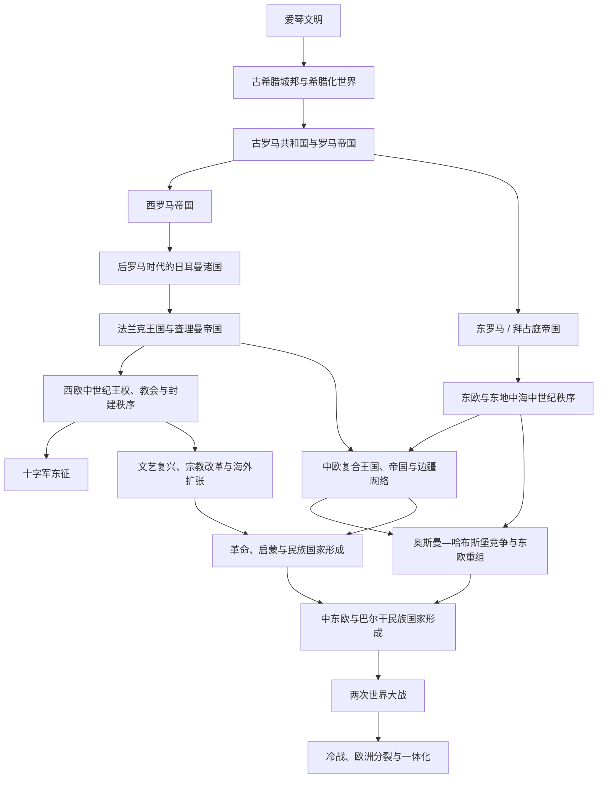

# 欧洲通史

## 概括

本目录集中整理跨越现代国家边界的欧洲共同历史。主线从爱琴与古典地中海世界开始，经罗马帝国、后罗马诸国、拜占庭与中世纪基督教世界，进入文艺复兴、宗教改革、海外扩张、革命、民族国家、两次世界大战、冷战和欧洲一体化。具体国家的王朝、制度与事件仍在各区域和国家目录维护。

## 历史主线

## 核心阶段导航

| 顺序 | 阶段 | 时间 | 入口 | 简要概括 |
|---:|---|---|---|---|
| 1 | 古希腊 | 约前3千纪—前146年 | [古希腊](/%E4%BA%BA%E6%96%87%E7%A7%91%E5%AD%A6/%E5%8E%86%E5%8F%B2/%E6%AC%A7%E6%B4%B2/_%E9%80%9A%E5%8F%B2/%E5%8F%A4%E5%B8%8C%E8%85%8A/README.md) | 爱琴文明、城邦、马其顿和希腊化世界构成古典地中海的重要传统。 |
| 2 | 古罗马 | 传统前753年—476年；东部延续至1453年 | [古罗马](/%E4%BA%BA%E6%96%87%E7%A7%91%E5%AD%A6/%E5%8E%86%E5%8F%B2/%E6%AC%A7%E6%B4%B2/_%E9%80%9A%E5%8F%B2/%E5%8F%A4%E7%BD%97%E9%A9%AC/README.md) | 罗马从城邦、共和国发展为地中海帝国，并长期影响法律、城市、语言和政治传统。 |
| 3 | 后罗马时代 | 5—8世纪 | [后罗马时代的日耳曼诸国](/%E4%BA%BA%E6%96%87%E7%A7%91%E5%AD%A6/%E5%8E%86%E5%8F%B2/%E6%AC%A7%E6%B4%B2/_%E9%80%9A%E5%8F%B2/%E5%90%8E%E7%BD%97%E9%A9%AC%E6%97%B6%E4%BB%A3%E7%9A%84%E6%97%A5%E8%80%B3%E6%9B%BC%E8%AF%B8%E5%9B%BD/README.md) | 西罗马旧疆形成多个日耳曼王国，教会、地方贵族与新王权共同重组西欧。 |
| 4 | 法兰克与加洛林秩序 | 486—843年及其后 | [法兰克王国](/%E4%BA%BA%E6%96%87%E7%A7%91%E5%AD%A6/%E5%8E%86%E5%8F%B2/%E6%AC%A7%E6%B4%B2/_%E9%80%9A%E5%8F%B2/%E5%90%8E%E7%BD%97%E9%A9%AC%E6%97%B6%E4%BB%A3%E7%9A%84%E6%97%A5%E8%80%B3%E6%9B%BC%E8%AF%B8%E5%9B%BD/%E6%B3%95%E5%85%B0%E5%85%8B%E7%8E%8B%E5%9B%BD/README.md) | 查理曼帝国及其分裂成为法国、德意志与中部欧洲多条政治主线的重要背景。 |
| 5 | 中世纪基督教世界 | 5—15世纪 | [十字军东征](/%E4%BA%BA%E6%96%87%E7%A7%91%E5%AD%A6/%E5%8E%86%E5%8F%B2/%E6%AC%A7%E6%B4%B2/_%E9%80%9A%E5%8F%B2/%E5%8D%81%E5%AD%97%E5%86%9B%E4%B8%9C%E5%BE%81/README.md) | 东罗马延续；西欧形成王权、教会、封建领主和城市并存的秩序。 |
| 6 | 文艺复兴与海外扩张 | 14—17世纪 | [意大利](/%E4%BA%BA%E6%96%87%E7%A7%91%E5%AD%A6/%E5%8E%86%E5%8F%B2/%E6%AC%A7%E6%B4%B2/%E6%84%8F%E5%A4%A7%E5%88%A9/README.md)、[伊比利亚半岛](/%E4%BA%BA%E6%96%87%E7%A7%91%E5%AD%A6/%E5%8E%86%E5%8F%B2/%E6%AC%A7%E6%B4%B2/%E4%BC%8A%E6%AF%94%E5%88%A9%E4%BA%9A%E5%8D%8A%E5%B2%9B/README.md) | 人文主义、城市经济、印刷、宗教改革与远洋扩张推动欧洲走向近代。 |
| 7 | 革命与民族国家 | 17—19世纪 | [法国](/%E4%BA%BA%E6%96%87%E7%A7%91%E5%AD%A6/%E5%8E%86%E5%8F%B2/%E6%AC%A7%E6%B4%B2/%E6%B3%95%E5%9B%BD/README.md)、[德意志](/%E4%BA%BA%E6%96%87%E7%A7%91%E5%AD%A6/%E5%8E%86%E5%8F%B2/%E6%AC%A7%E6%B4%B2/%E5%BE%B7%E6%84%8F%E5%BF%97/README.md) | 英格兰革命、启蒙与法国大革命改变政治语言，德国、意大利等完成民族统一。 |
| 8 | 世界大战与欧洲重组 | 1914—1945年 | [两次世界大战](/%E4%BA%BA%E6%96%87%E7%A7%91%E5%AD%A6/%E5%8E%86%E5%8F%B2/_%E9%80%9A%E5%8F%B2/%E4%B8%A4%E6%AC%A1%E4%B8%96%E7%95%8C%E5%A4%A7%E6%88%98.md) | 两次大战瓦解旧帝国体系，造成大规模暴力、边界重组与全球力量转移。 |
| 9 | 冷战与欧洲一体化 | 1945年至今 | [冷战、非殖民化与全球化](/%E4%BA%BA%E6%96%87%E7%A7%91%E5%AD%A6/%E5%8E%86%E5%8F%B2/_%E9%80%9A%E5%8F%B2/%E5%86%B7%E6%88%98%E3%80%81%E9%9D%9E%E6%AE%96%E6%B0%91%E5%8C%96%E4%B8%8E%E5%85%A8%E7%90%83%E5%8C%96.md) | 欧洲分裂为不同政治军事阵营，同时推进战后重建、福利国家和区域一体化。 |

## 跨时期区域框架

| 框架 | 时间范围 | 入口 | 作用 |
|---|---|---|---|
| 中欧历史空间 | 古代边疆至当代 | [中欧历史空间](/%E4%BA%BA%E6%96%87%E7%A7%91%E5%AD%A6/%E5%8E%86%E5%8F%B2/%E6%AC%A7%E6%B4%B2/_%E9%80%9A%E5%8F%B2/%E4%B8%AD%E6%AC%A7%E5%8E%86%E5%8F%B2%E7%A9%BA%E9%97%B4.md) | 横向比较神圣罗马帝国、瑞士、匈牙利、哈布斯堡体系和近现代国家重组，不取代各国连续史。 |

## 阶段要点

### 希腊、罗马与古典遗产

- 克里特米诺斯文明和迈锡尼文明属于爱琴青铜时代的重要组成部分。
- 古希腊由众多城邦和王国构成；雅典、斯巴达等政治共同体具有不同制度，不能视为统一民族国家。
- 马其顿扩张和亚历山大东征把希腊文化带入埃及、西亚和中亚，形成跨区域的希腊化世界。
- 罗马经历王政、共和国和帝国阶段，其法律、道路、城市、拉丁语和基督教帝国传统持续影响欧洲。
- 西罗马476年灭亡常被作为西欧古代与中世纪的分界之一；东罗马延续至1453年。

### 中世纪秩序

- 西罗马旧疆不是立即变成现代国家，而是在日耳曼王国、教会、城市和地方军事贵族之间长期重组。
- 法兰克王国在查理曼时期达到高峰；843年以后，西法兰克、东法兰克和中法兰克分别通向不同政治方向。
- 神圣罗马帝国是中欧复合政治体系，不等同于现代德国；其历史同时涉及德意志、奥地利、意大利北部和其他中欧地区。
- 十字军东征连接西欧、拜占庭、黎凡特和地中海贸易，不只是单一宗教战争。
- 东欧和巴尔干同时受拜占庭、斯拉夫诸国、匈牙利、奥斯曼与哈布斯堡体系影响。

### 文艺复兴、扩张与革命

- 文艺复兴首先在意大利城市发展，古典文化、人文主义、艺术与知识传播是其重要主线。
- 葡萄牙和西班牙率先建立远洋航路与殖民体系，荷兰、英国、法国随后参与海权、贸易和殖民竞争。
- 英格兰的制度冲突与革命推动议会和君主立宪传统形成；法国大革命则传播公民、民族主权和现代政治意识形态。
- 拿破仑战争既传播法典和行政改革，也激发民族主义、反法联盟和维也纳体系。

### 民族国家与世界大战

- 欧洲民族国家形成没有单一路径：英法较早形成王权国家，德国和意大利在19世纪统一，哈布斯堡、奥斯曼和俄罗斯则长期维持多民族帝国结构。
- 1648年威斯特伐利亚和约常被视为欧洲近代国家秩序的重要节点，但主权国家体系是长期形成的。
- 1918年以后奥匈、德意志、俄罗斯和奥斯曼等帝国发生剧变，中东欧与巴尔干边界重新划定。
- 两次世界大战削弱欧洲传统列强体系；战后美国和苏联主导国际格局，欧洲同时经历冷战分裂、去殖民化和一体化。

## 关键辨析

- 古希腊和罗马是跨越现代边界的历史共同体，不能分别简化为现代希腊或意大利的国家史。
- 法兰克王国是法国、德意志和中部欧洲多条政治传统的共同背景，不应写成任何单一现代国家的直接前身。
- “欧洲”不是封闭空间；其历史持续与西亚、北非、中亚、美洲、非洲和大洋洲发生战争、贸易、殖民与人口流动。
- 民族、语言、宗教和国家边界并不完全重合，尤其在中欧、东欧与巴尔干地区。

## 专题入口

- [中欧历史空间](/%E4%BA%BA%E6%96%87%E7%A7%91%E5%AD%A6/%E5%8E%86%E5%8F%B2/%E6%AC%A7%E6%B4%B2/_%E9%80%9A%E5%8F%B2/%E4%B8%AD%E6%AC%A7%E5%8E%86%E5%8F%B2%E7%A9%BA%E9%97%B4.md)
- [欧洲四大帝王与四大名将](/%E4%BA%BA%E6%96%87%E7%A7%91%E5%AD%A6/%E5%8E%86%E5%8F%B2/%E6%AC%A7%E6%B4%B2/_%E9%80%9A%E5%8F%B2/%E6%AC%A7%E6%B4%B2%E5%9B%9B%E5%A4%A7%E5%B8%9D%E7%8E%8B%E4%B8%8E%E5%9B%9B%E5%A4%A7%E5%90%8D%E5%B0%86.md)
- [世界历史通史](/%E4%BA%BA%E6%96%87%E7%A7%91%E5%AD%A6/%E5%8E%86%E5%8F%B2/_%E9%80%9A%E5%8F%B2/README.md)
- [欧洲历史](/%E4%BA%BA%E6%96%87%E7%A7%91%E5%AD%A6/%E5%8E%86%E5%8F%B2/%E6%AC%A7%E6%B4%B2/README.md)

## 跨区域联系

- 希波战争、亚历山大东征和罗马—波斯战争的东方背景见[伊朗](/%E4%BA%BA%E6%96%87%E7%A7%91%E5%AD%A6/%E5%8E%86%E5%8F%B2/%E8%A5%BF%E4%BA%9A/%E4%BC%8A%E6%9C%97/README.md)。
- 拜占庭后期和1453年后的东地中海格局见[奥斯曼帝国](/%E4%BA%BA%E6%96%87%E7%A7%91%E5%AD%A6/%E5%8E%86%E5%8F%B2/%E8%A5%BF%E4%BA%9A/%E5%9C%9F%E8%80%B3%E5%85%B6/%E5%A5%A5%E6%96%AF%E6%9B%BC%E5%B8%9D%E5%9B%BD/README.md)。
- 安达卢斯和中世纪伊斯兰世界背景见[阿拉伯帝国](/%E4%BA%BA%E6%96%87%E7%A7%91%E5%AD%A6/%E5%8E%86%E5%8F%B2/%E8%A5%BF%E4%BA%9A/_%E9%80%9A%E5%8F%B2/%E9%98%BF%E6%8B%89%E4%BC%AF%E5%B8%9D%E5%9B%BD/README.md)。
- 欧洲海外扩张、殖民体系和世界大战的全球比较见[世界历史通史](/%E4%BA%BA%E6%96%87%E7%A7%91%E5%AD%A6/%E5%8E%86%E5%8F%B2/_%E9%80%9A%E5%8F%B2/README.md)。
