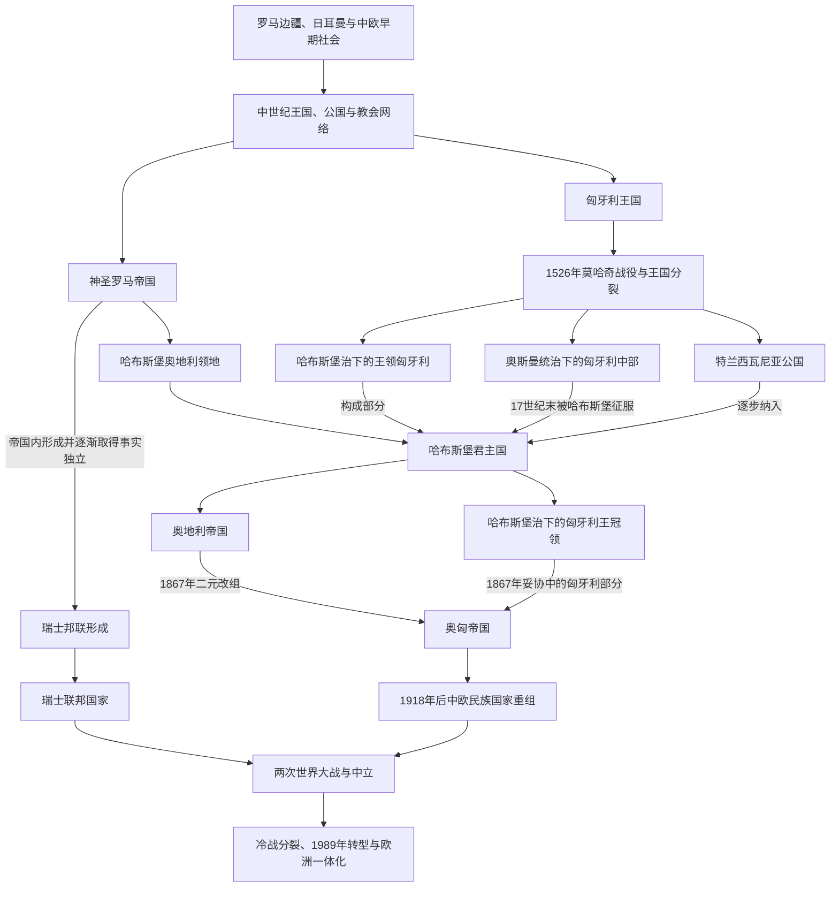

# 中欧历史空间

## 范围与概括

中欧是德意志、波兰、波希米亚、奥地利、匈牙利、瑞士及其邻近地区交错的历史空间，边界随时代与问题而变化。本专题负责跨国家比较，通过链接连接德意志、瑞士、匈牙利、奥地利、西斯拉夫和波罗的海历史；各国连续历史仍由对应国家或历史分支维护。

本页属于欧洲通史中的跨时期区域框架，不再作为装载少数国家笔记的独立目录。“中欧”在这里是理解神圣罗马帝国、哈布斯堡体系、奥匈帝国及近现代边界重组的分析工具，不是固定不变的国家分类。

## 演进图

## 相关国家与区域

| 区域 / 国家 | 入口 | 主线 |
|---|---|---|
| 瑞士 | [瑞士](/%E4%BA%BA%E6%96%87%E7%A7%91%E5%AD%A6/%E5%8E%86%E5%8F%B2/%E6%AC%A7%E6%B4%B2/%E5%BE%B7%E6%84%8F%E5%BF%97/%E7%91%9E%E5%A3%AB/README.md) | 旧瑞士邦联、宗教改革、赫尔维蒂共和国、1848年联邦与中立。 |
| 匈牙利 | [匈牙利](/%E4%BA%BA%E6%96%87%E7%A7%91%E5%AD%A6/%E5%8E%86%E5%8F%B2/%E6%AC%A7%E6%B4%B2/%E5%8C%88%E7%89%99%E5%88%A9/README.md) | 马扎尔人定居、中世纪王国、奥斯曼—哈布斯堡、奥匈帝国和现代国家。 |
| 德意志 | [德意志](/%E4%BA%BA%E6%96%87%E7%A7%91%E5%AD%A6/%E5%8E%86%E5%8F%B2/%E6%AC%A7%E6%B4%B2/%E5%BE%B7%E6%84%8F%E5%BF%97/README.md) | 东法兰克、神圣罗马帝国、德国和奥地利。 |
| 奥地利 | [奥地利](/%E4%BA%BA%E6%96%87%E7%A7%91%E5%AD%A6/%E5%8E%86%E5%8F%B2/%E6%AC%A7%E6%B4%B2/%E5%BE%B7%E6%84%8F%E5%BF%97/%E5%A5%A5%E5%9C%B0%E5%88%A9/README.md) | 哈布斯堡君主国、奥地利帝国、奥匈帝国与共和国。 |
| 西斯拉夫 | [西斯拉夫](/%E4%BA%BA%E6%96%87%E7%A7%91%E5%AD%A6/%E5%8E%86%E5%8F%B2/%E6%AC%A7%E6%B4%B2/%E6%96%AF%E6%8B%89%E5%A4%AB/%E8%A5%BF%E6%96%AF%E6%8B%89%E5%A4%AB/README.md) | 波兰、波希米亚、捷克、斯洛伐克及共同国家传统。 |
| 波罗的海 | [波罗的海](/%E4%BA%BA%E6%96%87%E7%A7%91%E5%AD%A6/%E5%8E%86%E5%8F%B2/%E6%AC%A7%E6%B4%B2/%E6%B3%A2%E7%BD%97%E7%9A%84%E6%B5%B7/README.md) | 立陶宛、波兰—立陶宛联邦和北方政治网络。 |

## 关键辨析

- “中欧”不是固定自然区，也不是单一民族文化圈；德语、斯拉夫语、匈牙利语及其他语言社群长期交错。
- 神圣罗马帝国不是现代德国，其成员和政治网络覆盖今日多个中欧国家。
- 哈布斯堡君主国是复合君主国，不应只作为奥地利民族国家的早期阶段。
- 1918年民族国家形成没有使人口与边界完全重合，少数族群和领土争议继续存在。

## 上级

- [欧洲通史](/%E4%BA%BA%E6%96%87%E7%A7%91%E5%AD%A6/%E5%8E%86%E5%8F%B2/%E6%AC%A7%E6%B4%B2/_%E9%80%9A%E5%8F%B2/README.md)
- [欧洲历史](/%E4%BA%BA%E6%96%87%E7%A7%91%E5%AD%A6/%E5%8E%86%E5%8F%B2/%E6%AC%A7%E6%B4%B2/README.md)
