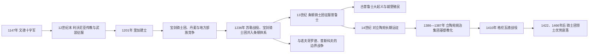

# 北方十字军

## 时间

12世纪－15世纪

## 别称

波罗的海十字军

## 概括

北方十字军是拉丁基督教世界在波罗的海和东欧边疆推动的一系列战争，目标包括文德人、利沃尼亚人、爱沙尼亚人、普鲁士人、立陶宛人等异教民族，也涉及与东正教政权的边界冲突。它既是传教战争，也是德意志、丹麦、瑞典以及军事修会扩张土地和控制贸易通道的过程。

## 说明

- 主要地区：波罗的海南岸和东岸，包括今德国东北部、波兰北部、波罗的海三国、芬兰和立陶宛周边。
- 主要力量：萨克森和德意志诸侯、丹麦王国、瑞典王国、利沃尼亚宝剑骑士团、条顿骑士团等。
- 文德十字军：1147年，与第二次十字军东征同一时期发动，主要针对易北河以东的斯拉夫异教部落。
- 利沃尼亚和爱沙尼亚战场：12世纪末至13世纪，传教士、商人、骑士团和丹麦势力共同推进征服与基督教化。
- 普鲁士十字军：13世纪，条顿骑士团征服古普鲁士人，建立骑士团国家。
- 立陶宛战场：立陶宛长期保持异教信仰，是北方十字军后期主要对象；1387年立陶宛正式基督教化后，骑士团继续以政治和边疆冲突为理由作战。
- 重要转折：1410年格伦瓦德战役中，波兰-立陶宛联军击败条顿骑士团，削弱骑士团在波罗的海的优势。

## 相关组织与区域视角

- 军事修会完整主线：[条顿骑士团](/%E4%BA%BA%E6%96%87%E7%A7%91%E5%AD%A6/%E5%8E%86%E5%8F%B2/%E6%AC%A7%E6%B4%B2/_%E9%80%9A%E5%8F%B2/%E5%8D%81%E5%AD%97%E5%86%9B%E4%B8%9C%E5%BE%81/%E5%B9%BF%E4%B9%89%E5%8D%81%E5%AD%97%E5%86%9B%E8%BF%90%E5%8A%A8/%E6%9D%A1%E9%A1%BF%E9%AA%91%E5%A3%AB%E5%9B%A2.md)。
- 东波罗的海地区视角：[中世纪波罗的海十字军](/%E4%BA%BA%E6%96%87%E7%A7%91%E5%AD%A6/%E5%8E%86%E5%8F%B2/%E6%AC%A7%E6%B4%B2/%E6%B3%A2%E7%BD%97%E7%9A%84%E6%B5%B7/%E4%B8%AD%E4%B8%96%E7%BA%AA%E6%B3%A2%E7%BD%97%E7%9A%84%E6%B5%B7%E5%8D%81%E5%AD%97%E5%86%9B.md)。

## 演进图

## 分区过程

### 文德与易北河边疆

1147年文德十字军与第二次十字军同时获得教廷支持，萨克森、丹麦和波兰等力量针对易北河以东的斯拉夫异教政权。远征没有立即完成征服，却把既有边疆战争、传教和土地扩张纳入十字军赎罪制度。随后德意志诸侯、主教区、城市和移民通过堡垒、教区、土地特许与市场逐步改变区域人口和权力结构。

### 利沃尼亚与爱沙尼亚

12世纪末，传教士梅纳德、主教贝尔托德及阿尔伯特先后在道加瓦河口活动。里加1201年建立后成为商贸、主教和军事基地，宝剑骑士团承担征服。利沃尼亚人、拉特加尔人、瑟米加尔人、库尔人和爱沙尼亚人并非统一阵营，常在抵抗、结盟和改宗之间选择；丹麦、瑞典、罗斯诸公与骑士团也争夺同一空间。

1236年苏勒战役中，萨莫吉希亚和瑟米加尔力量击败宝剑骑士团，幸存组织并入条顿骑士团的利沃尼亚分支。爱沙尼亚北部一度归丹麦，地方农民和贵族关系继续变化。所谓“基督教化完成”并不等于异教实践、地方语言和反抗立即消失。

### 普鲁士与骑士团国家

马佐维亚公爵康拉德邀请条顿骑士团对付古普鲁士人，教廷和皇帝的特许为骑士团主权主张提供法律基础。13世纪30年代以后，骑士团沿维斯瓦河和波罗的海修城、招募十字军与移民，并逐地征服。1260年杜尔贝战役后爆发古普鲁士大起义，显示征服远未稳固；骑士团以增援、城堡网和分化盟约到13世纪末压制主要抵抗。

征服兼有强制洗礼、土地重分配、人口死亡与迁徙，也有本地贵族被吸纳、农民继续生产和城市贸易增长。用“传教”或“德国东向殖民”任一单一概念都不足以涵盖这一复合过程。

### 立陶宛与东正教边界

立陶宛成为后期主要异教强国，并吸纳大片罗斯东正教领地。骑士团的季节性“远征”吸引西欧贵族，宗教誓愿、骑士文化和对萨莫吉希亚通道的战略需求结合。约盖拉与波兰联姻，1386年受洗、1387年推动立陶宛正式基督教化后，骑士团仍以改宗不充分和领土争议继续战争。

1242年楚德湖战役常被后世塑造成东西文明决定性对决，实际是诺夫哥罗德—普斯科夫、利沃尼亚骑士及地方势力连续边界战争的一环。1410年波兰—立陶宛在格伦瓦德／坦能堡击败骑士团，1422年梅尔诺和约稳定部分边界；1466年第二次托伦和约进一步削弱骑士团国家。

## 统治机制与地区影响

| 机制 | 运作 | 影响 |
|---|---|---|
| 教廷授权 | 赎罪、宣讲、募款和对征服领土的教会安排 | 把不同王国和边疆战争连接为跨欧洲运动 |
| 军事修会 | 终身誓愿、城堡、常备组织和国际捐赠 | 比季节性贵族军更能持续占领，也形成独立领土权力 |
| 城市与商贸 | 里加、吕贝克等与汉萨网络连接 | 商业推动移民和税收，也与本地港口、罗斯贸易竞争 |
| 土地与教区 | 测量、封地、什一税、主教区和修道院 | 重塑所有权与宗教生活，常伴强制和人口等级化 |
| 地方合作 | 部族首领、被吸纳贵族和改宗者提供军役与翻译 | 说明征服不是简单“德意志人对波罗的人”的二元冲突 |

## 兴起、衰落与争议

北方十字军的扩张依赖波罗的海海运、德意志与斯堪的纳维亚贵族资源、教廷法权和军事修会的常备城堡体系。其长期压力来自地域过大、地方起义、丹麦—瑞典—波兰—罗斯竞争以及骑士团同时兼具宗教组织和领土国家的合法性矛盾。立陶宛基督教化削弱“讨伐异教”的核心理由，波兰—立陶宛联合又形成更强军事财政对手；格伦瓦德是重大转折，却不是骑士团当天灭亡。

评价时需同时保留传教、战争、殖民和地方能动性。改宗既可能出于信仰，也可能来自政治联盟或强制；城市化和文字行政的扩展不能抵消土地剥夺、奴役、人口损失与文化压制。

## 演变关系

- 上级节点：[广义十字军运动](/%E4%BA%BA%E6%96%87%E7%A7%91%E5%AD%A6/%E5%8E%86%E5%8F%B2/%E6%AC%A7%E6%B4%B2/_%E9%80%9A%E5%8F%B2/%E5%8D%81%E5%AD%97%E5%86%9B%E4%B8%9C%E5%BE%81/%E5%B9%BF%E4%B9%89%E5%8D%81%E5%AD%97%E5%86%9B%E8%BF%90%E5%8A%A8/README.md)。
- 并列节点：[伊比利亚十字军](/%E4%BA%BA%E6%96%87%E7%A7%91%E5%AD%A6/%E5%8E%86%E5%8F%B2/%E6%AC%A7%E6%B4%B2/_%E9%80%9A%E5%8F%B2/%E5%8D%81%E5%AD%97%E5%86%9B%E4%B8%9C%E5%BE%81/%E5%B9%BF%E4%B9%89%E5%8D%81%E5%AD%97%E5%86%9B%E8%BF%90%E5%8A%A8/%E4%BC%8A%E6%AF%94%E5%88%A9%E4%BA%9A%E5%8D%81%E5%AD%97%E5%86%9B.md)、[阿尔比十字军](/%E4%BA%BA%E6%96%87%E7%A7%91%E5%AD%A6/%E5%8E%86%E5%8F%B2/%E6%AC%A7%E6%B4%B2/_%E9%80%9A%E5%8F%B2/%E5%8D%81%E5%AD%97%E5%86%9B%E4%B8%9C%E5%BE%81/%E5%B9%BF%E4%B9%89%E5%8D%81%E5%AD%97%E5%86%9B%E8%BF%90%E5%8A%A8/%E9%98%BF%E5%B0%94%E6%AF%94%E5%8D%81%E5%AD%97%E5%86%9B.md)、[后期反奥斯曼十字军](/%E4%BA%BA%E6%96%87%E7%A7%91%E5%AD%A6/%E5%8E%86%E5%8F%B2/%E6%AC%A7%E6%B4%B2/_%E9%80%9A%E5%8F%B2/%E5%8D%81%E5%AD%97%E5%86%9B%E4%B8%9C%E5%BE%81/%E5%B9%BF%E4%B9%89%E5%8D%81%E5%AD%97%E5%86%9B%E8%BF%90%E5%8A%A8/%E5%90%8E%E6%9C%9F%E5%8F%8D%E5%A5%A5%E6%96%AF%E6%9B%BC%E5%8D%81%E5%AD%97%E5%86%9B.md)。
