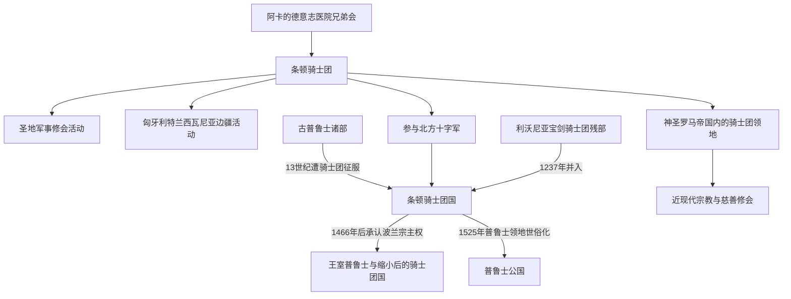

# 条顿骑士团

## 时间

1190年至今；骑士团国主要存在于13世纪至1525年

## 概括

条顿骑士团起源于第三次十字军东征时期的德意志医院兄弟会，随后转为兼具宗教誓愿和军事职能的修会。它先后在圣地、匈牙利边疆和波罗的海活动，并在普鲁士建立骑士团国。1525年普鲁士领地世俗化以后，骑士团作为宗教团体仍在神圣罗马帝国和中欧延续，因此“条顿骑士团”“条顿骑士团国”和后来的“普鲁士国家”不能混为同一对象。

## 演进图

## 主要阶段

| 阶段 | 时间 | 核心变化 |
|---|---|---|
| 医院兄弟会与军事修会形成 | 1190年代 | 在阿卡服务德语朝圣者，逐渐获得军事修会地位。 |
| 圣地与匈牙利边疆活动 | 12世纪末—13世纪初 | 在十字军国家和特兰西瓦尼亚边疆寻求稳定领地。 |
| 普鲁士十字军与骑士团国 | 13世纪—1410年 | 征服古普鲁士诸部，在马林堡等地建立修会国家，并与波兰、立陶宛竞争。 |
| 势力收缩 | 1410—1525年 | 格伦瓦德战役和第二次托伦和约后，骑士团国失去优势并受波兰宗主权约束。 |
| 普鲁士世俗化 | 1525年 | 大团长阿尔布雷希特把普鲁士领地改为世袭公国。 |
| 修会延续 | 1525年至今 | 骑士团在其他中欧领地延续，后来转向宗教、医疗和慈善职能。 |

## 统治结构与重要人物

| 类型 | 人物或机构 | 时间 | 说明 |
|---|---|---|---|
| 修会首脑 | 条顿骑士团大团长 | 1190年代以后 | 掌管修会成员、领地和军事事务；并非世袭君主。 |
| 关键大团长 | 赫尔曼·冯·萨尔察 | 1210—1239年 | 推动骑士团取得帝国和教廷特许，并转向普鲁士。 |
| 骑士团国末期首脑 | 阿尔布雷希特 | 1510—1525年 | 世俗化普鲁士领地，成为普鲁士公爵。 |
| 领地组织 | 总会、地方长官与城堡网络 | 中世纪 | 以修会纪律、城堡、城市和庄园体系维持统治。 |

## 重要转折

- 13世纪，骑士团受马佐夫舍公爵康拉德邀请进入普鲁士边疆，对古普鲁士人发动征服和基督教化战争。
- 1237年，利沃尼亚宝剑骑士团残部并入条顿骑士团，但利沃尼亚分支保持自身区域结构。
- 1410年格伦瓦德战役中，波兰—立陶宛联军击败骑士团，是其波罗的海霸权衰落的重要转折。
- 1466年第二次托伦和约后，骑士团失去西普鲁士等地，并承认波兰国王的宗主权。
- 1525年阿尔布雷希特改宗路德宗并建立普鲁士公国，骑士团国的普鲁士主线结束。
- 骑士团本身没有随普鲁士公国建立而消失，仍在中欧领地延续。

## 关键辨析

- 条顿骑士团是宗教修会；条顿骑士团国是它在波罗的海建立的领土国家。
- 骑士团成员具有浓厚德意志背景，但骑士团国不等同于近代德国。
- “普鲁士”最初是波罗的古普鲁士人的地域名称，后来被骑士团国和德意志统治者沿用。
- 征服、基督教化、移民和城市发展同时发生，但不能用“传播文明”掩盖战争、土地剥夺和当地社会重组。

## 区域视角

- 北方十字军背景：[北方十字军](/%E4%BA%BA%E6%96%87%E7%A7%91%E5%AD%A6/%E5%8E%86%E5%8F%B2/%E6%AC%A7%E6%B4%B2/_%E9%80%9A%E5%8F%B2/%E5%8D%81%E5%AD%97%E5%86%9B%E4%B8%9C%E5%BE%81/%E5%B9%BF%E4%B9%89%E5%8D%81%E5%AD%97%E5%86%9B%E8%BF%90%E5%8A%A8/%E5%8C%97%E6%96%B9%E5%8D%81%E5%AD%97%E5%86%9B.md)。
- 波罗的海社会与政治影响：[条顿骑士团国与波罗的海秩序](/%E4%BA%BA%E6%96%87%E7%A7%91%E5%AD%A6/%E5%8E%86%E5%8F%B2/%E6%AC%A7%E6%B4%B2/%E6%B3%A2%E7%BD%97%E7%9A%84%E6%B5%B7/%E6%9D%A1%E9%A1%BF%E9%AA%91%E5%A3%AB%E5%9B%A2%E5%9B%BD%E4%B8%8E%E6%B3%A2%E7%BD%97%E7%9A%84%E6%B5%B7%E7%A7%A9%E5%BA%8F.md)。
- 世俗化及普鲁士国家线：[骑士团国世俗化与普鲁士形成](/%E4%BA%BA%E6%96%87%E7%A7%91%E5%AD%A6/%E5%8E%86%E5%8F%B2/%E6%AC%A7%E6%B4%B2/%E5%BE%B7%E6%84%8F%E5%BF%97/%E5%BE%B7%E5%9B%BD/%E9%AA%91%E5%A3%AB%E5%9B%A2%E5%9B%BD%E4%B8%96%E4%BF%97%E5%8C%96%E4%B8%8E%E6%99%AE%E9%B2%81%E5%A3%AB%E5%BD%A2%E6%88%90.md)。

## 演变关系

- 上级专题：[广义十字军运动](/%E4%BA%BA%E6%96%87%E7%A7%91%E5%AD%A6/%E5%8E%86%E5%8F%B2/%E6%AC%A7%E6%B4%B2/_%E9%80%9A%E5%8F%B2/%E5%8D%81%E5%AD%97%E5%86%9B%E4%B8%9C%E5%BE%81/%E5%B9%BF%E4%B9%89%E5%8D%81%E5%AD%97%E5%86%9B%E8%BF%90%E5%8A%A8/README.md)。
- 前一过程：[北方十字军](/%E4%BA%BA%E6%96%87%E7%A7%91%E5%AD%A6/%E5%8E%86%E5%8F%B2/%E6%AC%A7%E6%B4%B2/_%E9%80%9A%E5%8F%B2/%E5%8D%81%E5%AD%97%E5%86%9B%E4%B8%9C%E5%BE%81/%E5%B9%BF%E4%B9%89%E5%8D%81%E5%AD%97%E5%86%9B%E8%BF%90%E5%8A%A8/%E5%8C%97%E6%96%B9%E5%8D%81%E5%AD%97%E5%86%9B.md)。
- 后续政治节点：[普鲁士公国](/%E4%BA%BA%E6%96%87%E7%A7%91%E5%AD%A6/%E5%8E%86%E5%8F%B2/%E6%AC%A7%E6%B4%B2/%E5%BE%B7%E6%84%8F%E5%BF%97/%E5%BE%B7%E5%9B%BD/%E6%99%AE%E9%B2%81%E5%A3%AB%E5%85%AC%E5%9B%BD.md)。
