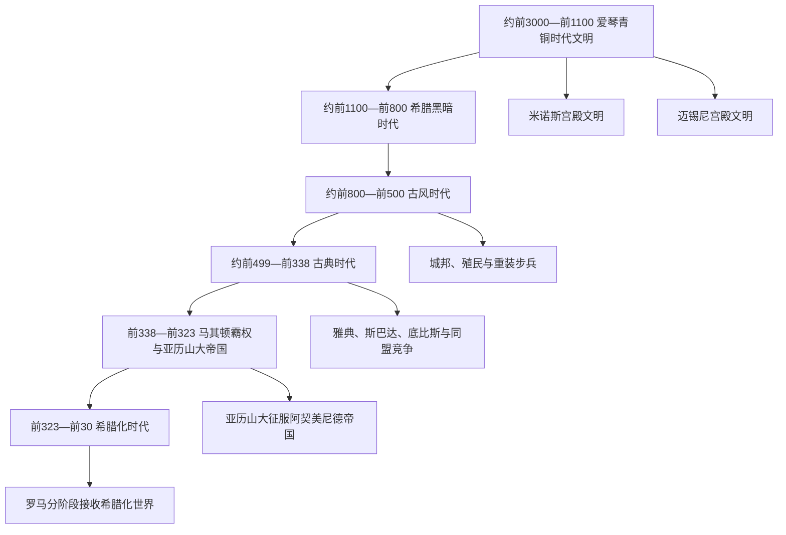

# 古希腊

[返回欧洲通史](/%E4%BA%BA%E6%96%87%E7%A7%91%E5%AD%A6/%E5%8E%86%E5%8F%B2/%E6%AC%A7%E6%B4%B2/_%E9%80%9A%E5%8F%B2/README.md)

## 范围与主线

古希腊不是一个统一民族国家，而是爱琴青铜时代文明、迈锡尼宫殿崩溃后的重组、城邦世界、马其顿王国和希腊化诸王国构成的历史连续体。共同语言、神话、圣所和竞技塑造“希腊人”认同，但政治权力长期分散在宫殿、贵族共同体、城邦、公民大会、同盟和王国宫廷之间。

本目录用六个阶段梳理主线。前146年是马其顿和希腊本土落入罗马支配的节点；前30年托勒密埃及灭亡才是整个希腊化时代的常用终点。希腊语言、城市制度、哲学和宗教传统此后继续存在于罗马帝国，并非随政治征服消失。

## 演变图

## 按时间排序的时期导航

| 顺序 | 名称 | 时间 | 历史主线 |
|---:|---|---|---|
| 1 | [爱琴文明](/%E4%BA%BA%E6%96%87%E7%A7%91%E5%AD%A6/%E5%8E%86%E5%8F%B2/%E6%AC%A7%E6%B4%B2/_%E9%80%9A%E5%8F%B2/%E5%8F%A4%E5%B8%8C%E8%85%8A/%E7%88%B1%E7%90%B4%E6%96%87%E6%98%8E.md) | 约前3000—前1100年 | 克里特米诺斯与希腊本土迈锡尼文明形成宫殿、贸易和文字系统；约前1200年前后宫殿网络崩溃 |
| 2 | [希腊黑暗时代](/%E4%BA%BA%E6%96%87%E7%A7%91%E5%AD%A6/%E5%8E%86%E5%8F%B2/%E6%AC%A7%E6%B4%B2/_%E9%80%9A%E5%8F%B2/%E5%8F%A4%E5%B8%8C%E8%85%8A/%E5%B8%8C%E8%85%8A%E9%BB%91%E6%9A%97%E6%97%B6%E4%BB%A3.md) | 约前1100—前800年 | 宫殿行政和线形文字乙种消失，人口、聚落与交换网络重组，铁器和新精英共同体发展 |
| 3 | [古风时代](/%E4%BA%BA%E6%96%87%E7%A7%91%E5%AD%A6/%E5%8E%86%E5%8F%B2/%E6%AC%A7%E6%B4%B2/_%E9%80%9A%E5%8F%B2/%E5%8F%A4%E5%B8%8C%E8%85%8A/%E5%8F%A4%E9%A3%8E%E6%97%B6%E4%BB%A3.md) | 约前800—前500年 | 城邦、公民共同体、字母文字、地中海殖民、重装步兵和多种政体形成 |
| 4 | [古典时代](/%E4%BA%BA%E6%96%87%E7%A7%91%E5%AD%A6/%E5%8E%86%E5%8F%B2/%E6%AC%A7%E6%B4%B2/_%E9%80%9A%E5%8F%B2/%E5%8F%A4%E5%B8%8C%E8%85%8A/%E5%8F%A4%E5%85%B8%E6%97%B6%E4%BB%A3.md) | 约前499—前338年 | 希波战争、雅典海上帝国、伯罗奔尼撒战争和霸权轮替，最终被马其顿压服 |
| 5 | [马其顿霸权与亚历山大帝国](/%E4%BA%BA%E6%96%87%E7%A7%91%E5%AD%A6/%E5%8E%86%E5%8F%B2/%E6%AC%A7%E6%B4%B2/_%E9%80%9A%E5%8F%B2/%E5%8F%A4%E5%B8%8C%E8%85%8A/%E9%A9%AC%E5%85%B6%E9%A1%BF%E9%9C%B8%E6%9D%83%E4%B8%8E%E4%BA%9A%E5%8E%86%E5%B1%B1%E5%A4%A7%E5%B8%9D%E5%9B%BD.md) | 前338—前323年；名义王统至前309/308年 | 腓力二世建立霸权，亚历山大摧毁波斯帝国；无成年继承人导致摄政战争 |
| 6 | [希腊化时代](/%E4%BA%BA%E6%96%87%E7%A7%91%E5%AD%A6/%E5%8E%86%E5%8F%B2/%E6%AC%A7%E6%B4%B2/_%E9%80%9A%E5%8F%B2/%E5%8F%A4%E5%B8%8C%E8%85%8A/%E5%B8%8C%E8%85%8A%E5%8C%96%E6%97%B6%E4%BB%A3.md) | 前323—前30年 | 继业者王国并立，希腊共同语和城市文化跨区域传播；罗马逐步接收各王国 |

## 统治者与世系入口

- [马其顿霸权与亚历山大帝国](/%E4%BA%BA%E6%96%87%E7%A7%91%E5%AD%A6/%E5%8E%86%E5%8F%B2/%E6%AC%A7%E6%B4%B2/_%E9%80%9A%E5%8F%B2/%E5%8F%A4%E5%B8%8C%E8%85%8A/%E9%A9%AC%E5%85%B6%E9%A1%BF%E9%9C%B8%E6%9D%83%E4%B8%8E%E4%BA%9A%E5%8E%86%E5%B1%B1%E5%A4%A7%E5%B8%9D%E5%9B%BD.md)内含阿吉德王朝从传说性先祖、历史主线到腓力三世和亚历山大四世的逐人连续表，并区分摄政、篡位与争议统治。
- [希腊化主要王国统治者世系表](/%E4%BA%BA%E6%96%87%E7%A7%91%E5%AD%A6/%E5%8E%86%E5%8F%B2/%E6%AC%A7%E6%B4%B2/_%E9%80%9A%E5%8F%B2/%E5%8F%A4%E5%B8%8C%E8%85%8A/%E5%B8%8C%E8%85%8A%E5%8C%96%E4%B8%BB%E8%A6%81%E7%8E%8B%E5%9B%BD%E7%BB%9F%E6%B2%BB%E8%80%85%E4%B8%96%E7%B3%BB%E8%A1%A8.md)集中维护马其顿王位、托勒密、塞琉古和帕加马的完整表；复位、共治、女王与并立竞争者均逐项标明。
- 希腊城邦不是单一君主国。[古典时代](/%E4%BA%BA%E6%96%87%E7%A7%91%E5%AD%A6/%E5%8E%86%E5%8F%B2/%E6%AC%A7%E6%B4%B2/_%E9%80%9A%E5%8F%B2/%E5%8F%A4%E5%B8%8C%E8%85%8A/%E5%8F%A4%E5%85%B8%E6%97%B6%E4%BB%A3.md)按雅典民主、斯巴达混合政体、寡头城邦和跨城邦同盟分别说明正式机构与实际权力。

## 重要转折与时间节点

| 时间 | 转折 | 意义 |
|---|---|---|
| 约前2000年前后 | 希腊语人群进入爱琴区域的过程 | 不是一次可精确纪年的“民族入侵”，语言、物质文化与人口迁移需分开理解 |
| 约前1450年后 | 迈锡尼精英接管克里特多处宫殿 | 爱琴海权力重心变化，线形文字乙种用于希腊语行政 |
| 约前1200—前1050年 | 宫殿崩溃与区域重组 | 中央书吏行政消失，但人口和文化没有“全部中断” |
| 前8世纪 | 城邦、字母与泛希腊圣所发展 | 为公民政治、成文史诗和殖民网络提供框架 |
| 前499—前479年 | 爱奥尼亚起义与希波战争 | 阻止波斯直接征服希腊本土，也催生雅典海上霸权 |
| 前478/477年 | 提洛同盟建立 | 防波斯联盟逐渐转化为雅典帝国 |
| 前431—前404年 | 伯罗奔尼撒战争 | 雅典帝国瓦解，斯巴达胜利却未建立稳定秩序 |
| 前371年 | 留克特拉战役 | 斯巴达陆上霸权崩解，底比斯短暂主导 |
| 前338年 | 喀罗尼亚战役 | 科林斯同盟使马其顿控制泛希腊战争与外交 |
| 前334—前323年 | 亚历山大东征 | 阿契美尼德帝国覆亡，马其顿军政网络扩至亚洲和埃及 |
| 前323年 | 亚历山大死亡 | 两名无执政能力的共王和模糊摄政安排引发继业者战争 |
| 前301年 | 伊普苏斯战役 | 安提柯统一尝试失败，多王国格局稳定 |
| 前168、前146年 | 皮德纳与亚该亚战争 | 马其顿王国和希腊本土自主大战略被罗马终结 |
| 前30年 | 托勒密埃及灭亡 | 希腊化时代传统终点，东地中海纳入罗马帝国体系 |

## 关键辨析

- “米诺斯人”“迈锡尼人”“多利安人”与后世希腊民族认同不能简单等同；考古类型、语言和政治共同体是不同层面。
- 城邦并不等于现代“城市”。它包含城市中心、乡村、圣所、公民团体和依附人口，领土大小差异显著。
- 雅典民主是成年男性公民的直接政治，不是普遍选举权；妇女、奴隶和外邦侨民被排除。
- 马其顿与希腊世界既有文化联系又有政治边界；腓力的胜利改变的是大战略权力，不是让城邦机构立即消失。
- “希腊化”表示希腊语和政治文化在多族群王国中的传播、选择和再造，不表示东方社会被动变成希腊社会。
- 罗马征服是持续一个多世纪的分阶段过程，不能把前146年当成托勒密、塞琉古等全部王国同时灭亡。

## 相关笔记

- [欧洲历史](/%E4%BA%BA%E6%96%87%E7%A7%91%E5%AD%A6/%E5%8E%86%E5%8F%B2/%E6%AC%A7%E6%B4%B2/README.md)
- [古罗马](/%E4%BA%BA%E6%96%87%E7%A7%91%E5%AD%A6/%E5%8E%86%E5%8F%B2/%E6%AC%A7%E6%B4%B2/_%E9%80%9A%E5%8F%B2/%E5%8F%A4%E7%BD%97%E9%A9%AC/README.md)
- [意大利历史](/%E4%BA%BA%E6%96%87%E7%A7%91%E5%AD%A6/%E5%8E%86%E5%8F%B2/%E6%AC%A7%E6%B4%B2/%E6%84%8F%E5%A4%A7%E5%88%A9/README.md)
- [伊朗](/%E4%BA%BA%E6%96%87%E7%A7%91%E5%AD%A6/%E5%8E%86%E5%8F%B2/%E8%A5%BF%E4%BA%9A/%E4%BC%8A%E6%9C%97/README.md)
- [埃及](/%E4%BA%BA%E6%96%87%E7%A7%91%E5%AD%A6/%E5%8E%86%E5%8F%B2/%E5%8C%97%E9%9D%9E/%E5%9F%83%E5%8F%8A/README.md)
