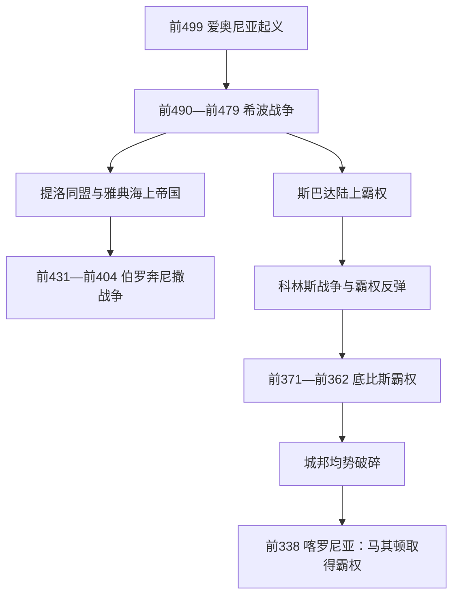

# 古典时代

## 时间

约前499年—前338年；若以波斯战争全面入侵为起点，也常写作前480年—前338年。

## 概括

古典时代不是“雅典黄金时代”的同义词，而是希腊城邦在抵抗阿契美尼德帝国、建立跨城邦同盟、争夺霸权并最终被马其顿压服的全过程。雅典以海军、贡赋同盟和较广泛的男性公民参与建立海上帝国；斯巴达依靠双王制、长老会、监察官与伯罗奔尼撒同盟维持陆上优势；底比斯、科林斯、阿尔戈斯及各联邦则不断改变均势。城邦内部的民主、寡头与僭主之争，同跨城邦战争相互放大，最终耗损了自主城邦共同维持均势的能力。

## 演进图

## 城邦政治与实际权力

古典希腊没有统一中央政府。“希腊人”共享语言、神祇、圣所和竞技传统，却分别效忠于自己的城邦。泛希腊会议和同盟通常为特定战争服务，盟主能否持续取得军费、舰队和驻军权，决定同盟会不会转化为霸权。

| 政体 / 组织 | 正式结构 | 实际权力机制 | 局限 |
|---|---|---|---|
| 雅典民主制 | 公民大会、五百人议事会、陪审法庭、年度官员与十将军 | 成年男性公民直接表决；将军因可连任、掌军费与外交而常有持续影响 | 妇女、奴隶、外邦侨民无公民政治权；帝国贡赋支撑本城福利与舰队 |
| 斯巴达混合政体 | 两个王室、五名监察官、长老会、公民大会 | 王负责军事与祭祀，监察官监督王权；斯巴达人依靠庇里阿西人和黑劳士劳动 | 全权公民人数长期减少，黑劳士反抗风险制约远征 |
| 寡头城邦 | 小规模富有家族议事机构与财产资格公民大会 | 地产、骑兵、贸易网络和外部盟主支持决定执政集团 | 容易因派系斗争招致流放、政变或外来驻军 |
| 提洛同盟 | 名义上盟邦共同议事、缴纳舰船或贡金 | 同盟金库迁至雅典后，雅典控制贡额、驻军、司法与退出权 | 盟邦脱离常遭军事镇压，逐渐成为雅典帝国 |
| 伯罗奔尼撒同盟 | 斯巴达与各盟邦分别缔约，战争时召开盟邦会议 | 斯巴达掌握陆军号召力，但科林斯等盟邦保留较大自主性 | 成员利益不一，胜利后难以形成稳定帝国治理 |
| 亚该亚、阿卡纳尼亚等联邦雏形 | 若干城邦共享会议、军队或官职 | 用共同防务扩大中小城邦的议价能力 | 本期多数联邦仍受强邻与内部地方认同限制 |

## 分阶段过程

### 希波战争与共同防卫

前499年，小亚细亚希腊城邦反抗波斯统治，雅典和埃雷特里亚提供有限援助。大流士一世平乱后远征爱琴海，前490年波斯军在马拉松败于雅典及普拉提亚援军。薛西斯一世在前480年发动规模更大的水陆进攻：温泉关失守、雅典被焚，但希腊联盟舰队在萨拉米斯迫使波斯海军退却；次年普拉提亚和米卡莱的胜利结束希腊本土面临的直接征服危机。

胜利并非所有希腊人的共同抗战神话那么整齐。一些城邦向波斯“献土献水”，另一些保持中立；雅典和斯巴达对继续向爱琴海东部进攻的目标也很快分歧。战争强化了泛希腊身份，却没有消除城邦竞争。

### 提洛同盟转化为雅典海上帝国

前478/477年，雅典主导提洛同盟，目标是保护爱琴海城邦并继续打击波斯。许多盟邦以贡金代替舰船，使雅典掌握唯一足以持续行动的大舰队。纳克索斯、萨索斯等试图退出者遭镇压；前454年同盟金库迁到雅典，贡赋被用于舰队、公共建筑和公民津贴。前449年前后对波斯的大规模战争减弱后，同盟仍未解散，防务联盟因而成为雅典帝国。

伯里克利时期，公民大会和陪审制度扩大了贫穷公民的参与，但政治平等只存在于公民共同体内部。矿山、家内劳动、作坊和农业使用奴隶；外邦侨民承担贸易和税负却无完整政治权。雅典的民主深化与盟邦受支配同时发生。

### 伯罗奔尼撒战争

战争的结构背景是雅典力量上升与斯巴达同盟的安全恐惧，直接争端包括科西拉冲突、波提狄亚叛乱和针对墨伽拉的法令。前431—前421年的阿基达穆斯战争中，斯巴达反复入侵阿提卡，雅典依靠城墙和舰队维持补给；前430年起瘟疫造成大量死亡，伯里克利亦病逝。布拉西达在色雷斯的行动和克里昂战死，促成《尼西亚斯和约》，但同盟冲突没有解决。

前415年，雅典远征西西里，统帅阿尔西比亚德被召回后叛逃，叙拉古在斯巴达援助下于前413年摧毁雅典远征军。此后波斯资助斯巴达建造舰队，雅典内部经历前411年四百人寡头政变和民主恢复。前405年羊河战役断绝雅典粮道，前404年雅典投降，长城被拆，三十僭主在斯巴达支持下掌权；民主派次年即恢复政体。

### 斯巴达、雅典与底比斯的霸权轮替

斯巴达胜利后在多地扶植十人寡头和驻军，军费与对波斯政策又使其同原盟友决裂。前395—前387/386年的科林斯战争中，雅典、底比斯、科林斯和阿尔戈斯在波斯资助下反斯巴达；“大王和约”以波斯王为仲裁者，承认小亚细亚希腊城邦归波斯，却要求希腊本土城邦“自治”，斯巴达借解释权维护优势。

前378/377年雅典建立第二次雅典同盟，承诺不恢复旧帝国式的土地占有和贡赋强制。底比斯则重建彼奥提亚联盟；前371年伊巴密浓达在留克特拉以斜线战术击败斯巴达，随后解放美塞尼亚，破坏斯巴达依赖黑劳士土地的根基。前362年曼丁尼亚战役虽由底比斯获胜，伊巴密浓达战死后无人能维持新均势。

### 马其顿夺取霸权

希腊城邦并非因一次战争突然“衰败”，而是陷入资源有限、同盟反复重组和外部财政介入的长期竞争。腓力二世改革马其顿方阵、伙伴骑兵、攻城技术和常备财政，又通过婚姻、赎俘、盟约和驻军逐步进入色萨利与希腊政治。第三次神圣战争给了他以阿波罗同盟执行者身份南下的合法入口。前338年喀罗尼亚战役中，马其顿击败雅典—底比斯联军；次年科林斯同盟确立马其顿军事领导权，城邦仍保留内部制度，却失去独立决定大战争与外交的能力。

## 重要事件

| 时间 | 事件 | 过程与转折 | 结果 / 长期影响 |
|---|---|---|---|
| 前499—前493 | 爱奥尼亚起义 | 小亚细亚城邦反波斯，雅典短暂介入；波斯海陆镇压 | 触发波斯对希腊本土的惩罚性远征 |
| 前490 | 马拉松战役 | 雅典重装步兵在波斯骑兵运用受限时主动出击 | 阻止第一次大规模入侵，提升雅典声望 |
| 前480—前479 | 萨拉米斯、普拉提亚与米卡莱 | 海军胜利切断波斯补给，陆军随后击败留守军 | 波斯无法直接征服希腊本土，爱琴海攻守转换 |
| 前478/477 | 提洛同盟建立 | 雅典接替斯巴达领导爱琴海战争 | 形成雅典舰队—贡赋体系 |
| 前462/461 | 厄菲阿尔特改革 | 削弱贵族主导的战神山议事会权力 | 公民大会、议事会与陪审法庭成为民主核心 |
| 前454 | 同盟金库迁雅典 | 雅典加强贡赋和财政控制 | 防务同盟帝国化 |
| 前431—前404 | 伯罗奔尼撒战争 | 瘟疫、西西里灾难、波斯资助斯巴达舰队构成连续转折 | 雅典帝国瓦解，希腊总体军政资源受损 |
| 前411、前404—前403 | 雅典两次寡头政变 | 战败压力下少数集团夺权，均遭反抗 | 民主恢复但社会撕裂加深 |
| 前395—前387/386 | 科林斯战争 | 旧盟友反斯巴达，波斯改变资助对象 | 大王和约显示波斯再度成为希腊均势仲裁者 |
| 前371 | 留克特拉战役 | 底比斯精锐突破斯巴达右翼 | 斯巴达陆上霸权崩解，美塞尼亚独立 |
| 前357—前355 | 同盟者战争 | 第二次雅典同盟部分盟邦反叛 | 雅典海上控制再次收缩 |
| 前338 | 喀罗尼亚战役 | 马其顿方阵与骑兵协同击败雅典—底比斯军 | 独立城邦霸权竞争终结，进入马其顿主导时代 |

## 鼎盛条件与体系失灵

### 雅典与城邦文化繁荣的条件

- 爱琴海贸易、劳里翁银矿、盟邦贡赋和海军就业为公共建设及公民津贴提供财政。
- 公民大会、法庭和剧场形成高密度公共辩论空间，悲剧、喜剧、修辞、史学与哲学彼此竞争。
- 城邦之间的竞争推动神庙、节庆、雕塑、体育和军事技术投入。
- 纸草、字母书写和跨地中海流动使思想与文本更容易传播，但口述、表演和师徒教学仍然重要。

### 衰落因素与直接转折

| 类型 | 因素 | 说明 |
|---|---|---|
| 结构因素 | 城邦规模与帝国任务不匹配 | 公民轮番任职适合城邦，却难以稳定管理大范围盟邦和长期驻军 |
| 结构因素 | 政治排斥与社会资源不均 | 公民共同体依赖妇女、侨民和奴隶劳动，改革难以覆盖全部人口 |
| 外部压力 | 波斯财政与马其顿常备军 | 波斯能改变资助对象；马其顿拥有更稳定的王室财政和专业军队 |
| 内部压力 | 霸权同盟的强制化 | 雅典、斯巴达、底比斯都因驻军、贡赋或政体输出招致盟友反弹 |
| 直接触发 | 前338年喀罗尼亚战败 | 关键联军被击溃，科林斯同盟把大战略置于马其顿王权之下 |

“古典时代结束”不等于希腊城市、民主制度或文化活动消失。雅典法庭与学园仍运行，联邦政治在希腊化时代反而更成熟；变化在于决定东地中海战争与王位的主角转为拥有常备军、宫廷和广域税源的王国。

## 演变关系

- 前一节点：[古风时代](/%E4%BA%BA%E6%96%87%E7%A7%91%E5%AD%A6/%E5%8E%86%E5%8F%B2/%E6%AC%A7%E6%B4%B2/_%E9%80%9A%E5%8F%B2/%E5%8F%A4%E5%B8%8C%E8%85%8A/%E5%8F%A4%E9%A3%8E%E6%97%B6%E4%BB%A3.md)。
- 后一节点：[马其顿霸权与亚历山大帝国](/%E4%BA%BA%E6%96%87%E7%A7%91%E5%AD%A6/%E5%8E%86%E5%8F%B2/%E6%AC%A7%E6%B4%B2/_%E9%80%9A%E5%8F%B2/%E5%8F%A4%E5%B8%8C%E8%85%8A/%E9%A9%AC%E5%85%B6%E9%A1%BF%E9%9C%B8%E6%9D%83%E4%B8%8E%E4%BA%9A%E5%8E%86%E5%B1%B1%E5%A4%A7%E5%B8%9D%E5%9B%BD.md)。
- 波斯背景：[阿契美尼德王朝](/%E4%BA%BA%E6%96%87%E7%A7%91%E5%AD%A6/%E5%8E%86%E5%8F%B2/%E8%A5%BF%E4%BA%9A/%E4%BC%8A%E6%9C%97/%E9%98%BF%E5%A5%91%E7%BE%8E%E5%B0%BC%E5%BE%B7%E7%8E%8B%E6%9C%9D.md)。
- 所属总览：[古希腊](/%E4%BA%BA%E6%96%87%E7%A7%91%E5%AD%A6/%E5%8E%86%E5%8F%B2/%E6%AC%A7%E6%B4%B2/_%E9%80%9A%E5%8F%B2/%E5%8F%A4%E5%B8%8C%E8%85%8A/README.md)。
