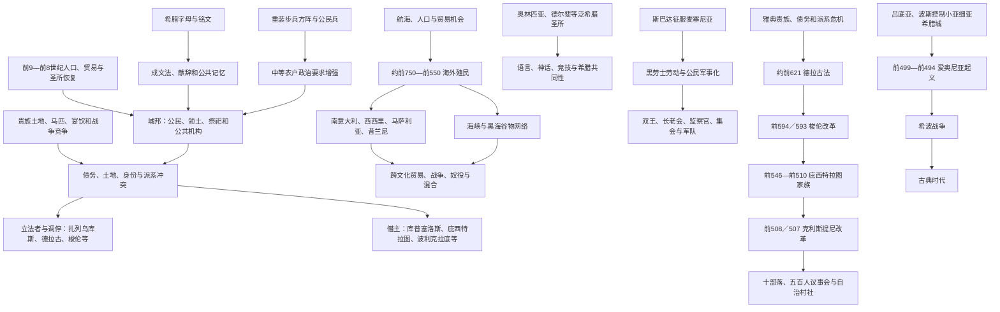

# 古风时代

## 时间

约前800—前480年。传统也常以约前500年为终点；本笔记将前499年爱奥尼亚起义和前490—前479年希波战争视为古风制度进入古典时代的过渡。

## 别称

古风希腊、城邦形成期。英文“Archaic”原指艺术风格的早期阶段，不表示社会“原始”。

## 概括

古风时代的核心不是一个希腊国家崛起，而是数百个城邦、殖民城和部族共同体在爱琴、地中海与黑海形成。人口增长、农业扩张、贵族竞争、字母书写、公共圣所和海外航海把后宫殿小共同体改造成具有领土、法律、官职、军队和公民身份的“波利斯”。城邦政体从世袭王权、贵族寡头、僭主到早期民主均有，雅典模式从来不代表全部希腊。

约前750—前550年，希腊城市在南意大利、西西里、高卢南岸、北非、黑海和海峡建立“阿波伊基亚”。新城通常政治独立于母城，同本地居民之间既有贸易、通婚和文化混合，也有夺地、奴役和战争。殖民、金属与谷物贸易、铸币和奴隶市场扩大财富，却加剧土地与债务矛盾。重装步兵和舰队需要更广泛公民参与，但不能简单说方阵自动创造民主。

斯巴达通过控制拉科尼亚、征服麦塞尼亚和黑劳士劳动形成双王、长老会、监察官与公民军体制；雅典则经德拉古、梭伦、庇西特拉图家族与克利斯提尼改革逐步扩大公民组织。科林斯、萨摩斯、米利都等僭主推动港口、神庙和殖民，也可能以暴力压制贵族。前6世纪后，吕底亚与阿契美尼德波斯控制小亚细亚希腊城，爱奥尼亚起义与波斯战争把多中心城邦世界推入古典时代。

## 城邦世界演变图

## 城邦形成

### 什么是城邦

城邦由一个或多个聚落、周围乡土、公共神庙、法律和公民共同体构成，不必拥有庞大城市。公民身份通常属于成年自由男性，并按出身、土地或部族登记；女性、奴隶、外来居民和被征服人口承担经济与宗教角色，却大多没有公民大会表决权。

城邦边界通过战争、婚姻、圣所和土地测量逐步形成。雅典整合整个阿提卡，斯巴达由数个村落和广阔被征服土地构成，岛屿小城邦可能只有一座中心。色萨利、伊庇鲁斯、马其顿等地长期保留王权或部族联盟，与城邦并存。

### 聚居与公共空间

古希腊传统常把“聚居”归功于某位英雄或立法者，实际是多代村落联合。卫城、广场、神庙、城墙、墓地和议事场所把私人贵族权力转成共同体空间。官职从终身王权变为年度或多人担任，长老会和公民集会逐步制度化，过程因城而异。

### 成文法

前7—前6世纪，多座城邦把习惯法刻在石头或木板上。成文并不自动公平，却减少贵族垄断解释。南意大利洛克里传统中的扎列乌库斯、雅典德拉古、斯巴达“莱库古大立法”等材料可靠程度不同；莱库古可能是集体传统人格化，不能列为有确切在位年表的立法君主。

## 社会与经济

### 农业、土地与债务

谷物、橄榄、葡萄、羊和山羊构成基础。人口与贸易增长使边地开垦、梯田和农业专门化扩大，土地继承与债务又造成小农失地。雅典梭伦前债务奴役、麦加拉与科林斯派系、其他城邦贫富冲突均说明公民共同体并不平等。

贵族以土地、马、宴饮、祭祀和谱系维持地位；中等农户能装备盾、矛和铠甲成为重装步兵；贫民常作轻装兵、水手、工匠或季节劳工。奴隶来自战争、海盗、债役和贸易，家庭、矿山、农场与工坊均使用，其规模依城邦与时期不同。

### 手工业与贸易

陶器、金属、纺织、船只和石雕出现专业作坊。科林斯陶器前7世纪广销，前6世纪雅典黑绘陶器后来领先。希腊人输入谷物、木材、金属、奴隶和奢侈品，输出酒、油、陶器与工艺品；实际商人包括希腊、腓尼基、伊特鲁里亚、本地居民和混合家庭。

铸币约前7世纪末在吕底亚和小亚细亚希腊城市出现，前6世纪由埃伊纳、科林斯、雅典等采用。银币方便军饷、市场和公共支付，但物物交换、称量银和信贷长期并存。雅典劳里昂银矿后来支撑海军，矿工中有大量奴隶。

## 大殖民运动

### 动因

殖民没有一个统一中央计划。土地紧张、继承冲突、内战流亡、贸易据点、矿产、谷物和个人声望均可能驱动。母城通常任命建城者“奥伊基斯特”，咨询神谕并组织居民；新城建立后一般拥有自己的公民、法律和外交，不是母城海外行省。

殖民者并非全是贫民，贵族和工匠可领导；也不一定与母城保持友好。科林斯与科西拉后来战争，说明血缘祭祀联系不等于政治服从。

### 主要方向

| 区域 | 代表城市 / 据点 | 大致建立 | 关系与影响 |
|---|---|---|---|
| 优卑亚—意大利 | 皮特库塞、库迈 | 约前8世纪中叶 | 金属、伊特鲁里亚和黎凡特商贸；希腊字母西传。 |
| 南意大利 | 塔兰托、克罗顿、锡巴里斯、洛克里等 | 前8—前7世纪 | 形成“大希腊”，同奥诺特里亚、卢卡尼亚等本地人竞争与混合。 |
| 西西里 | 纳克索斯、叙拉古、杰拉、阿克拉加斯等 | 前8—前6世纪 | 希腊城、腓尼基城与西坎、西库尔等本地共同体长期争战。 |
| 高卢与伊比利亚 | 马萨利亚、恩波里翁 | 约前600年、前575年 | 建立罗讷河、伊比利亚东北和西地中海贸易。 |
| 北非 | 昔兰尼 | 约前630年 | 来自锡拉的殖民者建立王权城市，同利比亚人交涉、冲突和通婚。 |
| 海峡与黑海 | 拜占庭、赫拉克利亚、锡诺普、奥尔比亚等 | 前7—前6世纪 | 获取谷物、鱼、木材、金属与奴隶，连接斯基泰等社会。 |
| 埃及 | 瑙克拉提斯 | 前7—前6世纪 | 在法老许可下形成多城邦商贸和圣所区，不是征服殖民地。 |
| 北爱琴与色雷斯 | 塔索斯、阿布德拉、哈尔基迪基诸城 | 前7—前6世纪 | 矿山、木材和航道，与色雷斯共同体竞争。 |

### 本地社会与殖民暴力

新城需要土地、港口和水源，可能通过条约、婚姻购买或武力取得。叙拉古压迫西库尔人，赫拉克利亚奴役当地玛里安底尼人，斯巴达人建立塔兰托的故事也涉及内争。另一些地点形成双语社区和混合艺术。只写“传播文明”会掩盖本地人主动性、失地和奴役；只写“殖民侵略”又会漏掉贸易、通婚和共同建城。

## 重装步兵与战争

### 方阵

重装步兵使用圆盾、长矛、头盔和护甲，密集队形依赖邻兵保护。装备昂贵，多由能自备武器的农户承担。前7世纪后方阵重要性上升，但贵族骑兵、轻装兵、弓手和舰队仍不可缺，战法也逐步演变。

旧说认为方阵使中农取得军事力量，从而必然要求民主。实际寡头、僭主与民主城邦都使用方阵，政治变化还取决于土地、债务、派系和海军。斯巴达公民军建立在黑劳士强制劳动上，更说明公民平等可同他人不自由并存。

### 城邦战争

争夺边界、牧场、圣所和贸易的战争频繁。优卑亚“勒兰托斯战争”被后世称多城大战，时间和规模材料有限；第一次神圣战争传统涉及德尔斐控制，同样可能被后世重构。战争通常季节性，却会导致屠杀、奴役和土地兼并。

## 斯巴达形成

### 征服和人口等级

斯巴达由拉科尼亚数村联合，约前8—前7世纪征服麦塞尼亚。被征服人口和拉科尼亚黑劳士为国家耕地、交纳收成；边民“佩里奥伊科伊”有地方共同体和经商工艺权，但无斯巴达政治权。成年男性公民“斯巴达人”需参加公共食堂和军事训练，若无力缴纳份额可能失去完整地位。

第二次麦塞尼亚战争的精确年代和英雄故事多来自后世。黑劳士人数与反抗风险促使斯巴达维持严密军政，却不能说全部制度一次由莱库古创造。

### 统治结构

| 机构 / 群体 | 构成 | 职能 | 权力限制 |
|---|---|---|---|
| 双王 | 阿吉亚德、欧里庞提德两王室各一王 | 军事指挥、祭祀、部分司法 | 受监察官、长老会和彼此竞争限制。 |
| 长老会 | 两王加28名60岁以上长老 | 预审议案、重大审判 | 终身贵族色彩强。 |
| 监察官 | 每年5人 | 监督国王、教育、外交和行政 | 任期短，可代表公民共同体制衡王权。 |
| 公民大会 | 成年男性斯巴达人 | 接受或否决提案、选举长老和监察官 | 辩论和议程能力有限。 |
| 公共食堂与训练 | 公民男性共同体 | 维持军纪和身份 | 经济门槛导致公民人数长期下降。 |
| 黑劳士 | 国家控制的依附农业人口 | 提供粮食与劳力 | 无政治权，遭强制和周期性恐吓。 |

约前6世纪，斯巴达不再直接吞并多数伯罗奔尼撒城，而通过条约形成后称伯罗奔尼撒同盟的体系；盟邦保留政体，战争时提供军队。斯巴达由此成为希波战争前最强陆军领导者。

## 雅典制度演变

### 贵族政治与危机

王权逐步被执政官、战神山议事会和贵族家族取代。约前632年库隆试图夺权失败，其支持者在圣所求庇护后被杀，引发“阿尔克迈翁家族污染”政治记忆。约前621年德拉古把杀人等法律成文化，后世因刑罚严酷形成“德拉古式”一词；其完整法典内容并未保存。

### 梭伦改革

前594／593年梭伦任执政官，在贵族与债务农民冲突中调停：

- 取消以公民身体担保的债务，释放或召回部分债务奴隶，即“解负令”。
- 按财产把公民分四级，官职和军役同财富相连，削弱纯出生贵族垄断。
- 扩大上诉和陪审参与，并调整议事机构；许多细节由后世追述。
- 保留财富差异和奴隶制，没有分配土地，也未建立成熟民主。

改革缓解部分危机，却没有终结派系冲突。

### 庇西特拉图家族

庇西特拉图前561／560年首次夺权，经历两次流亡，约前546年稳定统治至前527年去世。其政权保留执政官和法律，通过盟友、雇佣军与财富控制政治，同时发展道路、喷泉、雅典娜节、狄俄尼索斯节和乡村司法。小农贷款与宗教政策增强中央城邦认同，不能只称无制度暴君。

其子希庇亚斯与喜帕恰斯继承。前514年哈摩狄奥斯、阿里斯托革顿因私人和政治冲突刺杀喜帕恰斯；后来民主记忆称二人为“弑僭主者”。希庇亚斯统治转严，前510年斯巴达干预将其驱逐。

### 克利斯提尼改革

贵族伊萨戈拉斯与克利斯提尼争权，伊萨戈拉斯获斯巴达王克里奥梅尼斯支持，试图解散议事会，引发雅典人抵抗。前508／507年克利斯提尼回归并推行改革：

- 以居住村社“德莫”登记公民，降低宗族对身份的垄断。
- 把沿海、城市、内陆单位组合为十个新部落，打散地区派系。
- 建立五百人议事会，每部落50人轮值准备大会事务。
- 十部落成为军队、官职和祭祀基础。
- 放逐投票制度可能稍后实际使用，不能把所有民主制度都归同一年。

改革建立更广泛公民参与框架，但女性、奴隶、外侨仍被排除，陪审津贴和激进民主是5世纪进一步发展。

## 其他城邦与僭主

### 科林斯

巴基斯贵族集团被库普塞洛斯约前657年推翻，其子佩里安德经营港口、殖民和税收。科林斯控制地峡、莱凯翁和肯克里艾两港，殖民科西拉与叙拉古，成为陶器和航运中心。僭主下台后转为寡头政体。

### 阿尔戈斯

斐冬王或僭主传统同度量衡、阿尔戈斯军事兴起相连，年代争议。阿尔戈斯以重装步兵挑战斯巴达，前6世纪后在伯罗奔尼撒竞争中相对受挫，但保持独立城邦。

### 萨摩斯与波利克拉底

前6世纪后期波利克拉底依靠舰队、工程、海盗与埃及关系建立海上强权，后被波斯总督诱杀。萨摩斯隧道、神庙和港口反映僭主能集中资源，统治也依赖强制和个人外交。

### 小亚细亚诸城

米利都、以弗所、萨摩斯、福西亚等是贸易、哲学和殖民中心。先受吕底亚王国影响，前546年后多被阿契美尼德波斯控制，通常由本地僭主纳贡。波斯统治可保留城市制度，却把外交和税收纳入帝国。

## 宗教、竞技与共同身份

奥林匹亚、德尔斐、伊斯特米亚和尼米亚竞技节吸引不同城邦，神谕、祭祀、市场和停战提供交流。各城拥有保护神和地方历法，泛希腊神祇不消灭地方差异。

德尔斐神谕参与殖民合法化与外交，答辞常由后世重新编写，不可逐字视为预测。城邦在圣所奉献宝库和雕像，以共同宗教进行政治竞争。希腊身份逐步以语言、神祇、祭祀和对“蛮语者”的区别表达，仍不足以建立统一国家。

## 文化与思想

### 诗歌

荷马史诗、赫西俄德、阿尔基洛科斯、萨福、阿尔凯奥斯、提尔泰奥斯和品达前辈等通过史诗、挽歌、抒情诗讨论战争、宴饮、爱、劳动和城邦。诗歌多在表演中传播，后世文本定本不等于创作当时已固定。

### 自然哲学

前6世纪米利都的泰勒斯、阿那克西曼德、阿那克西美尼试图用水、无限者、空气等自然原理解释宇宙；毕达哥拉斯传统连接数学、音乐和灵魂；色诺芬尼批判拟人神。人物著作多由后世片段保存，思想并非从神话突然转为“纯科学”，宗教和理性解释长期共存。

### 艺术与建筑

东方化风格吸收近东动物、植物和工艺，后发展为黑绘陶器、大理石青年／少女像和多立克、爱奥尼亚柱式。大型石庙把城市财富、神祇和公民劳动结合。所谓“古风微笑”是雕塑程式，不一定表示人物情绪。

## 爱奥尼亚起义与时代转折

前499年，米利都僭主阿里斯塔戈拉斯在纳克索斯远征失败后发动反波斯起义，爱奥尼亚多城加入，雅典与埃雷特里亚提供有限援军并焚烧萨迪斯。波斯逐步反攻，前494年拉德海战后米利都陷落。

起义原因包括僭主政治、贡赋、地方自主和阿里斯塔戈拉斯个人危机，不能简化为“民主希腊反东方专制”。大流士一世随后惩罚雅典与埃雷特里亚并重建爱琴控制，引发前490年远征；薛西斯前480年大举入侵，城邦在分裂和联盟中进入古典希波战争。

## 重要事件

| 时间 | 事件 | 直接结果 | 长期意义 |
|---|---|---|---|
| 约前800年 | 多地城邦与公共圣所可见度上升 | 公民、领土和机构逐步形成 | 古风城邦世界展开。 |
| 传统前776年 | 首届奥运会纪年 | 后世建立胜者序列 | 成为泛希腊历法和竞技象征。 |
| 约前750—前550年 | 大殖民运动 | 希腊城市遍布地中海与黑海 | 贸易、文化混合、夺地和奴隶网络扩大。 |
| 前8—前7世纪 | 斯巴达征服麦塞尼亚 | 黑劳士劳动支撑公民军 | 形成特殊军政与持续安全压力。 |
| 前7世纪末 | 铸币在小亚细亚出现 | 市场和军饷工具发展 | 前6世纪多城采用本城币。 |
| 约前657年 | 库普塞洛斯夺取科林斯 | 巴基斯贵族统治终结 | 僭主成为贵族危机的一种解决。 |
| 约前621年 | 德拉古立法 | 杀人法等成文 | 法律解释部分脱离贵族口传。 |
| 前594／593年 | 梭伦改革 | 取消公民债务奴役、按财产分级 | 为雅典公民政治扩展奠基。 |
| 约前546—前527年 | 庇西特拉图稳定统治 | 雅典中央祭祀、工程和乡村行政加强 | 僭主国家为民主机构提供部分基础。 |
| 前546年 | 波斯征服吕底亚 | 小亚细亚希腊城纳入阿契美尼德帝国 | 爱琴政治进入帝国竞争。 |
| 前510年 | 希庇亚斯被逐 | 雅典僭主制结束 | 贵族派系冲突触发制度改革。 |
| 前508／507年 | 克利斯提尼改革 | 十部落、德莫和五百人议事会建立 | 雅典民主基本空间形成。 |
| 前499—前494年 | 爱奥尼亚起义 | 波斯恢复控制、米利都陷落 | 直接导向波斯惩罚远征。 |
| 前490年 | 马拉松战役 | 雅典等击退波斯军 | 古风城邦进入古典希波战争。 |

## 古风繁荣条件

- 宫殿后分散共同体逐步恢复人口、农业和海运。
- 字母、成文法和公共圣所降低亲族垄断记忆的程度。
- 殖民和贸易提供土地、金属、谷物、奴隶和精英声望。
- 重装步兵与舰队扩大对非贵族公民的军事依赖。
- 贵族派系竞争迫使立法、僭主和新公民组织出现。
- 泛希腊竞技和神谕既协调冲突，也提供竞争舞台。
- 与腓尼基、吕底亚、埃及、意大利和黑海社会的交流输入技术与观念。

## 结构矛盾与时代终结

### 内部矛盾

公民政治建立在排斥女性、外侨、奴隶和被征服者之上；土地与财富不均持续。僭主能打破旧贵族，却依赖家族和武力，继承后容易失去合法性。城邦主权鼓励制度创新，也使希腊难以建立稳定共同防务。

### 外部压力

吕底亚、迦太基、伊特鲁里亚和波斯都参与同希腊城市竞争，不能把希腊扩张当作单向过程。阿契美尼德帝国控制小亚细亚后，爱琴城邦面对更大财政军事实体；部分希腊人反抗，另一些为波斯服务。

### 直接转折

爱奥尼亚起义失败和波斯两次远征迫使本土城邦建立临时联盟。马拉松、温泉关、萨拉米斯和普拉提亚的战争改变海权与盟邦关系，雅典海军和提洛同盟随后兴起，标志古典时代新霸权结构。

## 长期影响

1. 城邦把政治共同体、领土和公民身份结合，成为后世希腊历史核心，但并非现代民主国家。
2. 殖民城市独立发展，使希腊文化成为跨地中海网络，也带来对本地居民的战争和奴役。
3. 雅典改革形成直接参与机制，斯巴达则形成混合政体和公民军，两者都依赖非公民劳动。
4. 字母、法典、诗歌和铸币扩大公共交换，为史学、哲学和古典艺术提供基础。
5. 泛希腊宗教增强共同身份，却未消除城邦战争。
6. 小亚细亚与近东交流对哲学、数学和艺术至关重要，古希腊不是孤立“西方奇迹”。
7. 城邦分散和联盟竞争后来既抵抗波斯，也导致雅典、斯巴达和马其顿争夺霸权。

## 关键辨析

- 古风时代不是“落后的古典时代前奏”，其制度、殖民和社会转型本身完整。
- 城邦是公民与领土共同体，不等于只有一座城市或现代城市国家。
- 公民权通常排除大多数居民，雅典改革也未建立普遍选举权。
- 重装步兵方阵可能扩大中农作用，但不会自动产生民主。
- 海外阿波伊基亚通常独立于母城，不是希腊统一殖民帝国的省。
- 殖民同时包含贸易、通婚、混合、夺地、奴役和战争，不能只写文化传播。
- 铸币起源同吕底亚—小亚细亚交流相关，不是希腊本土单独发明。
- 斯巴达制度由数代形成，“莱库古”是否单一历史人物无法确认。
- 黑劳士不是普通农奴，其受国家强制和身份世袭具有特殊性。
- 梭伦取消债务奴役未废除所有奴隶制，也没有重新平均分地。
- 庇西特拉图是僭主，但保留法律和官职；“僭主”初义不等于现代极权独裁者。
- 克利斯提尼改革奠定雅典民主，成熟激进民主和津贴制度属5世纪。
- 爱奥尼亚起义既有自主诉求也有僭主个人和帝国财政因素，不是纯粹东西文明战争。
- 波斯帝国常保留本地城邦与僭主，不能只用“专制”概括。

## 演变关系

- 前一阶段：[希腊黑暗时代](/%E4%BA%BA%E6%96%87%E7%A7%91%E5%AD%A6/%E5%8E%86%E5%8F%B2/%E6%AC%A7%E6%B4%B2/_%E9%80%9A%E5%8F%B2/%E5%8F%A4%E5%B8%8C%E8%85%8A/%E5%B8%8C%E8%85%8A%E9%BB%91%E6%9A%97%E6%97%B6%E4%BB%A3.md)。
- 后一阶段：[古典时代](/%E4%BA%BA%E6%96%87%E7%A7%91%E5%AD%A6/%E5%8E%86%E5%8F%B2/%E6%AC%A7%E6%B4%B2/_%E9%80%9A%E5%8F%B2/%E5%8F%A4%E5%B8%8C%E8%85%8A/%E5%8F%A4%E5%85%B8%E6%97%B6%E4%BB%A3.md)。
- 波斯背景：[阿契美尼德王朝](/%E4%BA%BA%E6%96%87%E7%A7%91%E5%AD%A6/%E5%8E%86%E5%8F%B2/%E8%A5%BF%E4%BA%9A/%E4%BC%8A%E6%9C%97/%E9%98%BF%E5%A5%91%E7%BE%8E%E5%B0%BC%E5%BE%B7%E7%8E%8B%E6%9C%9D.md)。
- 西地中海互动：[腓尼基、希腊与迦太基殖民](/%E4%BA%BA%E6%96%87%E7%A7%91%E5%AD%A6/%E5%8E%86%E5%8F%B2/%E6%AC%A7%E6%B4%B2/%E4%BC%8A%E6%AF%94%E5%88%A9%E4%BA%9A%E5%8D%8A%E5%B2%9B/%E8%85%93%E5%B0%BC%E5%9F%BA%E3%80%81%E5%B8%8C%E8%85%8A%E4%B8%8E%E8%BF%A6%E5%A4%AA%E5%9F%BA%E6%AE%96%E6%B0%91.md)。
- 所属总览：[古希腊](/%E4%BA%BA%E6%96%87%E7%A7%91%E5%AD%A6/%E5%8E%86%E5%8F%B2/%E6%AC%A7%E6%B4%B2/_%E9%80%9A%E5%8F%B2/%E5%8F%A4%E5%B8%8C%E8%85%8A/README.md)。
