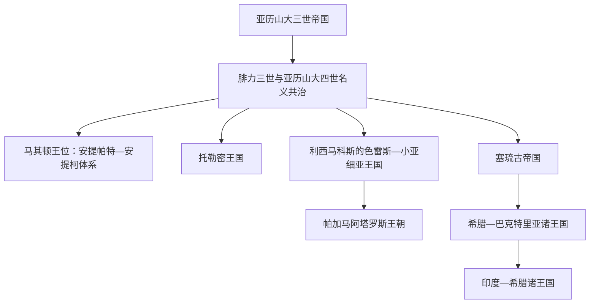

# 希腊化主要王国统治者世系表

## 范围

本表集中维护亚历山大帝国分裂后四个核心希腊化王国的公认统治者：马其顿王位、托勒密埃及、塞琉古帝国和帕加马。统治年代在共治、地方割据和古代纪年换算上可能相差一至两年，故对争议项使用“约”或在备注说明。希腊—巴克特里亚和印度—希腊诸王的钱币序列仍有大量年代、共治与领地重叠争议，不在此表伪造单一连续王统；其区域线索见南亚与伊朗相关笔记。

## 世系分流图

## 马其顿王位完整序列

阿吉德共王以前的王位见[马其顿霸权与亚历山大帝国](/%E4%BA%BA%E6%96%87%E7%A7%91%E5%AD%A6/%E5%8E%86%E5%8F%B2/%E6%AC%A7%E6%B4%B2/_%E9%80%9A%E5%8F%B2/%E5%8F%A4%E5%B8%8C%E8%85%8A/%E9%A9%AC%E5%85%B6%E9%A1%BF%E9%9C%B8%E6%9D%83%E4%B8%8E%E4%BA%9A%E5%8E%86%E5%B1%B1%E5%A4%A7%E5%B8%9D%E5%9B%BD.md)。下表从亚历山大死后列至罗马废除马其顿王国；非安提柯王朝的过渡统治者、复位和争位均单列。

| 顺序 | 统治者 | 在位 / 控制时间 | 王室与继承关系 | 关键事件 / 备注 |
|---:|---|---|---|---|
| 1 | 腓力三世·阿里达奥斯 | 前323—前317 | 阿吉德王朝，亚历山大异母兄 | 与亚历山大四世共王，实权由摄政与王后欧律狄刻掌握；被奥林匹亚丝处死 |
| 2 | 亚历山大四世 | 前323—前309/308 | 阿吉德王朝，亚历山大遗腹子 | 幼年共王，后被卡山德秘密杀害 |
| 3 | 卡山德 | 前305—前297；前317起控制马其顿 | 安提帕特之子，娶亚历山大同父异母妹帖撒罗妮卡 | 清除阿吉德继承人后称王 |
| 4 | 腓力四世 | 前297 | 卡山德长子 | 在位数月病死 |
| 5 | 亚历山大五世 | 前297—前294 | 卡山德之子，与安提帕特二世分治 | 邀皮洛士和德米特里援助，后被德米特里杀死 |
| 6 | 安提帕特二世 | 前297—前294 | 卡山德之子，与亚历山大五世分治 | 杀母帖撒罗妮卡；败亡后仍短暂争位 |
| 7 | **德米特里一世“围城者”** | 前294—前288 | 安提柯一世之子，前306已称王 | 夺取马其顿；因扩张计划遭皮洛士与利西马科斯夹击而逃亡 |
| 8 | 利西马科斯 | 前288—前281 | 亚历山大旧将，色雷斯国王 | 与皮洛士分占后独掌；库鲁佩迪安战败身亡 |
| 9 | 皮洛士 | 前288—前284；前274—前272 | 伊庇鲁斯埃阿喀得王室 | 两次占据马其顿部分或王位，均未建立稳定继承 |
| 10 | 托勒密·克劳诺斯 | 前281—前279 | 托勒密一世之子 | 杀塞琉古一世后夺位；对凯尔特人作战阵亡 |
| 11 | 墨勒阿革洛斯 | 前279 | 托勒密·克劳诺斯之弟 | 军队拥立约两个月后废黜 |
| 12 | 安提帕特·厄特西亚斯 | 前279 | 安提帕特家族王位竞争者 | 统治约45天，后被逐 |
| 13 | 索斯特涅斯 | 前279—前277 | 将领，拒绝或未稳定使用国王称号 | 组织抵抗凯尔特入侵；死后权力真空 |
| 14 | **安提柯二世·戈纳塔斯** | 前277—前274；前272—前239 | 德米特里一世之子 | 击败凯尔特人后立国；被皮洛士短暂逐出，复位后建立稳定安提柯王朝 |
| 15 | 德米特里二世 | 前239—前229 | 安提柯二世之子 | 与埃托利亚、亚该亚同盟战争；死时继承人年幼 |
| 16 | 安提柯三世·多宋 | 前229—前221 | 王族，先任腓力五世摄政，约前227称王 | 重组希腊同盟，在塞拉西亚击败斯巴达 |
| 17 | 腓力五世 | 前221—前179 | 德米特里二世之子，安提柯三世养子 / 受托继承人 | 参与马其顿战争；前197年库诺斯克法莱战败，丧失希腊霸权 |
| 18 | 珀尔修斯 | 前179—前168 | 腓力五世之子 | 第三次马其顿战争中皮德纳战败，被俘；王国被罗马废除 |
| — | 安德里斯库斯“腓力六世” | 前149—前148 | 自称珀尔修斯之子，王位冒认者 | 发动第四次马其顿战争，一度恢复王国形式；被罗马击败，不纳入安提柯合法世系编号 |

## 托勒密王国完整世系

“在位”包含共治与复位。托勒密王室频繁采用兄妹婚、共同王权和王后神化；表中因此把具有主权称号和实际统治作用的女王、共王分别列出。

| 顺序 | 统治者 | 在位时间 | 继承 / 共治关系 | 关键事件 / 备注 |
|---:|---|---|---|---|
| 1 | **托勒密一世·索特尔** | 前305—前282；前323起任埃及总督 | 亚历山大旧将，王朝建立者 | 控制埃及、昔兰尼与塞浦路斯部分地区；建立亚历山大里亚宫廷 |
| 2 | 托勒密二世·费拉德尔福斯 | 前285—前246；前285—前282与父共治 | 托勒密一世之子 | 强化官僚税制、海军与王室祭祀；与阿尔西诺伊二世共掌宫廷 |
| — | 阿尔西诺伊二世 | 约前277—前270 | 托勒密二世之姊妹王后，被神化共治者 | 是否以独立在位国王计数有争议，但肖像、称号和祭祀显示显著共同王权 |
| 3 | 托勒密三世·欧厄尔盖特斯 | 前246—前222 | 托勒密二世之子 | 第三次叙利亚战争扩大势力，王国达鼎盛 |
| 4 | 托勒密四世·费拉帕托尔 | 前221—前204 | 托勒密三世之子 | 前217年拉菲亚获胜；宫廷权臣与上埃及反抗加剧 |
| 5 | 托勒密五世·埃庇法涅斯 | 前204—前180 | 托勒密四世幼子 | 摄政争斗；失去柯里叙利亚；《罗塞塔石碑》属其加冕诏令 |
| — | 克娄巴特拉一世 | 前180—前176摄政 | 托勒密五世王后、塞琉古公主 | 为幼子托勒密六世摄政，缓和对塞琉古冲突 |
| 6 | 托勒密六世·费洛墨托尔 | 前180—前164；前163—前145 | 托勒密五世之子 | 先受母后摄政；与弟妹共治，多次受塞琉古入侵和亚历山大里亚政变影响 |
| 7 | 托勒密八世·费斯孔 | 前170—前163共治；前145—前131；前127—前116 | 托勒密六世之弟 | 被逐后统治昔兰尼；复位埃及并经历与克娄巴特拉二世内战 |
| — | 克娄巴特拉二世 | 前170—前164、前163—前127、前124—前116等阶段共治 | 托勒密六世之妹与王后，后嫁托勒密八世 | 前131—前127年在亚历山大里亚单独执政，后与托勒密八世和解 |
| 8 | 托勒密七世·尼奥斯·费洛帕托尔 | 约前145 | 可能为托勒密六世之子 | 是否正式在位及是否即后来托勒密·孟斐忒斯存在争议，列而不隐 |
| — | 克娄巴特拉三世 | 前142/前124—前101共治 | 托勒密八世之妻兼侄女 | 与母克娄巴特拉二世、丈夫及两子先后共治，主导继承安排 |
| 9 | 托勒密九世·拉塞罗斯 | 前116—前107；前88—前81 | 托勒密八世之子 | 被母后逐出后在塞浦路斯立足，后复位 |
| 10 | 托勒密十世·亚历山大一世 | 前107—前88 | 托勒密八世之子，托勒密九世之弟 | 与母后克娄巴特拉三世共治，后杀母；遭亚历山大里亚人驱逐 |
| 11 | 贝勒尼基三世 | 前101—前88与父 / 夫共治；前81—前80独掌 | 托勒密九世之女 | 独立女王约半年；被托勒密十一世杀害 |
| 12 | 托勒密十一世·亚历山大二世 | 前80 | 托勒密十世之子 | 在罗马支持下娶贝勒尼基三世，杀妻后被民众杀死，在位约19天 |
| 13 | 托勒密十二世·奥勒忒斯 | 前80—前58；前55—前51 | 托勒密九世之子，出身合法性受质疑 | 依赖罗马承认；被逐后由罗马军队送回 |
| 14 | 贝勒尼基四世 | 前58—前55 | 托勒密十二世之女 | 父王流亡期间统治；父复位后被处死 |
| 15 | **克娄巴特拉七世** | 前51—前30 | 托勒密十二世之女 | 先后与两弟及儿子共治；利用与凯撒、安东尼联盟维护王国，亚克兴战败后自杀 |
| 16 | 托勒密十三世 | 前51—前47 | 托勒密十二世幼子，与克娄巴特拉七世共治 | 宫廷派系驱逐姐姐；亚历山大里亚战争中溺亡 |
| 17 | 托勒密十四世 | 前47—前44 | 托勒密十三世之弟，与克娄巴特拉七世共治 | 凯撒安排下即位，死因不明 |
| 18 | 托勒密十五世·凯撒里昂 | 前44—前30 | 克娄巴特拉七世之子，宣称凯撒之子 | 幼年共王；罗马征服后被屋大维处死 |

## 塞琉古帝国完整世系与并立王位

塞琉古后期常有安条克与大马士革两宫廷并立。同一时期的竞争者各自编号，不能把他们写成单线父子继承。

| 顺序 | 统治者 | 在位时间 | 继承 / 权力基础 | 关键事件 / 备注 |
|---:|---|---|---|---|
| 1 | **塞琉古一世·尼卡托尔** | 前305—前281；前312起重掌巴比伦 | 亚历山大旧将，王朝建立者 | 建立从叙利亚到伊朗的帝国；前281年被托勒密·克劳诺斯刺杀 |
| 2 | 安条克一世·索特尔 | 前281—前261；前292起共治 | 塞琉古一世之子 | 镇压叛乱并抵御凯尔特人；与托勒密争夺叙利亚 |
| 3 | 安条克二世·忒奥斯 | 前261—前246 | 安条克一世之子 | 第二次叙利亚战争；婚姻继承安排引爆王室危机 |
| 4 | 塞琉古二世·卡利尼库斯 | 前246—前225 | 安条克二世与劳迪丝之子 | 与贝勒尼基一派及托勒密三世战争；东方帕提亚、巴克特里亚脱离 |
| — | 安条克·希耶拉克斯 | 约前241—前228 | 塞琉古二世之弟，小亚细亚竞争国王 | 受母亲与地方盟友支持，自立争位，最终败亡 |
| 5 | 塞琉古三世·克劳诺斯 | 前225—前223 | 塞琉古二世之子 | 远征小亚细亚时被军中刺杀 |
| 6 | **安条克三世“大帝”** | 前223—前187 | 塞琉古三世之弟 | 东方再征服后控制柯里叙利亚；马格尼西亚败于罗马，财政负担加重 |
| 7 | 塞琉古四世·费洛帕托尔 | 前187—前175 | 安条克三世之子 | 承担对罗马赔款，被权臣赫利奥多罗斯杀害 |
| 8 | 安条克四世·埃庇法涅斯 | 前175—前164 | 安条克三世之子，塞琉古四世之弟 | 夺侄子王位；干预犹太宗教引发马加比起义 |
| 9 | 安条克五世·欧帕托尔 | 前164—前162 | 安条克四世幼子 | 由吕西阿斯摄政，被堂兄德米特里一世处死 |
| 10 | 德米特里一世·索特尔 | 前162—前150 | 塞琉古四世之子 | 自罗马逃回夺位；被亚历山大·巴拉斯击败身亡 |
| 11 | 亚历山大一世·巴拉斯 | 前150—前145 | 自称安条克四世之子，获托勒密与罗马支持 | 击败德米特里一世后失去盟友，战败被杀 |
| 12 | 德米特里二世·尼卡托尔 | 前145—前138；前129—前125 | 德米特里一世之子 | 两度在位，中间被帕提亚俘虏；与多名竞争者并立 |
| 13 | 安条克六世·狄奥尼索斯 | 前145—约前142 | 亚历山大·巴拉斯幼子 | 由狄奥多特·特里丰拥立为傀儡，后死因可疑 |
| 14 | 狄奥多特·特里丰 | 约前142—前138 | 将领，自立国王 | 先借安条克六世名义统治，后称王；败于安条克七世 |
| 15 | 安条克七世·西德特斯 | 前138—前129 | 德米特里一世之子、德米特里二世之弟 | 一度恢复帝国并东征帕提亚，战死后东方霸权终结 |
| 16 | 亚历山大二世·扎比纳斯 | 前128—前123 | 托勒密八世扶植的冒认者 | 与德米特里二世、克娄巴特拉·忒娅一系竞争，被安条克八世击败 |
| 17 | 克娄巴特拉·忒娅 | 前125—前121，亦长期以王后共治 | 托勒密公主，先后嫁三位塞琉古王 | 杀长子塞琉古五世，后与安条克八世共治，最终被其毒杀 |
| 18 | 塞琉古五世·费洛墨托尔 | 前126/125 | 德米特里二世与克娄巴特拉·忒娅之子 | 未经母后许可即称王，旋被母亲处死 |
| 19 | 安条克八世·格里普斯 | 前125—前96 | 德米特里二世之子 | 前114年后与异母弟安条克九世长期分治内战 |
| 20 | 安条克九世·库齐刻诺斯 | 前114—前95 | 安条克七世之子 | 控制南部等地，与安条克八世并立；战败被杀 |
| 21 | 塞琉古六世·埃庇法涅斯 | 前96—前94 | 安条克八世之子 | 杀安条克九世后被其子反击；在摩普绥提亚遇害 |
| 22 | 安条克十世·欧塞贝斯 | 前95—约前92/前88 | 安条克九世之子 | 与多位堂兄弟并立；死亡年代不确定 |
| 23 | 安条克十一世·埃庇法涅斯 | 前94—前93 | 安条克八世之子 | 与兄弟腓力一世并立，进攻安条克失败溺亡 |
| 24 | 腓力一世·菲拉德尔福斯 | 前94—约前83 | 安条克八世之子 | 长期控制叙利亚北部；提格兰二世接管后去向不明 |
| 25 | 德米特里三世·欧凯罗斯 | 前96—前87 | 安条克八世之子，受托勒密九世扶植 | 以大马士革为中心，与兄弟和安条克十世竞争；被帕提亚俘虏 |
| 26 | 安条克十二世·狄奥尼索斯 | 前87—前84 | 安条克八世之子 | 以大马士革为中心，对纳巴泰战争中阵亡 |
| — | 提格兰二世 | 约前83—前69 | 亚美尼亚国王，受叙利亚城市或贵族接受 | 不是塞琉古王族；填补王朝内战造成的权力真空，后被罗马逐出 |
| 27 | 安条克十三世·阿西亚提库斯 | 前69—前64 | 安条克十世之子 | 在罗马许可下短暂复位；庞培废除塞琉古王国 |
| 28 | 塞琉古七世·菲洛墨托尔 | 约前70年代 | 身份与统治范围有争议，或为克娄巴特拉·塞勒涅之子 | 主要据钱币和晚期资料，是否实际统治叙利亚不明 |
| 29 | 腓力二世·菲洛罗迈奥斯 | 前65—前64 | 腓力一世之子 | 与安条克十三世争位；罗马设叙利亚行省后退出历史记录 |

## 帕加马阿塔罗斯王朝完整世系

| 顺序 | 统治者 | 统治时间 | 继承关系 | 关键事件 / 备注 |
|---:|---|---|---|---|
| 1 | 菲莱泰罗斯 | 前282—前263 | 利西马科斯部将，后独立；无子 | 掌帕加马堡垒与金库，以捐赠和外交建立地方统治；未正式称王 |
| 2 | 欧迈尼斯一世 | 前263—前241 | 菲莱泰罗斯之侄兼养子 | 击败塞琉古一世系军队，取得实际独立；仍未称王 |
| 3 | **阿塔罗斯一世** | 前241—前197 | 欧迈尼斯一世的堂侄 / 养嗣 | 击败加拉太人后称王；与罗马结盟 |
| 4 | 欧迈尼斯二世 | 前197—前159 | 阿塔罗斯一世长子 | 协助罗马击败安条克三世，阿帕米亚和约后领土大增 |
| 5 | 阿塔罗斯二世 | 前159—前138 | 欧迈尼斯二世之弟 | 此前长期辅政；维持亲罗马路线并建设帕加马 |
| 6 | 阿塔罗斯三世 | 前138—前133 | 欧迈尼斯二世之子 | 遗嘱把王国交给罗马，具体动机与遗嘱政治存在争议 |
| — | 阿里斯托尼库斯“欧迈尼斯三世” | 前133—前129 | 自称欧迈尼斯二世之子 | 反对遗赠并争取城市下层与乡村力量，最终被罗马俘获；属争位者 |

## 其他继业者王国与东部诸王

- 利西马科斯在前306年称王，前281年库鲁佩迪安战死后，其色雷斯—小亚细亚王国没有形成稳定世袭王朝，部分资源和领地最终促成帕加马兴起。
- 伊庇鲁斯皮洛士属于埃阿喀得王室，其意大利战争和两度取得马其顿王位见[希腊化时代](/%E4%BA%BA%E6%96%87%E7%A7%91%E5%AD%A6/%E5%8E%86%E5%8F%B2/%E6%AC%A7%E6%B4%B2/_%E9%80%9A%E5%8F%B2/%E5%8F%A4%E5%B8%8C%E8%85%8A/%E5%B8%8C%E8%85%8A%E5%8C%96%E6%97%B6%E4%BB%A3.md)；他不是安提柯王朝成员。
- 希腊—巴克特里亚和印度—希腊王权存在同时多中心、同名国王、钱币重铸和年代争议。与其把重叠政权硬排成虚假直线，应在[塞琉古统治与希腊化伊朗](/%E4%BA%BA%E6%96%87%E7%A7%91%E5%AD%A6/%E5%8E%86%E5%8F%B2/%E8%A5%BF%E4%BA%9A/%E4%BC%8A%E6%9C%97/%E5%A1%9E%E7%90%89%E5%8F%A4%E7%BB%9F%E6%B2%BB%E4%B8%8E%E5%B8%8C%E8%85%8A%E5%8C%96%E4%BC%8A%E6%9C%97.md)及[巽伽、贵霜与笈多前诸政权](/%E4%BA%BA%E6%96%87%E7%A7%91%E5%AD%A6/%E5%8E%86%E5%8F%B2/%E5%8D%97%E4%BA%9A/%E5%8D%B0%E5%BA%A6/%E5%B7%BD%E4%BC%BD%E3%80%81%E8%B4%B5%E9%9C%9C%E4%B8%8E%E7%AC%88%E5%A4%9A%E5%89%8D%E8%AF%B8%E6%94%BF%E6%9D%83.md)中按区域政治网络说明。

## 连续性辨析

- “亚历山大帝国继承者”不是一条合法王位顺序。前323—前306年诸将仍以阿吉德共王名义行事，前306年后才公开互称国王。
- 托勒密和塞琉古的同号君主很多，必须以序号、称号、父母和共治对象辨别；王后常是继承合法性的核心，不是附属人物。
- 马其顿在前168年被分为四个受罗马监督的共同体，前148年并为罗马行省；安德里斯库斯短暂复国不改变安提柯合法王统已终结的事实。
- 托勒密埃及延续到前30年，故“希腊化时代”按整个地中海世界通常以其灭亡为终点；前146年则是希腊本土被罗马支配的关键节点。

## 相关笔记

- [希腊化时代](/%E4%BA%BA%E6%96%87%E7%A7%91%E5%AD%A6/%E5%8E%86%E5%8F%B2/%E6%AC%A7%E6%B4%B2/_%E9%80%9A%E5%8F%B2/%E5%8F%A4%E5%B8%8C%E8%85%8A/%E5%B8%8C%E8%85%8A%E5%8C%96%E6%97%B6%E4%BB%A3.md)
- [马其顿霸权与亚历山大帝国](/%E4%BA%BA%E6%96%87%E7%A7%91%E5%AD%A6/%E5%8E%86%E5%8F%B2/%E6%AC%A7%E6%B4%B2/_%E9%80%9A%E5%8F%B2/%E5%8F%A4%E5%B8%8C%E8%85%8A/%E9%A9%AC%E5%85%B6%E9%A1%BF%E9%9C%B8%E6%9D%83%E4%B8%8E%E4%BA%9A%E5%8E%86%E5%B1%B1%E5%A4%A7%E5%B8%9D%E5%9B%BD.md)
- [古罗马](/%E4%BA%BA%E6%96%87%E7%A7%91%E5%AD%A6/%E5%8E%86%E5%8F%B2/%E6%AC%A7%E6%B4%B2/_%E9%80%9A%E5%8F%B2/%E5%8F%A4%E7%BD%97%E9%A9%AC/README.md)
- [埃及](/%E4%BA%BA%E6%96%87%E7%A7%91%E5%AD%A6/%E5%8E%86%E5%8F%B2/%E5%8C%97%E9%9D%9E/%E5%9F%83%E5%8F%8A/README.md)
