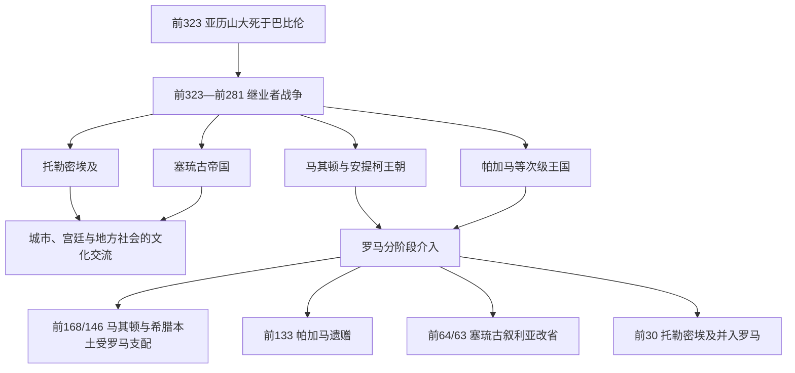

# 希腊化时代

## 时间

前323年—前30年。若只讨论希腊本土政治，前146年罗马摧毁科林斯、解散亚该亚同盟是关键终点；若讨论整个希腊化世界，通常以托勒密埃及在前30年并入罗马为终点。

## 概括

希腊化时代始于亚历山大三世死后的继承危机。马其顿将领没有保存统一帝国，而是在数轮继业者战争中把总督区、军队和宫廷转化为托勒密、塞琉古、安提柯等世袭王国。希腊共同语、城市制度、铸币、学术和艺术扩散到埃及、西亚、中亚和印度西北，但这不是单向的“希腊化”：王室采用埃及法老礼仪、西亚王权形式和地方神祇，城市精英、乡村社群、祭司集团与军人移民共同塑造多层文化。

罗马并非在前146年一次吞并全部希腊化世界。它先以盟友和仲裁者身份介入，继而通过马其顿战争、行省设置、王国遗赠、附庸安排和内战逐步接收领土。帕加马前133年遗赠、塞琉古叙利亚前64/63年改省、托勒密埃及前30年灭亡，是不同区域的终结节点。

## 演进图

## 从统一帝国到诸王国

### 巴比伦分封与摄政失败

前323年，腓力三世与尚未出生的亚历山大四世成为名义共王。佩尔狄卡斯以摄政身份试图维持中央命令，但各总督掌握军队、财政和地方联盟。托勒密把亚历山大遗体运到埃及并拒绝服从，佩尔狄卡斯远征尼罗河失败后被部下杀死。前321/320年的特里帕拉迪苏斯分封把摄政交给安提帕特，却没有解决总督权力已经地域化的问题。

安提帕特死后指定波利伯孔而非其子卡山德继任，马其顿、希腊与王室控制陷入内战。奥林匹亚丝杀腓力三世与欧律狄刻，卡山德随后处死奥林匹亚丝并软禁亚历山大四世。安提柯一世一度控制亚洲大部，迫使托勒密、塞琉古、利西马科斯和卡山德联合。前306年萨拉米斯海战后安提柯与德米特里率先称王，其他继业者相继采用王号，等于公开放弃以阿吉德共王维持统一的外壳。

### 伊普苏斯与库鲁佩迪安

前301年伊普苏斯战役中，塞琉古的战象切断德米特里与安提柯主力，安提柯战死，其亚洲领地被瓜分。德米特里仍控制舰队并一度夺取马其顿王位，但前288年被迫逃亡。前281年利西马科斯在库鲁佩迪安败于塞琉古一世；数月后塞琉古又被托勒密·克劳诺斯刺杀。至此亚历山大旧将一代接近结束，跨洲统一不再是现实方案。

## 主要王国与统治结构

完整、公认统治者逐人表见[希腊化主要王国统治者世系表](/%E4%BA%BA%E6%96%87%E7%A7%91%E5%AD%A6/%E5%8E%86%E5%8F%B2/%E6%AC%A7%E6%B4%B2/_%E9%80%9A%E5%8F%B2/%E5%8F%A4%E5%B8%8C%E8%85%8A/%E5%B8%8C%E8%85%8A%E5%8C%96%E4%B8%BB%E8%A6%81%E7%8E%8B%E5%9B%BD%E7%BB%9F%E6%B2%BB%E8%80%85%E4%B8%96%E7%B3%BB%E8%A1%A8.md)。

| 政权 | 核心区域 | 王权与行政机制 | 鼎盛条件 | 收缩 / 终结 |
|---|---|---|---|---|
| 托勒密王国 | 埃及、昔兰尼、塞浦路斯及阶段性东地中海据点 | 国王兼希腊化君主和埃及法老；以亚历山大里亚宫廷、财政官僚、土地与垄断税收维持军队 | 尼罗河农业、港口贸易、海军和集中财政 | 王室内战、上埃及反抗、失去柯里叙利亚、依赖罗马；前30年并入罗马 |
| 塞琉古帝国 | 叙利亚、美索不达米亚、伊朗高原及阶段性小亚细亚 | 国王巡行于多个宫廷中心，沿用总督区并建立希腊式城市和军事殖民点 | 继承阿契美尼德交通税源，能在西部城市与东方贵族之间调配资源 | 疆域过大、王室内战、帕提亚扩张和罗马压力；前64/63年叙利亚改省 |
| 安提柯马其顿 | 马其顿与对希腊城邦的不同程度控制 | 王国核心军队、王室土地、驻军和对城邦同盟的领导 | 马其顿本土兵源、王室连续性与希腊均势外交 | 亚该亚、埃托利亚同盟抗衡，罗马战争失败；前168年王国废除 |
| 帕加马 | 小亚细亚西部 | 由堡垒金库和地方领主发展为王国，依靠城市建设与亲罗马联盟 | 控制富庶农业区、贸易道路，罗马在阿帕米亚和约后扩大其领土 | 阿塔罗斯三世前133年遗赠罗马；阿里斯托尼库斯反抗失败 |
| 希腊本土联邦 | 亚该亚、埃托利亚及其成员城邦 | 联邦会议、共同官员、军队和外交；成员保留地方机构 | 中小城邦以联邦规模抗衡王国 | 内部分歧及选择不同外援；前146年亚该亚战争后受罗马控制 |
| 希腊—巴克特里亚与印度—希腊诸国 | 中亚、阿富汗、印度河西北 | 多中心王权，主要依靠钱币、城市、军队和地方联盟辨识 | 跨山贸易、希腊化城市与地方军事精英 | 王位重叠、游牧迁徙和区域政权竞争；年代与完整序列存在争议 |

### 法律名义与实际权力

希腊化国王常以“救主”“施惠者”“神显者”等称号建立个人合法性。王位没有统一的长子继承法：先王生前共治、军队拥立、王后血统、城市承认、宫廷政变和外部王国援助都可能决定继承。王后不仅通过婚姻结盟，还能摄政、共治或单独统治；托勒密王室的克娄巴特拉二世、三世、七世和塞琉古的克娄巴特拉·忒娅即是明显例子。

王国并非现代领土国家。国王直接控制宫廷、军队、王室土地和税收节点；希腊式城市可能拥有议事会、法律和公民共同体；神庙、部族、地方王侯和乡村共同体则保有不同程度自治。某地铸有国王钱币或承认王号，不一定表示中央能持续征税和驻军。

## 继业者战争后的区域过程

### 马其顿与希腊本土

凯尔特人前279年入侵造成王位危机，安提柯二世在击败入侵者后稳定马其顿。亚该亚同盟在阿拉图斯领导下扩张，埃托利亚同盟亦成为跨城邦力量；它们有时联合抗马其顿，有时又邀请马其顿或罗马介入。安提柯三世在塞拉西亚击败斯巴达改革者克里昂米尼三世，恢复马其顿优势。

腓力五世在第二次马其顿战争中败于罗马，前196年罗马将领弗拉米尼努斯在伊斯特米亚运动会上宣布“希腊自由”。这项自由保留城邦法律，却由罗马决定驻军撤退、战争仲裁和对外联盟。珀尔修斯在前168年皮德纳战败后，马其顿被分为四个共同体；前148年安德里斯库斯复国失败，马其顿成为行省。前146年亚该亚同盟与罗马战争失败，科林斯被毁，希腊本土进入稳定的罗马支配秩序。

### 托勒密与塞琉古的叙利亚战争

两王国围绕柯里叙利亚、腓尼基港口和税源进行六次叙利亚战争。托勒密三世在第三次战争中深入塞琉古腹地；托勒密四世前217年在拉菲亚阻止安条克三世，却大量动员埃及本地士兵，战后上埃及出现长期反抗。安条克三世前200年前后在帕尼翁取胜，最终夺走柯里叙利亚。

安条克三世试图进入小亚细亚和希腊，前190年马格尼西亚战败，前188年《阿帕米亚和约》迫使其割地、交舰并赔款。塞琉古宫廷为筹款加重对神庙和地方资源的索取。后期诸王在安条克与大马士革并立，托勒密、帕提亚、亚美尼亚和罗马各自扶植竞争者，王国逐渐缩为叙利亚城市带。

### 东方分化

巴克特里亚总督狄奥多特约前3世纪中叶脱离塞琉古，希腊—巴克特里亚国王又越过兴都库什进入印度西北。钱币同时使用希腊文和佉卢文，神像与王号吸收区域传统。由于钱币出土范围不等于确切疆界、许多国王同时并立，不能把所有东方王简单排成一条直线。希腊化形式在政治王国消失后仍通过城市、艺术、佛教造像、钱币和语言持续流动。

## 城市、社会与文化机制

### 城市与共同语

国王建立或扩建亚历山大里亚、安条克、塞琉西亚等城市，安置军人和移民，形成税收、市场和行政节点。希腊共同语成为跨地区政务与贸易语言，但阿拉米语、埃及语、波斯语及其他地方语言并未消失。城市“公民”身份常只覆盖特定社群，同一城市内还可能有王室军人、犹太社群、神庙人员、自由居民与奴隶等不同法律群体。

### 王室经济

王国通过土地租税、关税、矿山、盐油等专卖、铸币和战争赔款维持宫廷与军队。托勒密埃及的文书官僚尤其密集，但地方神庙和承包人仍是征收中介。战争使货币、士兵和商品流动增加，也造成征发、债务、土地集中和乡村逃亡。

### 学术与宗教

亚历山大里亚缪斯神庙和图书馆、帕加马图书馆以及雅典学园构成不同知识中心。欧几里得、阿基米德、埃拉托斯特尼等人的工作依赖宫廷资助、城市教育与跨区域文本流通。宗教方面，伊西斯、塞拉皮斯等崇拜跨地区传播；统治者祭祀把施惠、城市忠诚和王朝合法性结合起来。所谓“融合”不是旧神简单合并，而是不同社群在仪式、图像和名称上选择性对接。

## 罗马介入与终结过程

罗马最初以打击海盗、保护盟友或限制某一王国为名介入。它常保留败国王室和城邦制度，利用人质、赔款、条约与仲裁控制政策；因此“独立”与“附庸”之间存在长期灰区。

| 时间 | 转折 | 直接结果 | 长期意义 |
|---|---|---|---|
| 前200—前196 | 第二次马其顿战争 | 腓力五世战败，罗马宣布希腊城邦自由 | 罗马成为希腊争端最终仲裁者 |
| 前192—前188 | 罗马—塞琉古战争 | 安条克三世败，割出小亚细亚领地并赔款 | 帕加马壮大，塞琉古财政与威望受损 |
| 前171—前168 | 第三次马其顿战争 | 珀尔修斯在皮德纳战败 | 马其顿王国被废 |
| 前149—前146 | 第四次马其顿战争与亚该亚战争 | 安德里斯库斯、亚该亚同盟先后失败；科林斯被毁 | 马其顿设省，希腊本土失去独立大战略 |
| 前133—前129 | 帕加马遗赠与阿里斯托尼库斯反抗 | 罗马建立亚细亚行省 | 王国通过遗嘱和战争转化为行省 |
| 前88—前63 | 米特里达梯战争与庞培东征 | 罗马重组小亚细亚和叙利亚 | 塞琉古王国前64/63年终结 |
| 前31—前30 | 亚克兴战役与埃及征服 | 屋大维击败安东尼、克娄巴特拉七世 | 托勒密王国灭亡，希腊化时代传统终点 |

## 兴衰分析

| 类型 | 因素 | 说明 |
|---|---|---|
| 崛起机制 | 继业者掌握区域军队和税源 | 总督职位转为世袭王权，统一帝国分解成更可管理的区域国家 |
| 鼎盛条件 | 城市、交通和多层行政 | 王国既利用阿契美尼德与埃及旧制，也用新城和军屯组织军事移民 |
| 结构因素 | 继承规则不固定 | 幼主、共治、王后摄政与兄弟并立常转化为内战 |
| 结构因素 | 宫廷军事财政负担 | 常备军、舰队、雇佣兵和王室施惠需要持续税收，失败战争迅速削弱合法性 |
| 地区差异 | 地方社会并非被动希腊化 | 神庙、城市、乡村和地方贵族能谈判、反抗或转投其他国王 |
| 外部压力 | 帕提亚、罗马、凯尔特和区域联盟 | 不同边疆压力同时消耗广域王国，罗马尤其能逐一结盟和仲裁 |
| 直接触发 | 关键战败、遗赠或王朝绝嗣 | 皮德纳、帕加马遗嘱、庞培改省和亚克兴分别终结不同政权 |

## 重要事件

- 前323年，亚历山大死后巴比伦分封，腓力三世与亚历山大四世名义共治。
- 前321/320年，佩尔狄卡斯被杀，特里帕拉迪苏斯重新分封。
- 前306—前305年，主要继业者相继称王。
- 前301年，伊普苏斯战役使安提柯一世的统一计划破产。
- 前281年，库鲁佩迪安战役及塞琉古一世遇刺结束继业者第一代。
- 前279年，凯尔特人入侵马其顿和希腊，德尔斐防卫成为转折。
- 前217年，拉菲亚战役及其后的托勒密内部危机。
- 前190/189年，马格尼西亚战役；前188年《阿帕米亚和约》。
- 前168年，皮德纳战役终结安提柯王朝。
- 前146年，科林斯被毁，希腊本土纳入罗马支配。
- 前133年，帕加马遗赠罗马，随后爆发阿里斯托尼库斯反抗。
- 前64/63年，庞培终结塞琉古叙利亚王国。
- 前30年，托勒密埃及并入罗马。

## 演变关系

- 前一节点：[马其顿霸权与亚历山大帝国](/%E4%BA%BA%E6%96%87%E7%A7%91%E5%AD%A6/%E5%8E%86%E5%8F%B2/%E6%AC%A7%E6%B4%B2/_%E9%80%9A%E5%8F%B2/%E5%8F%A4%E5%B8%8C%E8%85%8A/%E9%A9%AC%E5%85%B6%E9%A1%BF%E9%9C%B8%E6%9D%83%E4%B8%8E%E4%BA%9A%E5%8E%86%E5%B1%B1%E5%A4%A7%E5%B8%9D%E5%9B%BD.md)。
- 统治者专表：[希腊化主要王国统治者世系表](/%E4%BA%BA%E6%96%87%E7%A7%91%E5%AD%A6/%E5%8E%86%E5%8F%B2/%E6%AC%A7%E6%B4%B2/_%E9%80%9A%E5%8F%B2/%E5%8F%A4%E5%B8%8C%E8%85%8A/%E5%B8%8C%E8%85%8A%E5%8C%96%E4%B8%BB%E8%A6%81%E7%8E%8B%E5%9B%BD%E7%BB%9F%E6%B2%BB%E8%80%85%E4%B8%96%E7%B3%BB%E8%A1%A8.md)。
- 罗马征服后续：[罗马共和国扩张期](/%E4%BA%BA%E6%96%87%E7%A7%91%E5%AD%A6/%E5%8E%86%E5%8F%B2/%E6%AC%A7%E6%B4%B2/_%E9%80%9A%E5%8F%B2/%E5%8F%A4%E7%BD%97%E9%A9%AC/%E7%BD%97%E9%A9%AC%E5%85%B1%E5%92%8C%E5%9B%BD%E6%89%A9%E5%BC%A0%E6%9C%9F.md)与[罗马共和国危机期](/%E4%BA%BA%E6%96%87%E7%A7%91%E5%AD%A6/%E5%8E%86%E5%8F%B2/%E6%AC%A7%E6%B4%B2/_%E9%80%9A%E5%8F%B2/%E5%8F%A4%E7%BD%97%E9%A9%AC/%E7%BD%97%E9%A9%AC%E5%85%B1%E5%92%8C%E5%9B%BD%E5%8D%B1%E6%9C%BA%E6%9C%9F.md)。
- 东方区域：[塞琉古统治与希腊化伊朗](/%E4%BA%BA%E6%96%87%E7%A7%91%E5%AD%A6/%E5%8E%86%E5%8F%B2/%E8%A5%BF%E4%BA%9A/%E4%BC%8A%E6%9C%97/%E5%A1%9E%E7%90%89%E5%8F%A4%E7%BB%9F%E6%B2%BB%E4%B8%8E%E5%B8%8C%E8%85%8A%E5%8C%96%E4%BC%8A%E6%9C%97.md)。
- 所属总览：[古希腊](/%E4%BA%BA%E6%96%87%E7%A7%91%E5%AD%A6/%E5%8E%86%E5%8F%B2/%E6%AC%A7%E6%B4%B2/_%E9%80%9A%E5%8F%B2/%E5%8F%A4%E5%B8%8C%E8%85%8A/README.md)。
