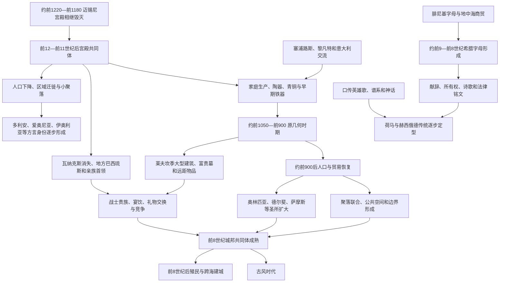

# 希腊黑暗时代

## 时间

约前1100—前800年。宫殿崩溃从前13世纪末已开始，前1050年后原几何时期出现恢复，前9—前8世纪人口、贸易、圣所和文字迅速发展。“黑暗时代”主要指可读文字和大型建筑材料稀少，不表示三百年文化停滞。

## 别称

后宫殿时代、早期铁器时代、原几何—几何时期、荷马时代。各称呼强调不同方面；“荷马时代”不能假定《伊利亚特》《奥德赛》直接记录整个时期。

## 概括

迈锡尼宫殿、线形文字B行政和远距再分配网络瓦解后，希腊人口减少并迁移，许多旧中心废弃，政治转向家庭、村落和地方首领。青铜仍被使用，铁因原料较易取得而逐步普及；陶器、墓葬和聚落显示阿提卡、优卑亚、克里特、塞浦路斯和西希腊的发展并不同步。莱夫坎季等地点拥有富贵墓葬与东方物品，证明交流从未完全中断。

这一时期没有证据支持一支“多利安军队”在某年征服全希腊。多利安、爱奥尼亚、伊奥利亚等方言和身份可能在宫殿崩溃后的迁徙、融合与政治记忆中逐步形成；希腊人向小亚细亚西岸和爱琴岛屿定居同样跨越多代。约前9—前8世纪，人口和农业恢复、贵族竞争、泛地区圣所、海上贸易和聚落联合推动城邦形成。希腊人借用腓尼基字母并创新元音字母，重新获得书写；史诗、法律、献辞和贸易由口传与文字共同进入古风时代。

## 社会重组图

## 宫殿崩溃后的断裂

### 行政与人口

迈锡尼宫殿毁灭后，线形文字B不再使用，因为它服务于仓储、贡赋和工坊账目，并未成为民间通用文字。大型圆顶墓、壁画宫殿和跨区域标准行政消失。皮洛斯等地人口大幅减少，部分居民迁向阿提卡、优卑亚、岛屿、克里特、塞浦路斯和安纳托利亚海岸；其他地区小聚落仍有连续。

人口减少的程度由墓地和聚落推估，资料发现会改变数字。部分“空白”可能是居民改用不易发现的房屋、墓葬或移动牧养，而非无人。希腊北部、西部和山地原本不在宫殿核心，其变化也不能只用迈锡尼中心衰亡衡量。

### 政治权力

迈锡尼最高称号“瓦纳克斯”退出日常政治，后来主要用于神或诗歌中的高王；宫殿时代较低级的“巴西琉斯”在后宫殿共同体上升为首领或国王。多个巴西琉斯可同时存在，权力依靠家族、土地、牲畜、武器、护从和宴饮，并无稳定官僚或绝对世袭。

家庭单位“奥伊科斯”组织土地、亲属、依附者与奴隶。村落长老、战士集团和集会可能限制首领，制度因地而异。荷马史诗中的国王、议事会和民众大会可帮助理解贵族政治理想，却混合青铜记忆与前8世纪经验，不能当作逐年宪法。

## 技术与物质文化

### 铁器普及

青铜需要远距进口锡，宫殿贸易中断使供应受限。铁矿在爱琴更易取得，冶炼技术经塞浦路斯与近东联系发展，前11世纪后铁刀、矛和工具增加。早期铁器不一定优于青铜，工艺成熟、渗碳和锻造需时间；青铜仍用于容器、首饰和防具。

铁器普及没有自动创造民主或推翻贵族。武器和农具的可得性、农业恢复、人口和社会组织共同改变军事与生产。

### 原几何和几何陶器

雅典等地约前1050年出现原几何陶器，以圆规同心圆和轮制技术著称；前900年后几何纹样更复杂，出现人、战车、葬礼和战斗场景。陶器风格用于年代和交流，却不等同族群边界。不同地区选择本地形制，阿提卡产品也通过海运传播。

### 墓葬变化

火葬与土葬、个人墓与家族墓在地区间变化。雅典部分时期以火葬为主，克里特常见集体墓，儿童待遇也不同。墓中武器、陶器和进口物显示地位竞争，但富墓数量少，不能代表全社会。

## 莱夫坎季与交流连续

优卑亚莱夫坎季约前10世纪的大型“图姆巴”建筑内葬有一名火葬男性、一名佩金饰女性和马匹，出土塞浦路斯、黎凡特相关器物。建筑可能是首领宅邸、葬仪纪念物或英雄崇拜前身，解释有争议。它证明所谓黑暗时代仍能组织大型建筑、远距交换和显著等级。

优卑亚航海者前10—前8世纪连接塞浦路斯、叙利亚、腓尼基和意大利，后来在阿尔米纳、皮特库塞等地活动。克里特的科摩斯等港口、罗得和塞浦路斯也维持东方联系。玻璃、象牙、金属、香料和样式通过小规模商人、工匠与礼物交换流动。

## 迁徙、方言与身份

### 不能简化的“多利安入侵”

古典时代希腊人把多利安人进入伯罗奔尼撒同“赫拉克勒斯后裔回归”传说联系，近代学者曾用它解释迈锡尼崩溃。考古没有发现一条可对应某年、某军队的统一破坏层；多利安方言分布可能来自宫殿后数代迁徙、地方语言变化和精英身份建构。

伯罗奔尼撒、克里特和南爱琴后来以多利安方言为主，阿提卡—爱奥尼亚、伊奥利亚和阿卡迪亚—塞浦路斯等方言保留不同特征。方言地图既保存青铜时代差异，也受后宫殿迁徙影响。

### 爱琴与小亚细亚定居

希腊语群体在小亚细亚西岸形成爱奥尼亚、伊奥利亚和多利安城市，古代传统常称单次“移民”。实际过程可能从前11世纪持续到前9世纪，包含当地安纳托利亚人口、爱琴移民和混合社区。米利都、以弗所、士麦那等地的希腊身份逐渐形成，并非空地建城。

### 族群记忆

“阿该亚人”“达那安人”“阿尔戈斯人”在史诗中可泛指希腊远征者，后世方言与地区联盟又赋予新意义。共同希腊身份尚未统一，地方城邦、亲族与方言通常更重要；泛希腊神祇、史诗和圣所后来才增强“希腊人—非希腊人”边界。

## 经济和社会恢复

### 农业与人口

约前9世纪后，墓葬、聚落和陶器数量上升，显示人口增长或考古可见度提高。谷物、橄榄、葡萄、牲畜和渔业共同支撑经济。土地分配和继承造成贵族大地产、独立农户、依附劳动与奴隶并存，地区差异很大。

人口压力并非殖民的唯一原因。贵族竞争、贸易机会、政治流亡和城邦组织也促成前8世纪海外定居。

### 贵族宴饮与竞争

战士首领以青铜三脚鼎、武器、马匹、进口奢侈品和大型葬礼展示地位。互赠和待客关系连接跨海精英，诗人歌唱祖先与战争以巩固名望。这类竞争也推动公共祭祀和运动会，把私人财富转化为共同体声望。

贵族并非不受约束。小农、战士、工匠和村落集会的合作对战争与生产必要，前8—前7世纪的债务、土地和权力冲突后来推动立法者与僭主。

## 宗教、圣所与英雄记忆

### 圣所扩大

奥林匹亚从前10—前9世纪起有祭祀活动，前8世纪奉献和竞技增多；德尔斐、萨摩斯赫拉神庙、阿尔戈斯赫拉神庙等吸引跨地区参与。圣所位于城邦边界、交通点或共同文化中心，可协调市场、仲裁、战争停战和身份竞争。

前776年传统被视为首届奥林匹克运动会，连续获胜者名单的早期可靠性有限；它适合作为古希腊纪年传统起点，不是可证明的体育发明日。

### 英雄崇拜

前8世纪人们重新向迈锡尼圆顶墓和旧遗址献祭，把不知名古墓解释为英雄住所。史诗传播、土地权和贵族谱系共同推动英雄崇拜。后世“阿伽门农墓”等名称多为传统归属，不代表出土铭文确认。

### 神祇连续与变化

宙斯、波塞冬、赫拉等名字在迈锡尼泥板已见，但宫殿崩溃后祭祀地点和职能重组。阿波罗、阿耳忒弥斯等泛希腊神崇拜扩大，本地神名和仪式仍多样。东方图像和神话母题通过贸易进入，被希腊诗歌重新编排。

## 字母与史诗

### 希腊字母形成

约前9世纪末至前8世纪，希腊人借用腓尼基辅音字母，以部分不适合希腊语的符号表示元音，形成多种地方字母。最早铭文包括器物所有权、献辞和诗句，如迪皮隆陶壶与“涅斯托耳之杯”，年代和“最早”排序随发现改变。

字母可能由双语商人、工匠或贵族在多地传播，不一定由一位发明者一次完成。早期识字范围有限，口传仍是诗歌、法律和记忆的主要载体。

### 荷马与赫西俄德

《伊利亚特》《奥德赛》由长久口传公式传统形成，通常认为前8—前7世纪逐步定型，何时写定、是否有一位“荷马”仍有争论。诗中青铜武器、战车和宫殿记忆同铁器、城邦集会和后世葬俗混合。

赫西俄德《神谱》《工作与时日》反映神祇谱系、农业伦理、债务和小农焦虑，也经历口传与编辑。史诗塑造共同神话与语言，却不是无偏见历史档案。

## 城邦形成

城邦不是一座有城墙的城市，而是公民共同体、领土、祭祀和政治机构的结合。其形成涉及：

- 相邻村落联合或“聚居”，如雅典传统中的提修斯联合叙事。
- 首领权力被贵族议事会、年度官职和集会分割。
- 公共神庙、广场、墓地和边界圣所取代单一家族中心。
- 战争、土地和共同祭祀界定公民与外人。
- 字母、历法和规则提高共同决策能力。
- 海外定居反过来强化母城身份。

不同地区不同时完成。斯巴达由数村联合并控制拉科尼亚、麦塞尼亚，雅典逐步整合阿提卡，克里特保留多种贵族城邦。马其顿、伊庇鲁斯等北方地区继续以王权和部族联盟为主，不能把城邦模式套满整个希腊语世界。

## 主要地区与转型

| 地区 | 宫殿后变化 | 前9—前8世纪特点 | 后续方向 |
|---|---|---|---|
| 阿提卡 / 雅典 | 聚落相对连续，陶器创新突出 | 墓葬、人口和贵族竞争扩大 | 阿提卡整合、执政官与雅典城邦。 |
| 优卑亚 | 莱夫坎季等富裕首领中心 | 东方贸易与航海活跃 | 参与意大利、北爱琴早期殖民。 |
| 伯罗奔尼撒 | 迈锡尼中心衰落、人口迁移 | 多利安方言区和地方王权形成 | 斯巴达、阿尔戈斯、科林斯等城邦。 |
| 克里特 | 宫殿传统终结但聚落、宗教延续 | 东方贸易、复杂葬俗和早期法律传统 | 多个多利安语贵族城邦。 |
| 中希腊 | 地区恢复不一 | 圣所与村落联盟增强 | 底比斯、奥尔霍迈诺斯、福基斯等。 |
| 爱琴岛屿 | 航线与人口重组 | 方言群、神庙和港口发展 | 纳克索斯、萨摩斯、罗得等海上城邦。 |
| 小亚细亚西岸 | 多阶段希腊语定居与本地混合 | 爱奥尼亚、伊奥利亚、多利安城市形成 | 米利都、以弗所等殖民和思想中心。 |

## 重要事件与过程

| 时间 | 事件或过程 | 直接结果 | 长期意义 |
|---|---|---|---|
| 约前1220—前1180年 | 迈锡尼宫殿连续毁灭 | 线形文字B行政和再分配瓦解 | 后宫殿社会开始。 |
| 约前1100年前后 | 聚落收缩和人口移动 | 大型中心减少，小共同体扩大 | 方言、地区身份和地方首领重组。 |
| 约前1050年 | 原几何陶器与铁器增多 | 工艺和区域交换恢复 | 早期铁器时代物质基础形成。 |
| 约前10世纪 | 莱夫坎季图姆巴葬仪 | 显示富裕首领和东方物品 | 否定全期封闭贫困的旧印象。 |
| 前10—前9世纪 | 希腊语群体在小亚细亚西岸发展 | 爱奥尼亚、伊奥利亚等城市形成 | 爱琴世界向东扩展。 |
| 前9世纪后 | 人口和聚落增长 | 农业、贸易和贵族竞争加强 | 城邦形成条件成熟。 |
| 前9—前8世纪 | 泛地区圣所奉献增加 | 奥林匹亚、德尔斐等吸引多方 | 泛希腊宗教与竞技共同体发展。 |
| 约前9世纪末—前8世纪 | 希腊字母形成 | 重新出现可读希腊语书写 | 铭文、法律与诗歌传播改变政治记忆。 |
| 前8世纪 | 几何艺术、英雄崇拜和史诗定型 | 迈锡尼废墟被纳入新共同体记忆 | 贵族合法性与共同希腊神话形成。 |
| 前8世纪中后期 | 海外殖民扩大 | 新城分布于意大利、西西里和北爱琴 | 古风地中海希腊网络展开。 |

## “黑暗”走向古风的机制

### 结构条件

宫殿消失使权力分散，家庭和村落承担生产；这降低大型官僚能力，也让地方共同体可重新组合。铁器、农业恢复和海运扩大资源，贵族需要通过公共祭祀、战争和规则争夺追随者。

### 外部联系

塞浦路斯、腓尼基和叙利亚提供金属工艺、图像、神话与字母；意大利和西地中海提供矿产、土地与贸易。恢复不是希腊内部自发“觉醒”，而是爱琴重新接入地中海。

### 直接转型

前8世纪人口密度、圣所、文字和海外建城同时增长，使公共机构超越亲族。城邦、重装步兵和法典在随后古风时代进一步成熟，不存在前800年一夜切换。

## 长期影响

1. 宫殿最高王权消失、巴西琉斯地方化，为多中心城邦政治提供制度空间。
2. 希腊方言与地区身份在迁徙和混合中定型，后世把复杂过程写成英雄家族移民。
3. 铁器与家庭生产减弱对宫殿进口体系依赖，但社会仍有贵族、奴隶和不平等。
4. 史诗把青铜时代记忆转化为全希腊文化资源，英雄墓又服务地方土地与谱系。
5. 字母创新让希腊语可标记元音，后来影响伊特鲁里亚、拉丁等字母系统。
6. 泛希腊圣所提供跨城邦共同性，却没有建立统一希腊国家。
7. 爱琴与东方贸易、海外殖民共同塑造古风繁荣，不能写成孤立“西方文明诞生”。

## 关键辨析

- “黑暗时代”指史料和大型遗迹稀少，不是没有历史、艺术或贸易。
- 时间范围不是全希腊统一；克里特、塞浦路斯、优卑亚等地转型不同。
- 迈锡尼宫殿毁灭后希腊语言与人口延续，不能称文明人口全部灭绝。
- 线形文字B失传是行政体系消失，不表示人们失去口语或全部记忆。
- 铁器扩散是经济技术过程，不自动导致平等、公民兵或城邦。
- “多利安入侵”不能由一条破坏层证明，方言分布来自多代变化。
- 小亚细亚“爱奥尼亚移民”不是一次整齐舰队迁徙，也包含本地人口。
- 莱夫坎季富墓证明精英和贸易，不代表整个希腊已恢复宫殿国家。
- 荷马史诗不是迈锡尼编年史，也不是前9世纪社会的原样照片。
- 前776年是后世奥运纪年传统起点，不等于可确认的第一场竞技。
- 希腊字母源于腓尼基模型并有本地创新，不能只称纯粹独立发明。
- 城邦形成是数代政治社会重组，不是一个国王颁令建立。

## 演变关系

- 前一阶段：[爱琴文明](/%E4%BA%BA%E6%96%87%E7%A7%91%E5%AD%A6/%E5%8E%86%E5%8F%B2/%E6%AC%A7%E6%B4%B2/_%E9%80%9A%E5%8F%B2/%E5%8F%A4%E5%B8%8C%E8%85%8A/%E7%88%B1%E7%90%B4%E6%96%87%E6%98%8E.md)。
- 后一阶段：[古风时代](/%E4%BA%BA%E6%96%87%E7%A7%91%E5%AD%A6/%E5%8E%86%E5%8F%B2/%E6%AC%A7%E6%B4%B2/_%E9%80%9A%E5%8F%B2/%E5%8F%A4%E5%B8%8C%E8%85%8A/%E5%8F%A4%E9%A3%8E%E6%97%B6%E4%BB%A3.md)。
- 所属总览：[古希腊](/%E4%BA%BA%E6%96%87%E7%A7%91%E5%AD%A6/%E5%8E%86%E5%8F%B2/%E6%AC%A7%E6%B4%B2/_%E9%80%9A%E5%8F%B2/%E5%8F%A4%E5%B8%8C%E8%85%8A/README.md)。
