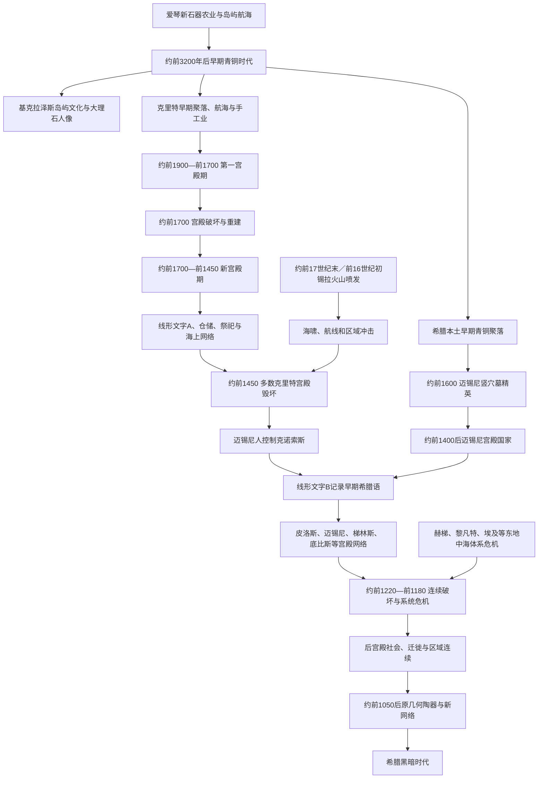

# 爱琴文明

## 时间

约前3200—前1050年。核心包括基克拉泽斯早期青铜文化、克里特米诺斯宫殿文明和希腊本土迈锡尼宫殿文明；“前1100年”是教学分界，实际崩溃、迁徙和区域连续延续数代。

## 别称与范围

爱琴青铜时代、米诺斯文明、迈锡尼文明。范围包括克里特、基克拉泽斯群岛、希腊本土、爱琴诸岛及同安纳托利亚、西地中海、埃及和黎凡特的网络。“米诺斯”与“迈锡尼”是现代考古命名，来自希腊神话中的米诺斯王与迈锡尼遗址，不是当时居民可确认的统一自称。

## 概括

爱琴文明不是一个连续王朝。前3千纪，基克拉泽斯岛民、克里特和希腊本土各自发展航海、冶金与聚落。约前1900年后，克里特的克诺索斯、费斯托斯、马利亚和扎克罗斯等宫殿中心通过仓储、祭祀、手工业和海上贸易组织资源，使用克里特象形文字与尚未释读的线形文字A。约前1600年，本土迈锡尼、皮洛斯、底比斯、梯林斯等军事贵族中心兴起；前1450年前后，多数克里特宫殿遭破坏，迈锡尼统治者控制克诺索斯并以线形文字B记录早期希腊语。

迈锡尼宫殿是彼此独立或竞争的区域国家，国王称“瓦纳克斯”，并非证据确凿的全希腊帝国。约前1220—前1180年，多数宫殿相继毁灭，线形文字B官僚体系消失，东地中海贸易收缩。崩溃可能由战争、宫廷冲突、地震、气候与粮食压力、贸易网络脆弱和人口移动共同造成；“多利安入侵”或“海上民族”都不足以单独解释。宫殿消失不等于居民或希腊语言消失，小聚落、陶器、宗教记忆和部分精英传统延续进后宫殿时代。

## 演变图

## 基克拉泽斯与早期青铜时代

### 岛屿网络

基克拉泽斯群岛土地有限，却位于安纳托利亚、克里特和希腊本土之间。岛民利用黑曜石、铜矿、石材、渔业与航海建立交换。约前3200—前2000年的大理石人像、石盘和陶器成为代表，许多人像出自墓葬；现代非法挖掘使不少器物失去出土语境，难以判断是神像、祖先、身份物还是多种用途。

基克拉泽斯“文化”包括不同时期岛屿传统，不是一个首都统治的海上国家。部分聚落有防御、手工业和社会差异，另一些规模很小。前2千纪以后，群岛先后受克里特、迈锡尼和本地力量影响，人口没有突然消失。

### 希腊本土早期聚落

勒尔纳“瓦片屋”等大型建筑显示前3千纪已有储藏、行政或精英活动。约前2200年前后，多地遭破坏或转型，伴随新式陶器、墓葬和人口变化。旧说把这一节点视为希腊人一次入侵的精确日期，现今更谨慎：印欧语希腊语形成涉及多次迁徙和本地混合，无法由某一陶器类型直接证明。

## 米诺斯文明

### 宫殿形成

约前1900年，克诺索斯、费斯托斯、马利亚等出现围绕中央庭院的大型复合建筑。宫殿有粮油仓、工坊、档案、宴饮和宗教空间，也同周边村庄、庄园与港口相连。“宫殿”不只为君主居住，更是资源集中、仪式展示和再分配节点。

约前1700年第一批宫殿多遭破坏，可能涉及地震与政治冲突，随后规模更大的新宫殿重建。克诺索斯壁画、精细陶器、印章与多层建筑反映专业工匠和跨岛网络。没有可靠文献证明传说中的米诺斯王建立覆盖全爱琴的“海上帝国”；克里特船队和贸易优势确实重要，但直接领土控制范围不清。

### 书写与行政

克里特象形文字和线形文字A用于标签、账目、献祭器物和行政。线形文字A尚未释读，能识别部分符号和数字，却不能确定语言与统治者姓名。后来迈锡尼人改造相关书写体系形成线形文字B，用来记录希腊语。

未释读不表示米诺斯人“没有历史”，但限制了王朝和政治名称重建。宫殿大小、印章和仓储表明等级，究竟是一位国王、祭司集团、王后还是多个家族统治仍有争论。“女神图像多”也不能直接证明母系或女性统治社会。

### 宗教与社会

山顶圣所、洞穴、双斧、牛角、献祭和宴饮是常见线索。跃牛图像可能与仪式和精英表演有关，不必等同后来神话迷宫中的固定故事。女性在壁画和祭仪中醒目，墓葬和行政材料仍不足以断言政治权力由女性垄断。

居民包括农民、牧民、航海者、工匠、商人、祭祀人员和依附劳工。橄榄油、酒、羊毛、藏红花、陶器和金属品进入宫殿网络。战争证据少于迈锡尼本土，但武器、防御和暴力并非不存在。

### 锡拉火山

锡拉岛阿克罗蒂里聚落因火山灰保存壁画、房屋和器物。喷发大约在前17世纪末或前16世纪初，放射性碳与埃及历史年代的精确对应仍有讨论。海啸、灰尘和航线中断影响克里特北岸和爱琴网络，但多数米诺斯宫殿在喷发后仍延续相当时间，因此不能把喷发写成米诺斯文明当日灭亡。

### 前1450年前后转折

约前1450年，克里特多数新宫殿中心毁坏，克诺索斯继续并出现线形文字B，显示迈锡尼希腊语统治集团接管。原因可能包括火山长期后果、岛内竞争和迈锡尼军事介入。克诺索斯本身约前14世纪后期又毁坏或失去中心地位，具体日期有争议；米诺斯文化传统在普通聚落、宗教和艺术中继续。

## 迈锡尼文明

### 竖穴墓精英兴起

约前17—前16世纪，迈锡尼竖穴墓圈埋有金面具、武器、琥珀、象牙和金银器，显示本土战士精英能调动远距物资。所谓“阿伽门农金面具”比传说特洛伊战争年代早数百年，命名只是发掘者谢里曼的浪漫解释。

精英权力来自土地、牲畜、战争、护从和交换。圆顶墓、城墙与大型宫殿在前15—前13世纪扩展，迈锡尼、梯林斯、皮洛斯、底比斯、奥尔霍迈诺斯等各自控制区域。

### 宫殿结构

线形文字B泥板显示宫殿以“瓦纳克斯”为最高统治者，“拉瓦盖塔斯”可能有军事或礼仪高位，地方“巴西琉斯”管理较小共同体或工匠群。贵族、收税者、祭司祭司女、工匠、牧人、军队和奴隶被登记。后来希腊城邦“巴西琉斯”成为国王称号，但迈锡尼时代其等级低于瓦纳克斯，制度不可直接等同。

| 层级 / 群体 | 线形文字B称谓或线索 | 作用 | 说明 |
|---|---|---|---|
| 最高统治者 | wa-na-ka（瓦纳克斯） | 宫殿土地、祭祀、生产和外交中心 | 各宫殿可能各有瓦纳克斯，无证据证明一位统治全希腊。 |
| 高级人物 | ra-wa-ke-ta（拉瓦盖塔斯） | 可能负责军队、随从或重要礼仪 | 精确职能仍有争议。 |
| 地方首领 | qa-si-re-u（巴西琉斯） | 管理工匠、村落或地方群体 | 后世“巴西琉斯”王号由此词发展，但权力发生变化。 |
| 宫廷贵族 | e-qe-ta等“随从” | 车辆、武器、土地和王室服务 | 可构成战士与行政精英。 |
| 地方共同体 | da-mo（德莫斯） | 持有土地、承担义务 | 与后世民主“德莫斯”不能机械等同。 |
| 祭司与祭司女 | 多种神职称谓 | 管理祭祀、神产和供物 | 女性可持有重要宗教财产。 |
| 工匠与劳工 | 青铜匠、纺织女工、牧人等 | 宫殿控制的专业生产 | 部分为依附者或奴隶，身份不一。 |
| 奴隶 | do-e-ro / do-e-ra | 为神庙、宫殿或个人服务 | 战争、贸易和出生均可能产生奴役。 |

泥板是火灾意外烧硬的年度账目，主要记录羊群、谷物、油、青铜、纺织、土地、贡赋和祭祀，不是文学编年史。因此不能列出完整迈锡尼诸王世系。

### 经济和战争

宫殿收集羊毛、谷物、油和金属，分配给工坊再回收成品。青铜依赖进口铜与锡，象牙、玻璃、琥珀和香料来自广域网络。沉船如乌鲁布伦展示东地中海货物混合，具体船员和归属仍有争议。

“独眼巨人城墙”、战车、剑、长矛和防具体现军事动员。宫殿之间既交易也竞争，海外活动可包括商人、雇佣兵、袭击和定居。赫梯档案所称“阿希亚瓦”常被联系迈锡尼世界，可能指强大爱琴政权，但对应哪一宫殿或联盟仍有争议。

### 宗教与后世连续

线形文字B出现宙斯、赫拉、波塞冬、狄俄尼索斯等后来希腊神名，也有后世不再明确的神祇。供物、圣所和节庆显示宗教连续，但神的职能和神话在数百年中重组。迈锡尼宫殿记忆、废墟和墓葬可能影响英雄崇拜；荷马史诗保存青铜时代元素，也融入前8世纪社会，不能当作线形文字时代实录。

## 特洛伊与荷马传统

安纳托利亚西北希萨利克遗址有多层城市，特洛伊VI和VIIa约属前2千纪后期并有战争或破坏迹象。赫梯文献中的维卢萨可能与特洛伊相关，阿希亚瓦势力也曾介入西安纳托利亚。考古能够说明该地是区域中心、经历冲突，却不能证明《伊利亚特》每个人物、十年围城或木马情节。

荷马史诗约在宫殿崩溃数百年后定型，口传歌手可保存地名、武器和英雄记忆，也会按后世价值重写。不能据“阿伽门农为诸王之王”断言迈锡尼统治全希腊。

## 青铜时代崩溃

### 破坏序列

约前1220—前1180年，皮洛斯、迈锡尼、梯林斯、底比斯等宫殿先后遭火灾或废弃。部分地点重建后又毁，说明不是同一天灾难。线形文字B档案中有海岸守备和青铜征集，可见危机准备；但泥板没有给出最终敌人姓名。

东地中海同时发生赫梯帝国崩溃、黎凡特城市破坏、埃及同“海上民族”作战和贸易收缩。爱琴危机属于互相依赖体系的连锁失效。

### 多重原因

- 宫殿高度集中仓储、青铜进口与专业工匠，交通一断便难维持。
- 王朝与精英战争可能造成宫廷政变、抢掠和地方反叛。
- 地震在部分遗址留下痕迹，却不能解释数十年跨区域破坏。
- 气候干旱和粮食压力可能加剧迁徙、饥荒和社会冲突，地区影响不同。
- 来自海上与陆上的袭击者可能包含原宫殿世界居民、邻近群体和新移民，不是一支统一“海上民族军”。
- 宫殿对农民、劳工和边缘共同体的汲取，可能使危机时缺少忠诚和恢复力。

### 后宫殿延续

宫殿官僚、长途奢侈品和线形文字B消失，许多人口向沿海、岛屿或更安全地区迁移。某些聚落如莱夫坎季后来发展，克里特、塞浦路斯等有不同连续。陶器、铁器试用、家庭生产和地方首领取代宫殿再分配。希腊语继续，宗教名称和英雄地景也延续，因而“文明完全消失”不准确。

## 重要事件与阶段

| 时间 | 事件或过程 | 直接结果 | 长期意义 |
|---|---|---|---|
| 约前3200年 | 爱琴早期青铜时代展开 | 岛屿航海、冶金和区域风格发展 | 基克拉泽斯、克里特、本土网络形成。 |
| 约前2200年 | 多地聚落破坏和转型 | 新陶器、墓葬和人口流动 | 希腊语形成背景之一，但不能等同单次入侵。 |
| 约前1900年 | 克里特第一宫殿出现 | 仓储、工坊、行政和祭祀集中 | 米诺斯宫殿文明建立。 |
| 约前1700年 | 第一宫殿破坏后重建 | 新宫殿规模与艺术扩大 | 克里特海上网络达到高峰。 |
| 约前17世纪末／前16世纪初 | 锡拉火山喷发 | 阿克罗蒂里被埋、海啸和航路受扰 | 严重冲击但没有立即消灭米诺斯文明。 |
| 约前1600年 | 迈锡尼竖穴墓精英兴起 | 本土财富与战士权力集中 | 迈锡尼宫殿国家前身形成。 |
| 约前1450年 | 多数克里特宫殿毁坏 | 迈锡尼统治者控制克诺索斯 | 线形文字B开始记录希腊语行政。 |
| 约前1400—前1200年 | 迈锡尼宫殿体系成熟 | 城堡、官僚、工坊和远距外交扩展 | 希腊本土首次有可读文字行政。 |
| 约前13世纪 | 东地中海贸易与军事竞争加剧 | 城防、武器与外交活动扩大 | 宫殿体系繁荣同时更加脆弱。 |
| 约前1220—前1180年 | 迈锡尼宫殿连续毁灭 | 官僚和长途再分配瓦解 | 进入后宫殿时代。 |
| 约前1050年后 | 原几何陶器、铁器和新航线扩展 | 小共同体逐步恢复交换 | 通向古风时代城邦形成。 |

## 文明兴起条件

- 爱琴短距离岛链、港湾和季风规律支持航海，连接三大洲。
- 克里特农业、橄榄、葡萄和羊毛为宫殿仓储与手工业提供剩余。
- 铜、锡、黄金、象牙、玻璃等远距交换强化精英和专业工匠。
- 宫殿通过书写、印章、称量和仓储提高资源动员。
- 宗教节庆、宴饮和艺术为不同聚落建立共同合法性。
- 迈锡尼贵族利用武器、战车、城墙和护从扩张。
- 与埃及、赫梯、黎凡特、塞浦路斯和意大利的外交贸易输入技术与声望。

## 衰落因素与直接终结

### 米诺斯宫殿

火山、地震、海上网络受损与岛内竞争削弱部分中心；迈锡尼军事贵族的介入是前1450年前后直接政治转折。克诺索斯仍延续，说明不是一次自然灾害灭亡全岛。迈锡尼接管后，米诺斯人口与文化没有消失。

### 迈锡尼宫殿

集中生产、进口青铜和少数行政中心构成结构脆弱；东地中海系统危机、战争和气候压力是外部与区域放大器；前13世纪末至前12世纪初多次火灾、废弃和王权失效是直接过程。没有证据指定一个民族同时摧毁所有宫殿。

## 长期影响

1. 线形文字B证明希腊语在青铜时代已用于行政，但希腊字母是后世重新从腓尼基字母发展。
2. 神名、祭祀地点和英雄墓记忆连接迈锡尼与后世宗教，具体神话内容仍经过长期重写。
3. 宫殿瓦解后，“瓦纳克斯”最高王权消失，地方“巴西琉斯”一词在后世上升为王号，体现制度断裂与词汇连续。
4. 海上网络、移民和工艺把爱琴文化传播至塞浦路斯、安纳托利亚和意大利，不能只以现代希腊边界理解。
5. 米诺斯和迈锡尼遗址后来被雅典、罗马和现代民族主义重新解释，考古事实需同神话和政治使用区分。
6. 青铜时代崩溃削弱大型宫殿，却为更分散的小共同体、铁器和最终城邦秩序创造空间。

## 关键辨析

- 米诺斯和迈锡尼是现代考古分类，不是两个血缘纯一、边界固定的民族。
- 克诺索斯宫殿没有证据证明是传说迷宫原型或由米诺斯王统一全海域。
- 线形文字A尚未释读，不能可靠列出米诺斯王朝世系或确定语言。
- 女性宗教图像多不等于已经证明母系社会或女王统治。
- 锡拉火山严重影响爱琴，但米诺斯主要宫殿在喷发后仍延续，不能写成“一次火山灭国”。
- 线形文字B泥板是账簿，不是编年史；迈锡尼诸王姓名和完整世系不可重建。
- 迈锡尼宫殿之间存在共同文化，不等于阿伽门农统治全希腊。
- 荷马史诗含青铜时代记忆，也反映数百年后的社会，不能逐句作为史料。
- “海上民族”是埃及文献对多个集团的称呼，不是已知统一民族。
- “多利安入侵”无法单独解释宫殿崩溃，人口和语言转变更复杂。
- 前1200年后是政治经济重组，不是希腊人口、语言与文化完全中断。

## 演变关系

- 后一阶段：[希腊黑暗时代](/%E4%BA%BA%E6%96%87%E7%A7%91%E5%AD%A6/%E5%8E%86%E5%8F%B2/%E6%AC%A7%E6%B4%B2/_%E9%80%9A%E5%8F%B2/%E5%8F%A4%E5%B8%8C%E8%85%8A/%E5%B8%8C%E8%85%8A%E9%BB%91%E6%9A%97%E6%97%B6%E4%BB%A3.md)。
- 古希腊总览：[古希腊](/%E4%BA%BA%E6%96%87%E7%A7%91%E5%AD%A6/%E5%8E%86%E5%8F%B2/%E6%AC%A7%E6%B4%B2/_%E9%80%9A%E5%8F%B2/%E5%8F%A4%E5%B8%8C%E8%85%8A/README.md)。
- 东地中海对读：[古埃及](/%E4%BA%BA%E6%96%87%E7%A7%91%E5%AD%A6/%E5%8E%86%E5%8F%B2/%E5%8C%97%E9%9D%9E/%E5%9F%83%E5%8F%8A/%E5%8F%A4%E5%9F%83%E5%8F%8A/README.md)。
- 近东青铜时代背景：[西亚历史](/%E4%BA%BA%E6%96%87%E7%A7%91%E5%AD%A6/%E5%8E%86%E5%8F%B2/%E8%A5%BF%E4%BA%9A/README.md)。
