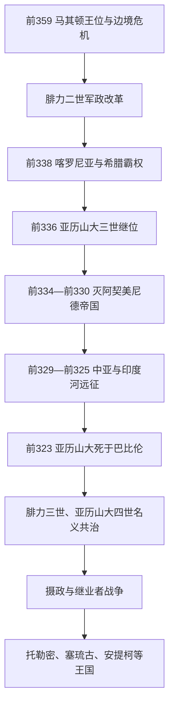

# 马其顿霸权与亚历山大帝国

## 时间

马其顿崛起背景始于前359年；对希腊城邦的霸权通常从前338年算起；亚历山大帝国存在于前336—前323年，其统一王权在前323—前309年间名义延续。

## 概括

腓力二世把一个受伊利里亚、培奥尼亚和王位竞争威胁的边缘王国改造成拥有常备步兵方阵、伙伴骑兵、攻城技术和稳定外交网络的军事国家。前338年喀罗尼亚战役后，他以科林斯同盟盟主身份统合多数希腊城邦。亚历山大三世继位后平定反叛，在十年内摧毁阿契美尼德帝国并进入中亚与印度河流域。这个帝国以国王本人、马其顿军队和既有波斯行政网络为结合点；亚历山大未留下成年继承人和清晰分权规则，故其死亡立即引发摄政竞争与继业者战争。

## 演进图

## 建立背景与崛起机制

前4世纪中期的马其顿不是骤然出现的“外来征服者”。阿吉德王室长期同希腊城邦、色雷斯、伊利里亚和波斯势力往来；宫廷使用希腊语，王室参加泛希腊祭祀，却在城邦人眼中保留边缘王国色彩。佩尔狄卡斯三世对伊利里亚战争阵亡后，幼主阿敏塔斯四世无力应对危机，摄政腓力取得王位。

腓力的优势来自多项机制叠加：

- 把长矛方阵训练为常备核心，以伙伴骑兵、轻装部队和攻城兵形成合成军队，而非只靠一种“马其顿方阵”。
- 控制安菲波利斯和潘盖翁矿区，获得铸币、雇佣兵和外交贿赂所需财政。
- 通过婚姻、释放俘虏、支持地方派系、加入色萨利同盟和介入神圣战争扩大合法性。
- 允许被征服贵族进入伙伴集团，以宫廷荣誉和土地把地方精英绑定于王权。
- 对希腊城邦保留内部政体，以科林斯同盟的“共同和平”和对波斯战争包装马其顿领导。

## 阿吉德王朝完整王位序列

早期谱系主要由后世王室传统保存，年份和亲属关系不可能像古典时代以后那样精确。下表把传说性先祖与史料较可靠的国王分开，并将共治、复位、摄政和争位逐人列明，不把数名国王合并成一项。

### 传说性先祖

| 顺序 | 统治者 | 传统年代 | 与前任关系 | 说明 |
|---:|---|---|---|---|
| 1 | 卡拉努斯 | 约前8世纪上半叶 | 王朝传说中的始祖 | 后世马其顿谱系所列，历史性与具体年代存在争议 |
| 2 | 科伊努斯 | 约前8世纪 | 传统称卡拉努斯之子 | 仅见较晚王表，事迹不详 |
| 3 | 提里马斯 | 约前8—前7世纪 | 传统继承者 | 史实难以核验；王室另有源自阿尔戈斯的祖先说 |

### 历史王位主线与争位者

| 顺序 | 统治者 | 在位时间 | 王室 / 与前任关系 | 关键事件与争议 |
|---:|---|---|---|---|
| 1 | 佩尔狄卡斯一世 | 约前7世纪 | 阿吉德王朝首位较常进入历史王表者 | 建国叙事仍混有传说，年代约数 |
| 2 | 阿尔盖乌斯一世 | 约前678—前640 | 传统称前王之子 | 早期扩张事迹多属王室记忆 |
| 3 | 腓力一世 | 约前640—前602 | 传统称前王之子 | 与伊利里亚冲突的记载不确定 |
| 4 | 阿埃罗普斯一世 | 约前602—前576 | 传统称前王之子 | 幼年继位说来自后世传统 |
| 5 | 阿尔塞塔斯一世 | 约前576—前547 | 传统称前王之子 | 生平资料稀少 |
| 6 | 阿敏塔斯一世 | 约前547—前498 | 传统称前王之子 | 接受阿契美尼德宗主权，进入较可靠文献时代 |
| 7 | 亚历山大一世 | 约前498—前454 | 阿敏塔斯一世之子 | 波斯战争中在波斯与希腊间周旋，后扩张下马其顿 |
| 8 | 佩尔狄卡斯二世 | 约前454—前413 | 亚历山大一世之子 | 在雅典、斯巴达与色雷斯势力间反复结盟；王位初年可能与兄弟竞争 |
| 9 | 阿尔塞塔斯二世 | 约前454—前448 | 亚历山大一世之子、佩尔狄卡斯二世之兄 | 部分王表列为短期共治或竞争者，先后次序有争议 |
| 10 | 阿尔赫劳斯一世 | 前413—前399 | 佩尔狄卡斯二世之子 | 改善道路、军队与宫廷文化；遇刺 |
| 11 | 克拉特鲁斯 | 前399 | 阿尔赫劳斯近臣或宠臣 | 杀前王后仅在位数日，是否正式加冕有争议 |
| 12 | 奥瑞斯特斯 | 前399—前396 | 阿尔赫劳斯之子，幼主 | 与摄政阿埃罗普斯二世共治，后被后者取代 |
| 13 | 阿埃罗普斯二世 | 前399—前394/393 | 王族，先任奥瑞斯特斯摄政 | 约前396年起以国王身份独掌权力 |
| 14 | 阿尔赫劳斯二世 | 约前396—前393 | 王族，身份关系不确定 | 短暂统治；是否与其他短王重叠存在争议 |
| 15 | 阿敏塔斯二世“小阿敏塔斯” | 约前393 | 王族，可能为阿埃罗普斯二世之子 | 被德尔达斯杀死，统治极短 |
| 16 | 保萨尼亚斯 | 约前393 | 王族竞争者 | 短暂夺位，后被阿敏塔斯三世推翻 |
| 17 | 阿敏塔斯三世 | 前393；前392—前370 | 王族，可能为阿敏塔斯一世后裔 | 首次即位后遭驱逐，复位并维系王国；腓力二世之父 |
| 18 | 阿尔盖乌斯二世 | 前393—前392 | 王族争位者，受伊利里亚支持 | 驱逐阿敏塔斯三世，次年败退；前359年再度争位失败 |
| 19 | 亚历山大二世 | 前370—前368 | 阿敏塔斯三世长子 | 与托勒密·阿洛罗斯冲突，被杀 |
| 20 | 托勒密·阿洛罗斯 | 前368—前365 | 王室姻亲，亚历山大二世的摄政与杀害者 | 以幼主佩尔狄卡斯三世摄政名义掌权，常列摄政或篡位者 |
| 21 | 佩尔狄卡斯三世 | 前365—前359 | 阿敏塔斯三世之子 | 杀托勒密后亲政；对伊利里亚作战阵亡 |
| 22 | 阿敏塔斯四世 | 前359，后为王位竞争焦点 | 佩尔狄卡斯三世幼子 | 名义继位，叔父腓力以摄政掌权并成为国王；前336年后因潜在争位被处死 |
| 23 | **腓力二世** | 前359—前336 | 阿敏塔斯三世之子、幼主之叔 | 重建军队和财政，前338年取得希腊霸权；前336年遇刺 |
| 24 | **亚历山大三世“大帝”** | 前336—前323 | 腓力二世之子 | 镇压底比斯，灭阿契美尼德帝国，远征至印度河；死于巴比伦 |
| 25 | 腓力三世·阿里达奥斯 | 前323—前317 | 腓力二世之子、亚历山大三世异母兄 | 与亚历山大四世名义共治；认知能力受限，实权由摄政、军队与王后欧律狄刻掌握；被奥林匹亚丝处死 |
| 26 | 亚历山大四世 | 前323—前309/308 | 亚历山大三世与罗克珊娜的遗腹子 | 自出生即为共王，先后受佩尔狄卡斯、安提帕特、波利伯孔和卡山德控制；被卡山德秘密杀害，阿吉德合法王统终结 |

亚历山大与巴尔西娜之子赫拉克勒斯在前309年被波利伯孔用作争位工具，可能获许诺立王，但未形成普遍承认的在位统治，故不编号为正式国王；他与母亲被杀进一步清除了阿吉德继承人。

## 腓力二世的统合过程

| 时间 | 行动 | 机制 | 结果 |
|---|---|---|---|
| 前359—前356 | 与培奥尼亚、伊利里亚交战，排除王位竞争 | 先议和争取时间，再重建军队；处理阿尔盖乌斯二世等竞争者 | 王国免于瓦解，确立个人王权 |
| 前357—前352 | 夺取安菲波利斯、皮德纳、墨托涅，进入色萨利 | 矿产财政、攻城术、婚姻与盟约并用 | 获得爱琴海出口与稳定军费 |
| 前356—前346 | 介入第三次神圣战争 | 以色萨利统帅和宗教执行者身份参战 | 取得温泉关以南政治合法性 |
| 前346—前338 | 拉拢或压制希腊各派 | “腓力派”网络、驻军、共同和平与有限自治 | 孤立雅典、底比斯的反马其顿联盟 |
| 前338—前337 | 喀罗尼亚胜利并建立科林斯同盟 | 马其顿掌军，成员承诺不互战、不颠覆政体 | 将对波斯战争变为共同计划 |

## 亚历山大东征

### 继位与后方稳定

前336年腓力遇刺后，亚历山大依靠安提帕特、安提柯等老臣和军队拥戴即位，并处死或清除若干潜在竞争者。前335年他快速北征多瑙河与伊利里亚；底比斯误信其死讯而反叛，城市被攻破，居民大多被杀或奴役。这个惩罚震慑希腊后方，但雅典仍保留形式自治。

### 摧毁阿契美尼德王权

前334年亚历山大渡过赫勒斯滂，在格拉尼库斯击败小亚细亚总督军。前333年伊苏斯战役迫使大流士三世逃离；亚历山大没有直接追入两河，而是沿腓尼基海岸攻取提尔、加沙，消除波斯舰队基地，再进入埃及并奠建亚历山大里亚。前331年高加米拉决战后，巴比伦、苏萨、波斯波利斯和埃克巴坦那相继落入其手。大流士被总督贝苏斯杀害后，亚历山大以波斯王权继承人自居并追杀弑君者。

### 中亚、印度与军队矛盾

在巴克特里亚和粟特，城堡、游击战与地方贵族网络使征服比大规模会战艰难。亚历山大建立殖民城市、与罗克珊娜结婚并吸收伊朗贵族；宫廷采用跪拜礼的尝试、处死帕曼纽与克利图斯、王侍阴谋审判，加剧马其顿将领的不安。前326年希达斯佩斯河战胜波鲁斯后，军队在希发西斯河拒绝继续东进。返回途中穿越格德罗西亚造成惨重损失。

### 帝国整合尝试

亚历山大沿用总督区和地方税收体系，同时安插马其顿军事监督者；在苏萨安排大规模联姻，在奥皮斯让亚洲士兵加入军队，并偿还士兵债务。此举并未形成稳定的混合官僚制：政策高度依赖国王本人，马其顿老兵、希腊城邦、伊朗精英和新军之间没有共同认可的继承规则。

## 继承危机与帝国瓦解

前323年亚历山大在巴比伦病逝时，异母兄阿里达奥斯成年但不具备独立执政能力，王后罗克珊娜尚怀孕。步兵主张立阿里达奥斯，骑兵将领倾向等待遗腹子，最终形成腓力三世与出生后的亚历山大四世共治。佩尔狄卡斯掌王印并任帝国摄政，克拉特鲁斯名义负责王室事务，安提帕特继续治理马其顿和希腊；各将领按“巴比伦分封”控制总督区。

| 时间 | 权力安排 / 冲突 | 转折 | 后果 |
|---|---|---|---|
| 前323 | 巴比伦分封 | 两位无实权国王，共同摄政机制模糊 | 总督拥有军队和税源，中央命令依赖协商 |
| 前322 | 拉米亚战争 | 雅典等反马其顿失败 | 安提帕特维持希腊控制，雅典民主受限 |
| 前321/320 | 佩尔狄卡斯远征埃及失败并被部下杀死 | 摄政无法压服托勒密 | 特里帕拉迪苏斯重新分封，安提帕特任摄政 |
| 前319 | 安提帕特去世，越过卡山德任命波利伯孔 | 马其顿军政集团分裂 | 卡山德、波利伯孔、奥林匹亚丝围绕王室内战 |
| 前317 | 腓力三世与欧律狄刻被杀 | 奥林匹亚丝夺取王室控制 | 卡山德反攻并处死奥林匹亚丝 |
| 前316—前309 | 卡山德软禁罗克珊娜与亚历山大四世 | 其他继业者逐渐接受事实割据 | 亚历山大四世被秘密杀害，王朝合法中心消失 |
| 前306—前305 | 安提柯、托勒密、塞琉古、利西马科斯、卡山德相继称王 | 君主称号不再依托阿吉德共王 | 多王国格局公开化 |
| 前301 | 伊普苏斯战役 | 安提柯一世战死 | 统一帝国最后一次现实尝试失败 |

## 鼎盛、衰落与灭亡原因

| 类型 | 因素 | 作用 |
|---|---|---|
| 崛起条件 | 腓力的财政—军事改革 | 矿山、常备军、攻城术和伙伴贵族构成可持续扩张机器 |
| 崛起条件 | 希腊城邦长期分裂 | 城邦难以组成稳定反马其顿联盟，第三次神圣战争为腓力提供合法入口 |
| 鼎盛条件 | 亚历山大的机动作战与波斯行政遗产 | 马其顿合成军队赢得决战，既有道路、总督区和金库支撑继续推进 |
| 结构弱点 | 帝国等同于国王的个人宫廷和行军军队 | 没有固定首都、统一官僚晋升体系或成年继承人 |
| 结构弱点 | 多重精英缺少共同继承规则 | 马其顿军队、希腊城邦、伊朗贵族和总督对合法性的理解不同 |
| 外部与空间压力 | 距离、地方反抗与持续驻军成本 | 中亚和印度远征暴露补给极限，地方控制依赖总督个人 |
| 直接触发 | 前323年亚历山大突然死亡 | 共王均无法执政，摄政名义不足以约束掌兵总督 |
| 直接灭亡过程 | 王室成员在继业者内战中被逐一杀害 | 前309/308年亚历山大四世死亡后，诸将公开称王，统一王统消失 |

## 重要事件

- 前359年，腓力二世在王位与边境危机中掌权。
- 前356年前后，马其顿控制安菲波利斯与潘盖翁矿区。
- 前338年，喀罗尼亚战役击败雅典—底比斯联军。
- 前337年，科林斯同盟成立并计划对波斯战争。
- 前336年，腓力二世遇刺，亚历山大三世即位。
- 前335年，底比斯反叛遭摧毁。
- 前334年，格拉尼库斯战役开启亚洲远征。
- 前333年，伊苏斯战役击败大流士三世。
- 前332年，提尔陷落；亚历山大进入埃及。
- 前331年，高加米拉战役摧毁波斯主力。
- 前330—前327年，中亚战争及地方精英整合。
- 前326年，希达斯佩斯河战役与希发西斯兵变。
- 前323年，亚历山大死于巴比伦，摄政与共王体制开始。
- 前317年，腓力三世被杀。
- 前309/308年，亚历山大四世被杀，阿吉德王统终结。

## 演变关系

- 前一节点：[古典时代](/%E4%BA%BA%E6%96%87%E7%A7%91%E5%AD%A6/%E5%8E%86%E5%8F%B2/%E6%AC%A7%E6%B4%B2/_%E9%80%9A%E5%8F%B2/%E5%8F%A4%E5%B8%8C%E8%85%8A/%E5%8F%A4%E5%85%B8%E6%97%B6%E4%BB%A3.md)。
- 后一节点：[希腊化时代](/%E4%BA%BA%E6%96%87%E7%A7%91%E5%AD%A6/%E5%8E%86%E5%8F%B2/%E6%AC%A7%E6%B4%B2/_%E9%80%9A%E5%8F%B2/%E5%8F%A4%E5%B8%8C%E8%85%8A/%E5%B8%8C%E8%85%8A%E5%8C%96%E6%97%B6%E4%BB%A3.md)。
- 帝国主要继承王国：[希腊化主要王国统治者世系表](/%E4%BA%BA%E6%96%87%E7%A7%91%E5%AD%A6/%E5%8E%86%E5%8F%B2/%E6%AC%A7%E6%B4%B2/_%E9%80%9A%E5%8F%B2/%E5%8F%A4%E5%B8%8C%E8%85%8A/%E5%B8%8C%E8%85%8A%E5%8C%96%E4%B8%BB%E8%A6%81%E7%8E%8B%E5%9B%BD%E7%BB%9F%E6%B2%BB%E8%80%85%E4%B8%96%E7%B3%BB%E8%A1%A8.md)。
- 被征服王朝：[阿契美尼德王朝](/%E4%BA%BA%E6%96%87%E7%A7%91%E5%AD%A6/%E5%8E%86%E5%8F%B2/%E8%A5%BF%E4%BA%9A/%E4%BC%8A%E6%9C%97/%E9%98%BF%E5%A5%91%E7%BE%8E%E5%B0%BC%E5%BE%B7%E7%8E%8B%E6%9C%9D.md)。
- 所属总览：[古希腊](/%E4%BA%BA%E6%96%87%E7%A7%91%E5%AD%A6/%E5%8E%86%E5%8F%B2/%E6%AC%A7%E6%B4%B2/_%E9%80%9A%E5%8F%B2/%E5%8F%A4%E5%B8%8C%E8%85%8A/README.md)。
