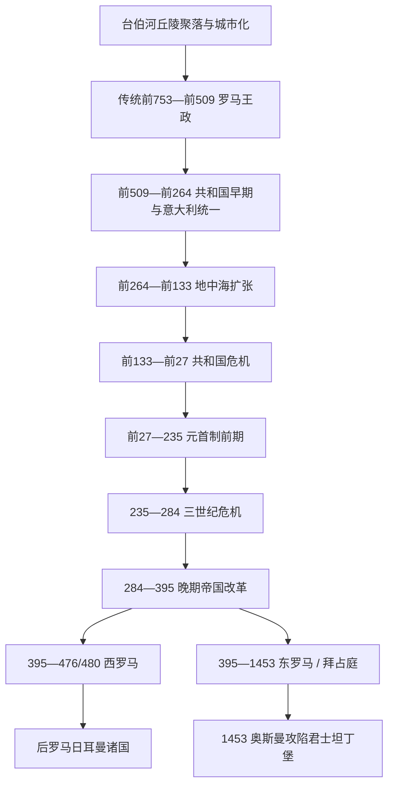

# 古罗马

[返回欧洲通史](/%E4%BA%BA%E6%96%87%E7%A7%91%E5%AD%A6/%E5%8E%86%E5%8F%B2/%E6%AC%A7%E6%B4%B2/_%E9%80%9A%E5%8F%B2/README.md)

## 范围与历史主线

古罗马从台伯河畔多丘聚落发展为城市国家，经王政传统、共和国制度、意大利同盟和地中海征服，最终形成皇帝统治的跨洲帝国。476年终结的是意大利的西部皇帝职位；以君士坦丁堡为中心的东部罗马帝国延续至1453年。本目录因此同时保留“古代地中海帝国”和“中世纪东罗马法统”两条连续主线。

历史脉络的核心不是一串征服年代，而是政治规模不断变化：国王与贵族共同体如何转为年度共和官职，共和城邦如何管理海外行省，长期军队如何产生皇帝，多皇帝共治如何回应边疆，东西宫廷又为何呈现不同结局。

## 演变图

## 按时间排序的时期导航

| 顺序 | 名称 | 时间 | 历史主线 |
|---:|---|---|---|
| 1 | [罗马王政时期](/%E4%BA%BA%E6%96%87%E7%A7%91%E5%AD%A6/%E5%8E%86%E5%8F%B2/%E6%AC%A7%E6%B4%B2/_%E9%80%9A%E5%8F%B2/%E5%8F%A4%E7%BD%97%E9%A9%AC/%E7%BD%97%E9%A9%AC%E7%8E%8B%E6%94%BF%E6%97%B6%E6%9C%9F.md) | 传统前753—前509年 | 拉丁、萨宾、伊特鲁里亚交流中的城市化；七王表属于后世传统，逐项标明史料争议 |
| 2 | [罗马共和国早期](/%E4%BA%BA%E6%96%87%E7%A7%91%E5%AD%A6/%E5%8E%86%E5%8F%B2/%E6%AC%A7%E6%B4%B2/_%E9%80%9A%E5%8F%B2/%E5%8F%A4%E7%BD%97%E9%A9%AC/%E7%BD%97%E9%A9%AC%E5%85%B1%E5%92%8C%E5%9B%BD%E6%97%A9%E6%9C%9F.md) | 前509—前264年 | 年度复数官职、贵族—平民斗争、差别公民权和意大利同盟形成 |
| 3 | [罗马共和国扩张期](/%E4%BA%BA%E6%96%87%E7%A7%91%E5%AD%A6/%E5%8E%86%E5%8F%B2/%E6%AC%A7%E6%B4%B2/_%E9%80%9A%E5%8F%B2/%E5%8F%A4%E7%BD%97%E9%A9%AC/%E7%BD%97%E9%A9%AC%E5%85%B1%E5%92%8C%E5%9B%BD%E6%89%A9%E5%BC%A0%E6%9C%9F.md) | 前264—前133年 | 布匿战争、马其顿与塞琉古战争、行省治理和扩张社会代价 |
| 4 | [罗马共和国危机期](/%E4%BA%BA%E6%96%87%E7%A7%91%E5%AD%A6/%E5%8E%86%E5%8F%B2/%E6%AC%A7%E6%B4%B2/_%E9%80%9A%E5%8F%B2/%E5%8F%A4%E7%BD%97%E9%A9%AC/%E7%BD%97%E9%A9%AC%E5%85%B1%E5%92%8C%E5%9B%BD%E5%8D%B1%E6%9C%BA%E6%9C%9F.md) | 前133—前27年 | 格拉古改革、同盟者战争、苏拉独裁、三头联盟和连续内战 |
| 5 | [罗马帝国元首制前期](/%E4%BA%BA%E6%96%87%E7%A7%91%E5%AD%A6/%E5%8E%86%E5%8F%B2/%E6%AC%A7%E6%B4%B2/_%E9%80%9A%E5%8F%B2/%E5%8F%A4%E7%BD%97%E9%A9%AC/%E7%BD%97%E9%A9%AC%E5%B8%9D%E5%9B%BD%E5%85%83%E9%A6%96%E5%88%B6%E5%89%8D%E6%9C%9F.md) | 前27—235年 | 共和国外观下的皇帝军政权、城市—行省体系和塞维鲁军事化 |
| 6 | [三世纪危机](/%E4%BA%BA%E6%96%87%E7%A7%91%E5%AD%A6/%E5%8E%86%E5%8F%B2/%E6%AC%A7%E6%B4%B2/_%E9%80%9A%E5%8F%B2/%E5%8F%A4%E7%BD%97%E9%A9%AC/%E4%B8%89%E4%B8%96%E7%BA%AA%E5%8D%B1%E6%9C%BA.md) | 235—284/285年 | 军人皇帝、高卢与帕尔米拉、外敌和币制压力；奥勒良再统一 |
| 7 | [罗马帝国晚期](/%E4%BA%BA%E6%96%87%E7%A7%91%E5%AD%A6/%E5%8E%86%E5%8F%B2/%E6%AC%A7%E6%B4%B2/_%E9%80%9A%E5%8F%B2/%E5%8F%A4%E7%BD%97%E9%A9%AC/%E7%BD%97%E9%A9%AC%E5%B8%9D%E5%9B%BD%E6%99%9A%E6%9C%9F.md) | 284—395年 | 四帝共治、行政税军改革、君士坦丁堡、基督教化和哥特危机 |
| 8 | [西罗马帝国](/%E4%BA%BA%E6%96%87%E7%A7%91%E5%AD%A6/%E5%8E%86%E5%8F%B2/%E6%AC%A7%E6%B4%B2/_%E9%80%9A%E5%8F%B2/%E5%8F%A4%E7%BD%97%E9%A9%AC/%E8%A5%BF%E7%BD%97%E9%A9%AC%E5%B8%9D%E5%9B%BD.md) | 395—476/480年 | 税源流失、联盟军地域化、强人将领和西部皇位终止 |
| 9 | [东罗马帝国与拜占庭帝国](/%E4%BA%BA%E6%96%87%E7%A7%91%E5%AD%A6/%E5%8E%86%E5%8F%B2/%E6%AC%A7%E6%B4%B2/_%E9%80%9A%E5%8F%B2/%E5%8F%A4%E7%BD%97%E9%A9%AC/%E4%B8%9C%E7%BD%97%E9%A9%AC%E5%B8%9D%E5%9B%BD%E4%B8%8E%E6%8B%9C%E5%8D%A0%E5%BA%AD%E5%B8%9D%E5%9B%BD.md) | 395—1453年 | 东部存续、查士丁尼、七世纪转型、中期复兴、1204断裂和奥斯曼征服 |

## 综合专题与世系入口

| 专题 | 内容 |
|---|---|
| [罗马帝国](/%E4%BA%BA%E6%96%87%E7%A7%91%E5%AD%A6/%E5%8E%86%E5%8F%B2/%E6%AC%A7%E6%B4%B2/_%E9%80%9A%E5%8F%B2/%E5%8F%A4%E7%BD%97%E9%A9%AC/%E7%BD%97%E9%A9%AC%E5%B8%9D%E5%9B%BD.md) | 从元首制到东西分治的制度、军队、行省、财政、法律、宗教与兴衰总览 |
| [罗马帝国皇帝世系表](/%E4%BA%BA%E6%96%87%E7%A7%91%E5%AD%A6/%E5%8E%86%E5%8F%B2/%E6%AC%A7%E6%B4%B2/_%E9%80%9A%E5%8F%B2/%E5%8F%A4%E7%BD%97%E9%A9%AC/%E7%BD%97%E9%A9%AC%E5%B8%9D%E5%9B%BD%E7%9A%87%E5%B8%9D%E4%B8%96%E7%B3%BB%E8%A1%A8.md) | 前27—395年及西部至476/480年的完整皇帝、共治和重大竞争者表 |
| [东罗马帝国皇帝世系表](/%E4%BA%BA%E6%96%87%E7%A7%91%E5%AD%A6/%E5%8E%86%E5%8F%B2/%E6%AC%A7%E6%B4%B2/_%E9%80%9A%E5%8F%B2/%E5%8F%A4%E7%BD%97%E9%A9%AC/%E4%B8%9C%E7%BD%97%E9%A9%AC%E5%B8%9D%E5%9B%BD%E7%9A%87%E5%B8%9D%E4%B8%96%E7%B3%BB%E8%A1%A8.md) | 395—1453年君士坦丁堡 / 尼西亚完整主线，含女皇、复位、摄政和共帝 |
| [三世纪危机](/%E4%BA%BA%E6%96%87%E7%A7%91%E5%AD%A6/%E5%8E%86%E5%8F%B2/%E6%AC%A7%E6%B4%B2/_%E9%80%9A%E5%8F%B2/%E5%8F%A4%E7%BD%97%E9%A9%AC/%E4%B8%89%E4%B8%96%E7%BA%AA%E5%8D%B1%E6%9C%BA.md) | 高卢帝国、帕尔米拉及各地称帝者逐人表，并区分实证与《奥古斯都史》虚构 |

## 重要转折与时间节点

| 时间 | 转折 | 意义 |
|---|---|---|
| 前7—前6世纪 | 罗马城市化与伊特鲁里亚影响 | 公共工程、王权和军事共同体形成 |
| 传统前509年 | 王政被逐 | 最高权转为年度、双人官职，宗教王职与军政权分离 |
| 前287年 | 霍腾西阿法 | 平民会议决议对全体公民有约束力 |
| 前264年 | 第一次布匿战争 | 罗马进入海外行省和海军战争 |
| 前216、前202年 | 坎尼与扎马 | 联盟体系承受危机并最终击败迦太基 |
| 前168、前146年 | 皮德纳、迦太基和科林斯 | 罗马确立地中海霸权 |
| 前133年 | 提比略·格拉古遇害 | 改革冲突转为精英集体暴力 |
| 前91—前88年 | 同盟者战争 | 意大利大多数自由居民获得罗马公民权 |
| 前88、前49年 | 苏拉、凯撒进军罗马 | 军团成为国内政权交接工具 |
| 前27年 | 奥古斯都宪制安排 | 元首制建立，军队和关键行省集中 |
| 68—69、193年 | 多皇帝内战 | 行省军团和近卫军共同决定皇位 |
| 212年 | 普授公民权 | 大多数帝国自由民成为罗马公民 |
| 235—284年 | 三世纪危机 | 单一皇帝覆盖多边疆的体系失灵并被重构 |
| 293年 | 四帝共治 | 多皇帝制度化分担区域防务 |
| 330年 | 君士坦丁堡启用 | 帝国增加靠近东方和多瑙前线的新首都 |
| 378年 | 阿德里安堡战役 | 哥特安置和晚期军队问题发生重大转折 |
| 395年 | 狄奥多西一世去世 | 东西宫廷长期各自运行 |
| 410、439年 | 罗马被洗劫、汪达尔夺北非 | 西部象征与财政基础先后受重创 |
| 476/480年 | 西部皇位终结 | 意大利进入无西帝的国王统治，罗马制度继续转化 |
| 636年后 | 东部失去叙利亚和埃及 | 帝国转为安纳托利亚—巴尔干核心 |
| 1204、1261年 | 十字军陷都与尼西亚复都 | 东部制度断裂后恢复，但国力不复 |
| 1453年 | 君士坦丁堡陷落 | 东部罗马皇帝法统终结 |

## 关键辨析

- 王政七王年表是后世传统，不能与共和国以后较完整的官职和碑铭证据等量齐观。
- 罗马共和国不是现代民主国家。公民大会投票单位不平等，妇女、奴隶和非公民无政治权，元老精英长期主导。
- “马略改革”不是一次法令瞬间创造职业军队；长期服役、国家装备、退伍安置与统帅网络逐步改变军队。
- “罗马帝国”并不从凯撒称帝开始。凯撒是终身独裁官，前27年奥古斯都的持续宪制安排才是通常起点。
- 395年不是法律上把一个国家永久分成两个国家，而是两个宫廷、军队和财政从此很少再由一位皇帝稳定统治。
- 476年不是罗马文明或帝国全部消失；东罗马延续，西部元老院、法律、城市和教会也继续存在。
- “蛮族入侵”不能单独解释西部灭亡。税源、内战、军队支付和联盟军安置共同决定国家是否能维持。
- 拜占庭人自称罗马人，“拜占庭帝国”是现代史学便利称呼。

## 区域交叉阅读

- 西地中海对手：[迦太基](/%E4%BA%BA%E6%96%87%E7%A7%91%E5%AD%A6/%E5%8E%86%E5%8F%B2/%E5%8C%97%E9%9D%9E/_%E9%80%9A%E5%8F%B2/%E8%BF%A6%E5%A4%AA%E5%9F%BA/README.md)与[布匿战争](/%E4%BA%BA%E6%96%87%E7%A7%91%E5%AD%A6/%E5%8E%86%E5%8F%B2/%E5%8C%97%E9%9D%9E/_%E9%80%9A%E5%8F%B2/%E8%BF%A6%E5%A4%AA%E5%9F%BA/%E5%B8%83%E5%8C%BF%E6%88%98%E4%BA%89.md)。
- 希腊化世界：[希腊化时代](/%E4%BA%BA%E6%96%87%E7%A7%91%E5%AD%A6/%E5%8E%86%E5%8F%B2/%E6%AC%A7%E6%B4%B2/_%E9%80%9A%E5%8F%B2/%E5%8F%A4%E5%B8%8C%E8%85%8A/%E5%B8%8C%E8%85%8A%E5%8C%96%E6%97%B6%E4%BB%A3.md)。
- 东方对手：[萨珊帝国](/%E4%BA%BA%E6%96%87%E7%A7%91%E5%AD%A6/%E5%8E%86%E5%8F%B2/%E8%A5%BF%E4%BA%9A/%E4%BC%8A%E6%9C%97/%E8%90%A8%E7%8F%8A%E5%B8%9D%E5%9B%BD.md)。
- 西部承接：[后罗马时代的日耳曼诸国](/%E4%BA%BA%E6%96%87%E7%A7%91%E5%AD%A6/%E5%8E%86%E5%8F%B2/%E6%AC%A7%E6%B4%B2/_%E9%80%9A%E5%8F%B2/%E5%90%8E%E7%BD%97%E9%A9%AC%E6%97%B6%E4%BB%A3%E7%9A%84%E6%97%A5%E8%80%B3%E6%9B%BC%E8%AF%B8%E5%9B%BD/README.md)。
- 东部终局：[奥斯曼帝国](/%E4%BA%BA%E6%96%87%E7%A7%91%E5%AD%A6/%E5%8E%86%E5%8F%B2/%E8%A5%BF%E4%BA%9A/%E5%9C%9F%E8%80%B3%E5%85%B6/%E5%A5%A5%E6%96%AF%E6%9B%BC%E5%B8%9D%E5%9B%BD/README.md)。
- 意大利区域线：[意大利历史](/%E4%BA%BA%E6%96%87%E7%A7%91%E5%AD%A6/%E5%8E%86%E5%8F%B2/%E6%AC%A7%E6%B4%B2/%E6%84%8F%E5%A4%A7%E5%88%A9/README.md)。
