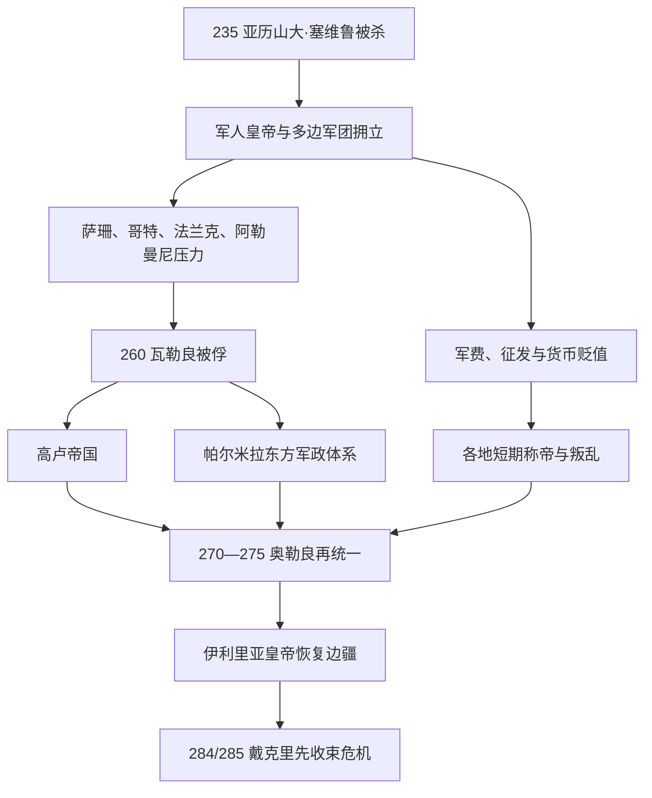

# 三世纪危机

## 时间

235年—284年。以亚历山大·塞维鲁被杀、马克西米努斯·色雷克斯获军队拥立为起点，以戴克里先击败竞争者并建立新的晚期帝国秩序为终点；卡里努斯到285年才被彻底击败，故危机收束有时写作284—285年。

## 概括

三世纪危机不是连续五十年的全面崩溃，而是皇位内战、萨珊与日耳曼边境战争、瘟疫、货币贬值、税收征发和地区军事自救相互强化的阶段。皇帝必须在莱茵、多瑙和幼发拉底之间迅速移动，一处军队若认为中央不能保护边区，就会拥立自己的将领。260年瓦勒良被萨珊俘虏后，高卢帝国在西部、帕尔米拉政权在东方形成相对完整的区域秩序。加里恩努斯的机动军改革、克劳狄二世的对哥特胜利、奥勒良的再统一和普罗布斯的边境恢复逐步扭转局面；戴克里先则承认单一皇帝无法同时覆盖所有前线，以共治、行政和税制改革建立新体制。

中央皇帝逐人连续表见[罗马帝国皇帝世系表](/%E4%BA%BA%E6%96%87%E7%A7%91%E5%AD%A6/%E5%8E%86%E5%8F%B2/%E6%AC%A7%E6%B4%B2/_%E9%80%9A%E5%8F%B2/%E5%8F%A4%E7%BD%97%E9%A9%AC/%E7%BD%97%E9%A9%AC%E5%B8%9D%E5%9B%BD%E7%9A%87%E5%B8%9D%E4%B8%96%E7%B3%BB%E8%A1%A8.md)。本页另把高卢、帕尔米拉与地方称帝者逐人列出，不使用“某某等僭位者”的合并项。

## 演进图

## 危机为何爆发

### 皇位与军队

塞维鲁王朝提高军饷并扩大军人特权，却没有建立稳定继承法。边区军队既承担更强敌人的压力，又能直接接触掌军总督；它们倾向拥立能立即发饷、作战和代表本区利益者。新皇必须奖赏拥立军、消灭其他候选人，常在尚未稳固边境前投入内战。

### 多线外部压力

萨珊王朝取代安息后追求恢复两河与亚美尼亚影响，军政动员更集中。多瑙和黑海方向的哥特、赫鲁利等集团能借船队和陆路深入巴尔干、小亚细亚；莱茵方向法兰克、阿勒曼尼等联盟扩大。罗马人把多种规模和性质不同的群体统称“蛮族”，现代叙述不能假设它们是统一民族国家。

### 疫病、货币和财政

约249年起的“西普里安瘟疫”在多地反复，具体病原与死亡规模不明，但军队、城市和劳动力受压。银币含银量不断下降，价格与实物征收上升；这既是“经济危机”，也是政府必须用有限贵金属支付不断扩大的军队。地方交易没有完全停止，地区差异很大，不能写成整个帝国一夜回到物物交换。

## 分阶段过程

| 阶段 | 时间 | 主线 | 结果 |
|---|---|---|---|
| 塞维鲁秩序崩解 | 235—249 | 马克西米努斯征发引发238年六帝混战；元老院与军队反复推举 | 皇位依靠短期军事胜利，中央承认机制失效 |
| 战争与疫病叠加 | 249—260 | 德基乌斯对哥特战死，多个皇帝在多瑙竞争；萨珊深入东方 | 260年瓦勒良被俘成为权威最低点 |
| 区域帝国并立 | 260—268/274 | 加里恩努斯守中央，高卢与帕尔米拉分别防卫西东 | 帝国政治分裂，但区域行政与铸币继续运作 |
| 伊利里亚皇帝反攻 | 268—275 | 克劳狄二世击败哥特，奥勒良击败帕尔米拉并接受高卢投降 | 274年领土统一，奥勒良获“世界复兴者”称号 |
| 恢复仍不稳定 | 275—284/285 | 塔西佗、弗洛里安、普罗布斯、卡鲁斯诸帝更替 | 边防改善但继承仍靠军队；戴克里先以新体制解决规模问题 |

## 高卢帝国统治者完整表

高卢帝国控制高卢、不列颠及阶段性的西班牙，设自己的执政官、近卫、铸币和行政，却通常以保卫罗马西部而非建立非罗马国家自居。

| 顺序 | 统治者 | 在位 / 称号时间 | 关系与控制 | 结局 / 备注 |
|---:|---|---|---|---|
| 1 | 波斯图穆斯 | 260—269 | 莱茵军队拥立，杀中央共帝萨洛尼努斯；控制高卢、不列颠和部分西班牙 | 因拒绝士兵洗劫美因茨，被本军杀害 |
| 2 | 拉埃利亚努斯 | 269 | 美因茨军队反对波斯图穆斯而拥立 | 数月内战败被杀 |
| 3 | 马略 | 269 | 波斯图穆斯死后由军队拥立 | 统治只有数月；“两三天”是夸张传说 |
| 4 | 维克托里努斯 | 269—271 | 波斯图穆斯旧将 | 恢复部分控制；在科隆被私人仇杀，母亲维多利亚维持继承安排 |
| 5 | 多米提安努斯二世 | 约271 | 钱币证实的短期称帝者，可能在维克托里努斯死后争位 | 仅少数钱币和后期资料，统治范围与长度不详 |
| 6 | 泰特里库斯一世 | 271—274 | 阿基坦总督，在维多利亚支持下拥立 | 面临军队、巴高达式骚动和浮士德努斯反叛；在沙隆战役向奥勒良投降 |
| 7 | 泰特里库斯二世 | 约273—274 | 泰特里库斯一世之子，正式凯撒，可能获更高称号 | 与父一同投降；严格说主要为凯撒而非稳定独立奥古斯都 |
| — | 浮士德努斯 | 约273/274 | 泰特里库斯部下，在奥古斯塔·特雷维罗鲁姆反叛 | 是否正式称帝主要见晚期资料，钱币证据不足，列为争议竞争者 |

## 帕尔米拉军政统治者完整表

帕尔米拉起初以罗马授权保卫东方。奥登纳图斯并未公开取代罗马皇帝；芝诺比娅摄政后逐步占领埃及和小亚细亚，至272年才让自己与儿子采用奥古斯都称号。因此“帕尔米拉帝国”有从罗马代理防务到独立皇权的演变。

| 顺序 | 统治者 | 权力时间 | 法律 / 实际地位 | 关键事件与结局 |
|---:|---|---|---|---|
| 1 | 奥登纳图斯 | 约260—267 | 帕尔米拉首领，获罗马“东方全境校正官”等权力，自称“万王之王” | 击败萨珊并清除东方竞争者；仍承认加里恩努斯，遇刺身亡 |
| 2 | 海兰一世 / 赫罗德 | 约263—267 | 奥登纳图斯之子和共治“万王之王” | 与父同遭暗杀；不是罗马奥古斯都 |
| 3 | 瓦巴拉图斯 | 267—272 | 奥登纳图斯幼子，芝诺比娅摄政；初以罗马头衔治东方，272年称奥古斯都 | 帕尔米拉钱币先同时承认奥勒良，后公开独立；战败被俘，结局不明 |
| 4 | **芝诺比娅** | 267—272摄政；272称奥古斯塔 | 瓦巴拉图斯之母和实际统治者 | 控制叙利亚、埃及及小亚细亚大片区域；败于奥勒良，被带往罗马，晚年传说不一 |

## 其他地方称帝者与争议人物

下表以年代排列。证据有时只有钱币、铭文或敌对叙事，故区分“确有称号”“军事叛乱”与“可能虚构”。

| 人物 | 时间 | 地区 / 权力基础 | 身份与史料判断 |
|---|---|---|---|
| 夸提努斯 | 235 | 东方一支军队 | 在马克西米努斯即位初被拥立，数日后被杀；主要见后世叙述 |
| 马格努斯 | 235 | 罗马 / 军队阴谋 | 传称计划毁桥困住马克西米努斯，是否实际称帝不确定 |
| 萨比尼亚努斯 | 240 | 非洲行省 | 在迦太基称帝反戈尔迪安三世，迅速被毛里塔尼亚总督平定 |
| 帕卡提亚努斯 | 248—249 | 默西亚 / 多瑙军队 | 钱币证实称帝；部下杀其并转而拥立德基乌斯 |
| 约塔皮亚努斯 | 248—249 | 叙利亚—卡帕多西亚 | 反对税务官和腓力一世，钱币证实；被本军杀害 |
| 西尔班纳库斯 | 约253或260年代 | 地点与年代不明，可能罗马或莱茵 | 仅由极少钱币证实“奥古斯都”称号，身份仍高度争议 |
| 乌拉尼乌斯·安东尼努斯 | 253/254 | 埃梅萨 | 祭司 / 地方领袖借萨珊威胁称帝，钱币和铭文证实；结局不明 |
| 因格努斯 | 260 | 潘诺尼亚 | 瓦勒良被俘后由多瑙军拥立，败于加里恩努斯将领奥勒奥鲁斯 |
| 雷加利亚努斯 | 260 | 潘诺尼亚 | 钱币证实称帝，可能为因格努斯之后；被本军或边族杀害 |
| 小马克里亚努斯 | 260—261 | 东方 | 由父马克里亚努斯和近卫长官巴利斯塔支持，与弟奎埃图斯共治；西进时败亡 |
| 奎埃图斯 | 260—261 | 叙利亚、埃梅萨 | 小马克里亚努斯之弟，共同称帝；兄败后被奥登纳图斯围杀 |
| 老马克里亚努斯 | 260—261 | 东方财政与军队 | 权力策划者，因年老 / 伤残未自称皇帝；支持两子，随军败亡 |
| 巴利斯塔 | 260年代 | 东方军政集团 | 曾打击萨珊并拥立马克里亚努斯兄弟；是否自称皇帝缺乏可靠证据 |
| 穆西乌斯·埃米利安努斯 | 261—262 | 埃及 | 先支持马克里亚努斯，后自称皇帝；被加里恩努斯将领击败处死 |
| 梅莫尔 | 262 | 埃及上游 | 穆西乌斯阵营官员，继续反抗；没有可靠皇号，属相关叛乱首领 |
| 奥勒奥鲁斯 | 267/268 | 米兰与骑兵部队 | 加里恩努斯将领，后支持波斯图穆斯或自行称帝；被围期间加里恩努斯遇刺，旋向克劳狄二世投降后被杀 |
| 塞普蒂米乌斯 | 271/272 | 达尔马提亚 | 军队短暂拥立，旋被本军杀害；资料极少 |
| 菲尔穆斯 | 273/274 | 埃及亚历山大里亚 | 帕尔米拉失败后反奥勒良；是否采用皇号有争议，历史叛乱本身较可靠 |
| 尤利乌斯·萨图尔尼努斯 | 约280 | 叙利亚 / 东方军队 | 被军队拥立反普罗布斯，旋在阿帕米亚被围杀 |
| 普罗库卢斯 | 约280 | 高卢里昂 | 富有军官 / 地方精英，军队拥立反普罗布斯；败逃后被捕处死 |
| 博诺苏斯 | 约280 | 莱茵舰队 | 舰队失火后担心惩罚而称帝，与普罗库卢斯同期或相继；战败自杀 |
| 萨比努斯·尤利安努斯 | 284—285 | 意大利或潘诺尼亚 | 卡里努斯时期称帝，后被卡里努斯击败；活动跨越戴克里先即位 |
| 森索里努斯 | 传说269年 | 不详 | 仅《奥古斯都史》记载，通常视为虚构或高度不可信，不列正式在位 |
| “三十僭主”中的多名人物 | 260年代传说 | 各地 | 《奥古斯都史》为仿雅典“三十僭主”凑数，含女性、孩童和虚构者，不能当作完整历史名单 |

## 军事、行政与经济调整

### 加里恩努斯改革

加里恩努斯减少元老院议员直接担任军团指挥，让更有职业经验的骑士军官上升；在意大利北部配置机动骑兵以快速应对多线反叛。所谓“把元老完全逐出军队”可能是渐进过程，但军官职业化方向明确。他停止德基乌斯式普遍祭祀迫害，恢复教会财产，争取内部稳定。

### 奥勒良再统一

奥勒良先击败汪达尔、尤通吉等威胁，并决定撤出难守的达契亚北部，把多瑙以南新行省也称达契亚，以缩短边线。272年攻破帕尔米拉，273年再次镇压其反叛；274年泰特里库斯在沙隆投降，高卢帝国终结。罗马城修建奥勒良城墙，说明首都也不再被视为绝对安全。其货币改革试图提高标识和含银标准，但无法完全恢复早期币制信任。

### 从普罗布斯到戴克里先

普罗布斯击退多支边族，安置战俘与移民并要求士兵参与公共工程，严苛劳役可能促成兵变。卡鲁斯家族再次以父子共治分担东西，仍因突然死亡瓦解。284年东方军队拥立戴克里先，285年击败卡里努斯；新帝不再假定一人可以在所有边疆随时出现，逐步发展多皇帝共治。

## 重要事件

- 235年，亚历山大·塞维鲁及其母被杀，马克西米努斯获拥立。
- 238年，非洲起义、元老院反抗与六位皇帝相继出现。
- 249—251年，德基乌斯的祭祀命令与哥特战争；皇帝在阿布里图斯阵亡。
- 约249—262年，西普里安瘟疫反复。
- 260年，瓦勒良被萨珊沙普尔一世俘虏。
- 260年起，高卢帝国形成；帕尔米拉获东方防务权。
- 267/268年，哥特和赫鲁利海陆入侵爱琴海区域。
- 268—269年，克劳狄二世在纳伊苏斯等战事中重创哥特军。
- 272年，奥勒良击败芝诺比娅和瓦巴拉图斯。
- 274年，高卢帝国投降，帝国领土重归一位皇帝。
- 275年，奥勒良被军官误信阴谋而杀。
- 282年，普罗布斯被兵变杀害。
- 284年，戴克里先即位；285年击败卡里努斯，危机收束。

## 兴衰因果

| 类型 | 因素 | 作用 |
|---|---|---|
| 结构因素 | 单一皇帝无法同时覆盖三大边疆 | 行程和通讯延误让地方军队自行创造领导 |
| 结构因素 | 皇位无固定继承规则 | 军事胜利、军饷和军队拥立即时性压过元老院确认 |
| 经济压力 | 军饷、赎买、重建和疫情叠加 | 货币贬值、实物征收与地方负担上升 |
| 外部压力 | 萨珊国家与跨部落军事集团 | 罗马面对的不再只是小规模袭扰，多线战争更持久 |
| 地区自救 | 高卢、帕尔米拉建立区域皇权 | 短期提高防务，却分割税源与合法性 |
| 恢复条件 | 伊利里亚军官集团、机动军和战略收缩 | 产生能连续作战的皇帝，放弃难守边线、集中兵力 |
| 直接收束 | 奥勒良军事统一与戴克里先制度化共治 | 前者恢复领土，后者试图解决皇帝覆盖和继承问题 |

## 演变关系

- 前一节点：[罗马帝国元首制前期](/%E4%BA%BA%E6%96%87%E7%A7%91%E5%AD%A6/%E5%8E%86%E5%8F%B2/%E6%AC%A7%E6%B4%B2/_%E9%80%9A%E5%8F%B2/%E5%8F%A4%E7%BD%97%E9%A9%AC/%E7%BD%97%E9%A9%AC%E5%B8%9D%E5%9B%BD%E5%85%83%E9%A6%96%E5%88%B6%E5%89%8D%E6%9C%9F.md)。
- 后一节点：[罗马帝国晚期](/%E4%BA%BA%E6%96%87%E7%A7%91%E5%AD%A6/%E5%8E%86%E5%8F%B2/%E6%AC%A7%E6%B4%B2/_%E9%80%9A%E5%8F%B2/%E5%8F%A4%E7%BD%97%E9%A9%AC/%E7%BD%97%E9%A9%AC%E5%B8%9D%E5%9B%BD%E6%99%9A%E6%9C%9F.md)。
- 中央皇帝连续表：[罗马帝国皇帝世系表](/%E4%BA%BA%E6%96%87%E7%A7%91%E5%AD%A6/%E5%8E%86%E5%8F%B2/%E6%AC%A7%E6%B4%B2/_%E9%80%9A%E5%8F%B2/%E5%8F%A4%E7%BD%97%E9%A9%AC/%E7%BD%97%E9%A9%AC%E5%B8%9D%E5%9B%BD%E7%9A%87%E5%B8%9D%E4%B8%96%E7%B3%BB%E8%A1%A8.md)。
- 萨珊压力：[萨珊帝国](/%E4%BA%BA%E6%96%87%E7%A7%91%E5%AD%A6/%E5%8E%86%E5%8F%B2/%E8%A5%BF%E4%BA%9A/%E4%BC%8A%E6%9C%97/%E8%90%A8%E7%8F%8A%E5%B8%9D%E5%9B%BD.md)。
- 所属综合页：[罗马帝国](/%E4%BA%BA%E6%96%87%E7%A7%91%E5%AD%A6/%E5%8E%86%E5%8F%B2/%E6%AC%A7%E6%B4%B2/_%E9%80%9A%E5%8F%B2/%E5%8F%A4%E7%BD%97%E9%A9%AC/%E7%BD%97%E9%A9%AC%E5%B8%9D%E5%9B%BD.md)。
- 所属总览：[古罗马](/%E4%BA%BA%E6%96%87%E7%A7%91%E5%AD%A6/%E5%8E%86%E5%8F%B2/%E6%AC%A7%E6%B4%B2/_%E9%80%9A%E5%8F%B2/%E5%8F%A4%E7%BD%97%E9%A9%AC/README.md)。
