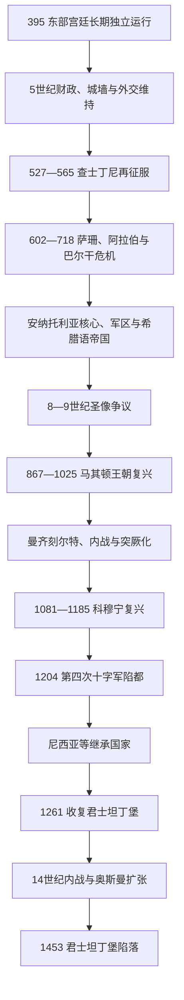

# 东罗马帝国与拜占庭帝国

## 时间

395年—1453年。330年君士坦丁堡建立、476年西部皇位终结、610年希拉克略即位、1204年第四次十字军占领首都和1261年复都都是内部转型节点，但国家始终主张罗马法统。后世“拜占庭帝国”一词便于区分中世纪阶段，不是当时正式国名。

## 概括

东罗马帝国依靠君士坦丁堡城墙和海峡、安纳托利亚与东方行省税源、较连续的官僚和金币体系，在五世纪西部瓦解时存续。查士丁尼一世一度收复北非、意大利和南西班牙，却因瘟疫、萨珊战争和长期驻防付出高昂成本。7世纪萨珊战争与阿拉伯征服使帝国失去叙利亚、埃及和北非，领土核心转为安纳托利亚与巴尔干，行政语言和军事组织更明显希腊化。

9—11世纪帝国经历军事、文化和经济复兴，巴西尔二世时期消灭保加利亚第一帝国；其后宫廷—军人冲突、塞尔柱扩张和曼齐刻尔特之后的内战导致安纳托利亚税兵基础收缩。科穆宁王朝以家族贵族、外交和西方雇佣力量恢复部分实力。1204年十字军攻陷君士坦丁堡，尼西亚等继承政权并立；尼西亚在1261年复都，却无法恢复原税源。巴列奥略时期内战、热那亚和威尼斯贸易优势、塞尔维亚与奥斯曼扩张使帝国缩为首都及零散领地。1453年穆罕默德二世攻破君士坦丁堡，君士坦丁十一世战死。

395—1453年全部皇帝、女皇、复位者、尼西亚主线及重要共治者见[东罗马帝国皇帝世系表](/%E4%BA%BA%E6%96%87%E7%A7%91%E5%AD%A6/%E5%8E%86%E5%8F%B2/%E6%AC%A7%E6%B4%B2/_%E9%80%9A%E5%8F%B2/%E5%8F%A4%E7%BD%97%E9%A9%AC/%E4%B8%9C%E7%BD%97%E9%A9%AC%E5%B8%9D%E5%9B%BD%E7%9A%87%E5%B8%9D%E4%B8%96%E7%B3%BB%E8%A1%A8.md)。

## 演进图

## 统治结构与实际权力

### 皇帝与宫廷

皇帝是最高立法、任官、军事和外交权威，主持凯旋、授予头衔并维护正统信仰。皇权不是不受限制的“东方专制”：军队可拥立将领，首都民众与赛马场派系可发动政变，牧首加冕和教会舆论影响合法性，贵族家族控制地方资源。幼帝时，皇太后、摄政委员会或高级共帝可能掌握全部政务。

| 机构 / 群体 | 名义职能 | 实际权力变化 |
|---|---|---|
| 皇帝与共治皇帝 | 颁法、统军、任官、外交与教会会议保护者 | 生前加冕儿子有助继承，也制造多个合法中心；军队与首都控制仍是最终保障 |
| 君士坦丁堡元老院 | 高官和贵族议政、在继承危机中参与拥立 | 早期影响较大，后逐渐成为身份团体，但在群众起义和无嗣继承时仍重要 |
| 宫廷官僚 | 财政、文书、司法、外交和皇室地产 | 职称和部门多次变化；宦官可掌财政、军队或摄政，不因身份而只是仆从 |
| 军区将领 | 统辖区域军队；早期军区形成与7世纪危机相关 | 强大军区能保卫安纳托利亚，也能拥立皇帝；后被中央拆分和制衡 |
| 中央野战军 / 禁军 | 保护首都并作为远征主力 | 9—11世纪常由皇帝和军人贵族竞争控制 |
| 牧首与教会 | 教义、圣礼、慈善、教育与皇帝加冕 | 皇帝能任免和流放牧首，教会也能以正统、婚姻和圣像问题限制皇帝 |
| 城市与乡村共同体 | 纳税、生产、地方司法和公共设施 | 7世纪后许多古典城市缩小，但港口、主教区和地方市场未消失 |
| 贵族家族 | 土地、官职、军队与婚姻网络 | 科穆宁以后皇权更依赖家族联盟；内战时家族可引入外国援军 |
| 商业共和国 | 获得港区、关税减免和海军合作 | 威尼斯、热那亚从盟友变为控制贸易节点的独立力量，削弱帝国海关收入 |

### 法律与行政连续性

查士丁尼《民法大全》整理古典法学、皇帝敕令和法律教材，成为帝国内部及后世欧洲法的重要基础。7世纪后希腊语成为主要行政语言，利奥三世《法律选编》、马其顿王朝《皇帝法典》等继续修订，而非放弃罗马法。

行省—管区旧制在战争中变化，军区最初是军队及其司令驻扎区域，后来兼具地方行政和征兵功能。将军是否直接拥有“军田”、所有士兵是否世袭农民，学界存在争论；应理解为军队财政与土地、地方税收长期结合，而非一种全国统一封建制。

### 军役、土地与普罗尼亚

中期帝国同时使用军区兵、中央职业军、盟友和雇佣兵。11世纪后普罗尼亚把特定财政收入的征收权暂授个人以换取服务，通常不等于完全私有、可世袭的西欧封地；晚期因中央衰弱，授予更容易世袭化。海军削减和向意大利商人授特权则使帝国越来越难独立控制海上运输。

## 分阶段历史

### 五世纪的生存与西部终结

阿卡狄乌斯和狄奥多西二世时期，安特米城墙加强首都防御。东部向匈人支付贡金、利用外交转移压力，并在财政改革下积累资源。阿斯帕等日耳曼或阿兰将领拥有强大军权，但利奥一世借伊苏里亚将领芝诺清除其集团，避免西部里西默式长期军人控制。

476年奥多亚克废黜罗慕路斯，把西部帝权标志送至芝诺。芝诺既要求名义承认尼波斯，又最终接受奥多亚克统治意大利；后来派东哥特狄奥多里克进入意大利，同时解决巴尔干军队压力。东部自此成为唯一持续的罗马皇帝中心。

### 查士丁尼再征服

532年尼卡骚乱把赛马场派系、税务不满和宫廷反对结合起来，查士丁尼在狄奥多拉支持下拒绝逃亡，贝利撒留等军队在竞技场镇压。随后重建圣索菲亚大教堂并推进法典编纂。

533—534年贝利撒留迅速消灭汪达尔王国，恢复北非。535年开始哥特战争，初期占领罗马和拉文纳，但萨珊战争、541年起查士丁尼瘟疫、东哥特反攻使战争拖至552/554年。意大利人口、城市和财政遭严重破坏，伦巴德568年入侵后大部分内陆再次失去。再征服重建地中海声望，却超过帝国长期驻防能力。

### 七世纪生存危机与转型

莫里斯602年被军队推翻后，萨珊以为其复仇为名全面进攻，占领叙利亚、巴勒斯坦和埃及。希拉克略从非洲起兵，610年推翻福卡斯；在首都受围和财政耗尽下，他以教会财产、战略撤退和深入高加索反攻，628年迫使萨珊归还领土。两帝国均已疲惫。

632年后阿拉伯军队快速扩张。636年雅尔穆克战败后叙利亚难以恢复，642年前后埃及失守，帝国失去主要粮税区。阿拉伯舰队威胁地中海；君士坦丁堡在7世纪后期和717—718年两次抵御大规模攻势。安纳托利亚军区、山地防线、海军和首都城墙使国家缩小而不亡。

巴尔干方面，斯拉夫群体在战争与迁徙中进入并建立地方共同体，保加尔于7世纪后期在多瑙以南形成国家。帝国对巴尔干的控制由全面行省治理变为沿海城市、要塞、传教、移民和逐步收复的组合。

### 圣像争议与制度稳定

利奥三世、君士坦丁五世支持限制 / 禁止圣像敬礼，原因涉及神学、皇权、修道院财产和军事政治，不能只解释为“受伊斯兰影响”。787年伊琳娜主持第二次尼西亚会议恢复圣像敬礼，利奥五世后再启争议，843年狄奥多拉摄政时最终恢复。

同一时期帝国抵御阿拉伯、保加尔和内部军区叛乱，重建金币与税收。破坏圣像皇帝在后世正统史书中形象极负面，但君士坦丁五世等人的军事与行政能力不能因此抹去。

### 马其顿王朝复兴

9世纪后阿拔斯政治分裂，帝国东方逐步反攻。867年巴西尔一世建立马其顿王朝，法律编纂、传教和宫廷文化活跃。西里尔与美多德传教及其弟子活动推动斯拉夫礼仪与文字传统；保加利亚和基辅罗斯受洗扩大君士坦丁堡教会影响。

尼基弗鲁斯二世、约翰一世在克里特、叙利亚和巴尔干扩张。巴西尔二世先击败巴尔达斯·斯克莱罗斯、巴尔达斯·福卡斯等军人贵族反叛，再经历数十年战争，于1018年吞并保加利亚第一帝国。他保留部分地方税制和教会安排，帝国达到中期领土高峰。

### 十一世纪危机与曼齐刻尔特

巴西尔二世无子，1025年后皇位通过弟弟君士坦丁八世的女儿佐伊、狄奥多拉及婚姻在文官和军人集团间转换。军队是否被文官“故意摧毁”过于简单；长期边防、土地集中、雇佣兵使用和频繁政变共同削弱协调。

1071年罗曼努斯四世在曼齐刻尔特被塞尔柱苏丹阿尔普·阿尔斯兰俘虏，损失本身并未立刻摧毁全部安纳托利亚军队。真正致命的是杜卡斯派趁机废帝、随后十年多方将领争位，各派邀请突厥军队进入安纳托利亚并以城镇、税源支付援助。中央内战让突厥部众和罗姆苏丹国取得稳定据点。详细区域后续见[安纳托利亚突厥化与罗姆苏丹国](/%E4%BA%BA%E6%96%87%E7%A7%91%E5%AD%A6/%E5%8E%86%E5%8F%B2/%E8%A5%BF%E4%BA%9A/%E5%9C%9F%E8%80%B3%E5%85%B6/%E5%AE%89%E7%BA%B3%E6%89%98%E5%88%A9%E4%BA%9A%E7%AA%81%E5%8E%A5%E5%8C%96%E4%B8%8E%E7%BD%97%E5%A7%86%E8%8B%8F%E4%B8%B9%E5%9B%BD.md)。

### 科穆宁复兴与十字军关系

阿历克塞一世1081年即位时面对诺曼入侵、佩切涅格和小亚细亚丧失。他以科穆宁家族婚姻网络掌握官职，引入新税和货币改革，并向西方请求雇佣援军。教宗动员形成规模远超预期的第一次十字军。十字军领袖向皇帝宣誓返还旧帝国城市，但安条克等地归属争端造成长期互不信任；尼西亚和小亚细亚西部部分收复。

约翰二世稳步远征，曼努埃尔一世广泛介入匈牙利、意大利、十字军国家和安纳托利亚。1176年密列奥塞法隆受挫并非“第二个曼齐刻尔特”式全面崩溃，但显示帝国难消灭罗姆苏丹国。曼努埃尔死后幼帝摄政、反拉丁情绪与安德罗尼科一世暴力清洗瓦解精英联盟。

### 1204年与继承国家

安格洛斯王朝税军能力弱化。被废王子阿历克塞承诺巨款、军援和教会合一，诱使第四次十字军转向君士坦丁堡。1203年复位的父子无法兑现承诺，首都反拉丁政变后，十字军于1204年4月攻陷并三日劫掠城市，大量圣物、艺术品和财富外流。

拉丁帝国控制首都，威尼斯取得港口与岛屿。尼西亚、伊庇鲁斯和特拉比松均自称罗马传统继承者。尼西亚以小亚细亚税源、流亡牧首和拉斯卡里斯—瓦塔泽斯王朝整合力量；1259年佩拉戈尼亚战胜反对联盟，1261年将领阿历克塞·斯特拉特戈普洛斯趁拉丁守军外出收复君士坦丁堡。米海尔八世废黜尼西亚幼帝约翰四世，建立巴列奥略王朝。

### 巴列奥略衰落与1453年

复都后的帝国为防西方再次入侵，把资源从安纳托利亚转向外交和巴尔干，边境防务削弱。威尼斯、热那亚商人享有低税和港区，帝国海关收入受损。安德罗尼科二世削减海军并雇用加泰罗尼亚佣兵对付突厥，佣兵首领被杀后加泰罗尼亚军洗劫帝国领地。

1321—1328年祖孙内战、1341—1354年约翰五世与约翰六世内战持续消耗。黑死病减少人口和税源，塞尔维亚杜尚扩张，奥斯曼受邀跨海介入并于1354年在加里波利建立稳定欧洲据点。帝国皇帝逐渐成为奥斯曼附庸，仍通过西欧旅行和教会合一寻求援助。1439年佛罗伦萨合一在东正教社会遭广泛抵制，西援有限。

穆罕默德二世在博斯普鲁斯修建鲁梅利堡切断黑海援助，准备大型火炮和舰队。1453年4月围城，守军包括拜占庭人与热那亚志愿者，人数远少于奥斯曼军。奥斯曼把船只拖过加拉塔后方进入金角湾，持续炮击城墙。5月29日总攻突破，君士坦丁十一世战死。特拉比松帝国仍延续至1461年，但君士坦丁堡罗马皇位终结。

## 生存、鼎盛与衰落原因

| 类型 | 因素 | 作用 |
|---|---|---|
| 五世纪生存 | 君士坦丁堡城墙、海峡和较富税源 | 首都难被陆军直接攻破，政府能支付军队与外交 |
| 五世纪生存 | 外交与吸收外来精英 | 以头衔、贡金、婚姻和引导迁徙分化敌人 |
| 中期恢复 | 安纳托利亚军区、金币、中央职业军 | 缩小帝国形成更紧凑税兵核心，抓住阿拔斯分裂反攻 |
| 鼎盛条件 | 马其顿王朝相对连续和军人皇帝 | 长期战争、法律编纂与地方整合相互支持 |
| 结构弱点 | 皇位共治和贵族家族内战 | 每次内战都把税源、城镇或外国军队让给盟友 |
| 结构弱点 | 海军与贸易收入外包 | 威尼斯、热那亚取得特权，帝国难以维持独立舰队 |
| 外部压力 | 阿拉伯、保加尔、塞尔柱、十字军、塞尔维亚和奥斯曼分期出现 | 帝国不是被一个“千年敌人”持续压迫，而是面对不同体系 |
| 关键断裂 | 1204年首都被攻陷 | 官僚、财政、圣物与人口网络遭掠夺，复国后未恢复原规模 |
| 直接灭亡过程 | 14世纪内战使奥斯曼进入欧洲，15世纪领土仅余孤岛 | 1453年火炮、封锁和兵力差距使首都防御最终崩溃 |

## 重要事件

- 413年左右，安特米城墙体系建成并持续扩展。
- 476年，西部皇帝职位终止，东部成为唯一连续罗马帝权中心。
- 532年，尼卡骚乱被镇压。
- 533—534年，汪达尔王国被征服。
- 535—554年，哥特战争重创意大利。
- 541年起，查士丁尼瘟疫反复。
- 602年，莫里斯被推翻，萨珊全面战争开启。
- 610年，希拉克略即位；628年迫使萨珊议和。
- 636年，雅尔穆克战役；随后叙利亚和埃及失守。
- 674—678年传统所称第一次阿拉伯围城，与717—718年围城均未攻破首都。
- 681年，帝国承认多瑙保加利亚国家。
- 726年前后起，圣像政策争议加剧；843年最终恢复圣像敬礼。
- 867年，马其顿王朝建立。
- 988年前后，基辅罗斯弗拉基米尔受洗。
- 1018年，保加利亚第一帝国被巴西尔二世吞并。
- 1054年，罗马与君士坦丁堡使节互相绝罚，是长期教会分化节点而非一日永久决裂。
- 1071年，曼齐刻尔特战役及随后内战。
- 1081年，阿历克塞一世即位；1096年起第一次十字军经过帝国。
- 1176年，密列奥塞法隆战役。
- 1204年，第四次十字军攻陷君士坦丁堡。
- 1261年，尼西亚军收复首都。
- 1341—1354年，第二次巴列奥略内战与奥斯曼介入。
- 1354年，奥斯曼取得加里波利稳定据点。
- 1402年，安卡拉战役暂缓奥斯曼压力。
- 1439年，佛罗伦萨教会合一。
- 1453年5月29日，君士坦丁堡陷落。

## 演变关系

- 前一节点：[罗马帝国晚期](/%E4%BA%BA%E6%96%87%E7%A7%91%E5%AD%A6/%E5%8E%86%E5%8F%B2/%E6%AC%A7%E6%B4%B2/_%E9%80%9A%E5%8F%B2/%E5%8F%A4%E7%BD%97%E9%A9%AC/%E7%BD%97%E9%A9%AC%E5%B8%9D%E5%9B%BD%E6%99%9A%E6%9C%9F.md)。
- 并行西部：[西罗马帝国](/%E4%BA%BA%E6%96%87%E7%A7%91%E5%AD%A6/%E5%8E%86%E5%8F%B2/%E6%AC%A7%E6%B4%B2/_%E9%80%9A%E5%8F%B2/%E5%8F%A4%E7%BD%97%E9%A9%AC/%E8%A5%BF%E7%BD%97%E9%A9%AC%E5%B8%9D%E5%9B%BD.md)。
- 皇帝完整专表：[东罗马帝国皇帝世系表](/%E4%BA%BA%E6%96%87%E7%A7%91%E5%AD%A6/%E5%8E%86%E5%8F%B2/%E6%AC%A7%E6%B4%B2/_%E9%80%9A%E5%8F%B2/%E5%8F%A4%E7%BD%97%E9%A9%AC/%E4%B8%9C%E7%BD%97%E9%A9%AC%E5%B8%9D%E5%9B%BD%E7%9A%87%E5%B8%9D%E4%B8%96%E7%B3%BB%E8%A1%A8.md)。
- 阿拉伯扩张：[阿拉伯帝国](/%E4%BA%BA%E6%96%87%E7%A7%91%E5%AD%A6/%E5%8E%86%E5%8F%B2/%E8%A5%BF%E4%BA%9A/_%E9%80%9A%E5%8F%B2/%E9%98%BF%E6%8B%89%E4%BC%AF%E5%B8%9D%E5%9B%BD/README.md)。
- 安纳托利亚转型：[安纳托利亚突厥化与罗姆苏丹国](/%E4%BA%BA%E6%96%87%E7%A7%91%E5%AD%A6/%E5%8E%86%E5%8F%B2/%E8%A5%BF%E4%BA%9A/%E5%9C%9F%E8%80%B3%E5%85%B6/%E5%AE%89%E7%BA%B3%E6%89%98%E5%88%A9%E4%BA%9A%E7%AA%81%E5%8E%A5%E5%8C%96%E4%B8%8E%E7%BD%97%E5%A7%86%E8%8B%8F%E4%B8%B9%E5%9B%BD.md)。
- 后一节点：[奥斯曼帝国](/%E4%BA%BA%E6%96%87%E7%A7%91%E5%AD%A6/%E5%8E%86%E5%8F%B2/%E8%A5%BF%E4%BA%9A/%E5%9C%9F%E8%80%B3%E5%85%B6/%E5%A5%A5%E6%96%AF%E6%9B%BC%E5%B8%9D%E5%9B%BD/README.md)。
- 所属总览：[古罗马](/%E4%BA%BA%E6%96%87%E7%A7%91%E5%AD%A6/%E5%8E%86%E5%8F%B2/%E6%AC%A7%E6%B4%B2/_%E9%80%9A%E5%8F%B2/%E5%8F%A4%E7%BD%97%E9%A9%AC/README.md)。
