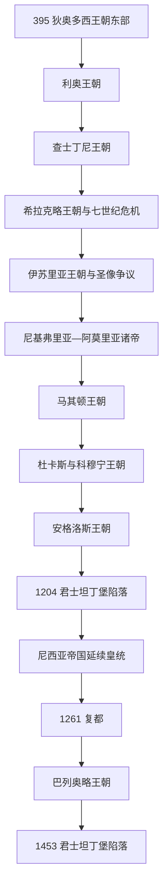

# 东罗马帝国皇帝世系表

## 范围与称谓

本表列395—1453年以君士坦丁堡为核心的罗马皇位，以及1204—1261年在尼西亚延续并最终复都的皇帝主线。“拜占庭帝国”是后世史学名称，当时国家与臣民自称罗马，其君主使用“罗马人的皇帝”等称号。395年并非新国建立，而是狄奥多西一世死后两个宫廷长期并行的节点。

同一时期常有幼帝、摄政、共治奥古斯都和内战竞争者。主表按取得高级皇权、实际统治或被广泛视为皇帝者逐人排列；只被加封为凯撒而未成皇帝者不冒充在位君主，但重要摄政与未独掌的共治皇帝另表列明。年代在加冕、共治起算及复位日上偶有差异，以年份说明。

## 世系演进图

## 狄奥多西、利奥与查士丁尼诸朝：395年—602年

| 顺序 | 皇帝 | 在位时间 | 王朝 / 继承关系 | 共治、复位与关键事件 |
|---:|---|---|---|---|
| 1 | 阿卡狄乌斯 | 395—408；383起为共治奥古斯都 | 狄奥多西一世长子 | 395年后主治东部，实际朝政受鲁菲努斯、欧特罗庇乌斯与皇后欧多克西亚等影响 |
| 2 | 狄奥多西二世 | 408—450；402起共治 | 阿卡狄乌斯之子，7岁独承东部 | 姐姐普尔喀丽娅和多位重臣先后主导；编纂《狄奥多西法典》，修筑君士坦丁堡城墙 |
| 3 | 马尔基安 | 450—457 | 军官，娶普尔喀丽娅取得狄奥多西王朝合法性 | 停止向匈人纳贡；主持卡尔西顿会议 |
| 4 | 利奥一世 | 457—474 | 阿兰将领阿斯帕拥立，利奥王朝开端 | 借伊苏里亚力量削弱阿斯帕；远征汪达尔失败 |
| 5 | 利奥二世 | 474 | 利奥一世外孙，芝诺之子 | 幼年先与外祖父、后与父芝诺共治；在位数月去世 |
| 6 | 芝诺 | 474—475；476—491 | 利奥一世女婿、利奥二世之父 | 被巴西利斯库斯逐出后复位；476年接收西部帝权标志，处理东哥特压力 |
| 7 | 巴西利斯库斯 | 475—476 | 利奥一世妻弟，宫廷政变夺位 | 与子马尔库斯共治；因宗教与财政政策失去支持，芝诺复位后被囚死 |
| 8 | 阿纳斯塔修斯一世 | 491—518 | 皇后阿里阿德涅选择并成婚，非前王血亲 | 改革货币与财政，留下充足国库；长期宗教分歧与维塔利安反叛 |
| 9 | 查士丁一世 | 518—527 | 近卫军指挥官，查士丁尼之舅 | 军队、宫廷与元老院妥协拥立；527年立外甥为共治皇帝 |
| 10 | **查士丁尼一世** | 527—565 | 查士丁一世外甥、养子与共治者 | 编纂《民法大全》，收复北非和意大利大片地区；瘟疫、战争与建设造成沉重财政 |
| 11 | 查士丁二世 | 565—578 | 查士丁尼外甥 | 对阿瓦尔与萨珊政策受挫；后期精神失常，提拔提比里乌斯治理 |
| 12 | 提比里乌斯二世·君士坦丁 | 578—582；574起为凯撒，578年共治 | 查士丁二世收养的将领 | 先以凯撒实际摄政，继位后扩大军费与施惠 |
| 13 | 莫里斯 | 582—602 | 提比里乌斯二世女婿与指定继承人 | 完成对萨珊有利战争，重整巴尔干；削减军费引发多瑙军队兵变 |
| 14 | 福卡斯 | 602—610 | 多瑙军队拥立，推翻莫里斯 | 处死前王全家；内战与萨珊入侵并发，被希拉克略推翻处死 |

### 本期未独掌的共治皇帝与摄政

| 人物 | 皇帝身份 / 掌权时间 | 与高级皇帝关系与结局 |
|---|---|---|
| 普尔喀丽娅 | 414—453年为奥古斯塔；狄奥多西二世幼年期掌摄政权，450年与马尔基安共同维系皇统 | 阿卡狄乌斯之女、狄奥多西二世之姐；并非男性“奥古斯都”，但拥有独立皇室称号、宫廷和宗教政策影响，不能只记为皇帝亲属 |
| 马尔库斯 | 475—476年共治皇帝 | 巴西利斯库斯之子，先封凯撒后升奥古斯都；父亲败于芝诺后同被囚禁而死 |
| 狄奥多西 | 590—602年共治皇帝 | 莫里斯长子，被立为奥古斯都以确保继承；福卡斯政变后与父亲、兄弟一同被杀 |

## 希拉克略王朝、二十年无政府与伊苏里亚王朝：610年—802年

| 顺序 | 皇帝 | 在位时间 | 王朝 / 继承关系 | 共治、复位与关键事件 |
|---:|---|---|---|---|
| 15 | **希拉克略** | 610—641 | 非洲总督之子，推翻福卡斯 | 反攻萨珊获胜后即遇阿拉伯扩张，失去叙利亚、埃及；行政与军事结构逐渐重组 |
| 16 | 君士坦丁三世 | 641；613起共治，原名希拉克略·君士坦丁 | 希拉克略长子 | 与异母弟赫拉克洛纳斯共治，数月后病死；毒杀传闻未获确定 |
| 17 | 赫拉克洛纳斯 | 641；638起共治 | 希拉克略与玛蒂娜之子 | 由母后玛蒂娜摄政，因政治反弹被废黜、施以肢残刑并流放 |
| 18 | 君士坦斯二世 | 641—668 | 君士坦丁三世之子，原名希拉克略，幼年拥立 | 将宫廷移驻西西里一段时间；抵御阿拉伯海军，后在锡拉库萨遇刺 |
| 19 | 君士坦丁四世 | 668—685；654起共治 | 君士坦斯二世长子 | 结束阿拉伯对君士坦丁堡的长期攻势；681年废黜两位共治弟弟 |
| 20 | 查士丁尼二世 | 685—695；705—711 | 君士坦丁四世之子 | 首次被废割鼻流放；借可萨与保加尔力量复位，报复统治后再被推翻杀死 |
| 21 | 利昂提奥斯 | 695—698 | 将领，政变推翻查士丁尼二世 | 北非失守后被军队推翻，后由复位的查士丁尼处死 |
| 22 | 提比里乌斯三世 | 698—705 | 原名阿普西马尔，舰队拥立 | 加强东方防务；查士丁尼复位后被处死 |
| 23 | 菲利皮科斯·巴尔达尼斯 | 711—713 | 亚美尼亚裔将领，推翻查士丁尼二世 | 改变宗教政策，遭宫廷政变刺瞎 |
| 24 | 阿纳斯塔修斯二世 | 713—715 | 原名阿尔特米奥斯，宫廷官员拥立 | 整顿海军准备防阿拉伯；奥普西金军区兵变后退位 |
| 25 | 狄奥多西三世 | 715—717 | 税务官，被兵变军队勉强拥立 | 面对利奥三世进军后和平退位，后任教士 |
| 26 | **利奥三世** | 717—741 | 安纳托利亚军区将领，伊苏里亚王朝建立者 | 抵御717—718年围城；推行法律改革，开启圣像政策争议 |
| 27 | 君士坦丁五世 | 741—775；720起共治 | 利奥三世之子 | 被阿尔塔巴斯多斯短暂逐出首都后复位；军政有成但强化破坏圣像政策 |
| 28 | 阿尔塔巴斯多斯 | 741—743 | 利奥三世女婿、军区将领 | 在君士坦丁堡称帝并恢复圣像，败于君士坦丁五世后被刺瞎 |
| 29 | 利奥四世 | 775—780；751起共治 | 君士坦丁五世之子 | 政策相对缓和；幼子继位 |
| 30 | 君士坦丁六世 | 780—797；776起共治 | 利奥四世之子 | 母后伊琳娜摄政，后争夺亲政权；被母亲集团刺瞎废黜 |
| 31 | **伊琳娜** | 797—802；780—790与792—797摄政 / 共治 | 利奥四世皇后、君士坦丁六世之母 | 787年恢复圣像敬礼；废子后以女性最高君主身份独掌，后被财政官僚政变推翻 |

### 本期重要共治与摄政者

| 人物 | 地位与时间 | 说明 |
|---|---|---|
| 玛蒂娜 | 641年皇太后与摄政 | 希拉克略遗孀，支持赫拉克洛纳斯；被反对派废黜并流放 |
| 大卫·提比里乌斯 | 641年共治皇帝 | 希拉克略幼子，短期获奥古斯都称号；政变后被废 |
| 希拉克略与提比里乌斯 | 659—681年共治皇帝 | 君士坦斯二世幼子、君士坦丁四世之弟；681年被兄长废黜并割鼻 |
| 提比里乌斯 | 706—711年共治皇帝 | 查士丁尼二世幼子；父王再度败亡时被杀 |
| 伊琳娜 | 780—790摄政，792—797恢复共治地位 | 其权力不是普通“皇后辅政”，而是控制敕令、官员与军队任命；797年转为唯一君主 |

## 尼基弗里亚、阿莫里亚与马其顿王朝：802年—1056年

| 顺序 | 皇帝 | 在位时间 | 王朝 / 继承关系 | 共治、复位与关键事件 |
|---:|---|---|---|---|
| 32 | 尼基弗鲁斯一世 | 802—811 | 财政官员，推翻伊琳娜 | 重整税制；普利斯卡战役败于保加尔可汗克鲁姆并阵亡 |
| 33 | 斯陶拉基奥斯 | 811；803起共治 | 尼基弗鲁斯一世之子 | 在普利斯卡重伤，继位数月后退位 |
| 34 | 米海尔一世·兰加贝 | 811—813 | 尼基弗鲁斯一世女婿 | 对克鲁姆战败后退位入修道院 |
| 35 | 利奥五世 | 813—820 | 亚美尼亚裔将领，军队拥立 | 恢复破坏圣像政策；圣诞礼拜中遇刺 |
| 36 | 米海尔二世 | 820—829 | 利奥五世旧同僚，阿莫里亚王朝开创者 | 平定斯拉夫人托马斯大叛乱；克里特落入安达卢西亚流亡者 |
| 37 | 狄奥斐卢斯 | 829—842；821起共治 | 米海尔二世之子 | 最后一位积极破坏圣像的皇帝；阿莫里昂被阿拔斯军攻陷 |
| 38 | 米海尔三世 | 842—867；840起共治 | 狄奥斐卢斯幼子 | 母后狄奥多拉摄政至856；恢复圣像，传教与军事复苏；被巴西尔一世杀害 |
| 39 | **巴西尔一世** | 867—886；866起共治 | 宫廷新贵，马其顿王朝建立者 | 杀米海尔三世后独掌；修订法律并扩张东方 |
| 40 | 利奥六世 | 886—912；870起共治 | 法律上为巴西尔一世之子，生父争议 | 完成《皇帝法典》；四婚争议影响政教关系 |
| 41 | 亚历山大 | 912—913；879起共治 | 巴西尔一世之子、利奥六世之弟 | 解除前朝官员，在位短暂；死后幼帝继位 |
| 42 | 君士坦丁七世 | 913—959；908起共治 | 利奥六世之子 | 幼年由摄政会议、后由罗曼努斯一世压过；945年恢复亲政，主持宫廷学术编纂 |
| 43 | 罗曼努斯一世·利卡潘努斯 | 920—944 | 海军将领，女儿嫁君士坦丁七世后升为高级共治皇帝 | 以自己诸子建立共治体系；被儿子推翻，儿子旋又被合法皇帝废黜 |
| 44 | 罗曼努斯二世 | 959—963；945起共治 | 君士坦丁七世之子 | 克里特收复；早逝后皇后狄奥法诺与将领掌权 |
| 45 | 尼基弗鲁斯二世·福卡斯 | 963—969 | 名将，娶皇太后狄奥法诺，与幼帝共治 | 收复克里特、塞浦路斯并扩张叙利亚；宫廷政变中被杀 |
| 46 | 约翰一世·齐米斯基斯 | 969—976 | 尼基弗鲁斯二世外甥兼政变首领 | 与巴西尔二世、君士坦丁八世共治；击败基辅罗斯并远征叙利亚 |
| 47 | **巴西尔二世** | 976—1025；960起共治 | 罗曼努斯二世之子 | 克服小亚细亚军阀反叛，灭保加利亚第一帝国；长期亲政 |
| 48 | 君士坦丁八世 | 1025—1028；962起共治 | 巴西尔二世之弟 | 数十年共治但少参政，兄死后独掌；无子，以女儿婚姻安排继承 |
| 49 | 罗曼努斯三世·阿尔吉罗斯 | 1028—1034 | 娶佐伊，由君士坦丁八世指定 | 对外战争受挫；在浴池死亡，是否谋杀有争议 |
| 50 | 米海尔四世 | 1034—1041 | 佐伊宠臣与第二任丈夫 | 由兄约翰“孤儿院长”主导财政；镇压彼得·德良反叛 |
| 51 | 米海尔五世 | 1041—1042 | 米海尔四世外甥，被佐伊收养 | 流放佐伊触发君士坦丁堡群众起义，被废刺瞎 |
| 52 | **佐伊** | 1042年4—6月独掌；1028—1050以王朝女继承人参与共治 | 君士坦丁八世之女 | 与妹妹狄奥多拉共同恢复；三次婚姻把皇权传给罗曼努斯三世、米海尔四世、君士坦丁九世 |
| 53 | 狄奥多拉 | 1042年与佐伊共治；1055—1056独掌 | 佐伊之妹 | 1042年群众拥立；1055年君士坦丁九世死后复位为唯一君主 |
| 54 | 君士坦丁九世·莫诺马霍斯 | 1042—1055 | 佐伊第三任丈夫，与佐伊、狄奥多拉共治 | 应对佩切涅格、塞尔柱和军政派系；文化与法学活动活跃 |
| 55 | 米海尔六世 | 1056—1057 | 狄奥多拉临终指定的文官 | 军事贵族反叛后退位，马其顿王朝政治主线结束 |

### 本期未独掌的共治皇帝与摄政

| 人物 | 皇帝身份 / 摄政时间 | 与高级皇帝关系与结局 |
|---|---|---|
| 狄奥多拉皇太后 | 842—856摄政 | 狄奥斐卢斯遗孀，辅佐米海尔三世；843年正式恢复圣像敬礼，后被儿子排除 |
| 君士坦丁 | 869—879共治皇帝 | 巴西尔一世长子，早逝，未独掌 |
| 克里斯托弗·利卡潘努斯 | 921—931共治皇帝 | 罗曼努斯一世长子，地位一度高于君士坦丁七世以外诸共帝；先父病逝 |
| 斯蒂芬·利卡潘努斯 | 924—945共治皇帝 | 罗曼努斯一世之子；944年同弟推翻父亲，旋被君士坦丁七世清除 |
| 君士坦丁·利卡潘努斯 | 924—945共治皇帝 | 罗曼努斯一世之子；参与推翻父亲后遭废黜 |
| 狄奥法诺 | 963年摄政 / 皇太后 | 罗曼努斯二世遗孀，以幼帝母亲身份同尼基弗鲁斯二世结婚；参与969年政变后被约翰一世流放 |
| 狄奥菲拉克特·兰加贝 | 811—813年共治皇帝 | 米海尔一世之子，曾被提议与法兰克皇室联姻；父亲退位后被阉割并送入修道院 |
| 君士坦丁 / 辛巴提奥斯 | 813—820年共治皇帝 | 利奥五世之子，加冕后改名君士坦丁；父亲遇刺后被阉割并流放 |

## 杜卡斯、科穆宁与安格洛斯诸朝：1057年—1204年

| 顺序 | 皇帝 | 在位时间 | 王朝 / 继承关系 | 共治、复位与关键事件 |
|---:|---|---|---|---|
| 56 | 伊萨克一世·科穆宁 | 1057—1059 | 军事贵族拥立 | 试图恢复军费与财政平衡，病中退位 |
| 57 | 君士坦丁十世·杜卡斯 | 1059—1067 | 伊萨克一世指定的文官贵族 | 军事投入不足，边境压力上升；死后皇后摄政 |
| 58 | 欧多基娅·马克勒姆博利提萨 | 1067；1071短暂恢复最高权力 | 君士坦丁十世遗孀与摄政女皇 | 与罗曼努斯四世结婚以获得军事领导；曼齐刻尔特后被杜卡斯派迫退 |
| 59 | 罗曼努斯四世·狄奥根尼斯 | 1068—1071 | 娶欧多基娅，与杜卡斯诸子共治 | 1071年曼齐刻尔特被塞尔柱俘虏；归国后内战失败，被刺瞎致死 |
| 60 | 米海尔七世·杜卡斯 | 1071—1078；1060起共治 | 君士坦丁十世之子 | 财政与粮价危机，多方军事反叛；退位为修士 |
| 61 | 尼基弗鲁斯三世·博塔尼亚特斯 | 1078—1081 | 小亚细亚将领，进军君士坦丁堡 | 以婚姻和头衔争取合法性，后被阿历克塞一世迫退 |
| 62 | **阿历克塞一世·科穆宁** | 1081—1118 | 科穆宁家族将领，政变建立王朝 | 依靠家族网络重建军政，应对诺曼、佩切涅格与第一次十字军 |
| 63 | 约翰二世·科穆宁 | 1118—1143；1092起共治 | 阿历克塞一世之子 | 稳步恢复安纳托利亚与巴尔干控制，远征中意外死亡 |
| 64 | 曼努埃尔一世·科穆宁 | 1143—1180 | 约翰二世幼子，由父指定 | 深入参与十字军和西方外交；1176年密列奥塞法隆受挫 |
| 65 | 阿历克塞二世·科穆宁 | 1180—1183；1171起共治 | 曼努埃尔一世幼子 | 母后安条克的玛丽摄政；被堂叔安德罗尼科一世废杀 |
| 66 | 安德罗尼科一世·科穆宁 | 1183—1185 | 曼努埃尔一世堂兄，先为摄政后夺位 | 以反贵族改革和暴力清洗统治；诺曼入侵时被首都群众杀死 |
| 67 | 伊萨克二世·安格洛斯 | 1185—1195；1203—1204复位 | 安格洛斯家族，推翻安德罗尼科 | 首次被弟弟刺瞎废黜；十字军扶持下与子复位，后再遭政变 |
| 68 | 阿历克塞三世·安格洛斯 | 1195—1203 | 伊萨克二世之兄 | 政变夺位，面对第四次十字军逃离首都 |
| 69 | 阿历克塞四世·安格洛斯 | 1203—1204 | 伊萨克二世之子，与父共治 | 以巨额军费和教会合一承诺换取十字军复位，无法兑现引发政变 |
| 70 | 尼古拉斯·卡纳沃斯 | 1204年1—2月 | 首都民众 / 元老院推选的短期皇帝 | 拒绝或无法掌握实权，后被阿历克塞五世逮捕处死；承认程度有限但不应省略 |
| 71 | 阿历克塞五世·杜卡斯 | 1204年2—4月 | 宫廷政变推翻安格洛斯父子 | 组织抵抗十字军，君士坦丁堡陷落前逃亡；后被拉丁人处死 |

### 本期重要共治者

| 人物 | 皇帝身份时间 | 说明 |
|---|---|---|
| 米海尔七世的兄弟君士坦提奥斯·杜卡斯 | 1060—1078共治 | 君士坦丁十世之子；在罗曼努斯四世及兄长时期保持共帝称号，后反对尼基弗鲁斯三世失败 |
| 安德罗尼科斯·杜卡斯 | 1068—约1070年代共治 | 君士坦丁十世幼子，罗曼努斯四世统治时获共帝称号 |
| 君士坦丁·杜卡斯 | 1074—1078及1081—约1087共治 / 继承人 | 米海尔七世之子；阿历克塞一世初期仍列共帝，安娜·科穆宁娜原与其订婚，后被约翰二世取代 |
| 阿历克塞·科穆宁 | 1122—1142共治 | 约翰二世长子，先父病逝，未独掌 |
| 阿历克塞二世 | 1171—1180共治 | 幼年加冕以稳定继承，父死后由母后摄政 |
| 阿历克塞四世 | 1203—1204共治 | 与复位的父亲伊萨克二世并立；法律名义依赖十字军军事控制 |

## 1204年断裂与尼西亚皇统：1204年—1261年

第四次十字军占领君士坦丁堡后建立拉丁帝国。尼西亚、伊庇鲁斯与特拉比松均由罗马—拜占庭精英建立继承政权；本表采用最终收复首都、且由君士坦丁堡教会加冕的尼西亚主线，不把三条竞争法统虚构成单一顺序。

| 顺序 | 皇帝 | 在位时间 | 王朝 / 继承关系 | 共治、复位与关键事件 |
|---:|---|---|---|---|
| 72 | 狄奥多尔一世·拉斯卡里斯 | 约1205/1208—1221 | 阿历克塞三世女婿，尼西亚帝国建立者 | 在小亚细亚重建军政与教会中心，约1208年正式加冕 |
| 73 | 约翰三世·杜卡斯·瓦塔泽斯 | 1221—1254 | 狄奥多尔一世女婿与指定继承人 | 扩张至巴尔干和爱琴，发展财政农业，为复都奠基 |
| 74 | 狄奥多尔二世·拉斯卡里斯 | 1254—1258 | 约翰三世与伊琳娜·拉斯卡里娜之子 | 提拔非贵族官员，与旧贵族矛盾加深；早逝 |
| 75 | 约翰四世·拉斯卡里斯 | 1258—1261 | 狄奥多尔二世幼子 | 摄政争斗后与米海尔八世共治；复都后被刺瞎废黜 |
| 76 | **米海尔八世·巴列奥略** | 1259—1282；1261起在君士坦丁堡 | 贵族将领，先任摄政、后为约翰四世共帝 | 1261年部将收复首都；废黜约翰四世，建立巴列奥略王朝 |

## 巴列奥略王朝：1261年—1453年

| 顺序 | 皇帝 | 在位时间 | 王朝 / 继承关系 | 共治、复位与关键事件 |
|---:|---|---|---|---|
| 77 | 米海尔八世·巴列奥略 | 1261—1282在复都后 | 王朝建立者 | 重建首都并以教会合一外交阻止西方入侵；资源转向欧洲削弱安纳托利亚防务 |
| 78 | 安德罗尼科二世 | 1282—1328；1272起共治 | 米海尔八世之子 | 削减海军、雇用加泰罗尼亚佣兵后失控；在祖孙内战中被迫退位 |
| 79 | 米海尔九世 | 1294—1320 | 安德罗尼科二世之子、正式共治皇帝 | 长期承担军事指挥，先父去世，未独掌 |
| 80 | 安德罗尼科三世 | 1328—1341；1321起竞争 / 共治 | 米海尔九世之子、安德罗尼科二世之孙 | 内战胜出；与约翰·坎塔库泽努斯改革军政，死后留下幼主 |
| 81 | 约翰五世·巴列奥略 | 1341—1376；1379—1390；1390—1391 | 安德罗尼科三世幼子 | 多次被废与复位；内战中依赖塞尔维亚、保加利亚、奥斯曼和西方援助 |
| 82 | 约翰六世·坎塔库泽努斯 | 1347—1354；1341起自称摄政 / 皇帝 | 安德罗尼科三世重臣，内战竞争者 | 与约翰五世达成共治后居高级地位，后退位为修士 |
| 83 | 马修·坎塔库泽努斯 | 1353—1357 | 约翰六世之子，共治皇帝 | 与约翰五世继续内战，被俘后放弃皇号 |
| 84 | 安德罗尼科四世 | 1376—1379；此前为共治皇帝 | 约翰五世之子 | 借热那亚与奥斯曼支持夺位；后被父亲复位，仍获部分领地 |
| 85 | 约翰七世 | 1390年4—9月；后为共治 / 摄政 | 安德罗尼科四世之子 | 借奥斯曼支持短暂夺位；1399—1403年在曼努埃尔二世西行时守首都 |
| 86 | **曼努埃尔二世** | 1391—1425；约1373起共治 | 约翰五世之子 | 在奥斯曼围困和安卡拉战役后外交周旋，保住缩小的帝国 |
| 87 | 约翰八世 | 1425—1448；1416起共治 | 曼努埃尔二世长子 | 参加费拉拉—佛罗伦萨会议寻求西援；无子 |
| 88 | **君士坦丁十一世** | 1449—1453 | 曼努埃尔二世之子、约翰八世之弟 | 在米斯特拉获拥立后入都，未举行传统首都加冕；1453年守城战死，帝国终结 |

### 巴列奥略后期共治说明

| 人物 | 皇帝身份时间 | 说明 |
|---|---|---|
| 安德罗尼科三世 | 1321—1328年在内战中以共治皇帝身份统治部分领土 | 与祖父安德罗尼科二世并立，1328年进占首都后独掌 |
| 安德罗尼科四世 | 约1352起共治，1373年反叛后被废，1376年夺位 | 说明共帝称号不能自动保证继承；其弟曼努埃尔后来取代其位置 |
| 约翰七世 | 1377起由父安德罗尼科四世加冕，1390短暂独掌，后再获共帝与摄政地位 | 在帖撒罗尼迦建立附属宫廷，1408年去世 |
| 安德罗尼科五世 | 1403—1407共治 | 约翰七世幼子，先父去世，没有独立统治 |
| 约翰八世 | 1416—1425共治 | 父亲年老和出行时承担政务，后顺利继位 |

## 1204年并立法统辨析

| 政权 | 统治者称号与基础 | 与尼西亚主线关系 |
|---|---|---|
| 拉丁帝国 | 十字军贵族在君士坦丁堡建立拉丁皇位 | 控制首都但不是罗马—希腊皇统；1261年被尼西亚军收复 |
| 伊庇鲁斯—帖撒罗尼迦 | 科穆宁·杜卡斯家族自称专制君主，狄奥多尔一度称皇帝 | 1220年代是尼西亚最强竞争者，克洛科特尼察战败后失去争夺首都优势 |
| 特拉比松帝国 | 科穆宁家族后裔自1204年称帝 | 长期独立于尼西亚和复都后的君士坦丁堡，后调整称号；1461年被奥斯曼征服 |
| 尼西亚帝国 | 拉斯卡里斯、瓦塔泽斯王朝拥有君士坦丁堡流亡牧首加冕 | 1261年收复首都，形成此表采用的制度连续主线 |

## 皇位运作机制

- 皇帝兼最高军事、立法、司法和任官来源，但实际治理依赖宫廷官僚、军区或行省将领、税收承包、教会与地方贵族。
- 加冕、紫衣出生、与前朝女继承人结婚和生前共治都能加强合法性，却不能阻止军队政变。芝诺、查士丁尼二世、伊萨克二世和约翰五世均经历失位或复位。
- 摄政者可能拥有全部实际权力。普尔喀丽娅、伊琳娜、狄奥多拉、欧多基娅和安条克的玛丽都不应仅写成“皇帝亲属”；她们控制任官、财政或外交，但法律地位各异。
- 7世纪以后，拉丁语行政传统逐步让位于希腊语，皇帝称号和国家认同仍坚持罗马连续性；“希腊化”不等于另建新国。
- 1204年是制度与领土的重大断裂，但尼西亚保有皇帝—牧首体系并在1261年复都；特拉比松与伊庇鲁斯的并立说明法统并非无人争议。

## 重要争议与不确定性

- 早期共治年份有时从凯撒、奥古斯都或正式加冕分别起算，本表在备注区分，不以单一年份掩盖。
- 741—743年阿尔塔巴斯多斯在首都实际称帝；即使胜者史书称其“篡位者”，也不能从连续表中删除。
- 1042年佐伊与狄奥多拉由首都群众恢复，是共同女皇统治；不能只把皇位记在她们的丈夫名下。
- 尼古拉斯·卡纳沃斯是否完全接受皇位、控制多少机构存在争议，故列为短期获选而非稳定王朝君主。
- 君士坦丁十一世没有在君士坦丁堡举行传统加冕，仍由宫廷、军队和兄弟协议承认为皇帝；加冕缺失不等于没有在位。

## 相关笔记

- [东罗马帝国与拜占庭帝国](/%E4%BA%BA%E6%96%87%E7%A7%91%E5%AD%A6/%E5%8E%86%E5%8F%B2/%E6%AC%A7%E6%B4%B2/_%E9%80%9A%E5%8F%B2/%E5%8F%A4%E7%BD%97%E9%A9%AC/%E4%B8%9C%E7%BD%97%E9%A9%AC%E5%B8%9D%E5%9B%BD%E4%B8%8E%E6%8B%9C%E5%8D%A0%E5%BA%AD%E5%B8%9D%E5%9B%BD.md)
- [罗马帝国皇帝世系表](/%E4%BA%BA%E6%96%87%E7%A7%91%E5%AD%A6/%E5%8E%86%E5%8F%B2/%E6%AC%A7%E6%B4%B2/_%E9%80%9A%E5%8F%B2/%E5%8F%A4%E7%BD%97%E9%A9%AC/%E7%BD%97%E9%A9%AC%E5%B8%9D%E5%9B%BD%E7%9A%87%E5%B8%9D%E4%B8%96%E7%B3%BB%E8%A1%A8.md)
- [罗马帝国晚期](/%E4%BA%BA%E6%96%87%E7%A7%91%E5%AD%A6/%E5%8E%86%E5%8F%B2/%E6%AC%A7%E6%B4%B2/_%E9%80%9A%E5%8F%B2/%E5%8F%A4%E7%BD%97%E9%A9%AC/%E7%BD%97%E9%A9%AC%E5%B8%9D%E5%9B%BD%E6%99%9A%E6%9C%9F.md)
- [西罗马帝国](/%E4%BA%BA%E6%96%87%E7%A7%91%E5%AD%A6/%E5%8E%86%E5%8F%B2/%E6%AC%A7%E6%B4%B2/_%E9%80%9A%E5%8F%B2/%E5%8F%A4%E7%BD%97%E9%A9%AC/%E8%A5%BF%E7%BD%97%E9%A9%AC%E5%B8%9D%E5%9B%BD.md)
- [阿拉伯帝国](/%E4%BA%BA%E6%96%87%E7%A7%91%E5%AD%A6/%E5%8E%86%E5%8F%B2/%E8%A5%BF%E4%BA%9A/_%E9%80%9A%E5%8F%B2/%E9%98%BF%E6%8B%89%E4%BC%AF%E5%B8%9D%E5%9B%BD/README.md)
- [奥斯曼帝国](/%E4%BA%BA%E6%96%87%E7%A7%91%E5%AD%A6/%E5%8E%86%E5%8F%B2/%E8%A5%BF%E4%BA%9A/%E5%9C%9F%E8%80%B3%E5%85%B6/%E5%A5%A5%E6%96%AF%E6%9B%BC%E5%B8%9D%E5%9B%BD/README.md)
