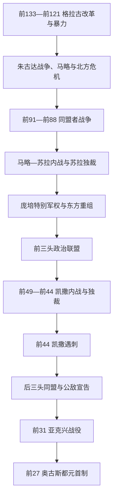

# 罗马共和国危机期

## 时间

前133年—前27年。以提比略·格拉古遇害和政治暴力常态化为起点，以屋大维接受“奥古斯都”称号、把内战胜利包装成共和国恢复为终点。

## 概括

共和国危机不是某个野心家突然摧毁良好制度，而是意大利城邦共和结构无法稳定分配地中海帝国的土地、税收、军役、公民权和长期统帅权。元老院、大会、保民官和年度官职仍运作，却越来越被例外授权、政治暴力、法庭清洗和私人联盟绕开。马略、苏拉、庞培、凯撒、安东尼与屋大维都以保护共和国或恢复秩序为名掌握超常军权。前27年并非共和国机构消失，而是军队、主要行省与财政集中到一位元首手中，使制度竞争不再能产生独立的武装中心。

## 演进图

## 结构性矛盾

| 问题 | 共和制度原有机制 | 帝国规模下的失灵 | 后果 |
|---|---|---|---|
| 公共土地与兵源 | 监察官、保民官和土地法调节 | 战争兼并、长期服役、地方差异使土地占有难清查 | 改革触动精英利益，政治暴力升级 |
| 意大利盟邦 | 以双边条约供兵、保留自治 | 承担大量战争却无罗马投票和分配权 | 同盟者战争迫使罗马扩授公民权 |
| 海外行省 | 年度官员延长统帅权治理 | 将领任期、军队忠诚与当地税源绑定 | 长期军权成为争夺中央的资本 |
| 城市公民大会 | 公民到罗马投票 | 公民遍布意大利，实际出席不均；暴力团体控制会场 | 法律程序更容易被动员机器操纵 |
| 退伍军人安置 | 临时分地或殖民 | 大规模职业化军团期待土地和赏金 | 士兵把统帅胜利视为自身保障 |
| 精英竞争 | 官职阶梯、同僚否决、任期限制 | 凯旋、东方财富和特别军权拉大个人资源差距 | 非正式联盟与内战取代常规竞争 |

## 格拉古改革与政治暴力

前133年，保民官提比略·格拉古提出限制个人占用公共土地并把多余土地分给贫困公民。他绕过元老院财务控制、让大会罢免否决改革的同僚，又计划竞选连任。反对者以其追求王权为由，在最高祭司纳西卡带领下用棍棒杀死他及支持者。改革委员会仍运作一段时间，说明冲突不是“改革立刻失败”，但以暴力解决保民官争议成为先例。

盖乌斯·格拉古前123—前122年提出更广方案：低价粮、殖民地、道路、行省税收承包和陪审法庭改革，并尝试扩大拉丁与意大利人权利。罗马公民对分享特权意见分裂；元老院以另一保民官提出更优厚方案分流支持。前121年元老院“最终决议”授权执政官镇压，盖乌斯死亡。紧急状态自此可用于绕开普通公民上诉保障。

## 马略、苏拉与意大利公民权

### 朱古达战争与军队变化

努米底亚王位争夺暴露罗马贵族受贿和指挥低效。马略以“新人”身份当选执政官并接管战争，允许或至少广泛招募无足够财产者参军；军队职业化并非一次法令完成，但长期海外服役、国家装备与退伍安置让士兵更依赖统帅。苏拉通过外交迫使朱古达投降，功劳归属成为二人竞争根源。

辛布里和条顿人迁徙造成北方恐慌，马略连续当选执政官并于前102—前101年取胜。例外连任证明危机能压倒传统任期规范，也让军事救国者的个人威望成为政治资源。

### 同盟者战争

前91年保民官德鲁苏斯提出向意大利盟邦授予公民权，遇刺后多个盟邦建立自己的联盟国家“意大利”，设首都、元老院和军队。战争证明盟邦不是松散部落，而是罗马军事体系的核心参与者。罗马一边作战，一边以尤利乌斯法等向忠诚或放下武器者授予公民权。到战争结束，大多数自由意大利人获得罗马公民权；但如何编入投票部落仍引发争执。

### 第一次进军罗马与苏拉独裁

前88年，保民官苏尔皮基乌斯推动把新公民分散编入全部部落，并把对米特里达梯六世的东方统帅权从苏拉转给马略。苏拉率军进占罗马，开创罗马统帅以军团解决国内任命争端的先例。他出征后，秦纳和马略反攻，清洗对手；马略很快病死，秦纳集团执政至苏拉回国。

前82年苏拉赢得内战，成为“制定法律、重建共和国”的无限期独裁官。他公布公敌名单，合法没收和杀害敌人；扩大元老院、限制保民官晋升、把陪审权还给元老，并规定官职年龄和间隔。前79年他主动退位，但改革既未解决军队个人化和土地安置，也证明胜利将领能用武力重写宪制。

## 庞培、克拉苏与特别军权

苏拉死后，未按传统官职阶梯完整晋升的庞培凭军队和胜利获得凯旋。前70年他与克拉苏任执政官，拆除部分苏拉限制。前73—前71年斯巴达克斯领导奴隶起义，克拉苏主力镇压，庞培截杀残部并分享功劳。

前67年《加比尼亚法》授庞培跨地中海大范围反海盗权，前66年《马尼利亚法》又让其接管米特里达梯战争。这些任务取得显著成果：庞培消灭本都王国、前64/63年终结塞琉古叙利亚并重组东方附庸。但一人长期统辖多省与军团，改变了“每年分配有限行省”的共和惯例。元老院回绝整体批准其东方安排和退伍军人土地，使其寻求私人联盟。

## 前三头联盟与凯撒内战

前60年凯撒、庞培、克拉苏以非正式私人协议互相支持：凯撒取得执政官和高卢长期统帅权，庞培的东方安排与退伍军人土地获批准，克拉苏集团得到财政利益。它不是法定“三人委员会”，权力依靠财富、门客、婚姻和选举动员。

凯撒前58—前50年征服高卢，取得忠诚军团、战利品和群众声望。克拉苏前53年在卡莱败于安息并战死，庞培妻子尤利娅此前去世，联盟纽带断裂。元老院中的凯撒反对者要求其卸军回国受审；凯撒要求同庞培同时解除武装未果。前49年他渡过卢比孔河，庞培与多数元老撤往希腊。法萨卢斯战败后庞培在埃及被杀。

凯撒在埃及、北非和西班牙继续消灭庞培派，逐步兼任独裁官，前44年获终身独裁。其改革包括历法、殖民、扩大元老院、债务调整和行省治理；但持续个人荣誉、终身权力和继承不确定使一批元老认为共和国将变为王政。前44年3月15日，布鲁图斯、卡西乌斯等刺杀凯撒。他们没有控制军队和财政，也没有可接受的战后秩序。

## 后三头同盟与屋大维胜出

凯撒遗嘱收养屋大维。执政官安东尼控制凯撒文件和部分老兵，屋大维以私人资金招募军队并获元老院利用。前43年穆提纳战争后，两名执政官阵亡，屋大维进军罗马取得执政官职位。屋大维、安东尼、雷必达依法成立“重建共和国三人委员会”，拥有立法、任官和分配行省的非常权力。

公敌宣告没收财产并处死包括西塞罗在内的对手。前42年腓立比战役击败布鲁图斯和卡西乌斯。此后安东尼主东方、屋大维主西方，雷必达被逐出核心权力。屋大维在意大利安置退伍军人引发土地没收和佩鲁贾战争；其将领阿格里帕前36年击败控制西西里粮道的塞克斯图斯·庞培。

安东尼与克娄巴特拉七世的联盟为东方战争和王朝安排提供资源，屋大维则把冲突宣传为罗马对“东方女王”，避免公开称另一罗马统帅为内战敌人。前31年阿格里帕在亚克兴切断安东尼海上补给；二人退往埃及，次年自杀，托勒密王国灭亡。

## 前27年的制度转换

屋大维没有取消元老院、执政官和公民大会。前27年他宣布“交还共和国”，随即获得奥古斯都称号并以十年为期管理需要驻军的关键行省；前23年进一步以最高保民官权和高于其他总督的统帅权巩固地位。埃及、军团、退伍军人财源和个人家产均受其控制。共和官职继续提供法律形式与精英晋升，但没有另一官员能合法积累相等军力。

## 重要事件

| 时间 | 事件 | 结果 / 长期影响 |
|---|---|---|
| 前133 | 提比略·格拉古改革与遇害 | 土地问题政治化，集体暴力进入共和国核心 |
| 前123—前121 | 盖乌斯·格拉古改革 | 粮食、殖民、法院和公民权形成综合改革；元老院最终决议用于镇压 |
| 前107—前105 | 马略接管朱古达战争 | “新人”与军队动员改变贵族政治平衡 |
| 前102—前101 | 马略击败条顿、辛布里 | 例外连任和救国将领模式强化 |
| 前91—前88 | 同盟者战争 | 意大利大多数自由居民获得公民权 |
| 前88 | 苏拉首次进军罗马 | 军团介入国内权力交接的禁忌被打破 |
| 前82—前79 | 苏拉独裁与公敌名单 | 以法律清洗对手并重写宪制 |
| 前73—前71 | 斯巴达克斯起义 | 奴隶制意大利的安全与军事动员问题暴露 |
| 前67—前62 | 庞培特别军权与东方重组 | 个人长期统帅权成为帝国治理工具 |
| 前60 | 前三头联盟 | 私人政治协议协调国家最高职位 |
| 前58—前50 | 凯撒征服高卢 | 获得长期军队、财富和独立政治资本 |
| 前49 | 凯撒渡过卢比孔 | 第二轮大内战开始 |
| 前44 | 凯撒遇刺 | 独裁者死亡但军队和非常权力问题未解决 |
| 前43 | 后三头同盟与公敌宣告 | 三人委员会成为合法非常政府 |
| 前42 | 腓立比战役 | 共和派主力毁灭 |
| 前36 | 瑙洛库斯海战 | 塞克斯图斯·庞培败，屋大维控制西部粮道 |
| 前31—前30 | 亚克兴与埃及征服 | 安东尼、克娄巴特拉败亡，屋大维独掌罗马世界 |
| 前27 | 第一次宪制安排 | 元首制建立，共和机构纳入单一军事权力中心 |

## 兴衰与灭亡原因

| 类型 | 因素 | 作用 |
|---|---|---|
| 结构因素 | 年度城邦官职无法管理长期海外军队 | 延长统帅权成为常态，将领形成独立政治基地 |
| 结构因素 | 盟邦、公民、退伍军人和行省利益难以同时分配 | 每次改革都能被对手描述为夺取某群体权利 |
| 结构因素 | 无常设中立执法力量 | 政治派系依靠门客、角斗士团体或军队控制会议与街道 |
| 外部压力 | 边境战争和东方王国提供例外军权理由 | 成功统帅带回财富和忠诚军队，超过普通官职资源 |
| 直接触发 | 前88年苏拉进军罗马 | 证明军团可决定国内政权；后来者不断重复 |
| 直接触发 | 前49年凯撒拒绝无保障卸军 | 元老院与凯撒均无法相信对方会守约，冲突军事化 |
| 终结过程 | 前43—前30年三人委员会清洗与内战 | 共和派、庞培派和安东尼派先后被消灭 |
| 制度替代 | 奥古斯都垄断军队、行省与财政 | 保留共和名称和官职，却消除可与元首竞争的独立军权 |

## 演变关系

- 前一节点：[罗马共和国扩张期](/%E4%BA%BA%E6%96%87%E7%A7%91%E5%AD%A6/%E5%8E%86%E5%8F%B2/%E6%AC%A7%E6%B4%B2/_%E9%80%9A%E5%8F%B2/%E5%8F%A4%E7%BD%97%E9%A9%AC/%E7%BD%97%E9%A9%AC%E5%85%B1%E5%92%8C%E5%9B%BD%E6%89%A9%E5%BC%A0%E6%9C%9F.md)。
- 后一节点：[罗马帝国元首制前期](/%E4%BA%BA%E6%96%87%E7%A7%91%E5%AD%A6/%E5%8E%86%E5%8F%B2/%E6%AC%A7%E6%B4%B2/_%E9%80%9A%E5%8F%B2/%E5%8F%A4%E7%BD%97%E9%A9%AC/%E7%BD%97%E9%A9%AC%E5%B8%9D%E5%9B%BD%E5%85%83%E9%A6%96%E5%88%B6%E5%89%8D%E6%9C%9F.md)。
- 皇帝连续表：[罗马帝国皇帝世系表](/%E4%BA%BA%E6%96%87%E7%A7%91%E5%AD%A6/%E5%8E%86%E5%8F%B2/%E6%AC%A7%E6%B4%B2/_%E9%80%9A%E5%8F%B2/%E5%8F%A4%E7%BD%97%E9%A9%AC/%E7%BD%97%E9%A9%AC%E5%B8%9D%E5%9B%BD%E7%9A%87%E5%B8%9D%E4%B8%96%E7%B3%BB%E8%A1%A8.md)。
- 安东尼、克娄巴特拉与埃及终局见[希腊化时代](/%E4%BA%BA%E6%96%87%E7%A7%91%E5%AD%A6/%E5%8E%86%E5%8F%B2/%E6%AC%A7%E6%B4%B2/_%E9%80%9A%E5%8F%B2/%E5%8F%A4%E5%B8%8C%E8%85%8A/%E5%B8%8C%E8%85%8A%E5%8C%96%E6%97%B6%E4%BB%A3.md)。
- 所属总览：[古罗马](/%E4%BA%BA%E6%96%87%E7%A7%91%E5%AD%A6/%E5%8E%86%E5%8F%B2/%E6%AC%A7%E6%B4%B2/_%E9%80%9A%E5%8F%B2/%E5%8F%A4%E7%BD%97%E9%A9%AC/README.md)。
