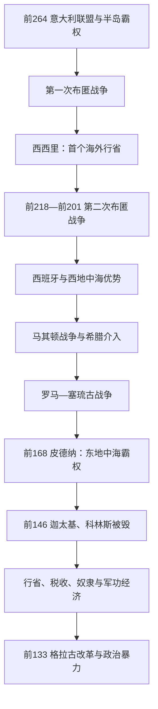

# 罗马共和国扩张期

## 时间

前264年—前133年。以第一次布匿战争开端，至提比略·格拉古任保民官并因土地改革遇害为止。前146年迦太基和科林斯同时被毁是军事霸权形成的象征，前133年帕加马遗赠与国内政治暴力则把扩张成果转化为共和国危机。

## 概括

罗马在一个多世纪内由意大利联盟盟主变为地中海霸权。它为对抗迦太基临时建立大型舰队，在第二次布匿战争承受坎尼惨败后拒绝和谈，以意大利人力、海上封锁和多战区战略反攻。战后罗马介入马其顿、塞琉古和希腊城邦政治，常以“保护盟友”“希腊自由”或惩罚违约为名，先限制对手，再设置行省。扩张带来土地、奴隶、赔款、税收和政治声望，也让长期军役、公共土地占有、行省掠夺和将领个人网络超出城邦共和制度的调节能力。

## 演进图

## 扩张制度与权力结构

共和国没有专门为海外帝国设计中央官僚。年度官员和临时授权被不断延长，元老院通过财政、外交、将领任务和行省分配维持统筹，但远方总督拥有广泛军政司法权。

| 层级 | 法律形式 | 实际运作 | 风险 |
|---|---|---|---|
| 罗马公民核心 | 执政官、裁判官、大会、元老院 | 决定战争、征兵、条约和分配战利品 | 远距离战争使普通公民难以监督将领 |
| 意大利盟邦 | 依双边条约供兵，保留地方政府 | 提供接近或超过罗马公民的兵力 | 没有罗马投票权，收益与负担不平衡 |
| 行省 | 由延长统帅权的前执政官 / 前裁判官治理 | 总督统军、审判、征收；财务官管理账目 | 任期短而权限大，勒索与包税容易发生 |
| 自由城与盟友王国 | 条约保留自治、免税或王室 | 罗马借地方精英低成本维持秩序 | “自由”取决于罗马认可，可随政治改变 |
| 包税人 | 骑士公司承包部分税收、矿山和供应 | 提前向国库付款，再在行省征收 | 追求利润造成过度征取，与总督既勾结又冲突 |
| 将领与军队 | 大会授予统帅权，元老院分配任务 | 胜利、战利品、凯旋和退伍安置形成个人声望 | 军队对统帅个人依赖在后期危机中加深 |

## 三次布匿战争

### 第一次布匿战争：前264—前241年

冲突由西西里墨萨纳的雇佣兵集团求援引发。罗马最初介入城市争端，迅速同控制西西里西部和海上通道的[迦太基](/%E4%BA%BA%E6%96%87%E7%A7%91%E5%AD%A6/%E5%8E%86%E5%8F%B2/%E5%8C%97%E9%9D%9E/_%E9%80%9A%E5%8F%B2/%E8%BF%A6%E5%A4%AA%E5%9F%BA/README.md)全面开战。罗马复制和改进舰船、反复重建因战斗与风暴损失的舰队；陆上围城与海上补给长期僵持。前241年埃加迪群岛海战切断迦太基驻军，迦太基求和，撤出西西里并赔款。西西里成为罗马第一个常设海外行省。

迦太基随后因欠饷爆发雇佣兵战争，罗马趁机取得撒丁和科西嘉并追加赔款。这个做法加深迦太基敌意，巴卡家族转向西班牙建立银矿和兵源基地。

### 第二次布匿战争：前218—前201年

汉尼拔攻陷与罗马结盟的萨贡托后，越过阿尔卑斯进入意大利。他在特雷比亚、特拉西梅诺湖和前216年坎尼连续取胜，坎尼造成罗马军政精英和盟军巨大伤亡。罗马的关键选择是不谈判：避免再次进行全面决战，坚守殖民地和多数中意大利盟友，同时在西班牙、西西里、马其顿方向作战。

卡普亚、塔兰托等地倒向汉尼拔，但拉丁殖民地和核心盟邦未整体崩解。西庇阿家族切断巴卡在西班牙的基地；小西庇阿攻取新迦太基，后渡海北非，迫使汉尼拔回援。前202年扎马战役中，努米底亚骑兵倒向罗马是重要转折。和约剥夺迦太基海外领地、舰队和独立开战权，并要求巨额赔款。

### 第三次布匿战争：前149—前146年

迦太基经济恢复但受条约限制，努米底亚不断侵占其土地。迦太基未经罗马许可反击后，罗马宣战。即使迦太基交出武器，罗马仍要求迁城，促使其绝望抵抗。小西庇阿·埃米利安经过围城攻陷并焚毁城市，幸存者被奴役，领土改为非洲行省。不是“土地真的被撒盐”的同时代事实；这一说法属于后世传说。

更完整战役主线见[布匿战争](/%E4%BA%BA%E6%96%87%E7%A7%91%E5%AD%A6/%E5%8E%86%E5%8F%B2/%E5%8C%97%E9%9D%9E/_%E9%80%9A%E5%8F%B2/%E8%BF%A6%E5%A4%AA%E5%9F%BA/%E5%B8%83%E5%8C%BF%E6%88%98%E4%BA%89.md)。

## 东地中海扩张

### 马其顿战争

第二次布匿战争中，腓力五世同汉尼拔结盟，引起第一次马其顿战争，但双方主要通过地区盟友牵制。战后罗马响应帕加马、罗得岛与希腊城邦请求，发动第二次战争；前197年库诺斯克法莱战役显示罗马军团在破碎地形中比方阵更灵活。罗马宣布“希腊自由”并短暂撤军，却保留仲裁权。

珀尔修斯重建马其顿影响，引发第三次战争。前168年皮德纳战役后王国被废，分成四个限制交往的共同体，大量精英被带往意大利。前149年安德里斯库斯以珀尔修斯之子身份复国，次年失败；马其顿转为行省。

### 塞琉古战争与小亚细亚秩序

安条克三世扩张至小亚细亚和色雷斯，并应埃托利亚同盟邀请进入希腊。罗马在温泉关击败其军，随后渡海；前190/189年马格尼西亚战役决定胜负。前188年《阿帕米亚和约》迫使塞琉古割出托罗斯山以西领土、限制舰队战象并赔款。帕加马和罗得岛成为主要受益盟友，罗马尚未直接吞并全部领土，却成为东地中海最终裁决者。

### 亚该亚战争与科林斯毁灭

罗马对希腊联邦内部事务的干预不断扩大。第三次马其顿战争后，大批亚该亚精英被扣留多年。前146年亚该亚同盟拒绝罗马命令并开战，很快败北；科林斯被掠夺焚毁，居民遭杀戮或奴役。希腊未立即形成单一“希腊行省”，但大战略和争端裁决已服从罗马及马其顿行省总督。

## 西班牙与内陆战争

罗马从迦太基夺得西班牙基地后，于前197年设置近西班牙和远西班牙两行省。征服并非顺利直线：卢西塔尼亚领袖维里阿修斯以游击战抵抗，后被盟友刺杀；努曼提亚长期抵抗，前133年被小西庇阿围困至饥饿投降。西班牙战争长期、战利品不稳定且征兵艰苦，多次引发罗马公民抗拒服役。

## 扩张如何制造共和国危机

### 土地与人口

战争俘虏大量流入，富有地主、商人和承包者扩大使用奴隶的庄园和作坊。公民农户是否被“大庄园一次性消灭”仍有地区差异，但长期服役、债务和市场变化确实增加土地集中与流动。意大利人口普查和兵役资格问题使政治家担忧可征兵公民减少。

### 财富与精英竞争

凯旋、赔款和掠夺让成功将领能资助建筑、选举和门客；行省总督任期则提供巨大利润。元老院内部竞争从年度官职声望转为争夺长期海外统帅权。传统反奢侈法和贪污审判难以控制规模不断增长的资源。

### 奴隶与社会冲突

西西里大种植园和牧场集中奴隶，前135—前132年爆发第一次奴隶战争。奴隶反抗、乡村贫困、盟邦兵役和城市贫民是不同问题，不能归结为单一“阶级斗争”，但都显示征服利益分配失衡。

## 重要事件

| 时间 | 事件 | 转折与结果 |
|---|---|---|
| 前264—前241 | 第一次布匿战争 | 罗马创建远洋舰队，取得西西里并开始行省治理 |
| 前238/237 | 罗马取得撒丁与科西嘉 | 趁迦太基雇佣兵战争施压，加深双方敌意 |
| 前218—前201 | 第二次布匿战争 | 汉尼拔入侵意大利；罗马依靠联盟韧性和多战区战略获胜 |
| 前216 | 坎尼战役 | 罗马遭灾难性损失却拒绝和谈，战争性质由决战转持久消耗 |
| 前202 | 扎马战役 | 迦太基失去大国军事自主权 |
| 前200—前196 | 第二次马其顿战争 | 罗马击败腓力五世，成为希腊世界仲裁者 |
| 前192—前188 | 罗马—塞琉古战争 | 安条克三世败，罗马盟友在小亚细亚扩张 |
| 前171—前168 | 第三次马其顿战争 | 珀尔修斯战败，马其顿王国被废 |
| 前149—前146 | 第三次布匿战争 | 迦太基被毁，非洲行省建立 |
| 前146 | 亚该亚战争 | 科林斯被毁，希腊本土失去独立外交 |
| 前135—前132 | 第一次西西里奴隶战争 | 海外农业与奴隶管理危机显现 |
| 前133 | 努曼提亚陷落、帕加马遗赠、提比略·格拉古遇害 | 海外帝国扩大与国内政治暴力同时进入新阶段 |

## 崛起、鼎盛与危机因素

| 类型 | 因素 | 说明 |
|---|---|---|
| 崛起机制 | 意大利同盟人力与罗马拒绝和谈 | 即使坎尼惨败，仍能重建军团并维持多线战争 |
| 崛起机制 | 灵活的条约与间接统治 | 先借盟友、自由城与附庸王削弱对手，降低直接占领成本 |
| 鼎盛条件 | 海陆军学习能力 | 从无大型舰队到控制海上，从方阵对手学习攻城和外交 |
| 结构问题 | 城邦年度官职管理跨海帝国 | 总督任期短、权限大，元老院监督滞后 |
| 结构问题 | 战利品与政治声望相连 | 将领为凯旋和长期统帅权竞争，个人网络扩大 |
| 社会压力 | 土地、军役、奴隶和盟邦权利失衡 | 不同群体承担战争成本却无法同比分享政治权 |
| 直接转折 | 前133年格拉古遇害 | 精英第一次以有组织暴力阻止保民官改革，为后续内战树立先例 |

## 演变关系

- 前一节点：[罗马共和国早期](/%E4%BA%BA%E6%96%87%E7%A7%91%E5%AD%A6/%E5%8E%86%E5%8F%B2/%E6%AC%A7%E6%B4%B2/_%E9%80%9A%E5%8F%B2/%E5%8F%A4%E7%BD%97%E9%A9%AC/%E7%BD%97%E9%A9%AC%E5%85%B1%E5%92%8C%E5%9B%BD%E6%97%A9%E6%9C%9F.md)。
- 后一节点：[罗马共和国危机期](/%E4%BA%BA%E6%96%87%E7%A7%91%E5%AD%A6/%E5%8E%86%E5%8F%B2/%E6%AC%A7%E6%B4%B2/_%E9%80%9A%E5%8F%B2/%E5%8F%A4%E7%BD%97%E9%A9%AC/%E7%BD%97%E9%A9%AC%E5%85%B1%E5%92%8C%E5%9B%BD%E5%8D%B1%E6%9C%BA%E6%9C%9F.md)。
- 对手主线：[迦太基](/%E4%BA%BA%E6%96%87%E7%A7%91%E5%AD%A6/%E5%8E%86%E5%8F%B2/%E5%8C%97%E9%9D%9E/_%E9%80%9A%E5%8F%B2/%E8%BF%A6%E5%A4%AA%E5%9F%BA/README.md)、[布匿战争](/%E4%BA%BA%E6%96%87%E7%A7%91%E5%AD%A6/%E5%8E%86%E5%8F%B2/%E5%8C%97%E9%9D%9E/_%E9%80%9A%E5%8F%B2/%E8%BF%A6%E5%A4%AA%E5%9F%BA/%E5%B8%83%E5%8C%BF%E6%88%98%E4%BA%89.md)。
- 希腊化背景：[希腊化时代](/%E4%BA%BA%E6%96%87%E7%A7%91%E5%AD%A6/%E5%8E%86%E5%8F%B2/%E6%AC%A7%E6%B4%B2/_%E9%80%9A%E5%8F%B2/%E5%8F%A4%E5%B8%8C%E8%85%8A/%E5%B8%8C%E8%85%8A%E5%8C%96%E6%97%B6%E4%BB%A3.md)。
- 所属总览：[古罗马](/%E4%BA%BA%E6%96%87%E7%A7%91%E5%AD%A6/%E5%8E%86%E5%8F%B2/%E6%AC%A7%E6%B4%B2/_%E9%80%9A%E5%8F%B2/%E5%8F%A4%E7%BD%97%E9%A9%AC/README.md)。
