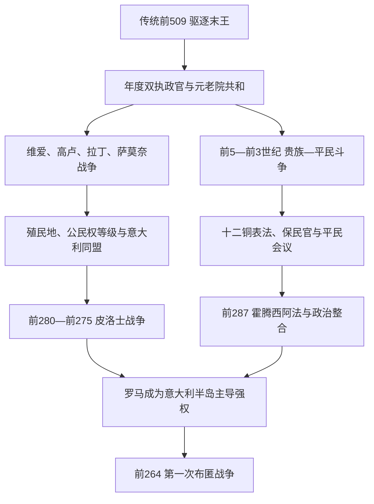

# 罗马共和国早期

## 时间

传统前509年—前264年。前509年是后世纪年中的政体转换标志；早期官职名称、首任执政官名单和许多战争细节存在后世重构。前264年第一次布匿战争爆发，标志罗马从意大利霸权进入长期海外扩张。

## 概括

早期共和国把国王的最高军政权分配给任期短、人数复数的官员，并由元老院、多个公民大会、保民官和祭司体系相互制约。这个制度起初由贵族家族主导，平民通过撤离、拒绝军役、选举代表和立法逐步取得任官、通婚、债务保护与法律平等。与此同时，罗马以公民殖民地、拉丁殖民地、差别公民权和双边同盟组织战败者，建立不要求所有地区完全同质化的意大利联盟。其韧性在高卢洗劫、萨莫奈战争和皮洛士入侵中受到检验。

## 演进图

## 共和国制度与实际权力

“共和国”意为公共事务，不等于现代代议民主。公民亲自参加大会，但投票单位而非个人票数决定结果；富有等级在百人队大会先投票，常能提前形成多数。官员无薪任职、竞选需社会资源，使富有家族长期占优势。

| 机构 / 职位 | 产生与任期 | 法定职能 | 实际权力与制约 |
|---|---|---|---|
| 两名执政官 | 百人队大会选举，一年 | 统军、召集元老院与大会、执行政务 | 彼此否决；任期后可能受审；战争延长导致后来出现延长统帅权 |
| 元老院 | 由卸任官员与贵族精英组成，监察官编录 | 名义上咨询，掌财政、外交、宗教解释和行省分配的连续意见 | 决议常无成文法律强制却具巨大权威；家族网络维持长期政策 |
| 独裁官 | 危机时由执政官依法指定，通常不超六个月 | 集中军政以应急 | 并非后世终身独裁；任务结束应卸任 |
| 百人队大会 | 按财产和军役单位投票 | 选高级官、宣战、审理重罪 | 富有百人队先投票，权重不均 |
| 部落大会 | 按地域部落投票 | 选部分官员、通过法律 | 地域编组比百人队更平等，但富人仍凭资源影响动员 |
| 平民会议 | 仅平民参加，由保民官召集 | 选保民官、通过平民决议 | 前287年后决议对全体公民有法律效力 |
| 保民官 | 平民会议选举，一年；人身神圣 | 援助平民、否决官员、召集会议 | 可阻止国家行为，也可能被贵族派系吸纳 |
| 监察官 | 通常每五年选两人，任期约18个月 | 人口普查、财产等级、元老院名册、公共合同 | 能以道德审查和名册调整影响精英地位 |
| 裁判官 | 前367年后逐步设置 | 城市司法与必要时统军 | 法令实践推动罗马私法发展 |
| 财务官 | 低阶官职 | 管理国库与将领财务 | 官职阶梯的入口，数量随扩张增加 |
| 祭司团 | 多由精英担任 | 历法、占卜、祭祀和法律日程 | 宗教程序可延迟会议或否定选举，政治与宗教不可分割 |

## 贵族与平民斗争的过程

“两个阶级从一开始整齐对立”的图像过于简单。平民内部从债务农民到富有非贵族差异很大；改革最终让富裕平民进入新贵族，而贫困、土地与债务问题并未消失。

| 时间 | 事件 / 法律 | 争议与机制 | 结果 |
|---|---|---|---|
| 传统前494 | 第一次平民撤离 | 平民以拒绝军役和离城建立集体谈判力量 | 保民官和平民营造官制度形成 |
| 前451—前450 | 十二铜表法 | 十人委员会公布法律；文本只经后世引文保存 | 限制贵族垄断法律知识，但保留债务与家父权严苛规则 |
| 传统前449 | 瓦莱里乌斯—霍拉提乌斯法 | 第二次撤离后的制度恢复叙事 | 强化上诉权、保民官神圣性与平民决议地位 |
| 前445 | 卡努莱乌斯法 | 废除贵族与平民通婚禁令 | 家族联盟和社会整合扩大 |
| 前367/366 | 李锡尼—塞克斯提乌斯法 | 债务、公共土地与执政官资格方案长期斗争 | 至少一名执政官可由平民担任，裁判官职位同时发展 |
| 前342 | 根努西亚法传统 | 禁止高利贷、限制重复任官等 | 具体执行与年代有争议，显示官职竞争持续 |
| 前300 | 奥古尔尼亚法 | 祭司名额向平民开放 | 宗教解释权不再由贵族独占 |
| 前287 | 霍腾西阿法 | 最后一次传统平民撤离后由独裁官立法 | 平民会议决议无需元老院事先批准即可约束全体 |

## 征服意大利的过程

### 对伊特鲁里亚与高卢冲击

罗马同近邻维爱长期竞争台伯河贸易和领土。传统称前396年独裁官卡米卢斯攻陷维爱，罗马获得大片土地。约前390或前387年，高卢人在阿利亚河击败罗马并洗劫城市；卡庇托利山是否完全失守、赎金和卡米卢斯救城细节带有英雄化。罗马随后加强防御、殖民和同盟，不是因一次胜利“立刻复兴”。

### 拉丁战争与差别整合

拉丁城市与罗马共享语言和宗教，也争夺同盟领导。前340—前338年战争后，罗马解散旧拉丁同盟，却没有把所有城市一律吞并：部分获完整公民权，部分获无投票权公民身份，另一些保留自治并承担军役。罗马同每个共同体分别订约，防止盟友形成独立统一阵线。

### 三次萨莫奈战争

萨莫奈山地联盟控制亚平宁中南部通道。前321年考迪乌姆峡谷中罗马军被迫投降，暴露在山地作战的弱点。长期战争促使罗马更灵活使用小单位、道路和殖民地，并与坎帕尼亚、阿普利亚等地精英结盟。前295年森提努姆战役击败萨莫奈、高卢、伊特鲁里亚等联军；前290年前后罗马取得优势，但地区抵抗并未一次消失。

### 皮洛士战争

塔兰托为抵抗罗马邀请伊庇鲁斯王皮洛士。皮洛士的方阵和战象在赫拉克利亚、阿斯库路姆取胜，却无法摧毁罗马征兵与盟友体系；“皮洛士式胜利”概括战术胜利无法补充损失的处境。他转战西西里对迦太基作战，又因征发和强硬统治失去希腊城市支持。前275年贝内文托战后撤离，罗马继而控制塔兰托并成为半岛霸主。

## 意大利同盟体系

| 身份 | 权利与义务 | 战略作用 |
|---|---|---|
| 罗马完整公民 | 投票、合法婚姻、财产权和服役 | 扩大核心人口，但远地公民参与罗马投票成本高 |
| 无投票权公民 | 承担税役并受罗马法部分保护，无罗马投票权 | 连接被并入地区，身份日后可能升级 |
| 拉丁殖民地居民 | 具拉丁权，建立在战略要地 | 守道路、边界和新领土，分散本地反抗 |
| 罗马公民殖民地 | 通常规模较小，保留公民身份 | 早期多守海岸和港口 |
| 盟邦 | 保留地方政府，不定额纳税但按条约供兵 | 罗马可动员远多于自身公民的军队；战利品与负担分配不均埋下同盟者战争问题 |

## 崛起条件与代价

| 类型 | 因素 | 说明 |
|---|---|---|
| 制度韧性 | 年度复数官职与元老院连续性 | 战败可更换统帅而不必推翻国家；元老院保存跨年度战略 |
| 人力机制 | 公民和盟邦分层动员 | 失败后仍能补充军团，皮洛士难以迫使整个联盟投降 |
| 整合机制 | 公民权、自治、殖民地和条约组合 | 给地方精英进入罗马体系的利益，同时分割潜在敌对联盟 |
| 基础设施 | 道路、殖民地和土地测量 | 把军事推进转为长期驻守与人口安置 |
| 社会代价 | 债务、长期军役和土地争夺 | 平民改革虽扩大政治资格，贫困和不平等没有根除 |
| 战略风险 | 盟邦承担大量兵役而缺乏罗马决策权 | 在海外扩张后矛盾加深，最终触发前91年同盟者战争 |

## 重要事件

- 传统前509年，末王被逐，两名年度最高官取代国王军权。
- 传统前494年，第一次平民撤离和保民官制度形成。
- 前451—前450年，十二铜表法成文。
- 约前396年，维爱陷落，罗马越出台伯河扩张。
- 约前390/387年，高卢洗劫罗马。
- 前367/366年，李锡尼—塞克斯提乌斯改革扩大平民任官。
- 前340—前338年，拉丁战争后罗马重组拉丁地区。
- 前326—前304年第二次萨莫奈战争，考迪乌姆峡谷是重大挫折。
- 前295年，森提努姆战役击败多方联军。
- 前287年，霍腾西阿法使平民决议对全体有效。
- 前280—前275年，皮洛士战争。
- 前272年，塔兰托投降；罗马基本主导意大利半岛。

## 演变关系

- 前一节点：[罗马王政时期](/%E4%BA%BA%E6%96%87%E7%A7%91%E5%AD%A6/%E5%8E%86%E5%8F%B2/%E6%AC%A7%E6%B4%B2/_%E9%80%9A%E5%8F%B2/%E5%8F%A4%E7%BD%97%E9%A9%AC/%E7%BD%97%E9%A9%AC%E7%8E%8B%E6%94%BF%E6%97%B6%E6%9C%9F.md)。
- 后一节点：[罗马共和国扩张期](/%E4%BA%BA%E6%96%87%E7%A7%91%E5%AD%A6/%E5%8E%86%E5%8F%B2/%E6%AC%A7%E6%B4%B2/_%E9%80%9A%E5%8F%B2/%E5%8F%A4%E7%BD%97%E9%A9%AC/%E7%BD%97%E9%A9%AC%E5%85%B1%E5%92%8C%E5%9B%BD%E6%89%A9%E5%BC%A0%E6%9C%9F.md)。
- 南意大利希腊背景见[古希腊](/%E4%BA%BA%E6%96%87%E7%A7%91%E5%AD%A6/%E5%8E%86%E5%8F%B2/%E6%AC%A7%E6%B4%B2/_%E9%80%9A%E5%8F%B2/%E5%8F%A4%E5%B8%8C%E8%85%8A/README.md)。
- 所属总览：[古罗马](/%E4%BA%BA%E6%96%87%E7%A7%91%E5%AD%A6/%E5%8E%86%E5%8F%B2/%E6%AC%A7%E6%B4%B2/_%E9%80%9A%E5%8F%B2/%E5%8F%A4%E7%BD%97%E9%A9%AC/README.md)。
