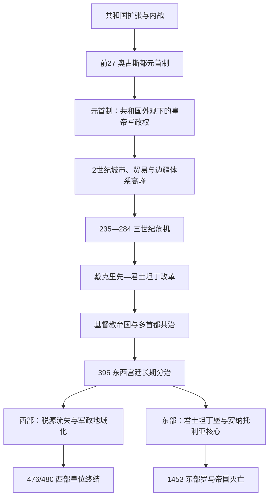

# 罗马帝国

## 时间

前27年—476年（西部皇帝职位）；东部罗马皇帝法统延续至1453年。本页以帝国制度整体为主题，分期正文及完整皇帝表由专页维护。

## 概括

罗马帝国是共和国数百年征服与前1世纪内战的制度结果。奥古斯都没有正式废除共和国，而是把军团、关键行省、财政和多项共和国权力集中于“第一公民”。元首制通过城市自治、地方精英、道路海运和相对稳定货币管理地中海世界；3世纪皇位内战、萨珊与日耳曼压力、瘟疫和货币危机暴露单一皇帝覆盖多边疆的局限。戴克里先和君士坦丁以多皇帝共治、行政分层、税制、机动军和新首都重建国家。

395年以后，东、西宫廷长期各自运行，但仍声称属于一个罗马帝国。西部因税源丧失、联盟军地域化和宫廷—将领冲突，于476年停止设置皇帝；东部依靠君士坦丁堡、安纳托利亚与较强官僚延续，后世称拜占庭帝国，1453年才灭亡。

## 演进图

## 分期与专页

| 阶段 | 时间 | 制度和事件主线 | 专页 |
|---|---|---|---|
| 共和国危机与帝制形成 | 前133—前27 | 长期统帅权、军队个人化、同盟者公民权、内战与三人委员会 | [罗马共和国危机期](/%E4%BA%BA%E6%96%87%E7%A7%91%E5%AD%A6/%E5%8E%86%E5%8F%B2/%E6%AC%A7%E6%B4%B2/_%E9%80%9A%E5%8F%B2/%E5%8F%A4%E7%BD%97%E9%A9%AC/%E7%BD%97%E9%A9%AC%E5%85%B1%E5%92%8C%E5%9B%BD%E5%8D%B1%E6%9C%BA%E6%9C%9F.md) |
| 元首制前期 | 前27—235 | 皇帝保留共和外观，城市—行省体系扩张，两次多皇帝内战与塞维鲁军事化 | [罗马帝国元首制前期](/%E4%BA%BA%E6%96%87%E7%A7%91%E5%AD%A6/%E5%8E%86%E5%8F%B2/%E6%AC%A7%E6%B4%B2/_%E9%80%9A%E5%8F%B2/%E5%8F%A4%E7%BD%97%E9%A9%AC/%E7%BD%97%E9%A9%AC%E5%B8%9D%E5%9B%BD%E5%85%83%E9%A6%96%E5%88%B6%E5%89%8D%E6%9C%9F.md) |
| 三世纪危机 | 235—284/285 | 军人皇帝、区域帝国、外敌、疫病和币制压力；奥勒良再统一 | [三世纪危机](/%E4%BA%BA%E6%96%87%E7%A7%91%E5%AD%A6/%E5%8E%86%E5%8F%B2/%E6%AC%A7%E6%B4%B2/_%E9%80%9A%E5%8F%B2/%E5%8F%A4%E7%BD%97%E9%A9%AC/%E4%B8%89%E4%B8%96%E7%BA%AA%E5%8D%B1%E6%9C%BA.md) |
| 晚期帝国 | 284—395 | 四帝共治、税军改革、君士坦丁堡、基督教化和哥特危机 | [罗马帝国晚期](/%E4%BA%BA%E6%96%87%E7%A7%91%E5%AD%A6/%E5%8E%86%E5%8F%B2/%E6%AC%A7%E6%B4%B2/_%E9%80%9A%E5%8F%B2/%E5%8F%A4%E7%BD%97%E9%A9%AC/%E7%BD%97%E9%A9%AC%E5%B8%9D%E5%9B%BD%E6%99%9A%E6%9C%9F.md) |
| 西罗马帝国 | 395—476/480 | 西部宫廷、强人将领、联盟军王国、非洲税源丧失和皇位终止 | [西罗马帝国](/%E4%BA%BA%E6%96%87%E7%A7%91%E5%AD%A6/%E5%8E%86%E5%8F%B2/%E6%AC%A7%E6%B4%B2/_%E9%80%9A%E5%8F%B2/%E5%8F%A4%E7%BD%97%E9%A9%AC/%E8%A5%BF%E7%BD%97%E9%A9%AC%E5%B8%9D%E5%9B%BD.md) |
| 东罗马 / 拜占庭 | 395—1453 | 五世纪存续、查士丁尼再征服、七世纪转型、复兴、1204断裂和奥斯曼征服 | [东罗马帝国与拜占庭帝国](/%E4%BA%BA%E6%96%87%E7%A7%91%E5%AD%A6/%E5%8E%86%E5%8F%B2/%E6%AC%A7%E6%B4%B2/_%E9%80%9A%E5%8F%B2/%E5%8F%A4%E7%BD%97%E9%A9%AC/%E4%B8%9C%E7%BD%97%E9%A9%AC%E5%B8%9D%E5%9B%BD%E4%B8%8E%E6%8B%9C%E5%8D%A0%E5%BA%AD%E5%B8%9D%E5%9B%BD.md) |

## 皇帝世系入口

- [罗马帝国皇帝世系表](/%E4%BA%BA%E6%96%87%E7%A7%91%E5%AD%A6/%E5%8E%86%E5%8F%B2/%E6%AC%A7%E6%B4%B2/_%E9%80%9A%E5%8F%B2/%E5%8F%A4%E7%BD%97%E9%A9%AC/%E7%BD%97%E9%A9%AC%E5%B8%9D%E5%9B%BD%E7%9A%87%E5%B8%9D%E4%B8%96%E7%B3%BB%E8%A1%A8.md)：逐人列前27年—395年的皇帝、正式共治者和重大竞争皇帝，并续列西部皇位至476/480；不合并四帝之年、193年诸帝、三世纪中央皇帝或西部末帝。
- [东罗马帝国皇帝世系表](/%E4%BA%BA%E6%96%87%E7%A7%91%E5%AD%A6/%E5%8E%86%E5%8F%B2/%E6%AC%A7%E6%B4%B2/_%E9%80%9A%E5%8F%B2/%E5%8F%A4%E7%BD%97%E9%A9%AC/%E4%B8%9C%E7%BD%97%E9%A9%AC%E5%B8%9D%E5%9B%BD%E7%9A%87%E5%B8%9D%E4%B8%96%E7%B3%BB%E8%A1%A8.md)：逐人列395—1453年君士坦丁堡 / 尼西亚主线，另列女皇、摄政、复位、竞争皇帝和重要未独掌共帝。
- [三世纪危机](/%E4%BA%BA%E6%96%87%E7%A7%91%E5%AD%A6/%E5%8E%86%E5%8F%B2/%E6%AC%A7%E6%B4%B2/_%E9%80%9A%E5%8F%B2/%E5%8F%A4%E7%BD%97%E9%A9%AC/%E4%B8%89%E4%B8%96%E7%BA%AA%E5%8D%B1%E6%9C%BA.md)：除中央皇帝外，完整分列高卢帝国、帕尔米拉、地方称帝者和史料可疑人物，说明哪些是真正奥古斯都、区域防务者或后世虚构。

## 皇权如何运作

罗马皇帝并非一种始终相同的职位。奥古斯都以共和国权力组合建立个人最高权，戴克里先则用更公开的君主礼仪与多皇帝体系覆盖边疆，拜占庭皇帝又与宫廷、教会和共治加冕相结合。

| 时期 | 法律语言 | 实际权力基础 | 主要制约 |
|---|---|---|---|
| 元首制 | 第一公民、保民官权、高级统帅权 | 军团、皇帝行省、金库、近卫军和政治威望 | 元老院承认、军队拥立、宫廷和继承不确定 |
| 塞维鲁以后 | 王朝与军队施惠更公开 | 提高军饷、骑士官僚、王室女性和多瑙军团 | 财政负担、边区军队竞争 |
| 四帝与晚期 | 多位奥古斯都 / 凯撒，宫廷礼仪神圣化 | 区域宫廷、税制、野战军、稳定金币和官僚层级 | 共治内战、地方将领、宗教争议 |
| 东西分治 | 两宫廷以共同罗马法统颁法 | 各自财政、军队和首都；婚姻与互相承认 | 对行省、军队和皇帝合法性的竞争 |
| 中世纪东罗马 | “罗马人的皇帝”、牧首加冕和共治 | 君士坦丁堡、官僚、军区 / 家族军队、教会与外交 | 宫廷政变、军区和贵族反叛、外国军事压力 |

皇位从来没有统一长子继承法。收养、生前共治、皇室婚姻、紫衣出生、军队拥立和首都控制均可竞争。合法性因此是一个过程：称帝、控制宫廷、获军队宣誓、元老院 / 牧首确认、击败竞争者，缺一仍可能统治，但稳定性降低。

## 帝国治理机制

### 行省与城市

共和国征服后逐步设置行省。元首制区分皇帝行省与元老院行省，但皇帝可通过任命、军队和上诉控制全局。地方城市议事会负责税收、道路、治安和节庆，精英以捐赠换取荣誉。中央政府因此不需庞大基层官僚，却依赖地方显贵愿意承担费用。

三世纪后行省拆小、管区和近卫大区形成，中央控制增强。行政扩张不是纯粹“官僚膨胀”，而是为了防止一个总督同时掌握过大税源和军队，并使征收更稳定。

### 军队

罗马军队由公民军团、辅助军、舰队和各种地方部队构成；212年普授公民权后，军团与辅助军法律身份差异减弱。边疆不是封闭线，而是堡垒、道路、关卡、市场和外交缓冲区。晚期机动野战军与边境驻军分化，皇帝也越来越依赖联盟军和外国出身军官。

士兵向皇帝宣誓并期待军饷、退伍金和土地。一个皇帝不能支付或保护边区时，军队会拥立新皇；这不是单纯“军纪败坏”，而是帝国政治没有独立于军队的继承机关。

### 财政与货币

国家收入来自土地、人头 / 身份税、关税、矿山、遗产、行省贡赋和皇室地产。早期以银币和铜币支持市场，政府也征收粮食供罗马与军队。三世纪贬值后，实物征收增加；戴克里先定期评估土地与人口，君士坦丁稳定高值金币。金币稳定不意味着普通铜币和物价同样稳定。

### 法律

罗马法来自成文法、公民大会、裁判官法令、元老院决议、法学家意见和皇帝敕令。皇帝成为最高上诉和立法来源，212年后罗马公民法适用范围扩大。查士丁尼《民法大全》在东部整理法学遗产，后来影响拜占庭和欧洲大陆法传统。法律文本表达中央理想，地方执行会受语言、习惯和权力关系影响。

## 扩张、边界与人口

| 区域 | 并入 / 控制过程 | 帝国价值 | 长期压力 |
|---|---|---|---|
| 意大利 | 共和国通过公民权和同盟整合 | 政治核心、兵源与道路中心 | 晚期税收特权逐步变化，五世纪成为争夺对象 |
| 西班牙与高卢 | 长期战争、殖民和城市化 | 金属、农业、军队与西方税源 | 莱茵压力和五世纪地方王国形成 |
| 北非与埃及 | 击败迦太基、托勒密后设省 | 罗马 / 君士坦丁堡粮食、税收和港口 | 汪达尔439年夺北非重创西部；阿拉伯征服埃及重创东部 |
| 巴尔干与多瑙 | 马其顿、色雷斯、达契亚战争与边防 | 重要军队招募区、连接东西 | 哥特、匈人、斯拉夫和保加尔分期进入 |
| 不列颠 | 43年起征服，大部分地区设省 | 矿产、军队荣誉和边疆网络 | 驻军成本高，五世纪初中央税军体系撤离 |
| 叙利亚与小亚细亚 | 吞并希腊化王国，长期对安息 / 萨珊 | 富裕城市、贸易、东方军队 | 萨珊战争、阿拉伯征服和后期塞尔柱扩张 |
| 美索不达米亚 | 图拉真、塞维鲁和晚期皇帝反复推进 | 战略缓冲与声望 | 补给困难，边界随罗马—波斯战争反复 |

帝国人口包括公民、地方城市居民、自由民、获释奴隶、奴隶、士兵、游牧和边境社群。语言上拉丁语主导西部军政和法律，希腊语在东地中海长期通行，科普特语、阿拉米语、柏柏尔语、凯尔特语言等并存。所谓“罗马化”是公民权、城市制度、军役、语言和物质文化的选择性传播，不等于所有居民放弃原身份。

## 宗教转型

早期帝国的公共祭祀维护城市和皇帝秩序，皇帝崇拜在行省提供共同忠诚形式。犹太战争重塑犹太社群与圣殿关系，基督教则通过城市、家庭和旅行网络扩散。迫害并非持续统一：尼禄事件限于罗马，德基乌斯要求普遍献祭，戴克里先大迫害才是帝国范围最系统行动之一。

君士坦丁支持教会后，皇帝提供财产、司法和会议组织。380年以后尼西亚基督教获正统地位，传统公共祭祀受限制。教义争议并未结束，阿里乌、基督二性 / 一性、圣像等问题与地方政治和帝国外交相互影响。

## 重要事件

| 时间 | 事件 | 帝国层面意义 |
|---|---|---|
| 前27 | 奥古斯都宪制安排 | 元首制建立 |
| 14 | 提比略继位 | 首次完成元首制度内的王朝交接 |
| 68—69 | 四帝内战 | 行省军团拥有创造皇帝的能力 |
| 117 | 图拉真统治末年 | 帝国疆域短暂达最大 |
| 212 | 普授公民权 | 大多数自由居民取得罗马公民身份 |
| 235 | 亚历山大·塞维鲁被杀 | 三世纪危机开始 |
| 260 | 瓦勒良被萨珊俘虏 | 高卢与帕尔米拉区域政权形成 |
| 274 | 奥勒良恢复统一 | 帝国领土重新归于中央 |
| 293 | 四帝共治 | 多皇帝制度化覆盖边疆 |
| 313 | 宗教宽容与教产返还 | 基督教从受迫害社群转为合法制度力量 |
| 324—330 | 君士坦丁统一并建新都 | 君士坦丁堡成为东方中心 |
| 378 | 阿德里安堡战役 | 哥特安置和军队问题改变晚期政治 |
| 395 | 狄奥多西一世死 | 东西宫廷长期分治 |
| 410 | 西哥特洗劫罗马 | 西部军政失衡的象征性转折 |
| 439 | 汪达尔夺取迦太基 | 西部失去核心税粮区 |
| 476/480 | 西部皇位终结 | 意大利转为无西帝的国王统治 |
| 527—565 | 查士丁尼时代 | 法典、再征服与瘟疫共同塑造东部转型 |
| 636后 | 叙利亚、埃及失守 | 东部收缩为安纳托利亚—巴尔干核心 |
| 1204 | 十字军攻陷君士坦丁堡 | 帝国制度、财政与领土遭重大断裂 |
| 1261 | 尼西亚收复首都 | 皇统复都但国力未恢复 |
| 1453 | 君士坦丁堡陷落 | 东部罗马皇帝法统终结 |

## 崛起、鼎盛、分化与灭亡

| 类型 | 因素 | 作用 |
|---|---|---|
| 建立条件 | 共和国已经征服地中海并建立行省、同盟和道路 | 奥古斯都接收的是成熟帝国资源，不是从零建国 |
| 建立机制 | 单一军权与共和形式结合 | 终止多军阀内战，同时让元老精英保留地位 |
| 鼎盛条件 | 城市自治、海运、币制和地方精英合作 | 中央以较少官僚调动广域税粮和军队 |
| 结构弱点 | 皇位无固定继承法 | 收养、血缘、军队和宫廷每次都需重新协调 |
| 结构弱点 | 多边疆和长距离通讯 | 一处危机常迫使其他边疆抽兵，区域军队更易拥立本地皇帝 |
| 外部压力 | 萨珊、哥特、匈人、阿拉伯、塞尔柱和奥斯曼在不同时期出现 | 不是单一连续敌人，而是多轮新军事政治体系 |
| 西部直接过程 | 北非税源丧失、468年远征失败、意大利军队土地争端 | 476年军队选择奥多亚克而不再立西帝 |
| 东部直接过程 | 1204断裂、14世纪内战和奥斯曼封锁 | 1453年首都在领土与兵源极度收缩后被攻破 |

罗马帝国没有一个统一“灭亡日”。西部的皇帝职位、行省行政、城市生活和罗马法分别在不同地区转化；东部继续近千年。把476年等同所有罗马文明消失，会掩盖东罗马与后罗马诸国的制度连续性。

## 演变关系

- 前一节点：[罗马共和国危机期](/%E4%BA%BA%E6%96%87%E7%A7%91%E5%AD%A6/%E5%8E%86%E5%8F%B2/%E6%AC%A7%E6%B4%B2/_%E9%80%9A%E5%8F%B2/%E5%8F%A4%E7%BD%97%E9%A9%AC/%E7%BD%97%E9%A9%AC%E5%85%B1%E5%92%8C%E5%9B%BD%E5%8D%B1%E6%9C%BA%E6%9C%9F.md)。
- 内部分期：[罗马帝国元首制前期](/%E4%BA%BA%E6%96%87%E7%A7%91%E5%AD%A6/%E5%8E%86%E5%8F%B2/%E6%AC%A7%E6%B4%B2/_%E9%80%9A%E5%8F%B2/%E5%8F%A4%E7%BD%97%E9%A9%AC/%E7%BD%97%E9%A9%AC%E5%B8%9D%E5%9B%BD%E5%85%83%E9%A6%96%E5%88%B6%E5%89%8D%E6%9C%9F.md)、[三世纪危机](/%E4%BA%BA%E6%96%87%E7%A7%91%E5%AD%A6/%E5%8E%86%E5%8F%B2/%E6%AC%A7%E6%B4%B2/_%E9%80%9A%E5%8F%B2/%E5%8F%A4%E7%BD%97%E9%A9%AC/%E4%B8%89%E4%B8%96%E7%BA%AA%E5%8D%B1%E6%9C%BA.md)、[罗马帝国晚期](/%E4%BA%BA%E6%96%87%E7%A7%91%E5%AD%A6/%E5%8E%86%E5%8F%B2/%E6%AC%A7%E6%B4%B2/_%E9%80%9A%E5%8F%B2/%E5%8F%A4%E7%BD%97%E9%A9%AC/%E7%BD%97%E9%A9%AC%E5%B8%9D%E5%9B%BD%E6%99%9A%E6%9C%9F.md)。
- 后续分化：[西罗马帝国](/%E4%BA%BA%E6%96%87%E7%A7%91%E5%AD%A6/%E5%8E%86%E5%8F%B2/%E6%AC%A7%E6%B4%B2/_%E9%80%9A%E5%8F%B2/%E5%8F%A4%E7%BD%97%E9%A9%AC/%E8%A5%BF%E7%BD%97%E9%A9%AC%E5%B8%9D%E5%9B%BD.md)、[东罗马帝国与拜占庭帝国](/%E4%BA%BA%E6%96%87%E7%A7%91%E5%AD%A6/%E5%8E%86%E5%8F%B2/%E6%AC%A7%E6%B4%B2/_%E9%80%9A%E5%8F%B2/%E5%8F%A4%E7%BD%97%E9%A9%AC/%E4%B8%9C%E7%BD%97%E9%A9%AC%E5%B8%9D%E5%9B%BD%E4%B8%8E%E6%8B%9C%E5%8D%A0%E5%BA%AD%E5%B8%9D%E5%9B%BD.md)。
- 完整世系：[罗马帝国皇帝世系表](/%E4%BA%BA%E6%96%87%E7%A7%91%E5%AD%A6/%E5%8E%86%E5%8F%B2/%E6%AC%A7%E6%B4%B2/_%E9%80%9A%E5%8F%B2/%E5%8F%A4%E7%BD%97%E9%A9%AC/%E7%BD%97%E9%A9%AC%E5%B8%9D%E5%9B%BD%E7%9A%87%E5%B8%9D%E4%B8%96%E7%B3%BB%E8%A1%A8.md)、[东罗马帝国皇帝世系表](/%E4%BA%BA%E6%96%87%E7%A7%91%E5%AD%A6/%E5%8E%86%E5%8F%B2/%E6%AC%A7%E6%B4%B2/_%E9%80%9A%E5%8F%B2/%E5%8F%A4%E7%BD%97%E9%A9%AC/%E4%B8%9C%E7%BD%97%E9%A9%AC%E5%B8%9D%E5%9B%BD%E7%9A%87%E5%B8%9D%E4%B8%96%E7%B3%BB%E8%A1%A8.md)。
- 所属总览：[古罗马](/%E4%BA%BA%E6%96%87%E7%A7%91%E5%AD%A6/%E5%8E%86%E5%8F%B2/%E6%AC%A7%E6%B4%B2/_%E9%80%9A%E5%8F%B2/%E5%8F%A4%E7%BD%97%E9%A9%AC/README.md)。
