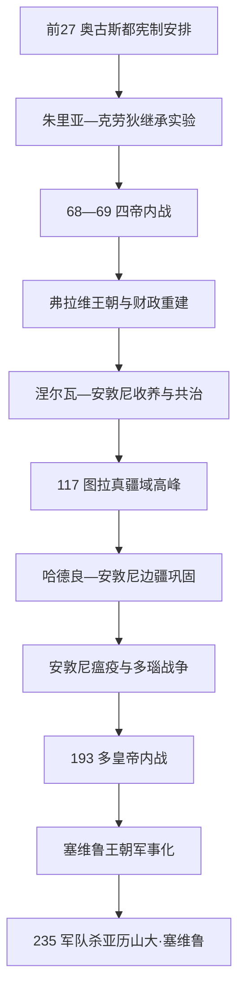

# 罗马帝国元首制前期

## 时间

前27年—235年。以奥古斯都第一次宪制安排为起点，以亚历山大·塞维鲁被莱茵军队杀害、三世纪危机爆发为终点。68—69年、193年两次多皇帝内战是皇位运作的重要断裂，但元首制的基本法律外观仍延续。

## 概括

元首制把内战后的单一军事最高权包装成“共和国恢复”。皇帝不以国王自称，而是同时拥有高于其他总督的统帅权、终身保民官权、首席祭司地位、任官推荐权和庞大私人财产。元老院、执政官和公民大会保留，但军团、关键行省和财政由元首掌握。帝国在道路、城市、军队、行省精英与罗马法的共同作用下稳定扩张；皇位却没有固定继承法，收养、血缘、近卫军、边区军团和元老院承认反复竞争。

全部皇帝、共治者和重大竞争皇帝逐人见[罗马帝国皇帝世系表](/%E4%BA%BA%E6%96%87%E7%A7%91%E5%AD%A6/%E5%8E%86%E5%8F%B2/%E6%AC%A7%E6%B4%B2/_%E9%80%9A%E5%8F%B2/%E5%8F%A4%E7%BD%97%E9%A9%AC/%E7%BD%97%E9%A9%AC%E5%B8%9D%E5%9B%BD%E7%9A%87%E5%B8%9D%E4%B8%96%E7%B3%BB%E8%A1%A8.md)，本页不以“某王朝诸帝”替代完整世系。

## 演进图

## 元首制的法律外观与实际权力

| 权力 / 机构 | 共和国形式 | 元首制实际运作 | 制约与风险 |
|---|---|---|---|
| 统帅权 | 行省总督依法获有限区域和期限的 imperium | 皇帝拥有覆盖关键行省、优越于其他总督的统帅权，军团向其宣誓 | 皇帝死亡或战败时军团可拥立本区统帅 |
| 保民官权 | 保民官一年一任，保护平民并否决官员 | 皇帝终身持有，借此召集机构、提出法律并宣称保护人民 | 权力依个人威望，不能提供明确继承法 |
| 元老院 | 管财政、外交与官职连续性 | 管理“元老院行省”、确认皇帝、审判精英，并提供高官 | 缺乏独立军队，否定军队拥立者往往无效 |
| 执政官与官职阶梯 | 最高年度民选官 | 多为荣誉和精英晋升，皇帝及亲族可反复任职 | 仍决定地位与任官经验，但无法与皇帝统帅权竞争 |
| 公民大会 | 选官、立法和审判 | 选举逐渐转为元老院与皇帝推荐，立法更多由元老院决议和皇帝敕令完成 | 罗马公民政治由直接大会转向行政与司法身份 |
| 皇帝家产与国库 | 公共国库由元老院官员管理 | 皇帝金库、埃及收入、矿山和王室地产支撑军队与施惠 | “公”“私”边界不清，宫廷自由民和骑士官僚权力增长 |
| 近卫军 | 无共和国常设首都军队先例 | 保卫皇帝、影响宫廷，近卫长官掌情报和司法 | 可刺杀、拍卖或拥立皇帝，但外省军团能反击 |
| 皇帝会议 | 非正式顾问 | 法学家、将领、骑士官员与亲族参与决策 | 宫廷派系、皇后与近臣可能在幼帝或弱帝时掌实权 |

## 分阶段发展

### 奥古斯都与朱里亚—克劳狄王朝

奥古斯都裁减内战军队并安置退伍军人，把军团稳定为约二十余个，设服役年限和军人国库。他把大部分军团所在行省置于自身名下，元老院管理较和平行省；埃及由骑士长官治理，元老未经许可不得进入。常备舰队、近卫军、道路驿站和人口调查提升帝国动员。

继承没有写入宪法。奥古斯都先后选择马塞卢斯、阿格里帕、盖乌斯和卢基乌斯，均先死，最终收养提比略。提比略、卡利古拉、克劳狄乌斯、尼禄都凭朱里亚—克劳狄亲缘与收养继位，却各自依赖元老院和军队确认。克劳狄由近卫军发现并拥立，显示宫廷军队已能决定首都；尼禄时期高卢和西班牙总督反叛，则证明行省军团也能创造皇帝。

### 69年与弗拉维重建

加尔巴、奥托、维特里乌斯和韦斯巴芗逐一由不同军队支持。最终获胜者不是传统罗马最高贵家族，而是掌握东方军团、埃及粮源和多瑙支援的韦斯巴芗。他通过新税、没收和行省征收修复国库，扩大意大利外精英进入元老院，并以父子共治建立明显王朝。图密善强化皇帝权威、提高军饷，却在宫廷政变中死亡；元老院推举涅尔瓦，以收养图拉真安抚军队。

### 收养继承与帝国高峰

“ 五贤帝 ”并非纯粹以才择君。涅尔瓦、图拉真、哈德良和安敦尼无存活亲子，收养兼顾亲缘、军队资历和宫廷派系。安敦尼按哈德良条件同时收养马可·奥勒留与卢基乌斯·维鲁斯，161年形成两位奥古斯都正式共治。

图拉真征服达契亚，获取矿产和新行省；其安息战争一度推进到美索不达米亚和波斯湾，117年领土最大。哈德良判断新东方领地难守，撤出部分地区，巡行各省、修边墙并强化官僚。安敦尼·庇护时期以间接防务和法律行政维持稳定。这个高峰依赖道路、海运、城市自治、相对稳定币制和地方精英合作，而非中央官员遍布每个村落。

### 瘟疫、边疆战争与血缘继承

卢基乌斯的东方军队带回疫病，约165年起的安敦尼瘟疫反复流行，影响人口、税收和军队，规模难以精确量化。马可·奥勒留长期在多瑙对马科曼尼等集团作战，一度计划建立新行省。其亲子康茂德继位终结连续收养模式；康茂德并非仅因“昏庸”导致危机，其宫廷清洗、军费和个人神化使精英联盟瓦解，最终被近臣谋杀。

### 193年与塞维鲁王朝

佩蒂纳克斯被近卫军杀害后，迪迪乌斯·尤利安努斯以赏金取得拥立；潘诺尼亚、叙利亚和不列颠军队分别支持塞普蒂米乌斯·塞维鲁、佩斯切尼乌斯·尼格尔和克洛狄乌斯·阿尔比努斯。塞维鲁获胜后解散旧近卫军，以多瑙士兵重建，提升军饷、准许士兵合法婚姻并扩大骑士军政官员。

卡拉卡拉杀死共治弟弟盖塔。212年《安东尼努斯敕令》把公民权授予帝国几乎所有自由居民，既完成数百年的身份扩张，也扩大适用罗马遗产税等财政基础。塞维鲁王室女性在马克里努斯短暂统治后组织军队拥立埃拉伽巴路斯和亚历山大·塞维鲁。235年，后者试图以外交和节制军费处理莱茵危机，被军队视为软弱而杀害，皇位进入持续的边区军团竞争。

## 行省治理与帝国整合

### 城市与地方精英

帝国中央官员数量有限，行省城市的议事会和地方显贵负责征税、公共建筑、治安与节庆。皇帝授予城市自由、殖民地或自治地位，地方精英以捐建浴场、剧院和供粮换取荣誉。二世纪后捐赠负担和税收压力上升，一些富人逃避市政职责，中央因而逐渐强化强制。

### 军队和边疆

军团驻边区，辅助军由非公民组成，服役后通常获公民权。沿莱茵、多瑙、幼发拉底和北非边界形成道路、堡垒、市场和军人家庭社区。“边墙”不是密封国界，而是监控交通、征收关税、发出警报和集中部队的系统。驻军同时是消费市场和地方政治力量。

### 法律与公民身份

裁判官法、元老院决议、法学家意见和皇帝敕令共同发展罗马法。皇帝作为最高上诉与恩赐来源，地方社群不断向其请愿。212年普授公民权后，公民 / 非公民区分弱化，但自由人、奴隶、获释奴隶、城市身份和社会等级仍决定具体权利。

### 经济与社会

地中海海运、道路和统一货币支持粮食、橄榄油、葡萄酒、陶器与奢侈品远距流通。埃及和北非供应罗马粮食，西班牙提供金属与油，意大利仍是消费和政治中心。帝国不是完全统一市场：运输成本、地方税制、自然灾害和治安造成巨大差异。奴隶劳动重要，但佃农、自由农民、工匠、士兵和商人同样构成经济。

## 宗教与皇帝合法性

传统祭祀是城市和国家秩序的一部分。行省皇帝崇拜通常祭祀皇帝的神圣地位、家神或死后神化，与对地方神祇的崇拜并存。犹太教因唯一神信仰、圣殿和社群法律与帝国多次冲突；66—73年、115—117年和132—135年的战争导致耶路撒冷与犹太地区重大重组。

基督教最初被视为犹太背景的社群，后在城市网络传播。迫害在本期多属地方性或特定皇帝政策，不是持续三百年的统一计划。拒绝公共祭祀容易被解释为危害共同体与皇帝忠诚，成为冲突核心。

## 重要事件

| 时间 | 事件 | 过程与影响 |
|---|---|---|
| 前27、前23 | 奥古斯都两次宪制安排 | 统帅权与保民官权构成元首长期权力 |
| 前9—14 | 日耳曼战争收缩与提比略继承 | 条顿堡森林损失后以莱茵为主要边界；收养继承完成 |
| 43 | 克劳狄征服不列颠 | 新行省建立，战争持续数十年 |
| 64 | 罗马大火与尼禄迫害基督徒 | 城市重建；迫害属罗马城特定事件 |
| 66—73 | 第一次犹太战争 | 70年第二圣殿被毁，犹太宗教与帝国关系重组 |
| 68—69 | 四帝之年 | 行省军团决定皇位，弗拉维王朝建立 |
| 101—106 | 达契亚战争 | 罗马取得达契亚，图拉真柱纪念征服 |
| 113—117 | 图拉真东方远征 | 帝国疆域短暂达最大，哈德良放弃难守领地 |
| 132—135 | 巴尔·科赫巴起义 | 犹太行省遭严重破坏，耶路撒冷改建 |
| 161—169 | 马可与卢基乌斯共治 | 首次长期两位同等奥古斯都，共同分担战争 |
| 约165—180 | 安敦尼瘟疫 | 疫病与多瑙战争叠加，人口和财政承压 |
| 193—197 | 多皇帝内战 | 塞维鲁以多瑙军队获胜，皇权进一步军事化 |
| 212 | 普授公民权敕令 | 大多数自由居民成为罗马公民 |
| 235 | 亚历山大·塞维鲁被杀 | 边区军队拒绝宫廷政策，三世纪危机开始 |

## 鼎盛与危机因素

| 类型 | 因素 | 说明 |
|---|---|---|
| 建立机制 | 奥古斯都垄断军队同时保留共和形式 | 避免公开王政刺激，让精英仍可通过官职获得地位 |
| 鼎盛条件 | 城市自治与地方精英合作 | 以较少中央官员管理广阔帝国 |
| 鼎盛条件 | 稳定军团、道路、港口与货币 | 支持边疆防务和税粮调运 |
| 结构弱点 | 无固定继承法 | 每次王朝绝嗣或弱帝都可能引发多军团拥立 |
| 结构弱点 | 军饷与边防开支刚性上升 | 塞维鲁提高军队待遇后，财政更依赖货币与税收扩张 |
| 外部压力 | 萨珊新王朝、日耳曼联盟与多瑙迁徙 | 敌手组织能力增强，多线作战需要皇帝亲临 |
| 疫病与人口 | 安敦尼瘟疫及后续疫情 | 影响程度地区不一，但削弱税役和补员余量 |
| 直接触发 | 235年莱茵军队兵变 | 军队拥立马克西米努斯，王朝宫廷与边军妥协崩解 |

## 演变关系

- 前一节点：[罗马共和国危机期](/%E4%BA%BA%E6%96%87%E7%A7%91%E5%AD%A6/%E5%8E%86%E5%8F%B2/%E6%AC%A7%E6%B4%B2/_%E9%80%9A%E5%8F%B2/%E5%8F%A4%E7%BD%97%E9%A9%AC/%E7%BD%97%E9%A9%AC%E5%85%B1%E5%92%8C%E5%9B%BD%E5%8D%B1%E6%9C%BA%E6%9C%9F.md)。
- 后一节点：[三世纪危机](/%E4%BA%BA%E6%96%87%E7%A7%91%E5%AD%A6/%E5%8E%86%E5%8F%B2/%E6%AC%A7%E6%B4%B2/_%E9%80%9A%E5%8F%B2/%E5%8F%A4%E7%BD%97%E9%A9%AC/%E4%B8%89%E4%B8%96%E7%BA%AA%E5%8D%B1%E6%9C%BA.md)。
- 完整世系：[罗马帝国皇帝世系表](/%E4%BA%BA%E6%96%87%E7%A7%91%E5%AD%A6/%E5%8E%86%E5%8F%B2/%E6%AC%A7%E6%B4%B2/_%E9%80%9A%E5%8F%B2/%E5%8F%A4%E7%BD%97%E9%A9%AC/%E7%BD%97%E9%A9%AC%E5%B8%9D%E5%9B%BD%E7%9A%87%E5%B8%9D%E4%B8%96%E7%B3%BB%E8%A1%A8.md)。
- 所属综合页：[罗马帝国](/%E4%BA%BA%E6%96%87%E7%A7%91%E5%AD%A6/%E5%8E%86%E5%8F%B2/%E6%AC%A7%E6%B4%B2/_%E9%80%9A%E5%8F%B2/%E5%8F%A4%E7%BD%97%E9%A9%AC/%E7%BD%97%E9%A9%AC%E5%B8%9D%E5%9B%BD.md)。
- 所属总览：[古罗马](/%E4%BA%BA%E6%96%87%E7%A7%91%E5%AD%A6/%E5%8E%86%E5%8F%B2/%E6%AC%A7%E6%B4%B2/_%E9%80%9A%E5%8F%B2/%E5%8F%A4%E7%BD%97%E9%A9%AC/README.md)。
